# [Work Step][After-Save][Record-Triggered] Relink After Work Photos to WO

## Flow Diagram [(_View History_)](Work_Step_After_Save_Record_Triggered_Relink_After_Work_Photos_to_WO-history.md)

```mermaid
%% If you read this, your Markdown visualizer does not handle MermaidJS syntax.
%% - If you are in VsCode, install extension `Markdown Preview Mermaid Support` at https://marketplace.visualstudio.com/items?itemName=bierner.markdown-mermaid
%% - If you are using sfdx-hardis, try to define env variable `MERMAID_MODES=cli,docker` ,then run again the command to regenerate markdown with SVG images.
%% - If you are within mkdocs-material, define mermaid plugin in `mkdocs.yml` as described in https://squidfunk.github.io/mkdocs-material/extensions/mermaid/
%% - At last resort, you can copy-paste this MermaidJS code in https://mermaid.live/ to see the Flow Diagram

flowchart TB
START(["START<br/><b>AutoLaunched Flow</b></br>Type: <b> Record After Save</b>"]):::startClass
click START "#general-information" "3046867768"

Collect_Content_Document_Ids[\"🟰 <em></em><br/>Collect Content Document Ids"/]:::assignments
click Collect_Content_Document_Ids "#collect_content_document_ids" "1070634303"

Increment_FileCounter[\"🟰 <em></em><br/>Increment FileCounter"/]:::assignments
click Increment_FileCounter "#increment_filecounter" "2234302930"

Link_Files_To_WO[\"🟰 <em></em><br/>Link Files To WO"/]:::assignments
click Link_Files_To_WO "#link_files_to_wo" "3284190905"

Set_Content_Document_Collection[\"🟰 <em></em><br/>Set Content Document Collection"/]:::assignments
click Set_Content_Document_Collection "#set_content_document_collection" "910719466"

Set_Title[\"🟰 <em></em><br/>Set Title"/]:::assignments
click Set_Title "#set_title" "2743319961"

Files_Retrieved{"🔀 <em></em><br/>Files Retrieved ?"}:::decisions
click Files_Retrieved "#files_retrieved" "3734517596"

Loop_Through_Content_Document{{"🔁 <em></em><br/>Loop Through Content Document"}}:::loops
click Loop_Through_Content_Document "#loop_through_content_document" "4207084913"

Loop_Through_Content_Document_Links{{"🔁 <em></em><br/>Loop Through Content Document Links"}}:::loops
click Loop_Through_Content_Document_Links "#loop_through_content_document_links" "2183036775"

Loop_Through_Files{{"🔁 <em></em><br/>Loop Through Files"}}:::loops
click Loop_Through_Files "#loop_through_files" "646313633"

Create_Files_on_Related_WO[("➕ <em></em><br/>Create Files on Related WO")]:::recordCreates
click Create_Files_on_Related_WO "#create_files_on_related_wo" "510525524"

Get_Content_Document_Information[("🔍 <em></em><br/>Get Content Document Information")]:::recordLookups
click Get_Content_Document_Information "#get_content_document_information" "708484929"

Get_Content_Document_Link[("🔍 <em></em><br/>Get Content Document Link")]:::recordLookups
click Get_Content_Document_Link "#get_content_document_link" "2592306955"

Update_Files_Title_Related_to_WO_Step[("🛠️ <em></em><br/>Update Files Title Related to WO Step")]:::recordUpdates
click Update_Files_Title_Related_to_WO_Step "#update_files_title_related_to_wo_step" "3337057262"

Collect_Content_Document_Ids --> Loop_Through_Content_Document_Links
Increment_FileCounter --> Set_Content_Document_Collection
Link_Files_To_WO --> Loop_Through_Files
Set_Content_Document_Collection --> Loop_Through_Content_Document
Set_Title --> Increment_FileCounter
Files_Retrieved --> |"Yes"| Loop_Through_Content_Document_Links
Files_Retrieved --> |"No"| END_Files_Retrieved
Loop_Through_Content_Document --> |"For Each"|Set_Title
Loop_Through_Content_Document ---> |"After Last"|Update_Files_Title_Related_to_WO_Step
Loop_Through_Content_Document_Links --> |"For Each"|Collect_Content_Document_Ids
Loop_Through_Content_Document_Links ---> |"After Last"|Get_Content_Document_Information
Loop_Through_Files --> |"For Each"|Link_Files_To_WO
Loop_Through_Files ---> |"After Last"|Create_Files_on_Related_WO
Create_Files_on_Related_WO --> END_Create_Files_on_Related_WO
Get_Content_Document_Information --> Loop_Through_Content_Document
Get_Content_Document_Link --> Files_Retrieved
Update_Files_Title_Related_to_WO_Step --> Loop_Through_Files
START -->  Get_Content_Document_Link
END_Files_Retrieved(( END )):::endClass
END_Create_Files_on_Related_WO(( END )):::endClass


classDef actionCalls fill:#D4E4FC,color:black,max-height:100px
classDef assignments fill:#FBEED7,color:black,max-height:100px
classDef collectionProcessors fill:#F0E3FA,color:black,max-height:100px
classDef customErrors fill:#FFE9E9,color:black,max-height:100px
classDef decisions fill:#FDEAF6,color:black,max-height:100px
classDef loops fill:#FDEAF6,color:black,max-height:100px
classDef recordCreates fill:#FFF8C9,color:black,max-height:100px
classDef recordDeletes fill:#FFF8C9,color:black,max-height:100px
classDef recordLookups fill:#EDEAFF,color:black,max-height:100px
classDef recordUpdates fill:#FFF8C9,color:black,max-height:100px
classDef screens fill:#DFF6FF,color:black,max-height:100px
classDef subflows fill:#D4E4FC,color:black,max-height:100px
classDef startClass fill:#D9F2E6,color:black,max-height:100px
classDef endClass fill:#F9BABA,color:black,max-height:100px


```

## General Information

|<!-- -->|<!-- -->|
|:---|:---|
|Object|WorkStep|
|Process Type| Auto Launched Flow|
|Trigger Type| Record After Save|
|Record Trigger Type| Create And Update|
|Label|[Work Step][After-Save][Record-Triggered] Relink After Work Photos to WO|
|Status|Active|
|Environments|Default|
|Interview Label|[Work Step][After-Save][Record-Triggered] Relink After Work Photos to WO {!$Flow.CurrentDateTime}|
| Builder Type (PM)|LightningFlowBuilder|
| Canvas Mode (PM)|AUTO_LAYOUT_CANVAS|
| Origin Builder Type (PM)|LightningFlowBuilder|
|Connector|[Get_Content_Document_Link](#get_content_document_link)|
|Next Node|[Get_Content_Document_Link](#get_content_document_link)|

#### Filters (logic: **and**)

|Filter Id|Field|Operator|Value|
|:-- |:-- |:--:|:--: |
|1|Status| Is Changed|✅|
|2|Status| Equal To|Completed|
|3|Name| Equal To|Take After Work Photos|

## Variables

|Name|Data Type|Is Collection|Is Input|Is Output|Object Type|
|:-- |:--:|:--:|:--:|:--:|:--: |
|ContentDocumentCollection|SObject|✅|✅|⬜|ContentDocument|
|ContentDocumentIdCollection|String|✅|✅|⬜|<!-- -->|
|ContentDocumentRecord|SObject|⬜|✅|⬜|ContentDocument|
|FileCounter|Number|⬜|⬜|⬜|<!-- -->|
|RelinkCollection|SObject|✅|✅|⬜|ContentDocumentLink|
|RelinkRecord|SObject|⬜|✅|⬜|ContentDocumentLink|

## Flow Nodes Details

### Collect_Content_Document_Ids

|<!-- -->|<!-- -->|
|:---|:---|
|Type|Assignment|
|Label|Collect Content Document Ids|
|Connector|[Loop_Through_Content_Document_Links](#loop_through_content_document_links)|

#### Assignments

|Assign To Reference|Operator|Value|
|:-- |:--:|:--: |
|ContentDocumentIdCollection| Add|Loop_Through_Content_Document_Links.ContentDocumentId|

### Increment_FileCounter

|<!-- -->|<!-- -->|
|:---|:---|
|Type|Assignment|
|Label|Increment FileCounter|
|Connector|[Set_Content_Document_Collection](#set_content_document_collection)|

#### Assignments

|Assign To Reference|Operator|Value|
|:-- |:--:|:--: |
|FileCounter| Add|1|

### Link_Files_To_WO

|<!-- -->|<!-- -->|
|:---|:---|
|Type|Assignment|
|Label|Link Files To WO|
|Connector|[Loop_Through_Files](#loop_through_files)|

#### Assignments

|Assign To Reference|Operator|Value|
|:-- |:--:|:--: |
|RelinkRecord.ContentDocumentId| Assign|Loop_Through_Files.ContentDocumentId|
|RelinkRecord.LinkedEntityId| Assign|$Record.ParentRecordId|
|RelinkCollection| Add|RelinkRecord|

### Set_Content_Document_Collection

|<!-- -->|<!-- -->|
|:---|:---|
|Type|Assignment|
|Label|Set Content Document Collection|
|Connector|[Loop_Through_Content_Document](#loop_through_content_document)|

#### Assignments

|Assign To Reference|Operator|Value|
|:-- |:--:|:--: |
|ContentDocumentCollection| Add|ContentDocumentRecord|

### Set_Title

|<!-- -->|<!-- -->|
|:---|:---|
|Type|Assignment|
|Label|Set Title|
|Connector|[Increment_FileCounter](#increment_filecounter)|

#### Assignments

|Assign To Reference|Operator|Value|
|:-- |:--:|:--: |
|ContentDocumentRecord.Id| Assign|Loop_Through_Content_Document.Id|
|ContentDocumentRecord.Title| Assign|TitleFormat|

### Files_Retrieved

|<!-- -->|<!-- -->|
|:---|:---|
|Type|Decision|
|Label|Files Retrieved ?|
|Default Connector Label|No|

#### Rule Yes (Yes)

|<!-- -->|<!-- -->|
|:---|:---|
|Connector|[Loop_Through_Content_Document_Links](#loop_through_content_document_links)|
|Condition Logic|and|

|Condition Id|Left Value Reference|Operator|Right Value|
|:-- |:-- |:--:|:--: |
|1|[Get_Content_Document_Link](#get_content_document_link)| Is Empty|⬜|

### Loop_Through_Content_Document

|<!-- -->|<!-- -->|
|:---|:---|
|Type|Loop|
|Label|Loop Through Content Document|
|Collection Reference|[Get_Content_Document_Information](#get_content_document_information)|
|Iteration Order|Asc|
|Next Value Connector|[Set_Title](#set_title)|
|No More Values Connector|[Update_Files_Title_Related_to_WO_Step](#update_files_title_related_to_wo_step)|

### Loop_Through_Content_Document_Links

|<!-- -->|<!-- -->|
|:---|:---|
|Type|Loop|
|Label|Loop Through Content Document Links|
|Collection Reference|[Get_Content_Document_Link](#get_content_document_link)|
|Iteration Order|Asc|
|Next Value Connector|[Collect_Content_Document_Ids](#collect_content_document_ids)|
|No More Values Connector|[Get_Content_Document_Information](#get_content_document_information)|

### Loop_Through_Files

|<!-- -->|<!-- -->|
|:---|:---|
|Type|Loop|
|Label|Loop Through Files|
|Collection Reference|[Get_Content_Document_Link](#get_content_document_link)|
|Iteration Order|Asc|
|Next Value Connector|[Link_Files_To_WO](#link_files_to_wo)|
|No More Values Connector|[Create_Files_on_Related_WO](#create_files_on_related_wo)|

### Create_Files_on_Related_WO

|<!-- -->|<!-- -->|
|:---|:---|
|Type|Record Create|
|Label|Create Files on Related WO|
|Input Reference|RelinkCollection|

### Get_Content_Document_Information

|<!-- -->|<!-- -->|
|:---|:---|
|Type|Record Lookup|
|Object|ContentDocument|
|Label|Get Content Document Information|
|Assign Null Values If No Records Found|⬜|
|Get First Record Only|⬜|
|Store Output Automatically|✅|
|Connector|[Loop_Through_Content_Document](#loop_through_content_document)|

#### Filters (logic: **and**)

|Filter Id|Field|Operator|Value|
|:-- |:-- |:--:|:--: |
|1|Id| In|ContentDocumentIdCollection|

### Get_Content_Document_Link

|<!-- -->|<!-- -->|
|:---|:---|
|Type|Record Lookup|
|Object|ContentDocumentLink|
|Label|Get Content Document Link|
|Assign Null Values If No Records Found|⬜|
|Get First Record Only|⬜|
|Store Output Automatically|✅|
|Connector|[Files_Retrieved](#files_retrieved)|

#### Filters (logic: **and**)

|Filter Id|Field|Operator|Value|
|:-- |:-- |:--:|:--: |
|1|LinkedEntityId| Equal To|$Record.Id|

### Update_Files_Title_Related_to_WO_Step

|<!-- -->|<!-- -->|
|:---|:---|
|Type|Record Update|
|Label|Update Files Title Related to WO Step|
|Input Reference|ContentDocumentCollection|
|Connector|[Loop_Through_Files](#loop_through_files)|

___

_Documentation generated from branch monitoring_krinkelsgreencare__upeodev_sandbox by [sfdx-hardis](https://sfdx-hardis.cloudity.com), featuring [salesforce-flow-visualiser](https://github.com/toddhalfpenny/salesforce-flow-visualiser)_