# [Account][Screen-Flow] Add Extra Work

## Flow Diagram

```mermaid
%% If you read this, your Markdown visualizer does not handle MermaidJS syntax.
%% - If you are in VsCode, install extension `Markdown Preview Mermaid Support` at https://marketplace.visualstudio.com/items?itemName=bierner.markdown-mermaid
%% - If you are using sfdx-hardis, try to define env variable `MERMAID_MODES=cli,docker` ,then run again the command to regenerate markdown with SVG images.
%% - If you are within mkdocs-material, define mermaid plugin in `mkdocs.yml` as described in https://squidfunk.github.io/mkdocs-material/extensions/mermaid/
%% - At last resort, you can copy-paste this MermaidJS code in https://mermaid.live/ to see the Flow Diagram

flowchart TB
START(["START<br/><b>Screen Flow</b>"]):::startClass
click START "#general-information" "3354280388"

Pricing{"🔀 <em></em><br/>Pricing"}:::decisions
click Pricing "#pricing" "897206153"

Pricing_Request_Needed{"🔀 <em></em><br/>Pricing Request Needed"}:::decisions
click Pricing_Request_Needed "#pricing_request_needed" "3517777077"

Create_Empty_Quote_Product[("➕ <em></em><br/>Create Empty Quote Product")]:::recordCreates
click Create_Empty_Quote_Product "#create_empty_quote_product" "1069075530"

Create_Opportunity[("<b>➕ <em></em><br/>Create Opportunity</b>")]:::recordCreatesChanged


click Create_Opportunity "#create_opportunity" "3617263965"


Create_Opportunity_Pricing[("<b>➕ <em></em><br/>Create Opportunity Pricing Request</b>")]:::recordCreatesChanged


click Create_Opportunity_Pricing "#create_opportunity_pricing" "4138911717"


Create_Quote[("➕ <em></em><br/>Create Quote")]:::recordCreates
click Create_Quote "#create_quote" "40700417"

Create_Quote_Products[("➕ <em></em><br/>Create Quote Products")]:::recordCreates
click Create_Quote_Products "#create_quote_products" "2152442002"

Get_Account_Details[("🔍 <em></em><br/>Get Account Details")]:::recordLookups
click Get_Account_Details "#get_account_details" "1096591173"

Get_Price_Book[("🔍 <em></em><br/>Get Price Book")]:::recordLookups
click Get_Price_Book "#get_price_book" "2689493689"

Get_Price_Book_Entry[("🔍 <em></em><br/>Get Price Book Entry")]:::recordLookups
click Get_Price_Book_Entry "#get_price_book_entry" "3888028995"

Get_Product[("🔍 <em></em><br/>Get Product")]:::recordLookups
click Get_Product "#get_product" "1550029501"

Get_Record_Type[("🔍 <em></em><br/>Get Record Type")]:::recordLookups
click Get_Record_Type "#get_record_type" "3104978074"

Get_Service_Contracts[("🔍 <em></em><br/>Get Service Contracts")]:::recordLookups
click Get_Service_Contracts "#get_service_contracts" "1814175263"

Update_Opportunity_with_Sync_Quote[("🛠️ <em></em><br/>Update Opportunity with Sync Quote")]:::recordUpdates
click Update_Opportunity_with_Sync_Quote "#update_opportunity_with_sync_quote" "3282998306"

Add_Extra_Work(["💻 <em></em><br/>Add Extra Work"]):::screens
click Add_Extra_Work "#add_extra_work" "3509726432"

PricingScreen(["💻 <em></em><br/>Pricing"]):::screens
click PricingScreen "#pricingscreen" "3115227867"

Pricing --> |"Defined"| Create_Quote_Products
Pricing --> |"Requested"| Create_Empty_Quote_Product
Pricing --> |"Default Outcome"| Update_Opportunity_with_Sync_Quote
Pricing_Request_Needed --> |"Yes"| Create_Opportunity_Pricing
Pricing_Request_Needed --> |"No"| Create_Opportunity
Pricing_Request_Needed --> |"Default Outcome"| Create_Quote
Create_Empty_Quote_Product --> Update_Opportunity_with_Sync_Quote
Create_Opportunity --> Create_Quote
Create_Opportunity_Pricing --> Create_Quote
Create_Quote --> Pricing
Create_Quote_Products --> Update_Opportunity_with_Sync_Quote
Get_Account_Details --> Add_Extra_Work
Get_Price_Book --> Get_Price_Book_Entry
Get_Price_Book_Entry --> PricingScreen
Get_Product --> Get_Price_Book
Get_Record_Type --> Get_Service_Contracts
Get_Service_Contracts --> Get_Account_Details
Update_Opportunity_with_Sync_Quote --> END_Update_Opportunity_with_Sync_Quote
Add_Extra_Work --> Get_Product
PricingScreen --> Pricing_Request_Needed
START -->  Get_Record_Type
END_Update_Opportunity_with_Sync_Quote(( END )):::endClass


classDef actionCalls fill:#D4E4FC,color:black,text-decoration:none,max-height:100px
classDef assignments fill:#FBEED7,color:black,text-decoration:none,max-height:100px
classDef collectionProcessors fill:#F0E3FA,color:black,text-decoration:none,max-height:100px
classDef customErrors fill:#FFE9E9,color:black,text-decoration:none,max-height:100px
classDef decisions fill:#FDEAF6,color:black,text-decoration:none,max-height:100px
classDef loops fill:#FDEAF6,color:black,text-decoration:none,max-height:100px
classDef recordCreates fill:#FFF8C9,color:black,text-decoration:none,max-height:100px
classDef recordDeletes fill:#FFF8C9,color:black,text-decoration:none,max-height:100px
classDef recordLookups fill:#EDEAFF,color:black,text-decoration:none,max-height:100px
classDef recordUpdates fill:#FFF8C9,color:black,text-decoration:none,max-height:100px
classDef screens fill:#DFF6FF,color:black,text-decoration:none,max-height:100px
classDef subflows fill:#D4E4FC,color:black,text-decoration:none,max-height:100px
classDef startClass fill:#D9F2E6,color:black,text-decoration:none,max-height:100px
classDef endClass fill:#F9BABA,color:black,text-decoration:none,max-height:100px



classDef actionCallsAdded fill:green,color:white,stroke-width:4px,text-decoration:none,max-height:100px
classDef assignmentsAdded fill:green,color:white,stroke-width:4px,text-decoration:none,max-height:100px
classDef collectionProcessorsAdded fill:green,color:white,stroke-width:4px,text-decoration:none,max-height:100px
classDef customErrorsAdded fill:green,color:white,stroke-width:4px,text-decoration:none,max-height:100px
classDef decisionsAdded fill:green,color:white,stroke-width:4px,text-decoration:none,max-height:100px
classDef loopsAdded fill:green,color:white,stroke-width:4px,text-decoration:none,max-height:100px
classDef recordCreatesAdded fill:green,color:white,stroke-width:4px,text-decoration:none,max-height:100px
classDef recordDeletesAdded fill:green,color:white,stroke-width:4px,text-decoration:none,max-height:100px
classDef recordLookupsAdded fill:green,color:white,stroke-width:4px,text-decoration:none,max-height:100px
classDef recordUpdatesAdded fill:green,color:white,stroke-width:4px,text-decoration:none,max-height:100px
classDef screensAdded fill:green,color:white,stroke-width:4px,text-decoration:none,max-height:100px
classDef subflowsAdded fill:green,color:white,stroke-width:4px,text-decoration:none,max-height:100px
classDef startClassAdded fill:green,color:white,stroke-width:4px,text-decoration:none,max-height:100px

classDef actionCallsRemoved fill:red,color:white,stroke-width:4px,text-decoration:none,max-height:100px
classDef assignmentsRemoved fill:red,color:white,stroke-width:4px,text-decoration:none,max-height:100px
classDef collectionProcessorsRemoved fill:red,color:white,stroke-width:4px,text-decoration:none,max-height:100px
classDef customErrorsRemoved fill:red,color:white,stroke-width:4px,text-decoration:none,max-height:100px
classDef decisionsRemoved fill:red,color:white,stroke-width:4px,text-decoration:none,max-height:100px
classDef loopsRemoved fill:red,color:white,stroke-width:4px,text-decoration:none,max-height:100px
classDef recordCreatesRemoved fill:red,color:white,stroke-width:4px,text-decoration:none,max-height:100px
classDef recordDeletesRemoved fill:red,color:white,stroke-width:4px,text-decoration:none,max-height:100px
classDef recordLookupsRemoved fill:red,color:white,stroke-width:4px,text-decoration:none,max-height:100px
classDef recordUpdatesRemoved fill:red,color:white,stroke-width:4px,text-decoration:none,max-height:100px
classDef screensRemoved fill:red,color:white,stroke-width:4px,text-decoration:none,max-height:100px
classDef subflowsRemoved fill:red,color:white,stroke-width:4px,text-decoration:none,max-height:100px
classDef startClassRemoved fill:red,color:white,stroke-width:4px,text-decoration:none,max-height:100px

classDef actionCallsChanged fill:orange,color:white,stroke-width:4px,text-decoration:none,max-height:100px
classDef assignmentsChanged fill:orange,color:white,stroke-width:4px,text-decoration:none,max-height:100px
classDef collectionProcessorsChanged fill:orange,color:white,stroke-width:4px,text-decoration:none,max-height:100px
classDef customErrorsChanged fill:orange,color:white,stroke-width:4px,text-decoration:none,max-height:100px
classDef decisionsChanged fill:orange,color:white,stroke-width:4px,text-decoration:none,max-height:100px
classDef loopsChanged fill:orange,color:white,stroke-width:4px,text-decoration:none,max-height:100px
classDef recordCreatesChanged fill:orange,color:white,stroke-width:4px,text-decoration:none,max-height:100px
classDef recordDeletesChanged fill:orange,color:white,stroke-width:4px,text-decoration:none,max-height:100px
classDef recordLookupsChanged fill:orange,color:white,stroke-width:4px,text-decoration:none,max-height:100px
classDef recordUpdatesChanged fill:orange,color:white,stroke-width:4px,text-decoration:none,max-height:100px
classDef screensChanged fill:orange,color:white,stroke-width:4px,text-decoration:none,max-height:100px
classDef subflowsChanged fill:orange,color:white,stroke-width:4px,text-decoration:none,max-height:100px
classDef startClassChanged fill:orange,color:white,stroke-width:4px,text-decoration:none,max-height:100px
  
```

<!-- Flow description -->

## Flow Nodes Details

### Create_Opportunity

|<!-- -->|<!-- -->|
|:---|:---|
|Type|Record Create|
|Object|Opportunity|
|Label|Create Opportunity|
|Assign Record Id To Reference|CreatedOpportunityId|
|Connector|[Create_Quote](#create_quote)|

#### Input Assignments

|Field|Value|
|:-- |:--: |
|AccountId|recordId|
|🟩<b>Amount__c</b>|<b>Unit_Price</b>|
|CloseDate|Expected_Work_Date|
|Description|Please_provide_a_description_of_the_extra_work|
|Name|OpportunityNameCalculation|
|Pricebook2Id|Get_Price_Book.Id|
|RecordTypeId|Get_Record_Type.Id|
|Service_Contract__c|ServiceContractTable.firstSelectedRow.Id|
|StageName|[Pricing](#pricing)|
|Type|Extra Work|

### Create_Opportunity_Pricing

|<!-- -->|<!-- -->|
|:---|:---|
|Type|Record Create|
|Object|Opportunity|
|Label|Create Opportunity Pricing Request|
|Assign Record Id To Reference|CreatedOpportunityId|
|Connector|[Create_Quote](#create_quote)|

#### Input Assignments

|Field|Value|
|:-- |:--: |
|AccountId|recordId|
|🟩<b>Amount__c</b>|<b>Unit_Price</b>|
|CloseDate|Expected_Work_Date|
|Description|Please_provide_a_description_of_the_extra_work|
|Name|OpportunityNameCalculation|
|Price_Request_Demand_Comments__c|Pricing_Request_Comment|
|Price_Request_Priority__c|Pricing_Request_Priority|
|Price_Request_Status__c|Requested|
|Pricebook2Id|Get_Price_Book.Id|
|Pricing_Request_Needed__c|✅|
|RecordTypeId|Get_Record_Type.Id|
|Service_Contract__c|ServiceContractTable.firstSelectedRow.Id|
|StageName|[Pricing](#pricing)|
|Type|Extra Work|

___

_Documentation generated from branch monitoring_krinkelsgreencare__upeodev_sandbox by [sfdx-hardis](https://sfdx-hardis.cloudity.com), featuring [salesforce-flow-visualiser](https://github.com/toddhalfpenny/salesforce-flow-visualiser)_