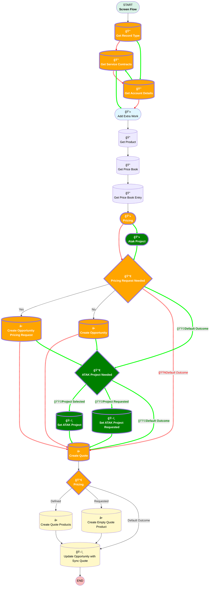

# [Account][Screen-Flow] Add Extra Work

## Flow Diagram

```mermaid
%% If you read this, your Markdown visualizer does not handle MermaidJS syntax.
%% - If you are in VsCode, install extension `Markdown Preview Mermaid Support` at https://marketplace.visualstudio.com/items?itemName=bierner.markdown-mermaid
%% - If you are using sfdx-hardis, try to define env variable `MERMAID_MODES=cli,docker` ,then run again the command to regenerate markdown with SVG images.
%% - If you are within mkdocs-material, define mermaid plugin in `mkdocs.yml` as described in https://squidfunk.github.io/mkdocs-material/extensions/mermaid/
%% - At last resort, you can copy-paste this MermaidJS code in https://mermaid.live/ to see the Flow Diagram

flowchart TB
START(["START<br/><b>Screen Flow</b>"]):::startClass
click START "#general-information" "3354280388"


ATAK_Project_Needed{"<b>🔀 <em></em><br/>ATAK Project Needed</b>"}:::decisionsAdded
click ATAK_Project_Needed "#atak_project_needed" "1021156515"


Pricing{"<b>🔀 <em></em><br/>Pricing</b>"}:::decisionsChanged
click Pricing "#pricing" "897206153"

Pricing_Request_Needed{"<b>🔀 <em></em><br/>Pricing Request Needed</b>"}:::decisionsChanged


click Pricing_Request_Needed "#pricing_request_needed" "1199015834"


Create_Empty_Quote_Product[("â• <em></em><br/>Create Empty Quote Product")]:::recordCreates
click Create_Empty_Quote_Product "#create_empty_quote_product" "1069075530"

Create_Opportunity[("<b>â• <em></em><br/>Create Opportunity</b>")]:::recordCreatesChanged


click Create_Opportunity "#create_opportunity" "1138322838"


Create_Opportunity_Pricing[("<b>â• <em></em><br/>Create Opportunity Pricing Request</b>")]:::recordCreatesChanged


click Create_Opportunity_Pricing "#create_opportunity_pricing" "814792322"


Create_Quote[("<b>â• <em></em><br/>Create Quote</b>")]:::recordCreatesChanged


click Create_Quote "#create_quote" "1558405254"


Create_Quote_Products[("â• <em></em><br/>Create Quote Products")]:::recordCreates
click Create_Quote_Products "#create_quote_products" "2152442002"

Get_Account_Details[("<b>🔠<em></em><br/>Get Account Details</b>")]:::recordLookupsChanged


click Get_Account_Details "#get_account_details" "2074714055"


Get_Price_Book[("🔠<em></em><br/>Get Price Book")]:::recordLookups
click Get_Price_Book "#get_price_book" "2689493689"

Get_Price_Book_Entry[("🔠<em></em><br/>Get Price Book Entry")]:::recordLookups
click Get_Price_Book_Entry "#get_price_book_entry" "3888028995"

Get_Product[("🔠<em></em><br/>Get Product")]:::recordLookups
click Get_Product "#get_product" "1550029501"

Get_Record_Type[("<b>🔠<em></em><br/>Get Record Type</b>")]:::recordLookupsChanged


click Get_Record_Type "#get_record_type" "2687488839"


Get_Service_Contracts[("<b>🔠<em></em><br/>Get Service Contracts</b>")]:::recordLookupsChanged


click Get_Service_Contracts "#get_service_contracts" "2318674667"


Set_ATAK_Project[("<b>ğŸ› ï¸ <em></em><br/>Set ATAK Project</b>")]:::recordUpdatesAdded
click Set_ATAK_Project "#set_atak_project" "1225614173"

Set_ATAK_Project_Requested[("<b>ğŸ› ï¸ <em></em><br/>Set ATAK Project Requested</b>")]:::recordUpdatesAdded
click Set_ATAK_Project_Requested "#set_atak_project_requested" "2913384462"


Update_Opportunity_with_Sync_Quote[("ğŸ› ï¸ <em></em><br/>Update Opportunity with Sync Quote")]:::recordUpdates
click Update_Opportunity_with_Sync_Quote "#update_opportunity_with_sync_quote" "3282998306"

Add_Extra_Work(["💻 <em></em><br/>Add Extra Work"]):::screens
click Add_Extra_Work "#add_extra_work" "3509726432"


Atak_Project(["<b>💻 <em></em><br/>Atak Project</b>"]):::screensAdded
click Atak_Project "#atak_project" "3246555534"


PricingScreen(["<b>💻 <em></em><br/>Pricing</b>"]):::screensChanged


click PricingScreen "#pricingscreen" "411734992"


ATAK_Project_Needed ==> |"🟩<b>Project Selected</b>"| Set_ATAK_Project
ATAK_Project_Needed ==> |"🟩<b>Project Requested</b>"| Set_ATAK_Project_Requested
ATAK_Project_Needed ==> |"🟩<b>Default Outcome</b>"| Create_Quote

Pricing --> |"Defined"| Create_Quote_Products
Pricing --> |"Requested"| Create_Empty_Quote_Product
Pricing --> |"Default Outcome"| Update_Opportunity_with_Sync_Quote
Pricing_Request_Needed --> |"Yes"| Create_Opportunity_Pricing
Pricing_Request_Needed --> |"No"| Create_Opportunity

Pricing_Request_Needed -.-> |"🟥<i>Default Outcome</i>"| Create_Quote

Pricing_Request_Needed ==> |"🟩<b>Default Outcome</b>"| ATAK_Project_Needed

Create_Empty_Quote_Product --> Update_Opportunity_with_Sync_Quote

Create_Opportunity -.-> Create_Quote
Create_Opportunity_Pricing -.-> Create_Quote

Create_Opportunity ==> ATAK_Project_Needed
Create_Opportunity_Pricing ==> ATAK_Project_Needed

Create_Quote --> Pricing
Create_Quote_Products --> Update_Opportunity_with_Sync_Quote

Get_Account_Details -.-> Add_Extra_Work

Get_Account_Details ==> Get_Service_Contracts

Get_Price_Book --> Get_Price_Book_Entry
Get_Price_Book_Entry --> PricingScreen
Get_Product --> Get_Price_Book

Get_Record_Type -.-> Get_Service_Contracts
Get_Service_Contracts -.-> Get_Account_Details

Get_Record_Type ==> Get_Account_Details
Get_Service_Contracts ==> Add_Extra_Work
Set_ATAK_Project ==> Create_Quote
Set_ATAK_Project_Requested ==> Create_Quote

Update_Opportunity_with_Sync_Quote --> END_Update_Opportunity_with_Sync_Quote
Add_Extra_Work --> Get_Product

PricingScreen -.-> Pricing_Request_Needed

Atak_Project ==> Pricing_Request_Needed
PricingScreen ==> Atak_Project

START -->  Get_Record_Type
END_Update_Opportunity_with_Sync_Quote(( END )):::endClass


classDef actionCalls fill:#D4E4FC,color:black,text-decoration:none,max-height:100px
classDef assignments fill:#FBEED7,color:black,text-decoration:none,max-height:100px
classDef collectionProcessors fill:#F0E3FA,color:black,text-decoration:none,max-height:100px
classDef customErrors fill:#FFE9E9,color:black,text-decoration:none,max-height:100px
classDef decisions fill:#FDEAF6,color:black,text-decoration:none,max-height:100px
classDef loops fill:#FDEAF6,color:black,text-decoration:none,max-height:100px
classDef recordCreates fill:#FFF8C9,color:black,text-decoration:none,max-height:100px
classDef recordDeletes fill:#FFF8C9,color:black,text-decoration:none,max-height:100px
classDef recordLookups fill:#EDEAFF,color:black,text-decoration:none,max-height:100px
classDef recordUpdates fill:#FFF8C9,color:black,text-decoration:none,max-height:100px
classDef screens fill:#DFF6FF,color:black,text-decoration:none,max-height:100px
classDef subflows fill:#D4E4FC,color:black,text-decoration:none,max-height:100px
classDef startClass fill:#D9F2E6,color:black,text-decoration:none,max-height:100px
classDef endClass fill:#F9BABA,color:black,text-decoration:none,max-height:100px


classDef actionCallsAdded fill:green,color:white,stroke-width:4px,text-decoration:none,max-height:100px
classDef assignmentsAdded fill:green,color:white,stroke-width:4px,text-decoration:none,max-height:100px
classDef collectionProcessorsAdded fill:green,color:white,stroke-width:4px,text-decoration:none,max-height:100px
classDef customErrorsAdded fill:green,color:white,stroke-width:4px,text-decoration:none,max-height:100px
classDef decisionsAdded fill:green,color:white,stroke-width:4px,text-decoration:none,max-height:100px
classDef loopsAdded fill:green,color:white,stroke-width:4px,text-decoration:none,max-height:100px
classDef recordCreatesAdded fill:green,color:white,stroke-width:4px,text-decoration:none,max-height:100px
classDef recordDeletesAdded fill:green,color:white,stroke-width:4px,text-decoration:none,max-height:100px
classDef recordLookupsAdded fill:green,color:white,stroke-width:4px,text-decoration:none,max-height:100px
classDef recordUpdatesAdded fill:green,color:white,stroke-width:4px,text-decoration:none,max-height:100px
classDef screensAdded fill:green,color:white,stroke-width:4px,text-decoration:none,max-height:100px
classDef subflowsAdded fill:green,color:white,stroke-width:4px,text-decoration:none,max-height:100px
classDef startClassAdded fill:green,color:white,stroke-width:4px,text-decoration:none,max-height:100px

classDef actionCallsRemoved fill:red,color:white,stroke-width:4px,text-decoration:none,max-height:100px
classDef assignmentsRemoved fill:red,color:white,stroke-width:4px,text-decoration:none,max-height:100px
classDef collectionProcessorsRemoved fill:red,color:white,stroke-width:4px,text-decoration:none,max-height:100px
classDef customErrorsRemoved fill:red,color:white,stroke-width:4px,text-decoration:none,max-height:100px
classDef decisionsRemoved fill:red,color:white,stroke-width:4px,text-decoration:none,max-height:100px
classDef loopsRemoved fill:red,color:white,stroke-width:4px,text-decoration:none,max-height:100px
classDef recordCreatesRemoved fill:red,color:white,stroke-width:4px,text-decoration:none,max-height:100px
classDef recordDeletesRemoved fill:red,color:white,stroke-width:4px,text-decoration:none,max-height:100px
classDef recordLookupsRemoved fill:red,color:white,stroke-width:4px,text-decoration:none,max-height:100px
classDef recordUpdatesRemoved fill:red,color:white,stroke-width:4px,text-decoration:none,max-height:100px
classDef screensRemoved fill:red,color:white,stroke-width:4px,text-decoration:none,max-height:100px
classDef subflowsRemoved fill:red,color:white,stroke-width:4px,text-decoration:none,max-height:100px
classDef startClassRemoved fill:red,color:white,stroke-width:4px,text-decoration:none,max-height:100px

classDef actionCallsChanged fill:orange,color:white,stroke-width:4px,text-decoration:none,max-height:100px
classDef assignmentsChanged fill:orange,color:white,stroke-width:4px,text-decoration:none,max-height:100px
classDef collectionProcessorsChanged fill:orange,color:white,stroke-width:4px,text-decoration:none,max-height:100px
classDef customErrorsChanged fill:orange,color:white,stroke-width:4px,text-decoration:none,max-height:100px
classDef decisionsChanged fill:orange,color:white,stroke-width:4px,text-decoration:none,max-height:100px
classDef loopsChanged fill:orange,color:white,stroke-width:4px,text-decoration:none,max-height:100px
classDef recordCreatesChanged fill:orange,color:white,stroke-width:4px,text-decoration:none,max-height:100px
classDef recordDeletesChanged fill:orange,color:white,stroke-width:4px,text-decoration:none,max-height:100px
classDef recordLookupsChanged fill:orange,color:white,stroke-width:4px,text-decoration:none,max-height:100px
classDef recordUpdatesChanged fill:orange,color:white,stroke-width:4px,text-decoration:none,max-height:100px
classDef screensChanged fill:orange,color:white,stroke-width:4px,text-decoration:none,max-height:100px
classDef subflowsChanged fill:orange,color:white,stroke-width:4px,text-decoration:none,max-height:100px
classDef startClassChanged fill:orange,color:white,stroke-width:4px,text-decoration:none,max-height:100px
  
linkStyle 0,1,2,9,13,14,18,24,25,26,27,31,32 stroke:#00ff00,stroke-width:4px,color:green;
linkStyle 8,11,12,17,22,23,30 stroke:#ff0000,stroke-width:4px,color:red;
```

<!-- Flow description -->

## Flow Nodes Details

### 🟩ATAK_Project_Needed

|🟩<b><!-- --></b>|<b><!-- --></b>|
|:---|:---|
|🟩<b>Type</b>|<b>Decision</b>|
|🟩<b>Label</b>|<b>ATAK Project Needed</b>|
|🟩<b>Default Connector</b>|<b>[Create_Quote](#create_quote)</b>|
|🟩<b>Default Connector Label</b>|<b>Default Outcome</b>|

#### 🟩Rule Project_Selected (Project Selected)

|🟩<b><!-- --></b>|<b><!-- --></b>|
|:---|:---|
|🟩<b>Connector</b>|<b>[Set_ATAK_Project](#set_atak_project)</b>|
|🟩<b>Condition Logic</b>|<b>and</b>|

|🟩<b>Condition Id</b>|<b>Left Value Reference</b>|<b>Operator</b>|<b>Right Value</b>|
|:-- |:-- |:--:|:--: |
|🟩<b>1</b>|<b>Existing_ATAK_Project.recordId</b>|<b> Is Null</b>|<b>⬜</b>|

#### 🟩Rule Project_Requested (Project Requested)

|🟩<b><!-- --></b>|<b><!-- --></b>|
|:---|:---|
|🟩<b>Connector</b>|<b>[Set_ATAK_Project_Requested](#set_atak_project_requested)</b>|
|🟩<b>Condition Logic</b>|<b>and</b>|

|🟩<b>Condition Id</b>|<b>Left Value Reference</b>|<b>Operator</b>|<b>Right Value</b>|
|:-- |:-- |:--:|:--: |
|🟩<b>1</b>|<b>Existing_ATAK_Project.recordId</b>|<b> Is Null</b>|<b>✅</b>|

### Pricing_Request_Needed

|<!-- -->|<!-- -->|
|:---|:---|
|Type|Decision|
|Label|Pricing Request Needed|
|🟥<i>Default Connector</i>|<i>[Create_Quote](#create_quote)</i>|
|🟩<b>Default Connector</b>|<b>[ATAK_Project_Needed](#atak_project_needed)</b>|
|Default Connector Label|Default Outcome|

### Create_Opportunity

|<!-- -->|<!-- -->|
|:---|:---|
|Type|Record Create|
|Object|Opportunity|
|Label|Create Opportunity|
|Assign Record Id To Reference|CreatedOpportunityId|
|🟥<i>Connector</i>|<i>[Create_Quote](#create_quote)</i>|
|🟩<b>Connector</b>|<b>[ATAK_Project_Needed](#atak_project_needed)</b>|

### Create_Opportunity_Pricing

|<!-- -->|<!-- -->|
|:---|:---|
|Type|Record Create|
|Object|Opportunity|
|Label|Create Opportunity Pricing Request|
|Assign Record Id To Reference|CreatedOpportunityId|
|🟥<i>Connector</i>|<i>[Create_Quote](#create_quote)</i>|
|🟩<b>Connector</b>|<b>[ATAK_Project_Needed](#atak_project_needed)</b>|

### Create_Quote

|<!-- -->|<!-- -->|
|:---|:---|
|Type|Record Create|
|Object|Quote|
|Label|Create Quote|
|Assign Record Id To Reference|CreatedQuoteId|
|Connector|[Pricing](#pricing)|

#### Input Assignments

|Field|Value|
|:-- |:--: |
|Amount__c|Unit_Price|
|Name|OpportunityNameCalculation|
|OpportunityId|CreatedOpportunityId|
|Pricebook2Id|Get_Price_Book.Id|
|🟩<b>QuoteAccountId</b>|<b>recordId</b>|

### Get_Account_Details

|<!-- -->|<!-- -->|
|:---|:---|
|Type|Record Lookup|
|Object|Account|
|Label|Get Account Details|
|Assign Null Values If No Records Found|⬜|
|Get First Record Only|✅|
|Store Output Automatically|✅|
|🟥<i>Connector</i>|<i>[Add_Extra_Work](#add_extra_work)</i>|
|🟩<b>Connector</b>|<b>[Get_Service_Contracts](#get_service_contracts)</b>|

### Get_Record_Type

|<!-- -->|<!-- -->|
|:---|:---|
|Type|Record Lookup|
|Object|RecordType|
|Label|Get Record Type|
|Assign Null Values If No Records Found|⬜|
|Get First Record Only|✅|
|Store Output Automatically|✅|
|🟥<i>Connector</i>|<i>[Get_Service_Contracts](#get_service_contracts)</i>|
|🟩<b>Connector</b>|<b>[Get_Account_Details](#get_account_details)</b>|

### Get_Service_Contracts

|<!-- -->|<!-- -->|
|:---|:---|
|Type|Record Lookup|
|Object|ServiceContract|
|Label|Get Service Contracts|
|Assign Null Values If No Records Found|⬜|
|Get First Record Only|⬜|
|Store Output Automatically|✅|
|🟥<i>Connector</i>|<i>[Get_Account_Details](#get_account_details)</i>|
|🟩<b>Connector</b>|<b>[Add_Extra_Work](#add_extra_work)</b>|

#### Filters (logic: **and**)

|Filter Id|Field|Operator|Value|
|:-- |:-- |:--:|:--: |
|🟥<i>1</i>|<i>AccountId</i>|<i> Equal To</i>|<i>recordId</i>|
|🟩<b>1</b>|<b>AccountId</b>|<b> Equal To</b>|<b>Get_Account_Details.ParentId</b>|

### 🟩Set_ATAK_Project

|🟩<b><!-- --></b>|<b><!-- --></b>|
|:---|:---|
|🟩<b>Type</b>|<b>Record Update</b>|
|🟩<b>Object</b>|<b>Opportunity</b>|
|🟩<b>Label</b>|<b>Set ATAK Project</b>|
|🟩<b>Connector</b>|<b>[Create_Quote](#create_quote)</b>|

#### 🟩Filters (logic: **and**)

|🟩<b>Filter Id</b>|<b>Field</b>|<b>Operator</b>|<b>Value</b>|
|:-- |:-- |:--:|:--: |
|🟩<b>1</b>|<b>Id</b>|<b> Equal To</b>|<b>CreatedOpportunityId</b>|

#### 🟩Input Assignments

|🟩<b>Field</b>|<b>Value</b>|
|:-- |:--: |
|🟩<b>ATAK_Projectx__c</b>|<b>Existing_ATAK_Project.recordId</b>|

### 🟩Set_ATAK_Project_Requested

|🟩<b><!-- --></b>|<b><!-- --></b>|
|:---|:---|
|🟩<b>Type</b>|<b>Record Update</b>|
|🟩<b>Object</b>|<b>Opportunity</b>|
|🟩<b>Label</b>|<b>Set ATAK Project Requested</b>|
|🟩<b>Connector</b>|<b>[Create_Quote](#create_quote)</b>|

#### 🟩Filters (logic: **and**)

|🟩<b>Filter Id</b>|<b>Field</b>|<b>Operator</b>|<b>Value</b>|
|:-- |:-- |:--:|:--: |
|🟩<b>1</b>|<b>Id</b>|<b> Equal To</b>|<b>CreatedOpportunityId</b>|

#### 🟩Input Assignments

|🟩<b>Field</b>|<b>Value</b>|
|:-- |:--: |
|🟩<b>ATAK_Project_Needed__c</b>|<b>✅</b>|
|🟩<b>ATAK_Project_Request_Comment__c</b>|<b>Any_specific_comments_for_this_project_request</b>|
|🟩<b>ATAK_Project_Request_Priority__c</b>|<b>Priority</b>|
|🟩<b>ATAK_Project_Request_Status__c</b>|<b>Requested</b>|
|🟩<b>Service_Package__c</b>|<b>Service_Package_Type</b>|

### 🟥PricingScreen

### 🟩Atak_Project

|<!-- -->|<!-- -->|
|:---|:---|
|Type|Screen|
|🟥<i>Label</i>|<i>[Pricing](#pricing)</i>|
|🟩<b>Label</b>|<b>Atak Project</b>|
|Allow Back|⬜|
|Allow Finish|✅|
|Allow Pause|⬜|
|Next Or Finish Button Label|Create Extra Work|
|Show Footer|✅|
|Show Header|⬜|
|Connector|[Pricing_Request_Needed](#pricing_request_needed)|

#### 🟩Copy_1_of_ExtraWorkTitleScreen2

|🟩<b><!-- --></b>|<b><!-- --></b>|
|:---|:---|
|🟩<b>Field Text</b>|<b>
<strong style="font-size: 18px;">Add Extra Work</strong>

 

Select an existing ATAK Project or request a new ATAK Project creation
</b>|
|🟩<b>Field Type</b>|<b> Display Text</b>|

#### 🟩Existing_ATAK_Project

|🟩<b><!-- --></b>|<b><!-- --></b>|
|:---|:---|
|🟩<b>Extension Name</b>|<b>flowruntime:lookup</b>|
|🟩<b>Field Type</b>|<b> Component Instance</b>|
|🟩<b>Inputs On Next Nav To Assoc Scrn</b>|<b> Use Stored Values</b>|
|🟩<b>Is Required</b>|<b>✅</b>|
|🟩<b>Store Output Automatically</b>|<b>✅</b>|
|🟩<b>Parent Field</b>|<b>[Atak_Project_Section1_Column1](#atak_project_section1_column1)</b>|
|🟩<b>Field Api Name (input)</b>|<b>ATAK_Projectx__c</b>|
|🟩<b>Label (input)</b>|<b>Existing ATAK Project</b>|
|🟩<b>Object Api Name (input)</b>|<b>Opportunity</b>|
|🟩<b>Disabled (input)</b>|<b>New_ATAK_Toggle.value</b>|

#### 🟩New_ATAK_Toggle

|🟩<b><!-- --></b>|<b><!-- --></b>|
|:---|:---|
|🟩<b>Extension Name</b>|<b>flowruntime:toggle</b>|
|🟩<b>Field Type</b>|<b> Component Instance</b>|
|🟩<b>Inputs On Next Nav To Assoc Scrn</b>|<b> Use Stored Values</b>|
|🟩<b>Is Required</b>|<b>✅</b>|
|🟩<b>Store Output Automatically</b>|<b>✅</b>|
|🟩<b>Parent Field</b>|<b>[Atak_Project_Section1_Column1](#atak_project_section1_column1)</b>|
|🟩<b>Label (input)</b>|<b>Request New Project</b>|
|🟩<b>Message Toggle Active (input)</b>|<b>Yes</b>|
|🟩<b>Message Toggle Inactive (input)</b>|<b>No</b>|

#### 🟩Atak_Project_Section1_Column1

|🟩<b><!-- --></b>|<b><!-- --></b>|
|:---|:---|
|🟩<b>Field Type</b>|<b> Region</b>|
|🟩<b>Is Required</b>|<b>⬜</b>|
|🟩<b>Parent Field</b>|<b>[Atak_Project_Section1](#atak_project_section1)</b>|
|🟩<b>Width (input)</b>|<b>6</b>|

#### 🟩Atak_Project_Section1_Column2

|🟩<b><!-- --></b>|<b><!-- --></b>|
|:---|:---|
|🟩<b>Field Type</b>|<b> Region</b>|
|🟩<b>Is Required</b>|<b>⬜</b>|
|🟩<b>Parent Field</b>|<b>[Atak_Project_Section1](#atak_project_section1)</b>|
|🟩<b>Width (input)</b>|<b>6</b>|

#### 🟩Atak_Project_Section1

|🟩<b><!-- --></b>|<b><!-- --></b>|
|:---|:---|
|🟩<b>Field Type</b>|<b> Region Container</b>|
|🟩<b>Is Required</b>|<b>⬜</b>|
|🟩<b>Region Container Type</b>|<b> Section Without Header</b>|

#### 🟩Priority

|🟩<b><!-- --></b>|<b><!-- --></b>|
|:---|:---|
|🟩<b>Data Type</b>|<b>String</b>|
|🟩<b>Choice References</b>|<b>- Low - Medium - High </b>|
|🟩<b>Field Text</b>|<b>Priority</b>|
|🟩<b>Field Type</b>|<b> Dropdown Box</b>|
|🟩<b>Inputs On Next Nav To Assoc Scrn</b>|<b> Use Stored Values</b>|
|🟩<b>Is Required</b>|<b>⬜</b>|
|🟩<b>Parent Field</b>|<b>[Atak_Project_Section2_Column1](#atak_project_section2_column1)</b>|

#### 🟩Any_specific_comments_for_this_project_request

|🟩<b><!-- --></b>|<b><!-- --></b>|
|:---|:---|
|🟩<b>Data Type</b>|<b>String</b>|
|🟩<b>Field Text</b>|<b>Any specific comments for this project request?</b>|
|🟩<b>Field Type</b>|<b> Input Field</b>|
|🟩<b>Inputs On Next Nav To Assoc Scrn</b>|<b> Use Stored Values</b>|
|🟩<b>Is Required</b>|<b>⬜</b>|
|🟩<b>Parent Field</b>|<b>[Atak_Project_Section2_Column1](#atak_project_section2_column1)</b>|

#### 🟩Atak_Project_Section2_Column1

|🟩<b><!-- --></b>|<b><!-- --></b>|
|:---|:---|
|🟩<b>Field Type</b>|<b> Region</b>|
|🟩<b>Is Required</b>|<b>⬜</b>|
|🟩<b>Parent Field</b>|<b>[Atak_Project_Section2](#atak_project_section2)</b>|
|🟩<b>Width (input)</b>|<b>6</b>|

#### 🟩Service_Package_Type

|🟩<b><!-- --></b>|<b><!-- --></b>|
|:---|:---|
|🟩<b>Data Type</b>|<b>String</b>|
|🟩<b>Choice References</b>|<b>servicePackageType</b>|
|🟩<b>Field Text</b>|<b>Service Package Type</b>|
|🟩<b>Field Type</b>|<b> Dropdown Box</b>|
|🟩<b>Help Text</b>|<b>
Used to generate a suggested project name
</b>|
|🟩<b>Inputs On Next Nav To Assoc Scrn</b>|<b> Use Stored Values</b>|
|🟩<b>Is Required</b>|<b>⬜</b>|
|🟩<b>Parent Field</b>|<b>[Atak_Project_Section2_Column2](#atak_project_section2_column2)</b>|

#### 🟩Atak_Project_Section2_Column2

|🟩<b><!-- --></b>|<b><!-- --></b>|
|:---|:---|
|🟩<b>Field Type</b>|<b> Region</b>|
|🟩<b>Is Required</b>|<b>⬜</b>|
|🟩<b>Parent Field</b>|<b>[Atak_Project_Section2](#atak_project_section2)</b>|
|🟩<b>Width (input)</b>|<b>6</b>|

#### 🟩Atak_Project_Section2

|🟩<b><!-- --></b>|<b><!-- --></b>|
|:---|:---|
|🟩<b>Field Type</b>|<b> Region Container</b>|
|🟩<b>Is Required</b>|<b>⬜</b>|
|🟩<b>Region Container Type</b>|<b> Section Without Header</b>|
|🟩<b>Visibility Rule</b>|<b>conditionLogic: and conditions: &nbsp;&nbsp;leftValueReference: New_ATAK_Toggle.value &nbsp;&nbsp;operator: EqualTo &nbsp;&nbsp;rightValue: &nbsp;&nbsp;&nbsp;&nbsp;booleanValue: true </b>|

### 🟩PricingScreen

|🟩<b><!-- --></b>|<b><!-- --></b>|
|:---|:---|
|🟩<b>Type</b>|<b>Screen</b>|
|🟩<b>Label</b>|<b>[Pricing](#pricing)</b>|
|🟩<b>Allow Back</b>|<b>⬜</b>|
|🟩<b>Allow Finish</b>|<b>✅</b>|
|🟩<b>Allow Pause</b>|<b>⬜</b>|
|🟩<b>Next Or Finish Button Label</b>|<b>Next</b>|
|🟩<b>Show Footer</b>|<b>✅</b>|
|🟩<b>Show Header</b>|<b>⬜</b>|
|🟩<b>Connector</b>|<b>[Atak_Project](#atak_project)</b>|

___

_Documentation generated from branch monitoring_krinkelsgreencare__upeodev_sandbox by [sfdx-hardis](https://sfdx-hardis.cloudity.com), featuring [salesforce-flow-visualiser](https://github.com/toddhalfpenny/salesforce-flow-visualiser)_