# [Account][Screen-Flow] Add Extra Work Quote

## Flow Diagram

```mermaid
%% If you read this, your Markdown visualizer does not handle MermaidJS syntax.
%% - If you are in VsCode, install extension `Markdown Preview Mermaid Support` at https://marketplace.visualstudio.com/items?itemName=bierner.markdown-mermaid
%% - If you are using sfdx-hardis, try to define env variable `MERMAID_MODES=cli,docker` ,then run again the command to regenerate markdown with SVG images.
%% - If you are within mkdocs-material, define mermaid plugin in `mkdocs.yml` as described in https://squidfunk.github.io/mkdocs-material/extensions/mermaid/
%% - At last resort, you can copy-paste this MermaidJS code in https://mermaid.live/ to see the Flow Diagram

flowchart TB
START(["<b>START<br/><b>Screen Flow</b></b>"]):::startClassChanged


click START "#general-information" "3544876864"


Open_Quote("⚡ <em></em><br/>Open Quote"):::actionCalls
click Open_Quote "#open_quote" "3190499939"

Set_Quote_Values_for_ATAK_Project_Req[\"🟰 <em></em><br/>Set Quote Values for ATAK Project Req"/]:::assignments
click Set_Quote_Values_for_ATAK_Project_Req "#set_quote_values_for_atak_project_req" "140031958"


Set_Quote_Values_for_Pricing_Req[\"<i>🟰 <em></em><br/>Set Quote Values for Pricing Req</i>"/]:::assignmentsRemoved
click Set_Quote_Values_for_Pricing_Req "#set_quote_values_for_pricing_req" "2023165874"


Set_Quote_Values_no_Pricing_Req[\"<b>🟰 <em></em><br/>Set Quote Values no Pricing Req</b>"/]:::assignmentsChanged


click Set_Quote_Values_no_Pricing_Req "#set_quote_values_no_pricing_req" "1716476897"


Stamp_ATAK_Project[\"🟰 <em></em><br/>Stamp ATAK Project"/]:::assignments
click Stamp_ATAK_Project "#stamp_atak_project" "1019008470"

ATAK_Project_Needed{"🔀 <em></em><br/>ATAK Project Needed"}:::decisions
click ATAK_Project_Needed "#atak_project_needed" "144185189"


Pricing{"<i>🔀 <em></em><br/>Pricing</i>"}:::decisionsRemoved
click Pricing "#pricing" "2049559269"

Pricing_Request_Needed{"<i>🔀 <em></em><br/>Pricing Request Needed</i>"}:::decisionsRemoved
click Pricing_Request_Needed "#pricing_request_needed" "4107061553"

Create_Empty_Quote_Product[("<i>➕ <em></em><br/>Create Empty Quote Product</i>")]:::recordCreatesRemoved
click Create_Empty_Quote_Product "#create_empty_quote_product" "2470100923"


Create_Quote[("<b>➕ <em></em><br/>Create Quote</b>")]:::recordCreatesChanged


click Create_Quote "#create_quote" "715331569"


Create_Quote_Products[("➕ <em></em><br/>Create Quote Products")]:::recordCreates
click Create_Quote_Products "#create_quote_products" "975807874"

Get_Account_Details[("🔍 <em></em><br/>Get Account Details")]:::recordLookups
click Get_Account_Details "#get_account_details" "2074714055"

Get_Price_Book[("🔍 <em></em><br/>Get Price Book")]:::recordLookups
click Get_Price_Book "#get_price_book" "2689493689"

Get_Price_Book_Entry[("🔍 <em></em><br/>Get Price Book Entry")]:::recordLookups
click Get_Price_Book_Entry "#get_price_book_entry" "3888028995"

Get_Product[("🔍 <em></em><br/>Get Product")]:::recordLookups
click Get_Product "#get_product" "1550029501"

Get_Record_Type[("🔍 <em></em><br/>Get Record Type")]:::recordLookups
click Get_Record_Type "#get_record_type" "4243362384"

Get_Service_Contracts[("🔍 <em></em><br/>Get Service Contracts")]:::recordLookups
click Get_Service_Contracts "#get_service_contracts" "2318674667"

Add_Extra_Work(["<b>💻 <em></em><br/>Add Extra Work</b>"]):::screensChanged


click Add_Extra_Work "#add_extra_work" "1695766313"


Atak_Project(["<b>💻 <em></em><br/>Atak Project</b>"]):::screensChanged


click Atak_Project "#atak_project" "3760113405"


PricingScreen(["<b>💻 <em></em><br/>Pricing</b>"]):::screensChanged


click PricingScreen "#pricingscreen" "4253704221"



Quote_PDF_Administrion(["<b>💻 <em></em><br/>Quote PDF Administrion</b>"]):::screensAdded
click Quote_PDF_Administrion "#quote_pdf_administrion" "1434990421"


Open_Quote --> END_Open_Quote
Set_Quote_Values_for_ATAK_Project_Req --> Create_Quote

Set_Quote_Values_for_Pricing_Req -.-> ATAK_Project_Needed

Set_Quote_Values_no_Pricing_Req --> ATAK_Project_Needed
Stamp_ATAK_Project --> Create_Quote
ATAK_Project_Needed --> |"Project Selected"| Stamp_ATAK_Project
ATAK_Project_Needed --> |"Project Requested"| Set_Quote_Values_for_ATAK_Project_Req
ATAK_Project_Needed --> |"Default Outcome"| Create_Quote

Pricing -.-> |"🟥<i>Defined</i>"| Create_Quote_Products
Pricing -.-> |"🟥<i>Requested</i>"| Create_Empty_Quote_Product
Pricing -.-> |"🟥<i>Default Outcome</i>"| Open_Quote
Pricing_Request_Needed -.-> |"🟥<i>Yes</i>"| Set_Quote_Values_for_Pricing_Req
Pricing_Request_Needed -.-> |"🟥<i>No</i>"| Set_Quote_Values_no_Pricing_Req
Pricing_Request_Needed -.-> |"🟥<i>Default Outcome</i>"| ATAK_Project_Needed
Create_Empty_Quote_Product -.-> Open_Quote
Create_Quote -.-> Pricing

Create_Quote ==> Create_Quote_Products

Create_Quote_Products --> Open_Quote
Get_Account_Details --> Get_Service_Contracts
Get_Price_Book --> Get_Price_Book_Entry
Get_Price_Book_Entry --> PricingScreen
Get_Product --> Get_Price_Book
Get_Record_Type --> Get_Account_Details
Get_Service_Contracts --> Add_Extra_Work
Add_Extra_Work --> Get_Product

Atak_Project -.-> Pricing_Request_Needed
PricingScreen -.-> Atak_Project

Atak_Project ==> Set_Quote_Values_no_Pricing_Req
PricingScreen ==> Quote_PDF_Administrion
Quote_PDF_Administrion ==> Atak_Project

START -->  Get_Record_Type
END_Open_Quote(( END )):::endClass


classDef actionCalls fill:#D4E4FC,color:black,text-decoration:none,max-height:100px
classDef assignments fill:#FBEED7,color:black,text-decoration:none,max-height:100px
classDef collectionProcessors fill:#F0E3FA,color:black,text-decoration:none,max-height:100px
classDef customErrors fill:#FFE9E9,color:black,text-decoration:none,max-height:100px
classDef decisions fill:#FDEAF6,color:black,text-decoration:none,max-height:100px
classDef loops fill:#FDEAF6,color:black,text-decoration:none,max-height:100px
classDef recordCreates fill:#FFF8C9,color:black,text-decoration:none,max-height:100px
classDef recordDeletes fill:#FFF8C9,color:black,text-decoration:none,max-height:100px
classDef recordLookups fill:#EDEAFF,color:black,text-decoration:none,max-height:100px
classDef recordUpdates fill:#FFF8C9,color:black,text-decoration:none,max-height:100px
classDef screens fill:#DFF6FF,color:black,text-decoration:none,max-height:100px
classDef subflows fill:#D4E4FC,color:black,text-decoration:none,max-height:100px
classDef startClass fill:#D9F2E6,color:black,text-decoration:none,max-height:100px
classDef endClass fill:#F9BABA,color:black,text-decoration:none,max-height:100px



classDef actionCallsAdded fill:green,color:white,stroke-width:4px,text-decoration:none,max-height:100px
classDef assignmentsAdded fill:green,color:white,stroke-width:4px,text-decoration:none,max-height:100px
classDef collectionProcessorsAdded fill:green,color:white,stroke-width:4px,text-decoration:none,max-height:100px
classDef customErrorsAdded fill:green,color:white,stroke-width:4px,text-decoration:none,max-height:100px
classDef decisionsAdded fill:green,color:white,stroke-width:4px,text-decoration:none,max-height:100px
classDef loopsAdded fill:green,color:white,stroke-width:4px,text-decoration:none,max-height:100px
classDef recordCreatesAdded fill:green,color:white,stroke-width:4px,text-decoration:none,max-height:100px
classDef recordDeletesAdded fill:green,color:white,stroke-width:4px,text-decoration:none,max-height:100px
classDef recordLookupsAdded fill:green,color:white,stroke-width:4px,text-decoration:none,max-height:100px
classDef recordUpdatesAdded fill:green,color:white,stroke-width:4px,text-decoration:none,max-height:100px
classDef screensAdded fill:green,color:white,stroke-width:4px,text-decoration:none,max-height:100px
classDef subflowsAdded fill:green,color:white,stroke-width:4px,text-decoration:none,max-height:100px
classDef startClassAdded fill:green,color:white,stroke-width:4px,text-decoration:none,max-height:100px

classDef actionCallsRemoved fill:red,color:white,stroke-width:4px,text-decoration:none,max-height:100px
classDef assignmentsRemoved fill:red,color:white,stroke-width:4px,text-decoration:none,max-height:100px
classDef collectionProcessorsRemoved fill:red,color:white,stroke-width:4px,text-decoration:none,max-height:100px
classDef customErrorsRemoved fill:red,color:white,stroke-width:4px,text-decoration:none,max-height:100px
classDef decisionsRemoved fill:red,color:white,stroke-width:4px,text-decoration:none,max-height:100px
classDef loopsRemoved fill:red,color:white,stroke-width:4px,text-decoration:none,max-height:100px
classDef recordCreatesRemoved fill:red,color:white,stroke-width:4px,text-decoration:none,max-height:100px
classDef recordDeletesRemoved fill:red,color:white,stroke-width:4px,text-decoration:none,max-height:100px
classDef recordLookupsRemoved fill:red,color:white,stroke-width:4px,text-decoration:none,max-height:100px
classDef recordUpdatesRemoved fill:red,color:white,stroke-width:4px,text-decoration:none,max-height:100px
classDef screensRemoved fill:red,color:white,stroke-width:4px,text-decoration:none,max-height:100px
classDef subflowsRemoved fill:red,color:white,stroke-width:4px,text-decoration:none,max-height:100px
classDef startClassRemoved fill:red,color:white,stroke-width:4px,text-decoration:none,max-height:100px

classDef actionCallsChanged fill:orange,color:white,stroke-width:4px,text-decoration:none,max-height:100px
classDef assignmentsChanged fill:orange,color:white,stroke-width:4px,text-decoration:none,max-height:100px
classDef collectionProcessorsChanged fill:orange,color:white,stroke-width:4px,text-decoration:none,max-height:100px
classDef customErrorsChanged fill:orange,color:white,stroke-width:4px,text-decoration:none,max-height:100px
classDef decisionsChanged fill:orange,color:white,stroke-width:4px,text-decoration:none,max-height:100px
classDef loopsChanged fill:orange,color:white,stroke-width:4px,text-decoration:none,max-height:100px
classDef recordCreatesChanged fill:orange,color:white,stroke-width:4px,text-decoration:none,max-height:100px
classDef recordDeletesChanged fill:orange,color:white,stroke-width:4px,text-decoration:none,max-height:100px
classDef recordLookupsChanged fill:orange,color:white,stroke-width:4px,text-decoration:none,max-height:100px
classDef recordUpdatesChanged fill:orange,color:white,stroke-width:4px,text-decoration:none,max-height:100px
classDef screensChanged fill:orange,color:white,stroke-width:4px,text-decoration:none,max-height:100px
classDef subflowsChanged fill:orange,color:white,stroke-width:4px,text-decoration:none,max-height:100px
classDef startClassChanged fill:orange,color:white,stroke-width:4px,text-decoration:none,max-height:100px
  
linkStyle 16,27,28,29 stroke:#00ff00,stroke-width:4px,color:green;
linkStyle 2,8,9,10,11,12,13,14,15,25,26 stroke:#ff0000,stroke-width:4px,color:red;
```

## General Information

|<!-- -->|<!-- -->|
|:---|:---|
|🟥<i>Status</i>|<i>Active</i>|
|🟩<b>Status</b>|<b>⚠️ Draft</b>|

## Formulas

|Name|Data Type|Expression|Description|
|:-- |:--:|:-- |:--  |
|🟥<i><!-- --></i>|<i><!-- --></i>|<i><!-- --></i>|<i><!-- --></i>|
|🟩<b>OpportunityNameCalculation</b>|<b>String</b>|<b>{!Get_Account_Details.Name} &' - Extra Work'&' - '&TEXT({!Expected_Work_Date})</b>|<b><!-- --></b>|

## Flow Nodes Details

### 🟥Set_Quote_Values_for_Pricing_Req

|<!-- -->|<!-- -->|
|:---|:---|
|🟥<i>Type</i>|<i>Assignment</i>|
|🟥<i>Label</i>|<i>Set Quote Values for Pricing Req</i>|
|🟥<i>Connector</i>|<i>[ATAK_Project_Needed](#atak_project_needed)</i>|

#### 🟥Assignments

|Assign To Reference|Operator|Value|
|:-- |:--:|:--: |
|🟥<i>quoteRecord.Name</i>|<i> Assign</i>|<i>OpportunityNameCalculation</i>|
|🟥<i>quoteRecord.QuoteAccountId</i>|<i> Assign</i>|<i>recordId</i>|
|🟥<i>quoteRecord.AccountId</i>|<i> Assign</i>|<i>recordId</i>|
|🟥<i>quoteRecord.Amount__c</i>|<i> Assign</i>|<i>Unit_Price</i>|
|🟥<i>quoteRecord.ExpirationDate</i>|<i> Assign</i>|<i>Expected_Work_Date</i>|
|🟥<i>quoteRecord.Description</i>|<i> Assign</i>|<i>Please_provide_a_description_of_the_extra_work</i>|
|🟥<i>quoteRecord.Pricing_Request_Needed__c</i>|<i> Assign</i>|<i>✅</i>|
|🟥<i>quoteRecord.ATAK_Project_Request_Priority__c</i>|<i> Assign</i>|<i>Pricing_Request_Priority</i>|
|🟥<i>quoteRecord.Price_Request_Status__c</i>|<i> Assign</i>|<i>Requested</i>|
|🟥<i>quoteRecord.Price_Request_Demand_Comments__c</i>|<i> Assign</i>|<i>Pricing_Request_Comment</i>|
|🟥<i>quoteRecord.Pricebook2Id</i>|<i> Assign</i>|<i>Get_Price_Book.Id</i>|
|🟥<i>quoteRecord.Status</i>|<i> Assign</i>|<i>[Pricing](#pricing)</i>|
|🟥<i>quoteRecord.Service_Contract__c</i>|<i> Assign</i>|<i>ServiceContractTable.firstSelectedRow.Id</i>|
|🟥<i>quoteRecord.Type__c</i>|<i> Assign</i>|<i>Extra Work</i>|

### Set_Quote_Values_no_Pricing_Req

#### Assignments

|Assign To Reference|Operator|Value|
|:-- |:--:|:--: |
|🟥<i>quoteRecord.Description</i>|<i> Assign</i>|<i>Please_provide_a_description_of_the_extra_work</i>|
|🟩<b>quoteRecord.Extra_Work__c</b>|<b> Assign</b>|<b>Please_provide_a_description_of_the_extra_work</b>|
|🟥<i>quoteRecord.Status</i>|<i> Assign</i>|<i>[Pricing](#pricing)</i>|
|🟩<b>quoteRecord.Status</b>|<b> Assign</b>|<b>Pricing</b>|
|🟩<b>quoteRecord.Document_Language__c</b>|<b> Assign</b>|<b>Document_Language</b>|
|🟩<b>quoteRecord.ContactId</b>|<b> Assign</b>|<b>Contact.recordId</b>|
|🟩<b>quoteRecord.Offer_Valid_For__c</b>|<b> Assign</b>|<b>Offer_Validity_in_months</b>|
|🟩<b>quoteRecord.Our_Reference__c</b>|<b> Assign</b>|<b>Our_Reference</b>|
|🟩<b>quoteRecord.Customer_Reference__c</b>|<b> Assign</b>|<b>Customer_Reference</b>|
|🟩<b>quoteRecord.Subject__c</b>|<b> Assign</b>|<b>Subject</b>|
|🟩<b>quoteRecord.Additional_Remarks__c</b>|<b> Assign</b>|<b>Additional_Remarks</b>|
|🟩<b>quoteRecord.Adjustable_Price__c</b>|<b> Assign</b>|<b>Adjustable_Price</b>|
|🟩<b>quoteRecord.Adjustment_Period__c</b>|<b> Assign</b>|<b>Adjustment_Period</b>|
|🟩<b>quoteRecord.Payment_Term__c</b>|<b> Assign</b>|<b>Payment_Term</b>|

### 🟥Pricing

|<!-- -->|<!-- -->|
|:---|:---|
|🟥<i>Type</i>|<i>Decision</i>|
|🟥<i>Label</i>|<i>[Pricing](#pricing)</i>|
|🟥<i>Default Connector</i>|<i>[Open_Quote](#open_quote)</i>|
|🟥<i>Default Connector Label</i>|<i>Default Outcome</i>|

#### 🟥Rule Defined (Defined)

|<!-- -->|<!-- -->|
|:---|:---|
|🟥<i>Connector</i>|<i>[Create_Quote_Products](#create_quote_products)</i>|
|🟥<i>Condition Logic</i>|<i>and</i>|

|Condition Id|Left Value Reference|Operator|Right Value|
|:-- |:-- |:--:|:--: |
|🟥<i>1</i>|<i>Request_Pricing_to_Business_Support_Choice</i>|<i> Equal To</i>|<i>No</i>|

#### 🟥Rule Requested (Requested)

|<!-- -->|<!-- -->|
|:---|:---|
|🟥<i>Connector</i>|<i>[Create_Empty_Quote_Product](#create_empty_quote_product)</i>|
|🟥<i>Condition Logic</i>|<i>and</i>|

|Condition Id|Left Value Reference|Operator|Right Value|
|:-- |:-- |:--:|:--: |
|🟥<i>1</i>|<i>Request_Pricing_to_Business_Support_Choice</i>|<i> Equal To</i>|<i>Yes</i>|

### 🟥Pricing_Request_Needed

|<!-- -->|<!-- -->|
|:---|:---|
|🟥<i>Type</i>|<i>Decision</i>|
|🟥<i>Label</i>|<i>Pricing Request Needed</i>|
|🟥<i>Default Connector</i>|<i>[ATAK_Project_Needed](#atak_project_needed)</i>|
|🟥<i>Default Connector Label</i>|<i>Default Outcome</i>|

#### 🟥Rule yesPricingNeeded (Yes)

|<!-- -->|<!-- -->|
|:---|:---|
|🟥<i>Connector</i>|<i>[Set_Quote_Values_for_Pricing_Req](#set_quote_values_for_pricing_req)</i>|
|🟥<i>Condition Logic</i>|<i>and</i>|

|Condition Id|Left Value Reference|Operator|Right Value|
|:-- |:-- |:--:|:--: |
|🟥<i>1</i>|<i>Request_Pricing_to_Business_Support_Choice</i>|<i> Equal To</i>|<i>Yes</i>|

#### 🟥Rule NoPricingNotNeeded (No)

|<!-- -->|<!-- -->|
|:---|:---|
|🟥<i>Connector</i>|<i>[Set_Quote_Values_no_Pricing_Req](#set_quote_values_no_pricing_req)</i>|
|🟥<i>Condition Logic</i>|<i>and</i>|

|Condition Id|Left Value Reference|Operator|Right Value|
|:-- |:-- |:--:|:--: |
|🟥<i>1</i>|<i>Request_Pricing_to_Business_Support_Choice</i>|<i> Equal To</i>|<i>No</i>|

### 🟥Create_Empty_Quote_Product

|<!-- -->|<!-- -->|
|:---|:---|
|🟥<i>Type</i>|<i>Record Create</i>|
|🟥<i>Object</i>|<i>QuoteLineItem</i>|
|🟥<i>Label</i>|<i>Create Empty Quote Product</i>|
|🟥<i>Store Output Automatically</i>|<i>✅</i>|
|🟥<i>Connector</i>|<i>[Open_Quote](#open_quote)</i>|

#### 🟥Input Assignments

|Field|Value|
|:-- |:--: |
|🟥<i>PricebookEntryId</i>|<i>Get_Price_Book_Entry.Id</i>|
|🟥<i>Product2Id</i>|<i>Get_Product.Id</i>|
|🟥<i>Quantity</i>|<i>1</i>|
|🟥<i>QuoteId</i>|<i>quoteRecord.Id</i>|
|🟥<i>UnitPrice</i>|<i>numberValue: 0 </i>|

### Create_Quote

|<!-- -->|<!-- -->|
|:---|:---|
|🟥<i>Connector</i>|<i>[Pricing](#pricing)</i>|
|🟩<b>Connector</b>|<b>[Create_Quote_Products](#create_quote_products)</b>|

### Add_Extra_Work

#### ServiceContractTable

|<!-- -->|<!-- -->|
|:---|:---|
|🟥<i>Columns (input)</i>|<i>[{"apiName":"Name","guid":"column-5617","editable":false,"hasCustomHeaderLabel":false,"customHeaderLabel":"","wrapText":true,"order":0,"label":"Contract Name","type":"text"},{"apiName":"Type__c","guid":"column-996f","editable":false,"hasCustomHeaderLabel":false,"customHeaderLabel":"","wrapText":true,"order":1,"label":"Type","type":"text"},{"apiName":"Contract_type__c","guid":"column-efcd","editable":false,"hasCustomHeaderLabel":false,"customHeaderLabel":"","wrapText":true,"order":2,"label":"Contract type","type":"text"},{"apiName":"Status","guid":"column-d462","editable":false,"hasCustomHeaderLabel":false,"customHeaderLabel":"","wrapText":true,"order":3,"label":"Status","type":"text"},{"apiName":"EndDate","guid":"column-e2a7","editable":false,"hasCustomHeaderLabel":false,"customHeaderLabel":"","wrapText":true,"order":4,"label":"End Date","type":"date-local"},{"apiName":"","guid":"column-e54f","editable":false,"hasCustomHeaderLabel":false,"customHeaderLabel":"","wrapText":true,"order":4}]</i>|
|🟩<b>Columns (input)</b>|<b>[{"apiName":"Name","guid":"column-5617","editable":false,"hasCustomHeaderLabel":false,"customHeaderLabel":"","wrapText":true,"order":0,"label":"Contract Name","type":"text"},{"apiName":"Type__c","guid":"column-996f","editable":false,"hasCustomHeaderLabel":false,"customHeaderLabel":"","wrapText":true,"order":1,"label":"Type","type":"text"},{"apiName":"Contract_type__c","guid":"column-efcd","editable":false,"hasCustomHeaderLabel":false,"customHeaderLabel":"","wrapText":true,"order":2,"label":"Contract type","type":"text"},{"apiName":"Status","guid":"column-d462","editable":false,"hasCustomHeaderLabel":false,"customHeaderLabel":"","wrapText":true,"order":3,"label":"Status","type":"text"},{"apiName":"Additional_Work_in_scope_contract__c","guid":"column-e54f","editable":false,"hasCustomHeaderLabel":false,"customHeaderLabel":"","wrapText":true,"order":4,"label":"Additional Work in scope contract","type":"boolean"}]</b>|

### Atak_Project

|<!-- -->|<!-- -->|
|:---|:---|
|🟥<i>Connector</i>|<i>[Pricing_Request_Needed](#pricing_request_needed)</i>|
|🟩<b>Connector</b>|<b>[Set_Quote_Values_no_Pricing_Req](#set_quote_values_no_pricing_req)</b>|

#### 🟥Existing_ATAK_Project

#### 🟩New_ATAK_Toggle

|<!-- -->|<!-- -->|
|:---|:---|
|🟥<i>Extension Name</i>|<i>flowruntime:lookup</i>|
|🟩<b>Extension Name</b>|<b>flowruntime:toggle</b>|
|🟥<i>Field Api Name (input)</i>|<i>ATAK_Projectx__c</i>|
|🟥<i>Label (input)</i>|<i>Existing ATAK Project</i>|
|🟥<i>Object Api Name (input)</i>|<i>Opportunity</i>|
|🟥<i>Disabled (input)</i>|<i>New_ATAK_Toggle.value</i>|
|🟩<b>Label (input)</b>|<b>Request New Project</b>|
|🟩<b>Message Toggle Active (input)</b>|<b>Yes</b>|
|🟩<b>Message Toggle Inactive (input)</b>|<b>No</b>|

#### 🟥New_ATAK_Toggle

#### 🟩Existing_ATAK_Project

|<!-- -->|<!-- -->|
|:---|:---|
|🟥<i>Extension Name</i>|<i>flowruntime:toggle</i>|
|🟩<b>Extension Name</b>|<b>flowruntime:lookup</b>|
|🟥<i>Label (input)</i>|<i>Request New Project</i>|
|🟥<i>Message Toggle Active (input)</i>|<i>Yes</i>|
|🟥<i>Message Toggle Inactive (input)</i>|<i>No</i>|
|🟩<b>Field Api Name (input)</b>|<b>ATAK_Projectx__c</b>|
|🟩<b>Label (input)</b>|<b>Existing ATAK Project</b>|
|🟩<b>Object Api Name (input)</b>|<b>Opportunity</b>|
|🟩<b>Disabled (input)</b>|<b>New_ATAK_Toggle.value</b>|

#### 🟩warning

|<!-- -->|<!-- -->|
|:---|:---|
|🟩<b>Field Text</b>|<b>
The ATAK Project creation will be requested only 

<strong>after the customer accepts the quote.</strong>
</b>|
|🟩<b>Field Type</b>|<b> Display Text</b>|
|🟩<b>Visibility Rule</b>|<b>conditionLogic: and conditions: &nbsp;&nbsp;leftValueReference: New_ATAK_Toggle.value &nbsp;&nbsp;operator: EqualTo &nbsp;&nbsp;rightValue: &nbsp;&nbsp;&nbsp;&nbsp;booleanValue: true </b>|
|🟩<b>Parent Field</b>|<b>[Atak_Project_Section1_Column2](#atak_project_section1_column2)</b>|

### PricingScreen

|<!-- -->|<!-- -->|
|:---|:---|
|🟥<i>Label</i>|<i>[Pricing](#pricing)</i>|
|🟩<b>Label</b>|<b>Pricing</b>|
|🟥<i>Connector</i>|<i>[Atak_Project](#atak_project)</i>|
|🟩<b>Connector</b>|<b>[Quote_PDF_Administrion](#quote_pdf_administrion)</b>|

#### 🟥Request_Pricing_to_Business_Support_Choice

#### 🟩Unit_Price

|<!-- -->|<!-- -->|
|:---|:---|
|🟥<i>Data Type</i>|<i>String</i>|
|🟥<i>Choice References</i>|<i>- 'Yes' - 'No' </i>|
|🟥<i>Default Selected Choice Reference</i>|<i>No</i>|
|🟥<i>Field Text</i>|<i>Request Pricing to Business Support</i>|
|🟥<i>Field Type</i>|<i> Dropdown Box</i>|
|🟩<b>Data Type</b>|<b>Currency</b>|
|🟩<b>Field Text</b>|<b>Sales Price</b>|
|🟩<b>Field Type</b>|<b> Input Field</b>|
|🟩<b>Scale</b>|<b>0</b>|
|🟩<b>Validation Rule</b>|<b>errorMessage: 
You can't make a quick quote with a value superior to 5000€.
 formulaExpression: '{!Unit_Price}<=5000' </b>|

#### 🟥Pricing_Request_Priority

#### 🟩Any_additional_comments

|<!-- -->|<!-- -->|
|:---|:---|
|🟥<i>Choice References</i>|<i>PricingRequestPriority</i>|
|🟥<i>Default Value</i>|<i>Medium</i>|
|🟥<i>Field Text</i>|<i>Pricing Request Priority</i>|
|🟥<i>Field Type</i>|<i> Dropdown Box</i>|
|🟩<b>Field Text</b>|<b>Any additional comments?</b>|
|🟩<b>Field Type</b>|<b> Input Field</b>|
|🟥<i>Visibility Rule</i>|<i>conditionLogic: and conditions: &nbsp;&nbsp;leftValueReference: Request_Pricing_to_Business_Support_Choice &nbsp;&nbsp;operator: EqualTo &nbsp;&nbsp;rightValue: &nbsp;&nbsp;&nbsp;&nbsp;elementReference: 'Yes' </i>|

#### 🟥Pricing_Request_Comment

#### 🟩PricingScreen_Section1_Column2

|<!-- -->|<!-- -->|
|:---|:---|
|🟩<b>Field Type</b>|<b> Region</b>|
|🟩<b>Is Required</b>|<b>⬜</b>|
|🟩<b>Parent Field</b>|<b>[PricingScreen_Section1](#pricingscreen_section1)</b>|
|🟩<b>Width (input)</b>|<b>6</b>|

#### 🟩PricingScreen_Section1

|<!-- -->|<!-- -->|
|:---|:---|
|🟩<b>Field Type</b>|<b> Region Container</b>|
|🟩<b>Is Required</b>|<b>⬜</b>|
|🟩<b>Region Container Type</b>|<b> Section Without Header</b>|

### 🟩Quote_PDF_Administrion

|<!-- -->|<!-- -->|
|:---|:---|
|🟩<b>Type</b>|<b>Screen</b>|
|🟩<b>Label</b>|<b>Quote PDF Administrion</b>|
|🟩<b>Allow Back</b>|<b>⬜</b>|
|🟩<b>Allow Finish</b>|<b>✅</b>|
|🟩<b>Allow Pause</b>|<b>⬜</b>|
|🟩<b>Show Footer</b>|<b>✅</b>|
|🟩<b>Show Header</b>|<b>⬜</b>|
|🟩<b>Connector</b>|<b>[Atak_Project](#atak_project)</b>|

#### 🟩AdministrativeTitle

|<!-- -->|<!-- -->|
|:---|:---|
|🟩<b>Field Text</b>|<b>
<strong style="font-size: 18px;">Quote Document Details</strong>

 

Define the necessary dynamic fields for the creation of the Quote PDF.
</b>|
|🟩<b>Field Type</b>|<b> Display Text</b>|

#### 🟩Document_Language

|<!-- -->|<!-- -->|
|:---|:---|
|🟥<i>Field Text</i>|<i>Pricing Request Comment</i>|
|🟥<i>Field Type</i>|<i> Input Field</i>|
|🟩<b>Choice References</b>|<b>LanguageChoice</b>|
|🟩<b>Default Value</b>|<b>Dutch</b>|
|🟩<b>Field Text</b>|<b>Document Language</b>|
|🟩<b>Field Type</b>|<b> Dropdown Box</b>|
|🟩<b>Is Required</b>|<b>✅</b>|
|🟩<b>Parent Field</b>|<b>[Quote_PDF_Administrion_Section1_Column1](#quote_pdf_administrion_section1_column1)</b>|

#### 🟩Quote_PDF_Administrion_Section1_Column1

|<!-- -->|<!-- -->|
|:---|:---|
|🟩<b>Field Type</b>|<b> Region</b>|
|🟥<i>Visibility Rule</i>|<i>conditionLogic: and conditions: &nbsp;&nbsp;leftValueReference: Request_Pricing_to_Business_Support_Choice &nbsp;&nbsp;operator: EqualTo &nbsp;&nbsp;rightValue: &nbsp;&nbsp;&nbsp;&nbsp;elementReference: 'Yes' </i>|
|🟥<i>Parent Field</i>|<i>[PricingScreen_Section1_Column2](#pricingscreen_section1_column2)</i>|
|🟩<b>Parent Field</b>|<b>[Quote_PDF_Administrion_Section1](#quote_pdf_administrion_section1)</b>|
|🟩<b>Width (input)</b>|<b>4</b>|

#### 🟥PricingScreen_Section1_Column2

#### 🟩Contact

|<!-- -->|<!-- -->|
|:---|:---|
|🟩<b>Extension Name</b>|<b>flowruntime:lookup</b>|
|🟩<b>Field Type</b>|<b> Component Instance</b>|
|🟩<b>Inputs On Next Nav To Assoc Scrn</b>|<b> Use Stored Values</b>|
|🟩<b>Is Required</b>|<b>✅</b>|
|🟩<b>Store Output Automatically</b>|<b>✅</b>|
|🟩<b>Parent Field</b>|<b>[Quote_PDF_Administrion_Section1_Column2](#quote_pdf_administrion_section1_column2)</b>|
|🟩<b>Field Api Name (input)</b>|<b>ContactId</b>|
|🟩<b>Label (input)</b>|<b>Quote Contact</b>|
|🟩<b>Object Api Name (input)</b>|<b>Quote</b>|

#### 🟩Quote_PDF_Administrion_Section1_Column2

|<!-- -->|<!-- -->|
|:---|:---|
|🟥<i>Parent Field</i>|<i>[PricingScreen_Section1](#pricingscreen_section1)</i>|
|🟥<i>Width (input)</i>|<i>6</i>|
|🟩<b>Parent Field</b>|<b>[Quote_PDF_Administrion_Section1](#quote_pdf_administrion_section1)</b>|
|🟩<b>Width (input)</b>|<b>4</b>|

#### 🟥PricingScreen_Section1

#### 🟩Offer_Validity_in_months

|<!-- -->|<!-- -->|
|:---|:---|
|🟩<b>Data Type</b>|<b>Number</b>|
|🟩<b>Default Value</b>|<b>1</b>|
|🟩<b>Field Text</b>|<b>Offer Validity (in months)</b>|
|🟩<b>Field Type</b>|<b> Input Field</b>|
|🟩<b>Inputs On Next Nav To Assoc Scrn</b>|<b> Use Stored Values</b>|
|🟩<b>Is Required</b>|<b>✅</b>|
|🟩<b>Scale</b>|<b>0</b>|
|🟩<b>Parent Field</b>|<b>[Quote_PDF_Administrion_Section1_Column3](#quote_pdf_administrion_section1_column3)</b>|

#### 🟩Quote_PDF_Administrion_Section1_Column3

|<!-- -->|<!-- -->|
|:---|:---|
|🟩<b>Field Type</b>|<b> Region</b>|
|🟩<b>Is Required</b>|<b>⬜</b>|
|🟩<b>Parent Field</b>|<b>[Quote_PDF_Administrion_Section1](#quote_pdf_administrion_section1)</b>|
|🟩<b>Width (input)</b>|<b>4</b>|

#### 🟩Quote_PDF_Administrion_Section1

#### 🟥Unit_Price

#### 🟩AdministrativeDetailsTitle

|<!-- -->|<!-- -->|
|:---|:---|
|🟥<i>Data Type</i>|<i>Currency</i>|
|🟥<i>Field Text</i>|<i>Sales Price</i>|
|🟩<b>Field Text</b>|<b>
<strong>Administrative Details</strong>
</b>|
|🟩<b>Field Type</b>|<b> Display Text</b>|

#### 🟩Our_Reference

|<!-- -->|<!-- -->|
|:---|:---|
|🟩<b>Data Type</b>|<b>String</b>|
|🟩<b>Field Text</b>|<b>Our Reference</b>|
|🟥<i>Scale</i>|<i>0</i>|
|🟥<i>Parent Field</i>|<i>[PricingScreen_Section2_Column1](#pricingscreen_section2_column1)</i>|
|🟩<b>Parent Field</b>|<b>[Quote_PDF_Administrion_Section2_Column1](#quote_pdf_administrion_section2_column1)</b>|

#### 🟥PricingScreen_Section2_Column1

#### 🟩Quote_PDF_Administrion_Section2_Column1

|<!-- -->|<!-- -->|
|:---|:---|
|🟥<i>Parent Field</i>|<i>[PricingScreen_Section2](#pricingscreen_section2)</i>|
|🟩<b>Parent Field</b>|<b>[Quote_PDF_Administrion_Section2](#quote_pdf_administrion_section2)</b>|

#### 🟥Any_additional_comments

#### 🟩Customer_Reference

|<!-- -->|<!-- -->|
|:---|:---|
|🟥<i>Field Text</i>|<i>Any additional comments?</i>|
|🟩<b>Field Text</b>|<b>Customer Reference</b>|
|🟥<i>Visibility Rule</i>|<i>conditionLogic: and conditions: &nbsp;&nbsp;leftValueReference: Request_Pricing_to_Business_Support_Choice &nbsp;&nbsp;operator: EqualTo &nbsp;&nbsp;rightValue: &nbsp;&nbsp;&nbsp;&nbsp;elementReference: 'No' </i>|
|🟥<i>Parent Field</i>|<i>[PricingScreen_Section2_Column2](#pricingscreen_section2_column2)</i>|
|🟩<b>Parent Field</b>|<b>[Quote_PDF_Administrion_Section2_Column2](#quote_pdf_administrion_section2_column2)</b>|

#### 🟥PricingScreen_Section2_Column2

#### 🟩Quote_PDF_Administrion_Section2_Column2

|<!-- -->|<!-- -->|
|:---|:---|
|🟥<i>Parent Field</i>|<i>[PricingScreen_Section2](#pricingscreen_section2)</i>|
|🟩<b>Parent Field</b>|<b>[Quote_PDF_Administrion_Section2](#quote_pdf_administrion_section2)</b>|

#### 🟥PricingScreen_Section2

#### 🟩Quote_PDF_Administrion_Section2

|<!-- -->|<!-- -->|
|:---|:---|
|🟥<i>Visibility Rule</i>|<i>conditionLogic: and conditions: &nbsp;&nbsp;leftValueReference: Request_Pricing_to_Business_Support_Choice &nbsp;&nbsp;operator: EqualTo &nbsp;&nbsp;rightValue: &nbsp;&nbsp;&nbsp;&nbsp;elementReference: 'No' </i>|

#### 🟩Subject

|<!-- -->|<!-- -->|
|:---|:---|
|🟩<b>Data Type</b>|<b>String</b>|
|🟩<b>Default Value</b>|<b>OpportunityNameCalculation</b>|
|🟩<b>Field Text</b>|<b>Subject</b>|
|🟩<b>Field Type</b>|<b> Input Field</b>|
|🟩<b>Inputs On Next Nav To Assoc Scrn</b>|<b> Use Stored Values</b>|
|🟩<b>Is Required</b>|<b>✅</b>|

#### 🟩Additional_Remarks

|<!-- -->|<!-- -->|
|:---|:---|
|🟩<b>Field Text</b>|<b>Additional Remarks</b>|
|🟩<b>Field Type</b>|<b> Large Text Area</b>|
|🟩<b>Inputs On Next Nav To Assoc Scrn</b>|<b> Use Stored Values</b>|
|🟩<b>Is Required</b>|<b>⬜</b>|

#### 🟩PricingDetails

|<!-- -->|<!-- -->|
|:---|:---|
|🟩<b>Field Text</b>|<b>
<strong>Pricing Details</strong>
</b>|
|🟩<b>Field Type</b>|<b> Display Text</b>|

#### 🟩Adjustable_Price

|<!-- -->|<!-- -->|
|:---|:---|
|🟩<b>Data Type</b>|<b>Boolean</b>|
|🟩<b>Field Text</b>|<b>Adjustable Price</b>|
|🟩<b>Field Type</b>|<b> Input Field</b>|
|🟩<b>Inputs On Next Nav To Assoc Scrn</b>|<b> Use Stored Values</b>|
|🟩<b>Is Required</b>|<b>✅</b>|
|🟩<b>Parent Field</b>|<b>[Quote_PDF_Administrion_Section3_Column1](#quote_pdf_administrion_section3_column1)</b>|

#### 🟩Adjustment_Period

|<!-- -->|<!-- -->|
|:---|:---|
|🟩<b>Data Type</b>|<b>String</b>|
|🟩<b>Choice References</b>|<b>AdjustmentPeriod</b>|
|🟩<b>Field Text</b>|<b>Adjustment Period</b>|
|🟩<b>Field Type</b>|<b> Dropdown Box</b>|
|🟩<b>Inputs On Next Nav To Assoc Scrn</b>|<b> Use Stored Values</b>|
|🟩<b>Is Required</b>|<b>✅</b>|
|🟩<b>Visibility Rule</b>|<b>conditionLogic: and conditions: &nbsp;&nbsp;leftValueReference: Adjustable_Price &nbsp;&nbsp;operator: EqualTo &nbsp;&nbsp;rightValue: &nbsp;&nbsp;&nbsp;&nbsp;booleanValue: true </b>|
|🟩<b>Parent Field</b>|<b>[Quote_PDF_Administrion_Section3_Column1](#quote_pdf_administrion_section3_column1)</b>|

#### 🟩Quote_PDF_Administrion_Section3_Column1

|<!-- -->|<!-- -->|
|:---|:---|
|🟩<b>Field Type</b>|<b> Region</b>|
|🟩<b>Is Required</b>|<b>⬜</b>|
|🟩<b>Parent Field</b>|<b>[Quote_PDF_Administrion_Section3](#quote_pdf_administrion_section3)</b>|
|🟩<b>Width (input)</b>|<b>6</b>|

#### 🟩Payment_Term

|<!-- -->|<!-- -->|
|:---|:---|
|🟩<b>Data Type</b>|<b>Number</b>|
|🟩<b>Default Value</b>|<b>30</b>|
|🟩<b>Field Text</b>|<b>Payment Term</b>|
|🟩<b>Field Type</b>|<b> Input Field</b>|
|🟩<b>Inputs On Next Nav To Assoc Scrn</b>|<b> Use Stored Values</b>|
|🟩<b>Is Required</b>|<b>✅</b>|
|🟩<b>Scale</b>|<b>0</b>|
|🟩<b>Parent Field</b>|<b>[Quote_PDF_Administrion_Section3_Column2](#quote_pdf_administrion_section3_column2)</b>|

#### 🟩Quote_PDF_Administrion_Section3_Column2

|<!-- -->|<!-- -->|
|:---|:---|
|🟩<b>Field Type</b>|<b> Region</b>|
|🟩<b>Is Required</b>|<b>⬜</b>|
|🟩<b>Parent Field</b>|<b>[Quote_PDF_Administrion_Section3](#quote_pdf_administrion_section3)</b>|
|🟩<b>Width (input)</b>|<b>6</b>|

#### 🟩Quote_PDF_Administrion_Section3

|<!-- -->|<!-- -->|
|:---|:---|
|🟩<b>Field Type</b>|<b> Region Container</b>|
|🟩<b>Is Required</b>|<b>⬜</b>|
|🟩<b>Region Container Type</b>|<b> Section Without Header</b>|

___

_Documentation generated from branch monitoring_krinkelsgreencare__upeodev_sandbox by [sfdx-hardis](https://sfdx-hardis.cloudity.com), featuring [salesforce-flow-visualiser](https://github.com/toddhalfpenny/salesforce-flow-visualiser)_