# [Account][Screen-Flow] Add Extra Work Quote

## Flow Diagram

```mermaid
%% If you read this, your Markdown visualizer does not handle MermaidJS syntax.
%% - If you are in VsCode, install extension `Markdown Preview Mermaid Support` at https://marketplace.visualstudio.com/items?itemName=bierner.markdown-mermaid
%% - If you are using sfdx-hardis, try to define env variable `MERMAID_MODES=cli,docker` ,then run again the command to regenerate markdown with SVG images.
%% - If you are within mkdocs-material, define mermaid plugin in `mkdocs.yml` as described in https://squidfunk.github.io/mkdocs-material/extensions/mermaid/
%% - At last resort, you can copy-paste this MermaidJS code in https://mermaid.live/ to see the Flow Diagram

flowchart TB
START(["<b>START<br/><b>Screen Flow</b></b>"]):::startClassChanged


click START "#general-information" "3544876864"


Open_Quote("⚡ <em></em><br/>Open Quote"):::actionCalls
click Open_Quote "#open_quote" "3190499939"

Set_Quote_Values_for_ATAK_Project_Req[\"🟰 <em></em><br/>Set Quote Values for ATAK Project Req"/]:::assignments
click Set_Quote_Values_for_ATAK_Project_Req "#set_quote_values_for_atak_project_req" "140031958"

Set_Quote_Values_no_Pricing_Req[\"🟰 <em></em><br/>Set Quote Values no Pricing Req"/]:::assignments
click Set_Quote_Values_no_Pricing_Req "#set_quote_values_no_pricing_req" "1716476897"

Stamp_ATAK_Project[\"🟰 <em></em><br/>Stamp ATAK Project"/]:::assignments
click Stamp_ATAK_Project "#stamp_atak_project" "1019008470"

ATAK_Project_Needed{"🔀 <em></em><br/>ATAK Project Needed"}:::decisions
click ATAK_Project_Needed "#atak_project_needed" "144185189"

Create_Quote[("➕ <em></em><br/>Create Quote")]:::recordCreates
click Create_Quote "#create_quote" "715331569"

Create_Quote_Products[("➕ <em></em><br/>Create Quote Products")]:::recordCreates
click Create_Quote_Products "#create_quote_products" "3681851260"

Get_Account_Details[("🔍 <em></em><br/>Get Account Details")]:::recordLookups
click Get_Account_Details "#get_account_details" "2074714055"

Get_Price_Book[("🔍 <em></em><br/>Get Price Book")]:::recordLookups
click Get_Price_Book "#get_price_book" "2689493689"

Get_Price_Book_Entry[("🔍 <em></em><br/>Get Price Book Entry")]:::recordLookups
click Get_Price_Book_Entry "#get_price_book_entry" "3888028995"

Get_Product[("🔍 <em></em><br/>Get Product")]:::recordLookups
click Get_Product "#get_product" "1550029501"

Get_Record_Type[("🔍 <em></em><br/>Get Record Type")]:::recordLookups
click Get_Record_Type "#get_record_type" "4243362384"

Get_Service_Contracts[("🔍 <em></em><br/>Get Service Contracts")]:::recordLookups
click Get_Service_Contracts "#get_service_contracts" "579979614"

Add_Extra_Work(["💻 <em></em><br/>Add Extra Work"]):::screens
click Add_Extra_Work "#add_extra_work" "263695779"

Atak_Project(["💻 <em></em><br/>Atak Project"]):::screens
click Atak_Project "#atak_project" "1492966344"

PricingScreen(["💻 <em></em><br/>Pricing"]):::screens
click PricingScreen "#pricingscreen" "4253704221"

Quote_PDF_Administrion(["<b>💻 <em></em><br/>Quote PDF Administrion</b>"]):::screensChanged


click Quote_PDF_Administrion "#quote_pdf_administrion" "3861525952"


Open_Quote --> END_Open_Quote
Set_Quote_Values_for_ATAK_Project_Req --> Create_Quote
Set_Quote_Values_no_Pricing_Req --> ATAK_Project_Needed
Stamp_ATAK_Project --> Create_Quote
ATAK_Project_Needed --> |"Project Selected"| Stamp_ATAK_Project
ATAK_Project_Needed --> |"Project Requested"| Set_Quote_Values_for_ATAK_Project_Req
ATAK_Project_Needed --> |"Default Outcome"| Create_Quote
Create_Quote --> Create_Quote_Products
Create_Quote_Products --> Open_Quote
Get_Account_Details --> Get_Service_Contracts
Get_Price_Book --> Get_Price_Book_Entry
Get_Price_Book_Entry --> PricingScreen
Get_Product --> Get_Price_Book
Get_Record_Type --> Get_Account_Details
Get_Service_Contracts --> Add_Extra_Work
Add_Extra_Work --> Get_Product
Atak_Project --> Set_Quote_Values_no_Pricing_Req
PricingScreen --> Quote_PDF_Administrion
Quote_PDF_Administrion --> Atak_Project
START -->  Get_Record_Type
END_Open_Quote(( END )):::endClass


classDef actionCalls fill:#D4E4FC,color:black,text-decoration:none,max-height:100px
classDef assignments fill:#FBEED7,color:black,text-decoration:none,max-height:100px
classDef collectionProcessors fill:#F0E3FA,color:black,text-decoration:none,max-height:100px
classDef customErrors fill:#FFE9E9,color:black,text-decoration:none,max-height:100px
classDef decisions fill:#FDEAF6,color:black,text-decoration:none,max-height:100px
classDef loops fill:#FDEAF6,color:black,text-decoration:none,max-height:100px
classDef recordCreates fill:#FFF8C9,color:black,text-decoration:none,max-height:100px
classDef recordDeletes fill:#FFF8C9,color:black,text-decoration:none,max-height:100px
classDef recordLookups fill:#EDEAFF,color:black,text-decoration:none,max-height:100px
classDef recordUpdates fill:#FFF8C9,color:black,text-decoration:none,max-height:100px
classDef screens fill:#DFF6FF,color:black,text-decoration:none,max-height:100px
classDef subflows fill:#D4E4FC,color:black,text-decoration:none,max-height:100px
classDef startClass fill:#D9F2E6,color:black,text-decoration:none,max-height:100px
classDef endClass fill:#F9BABA,color:black,text-decoration:none,max-height:100px



classDef actionCallsAdded fill:green,color:white,stroke-width:4px,text-decoration:none,max-height:100px
classDef assignmentsAdded fill:green,color:white,stroke-width:4px,text-decoration:none,max-height:100px
classDef collectionProcessorsAdded fill:green,color:white,stroke-width:4px,text-decoration:none,max-height:100px
classDef customErrorsAdded fill:green,color:white,stroke-width:4px,text-decoration:none,max-height:100px
classDef decisionsAdded fill:green,color:white,stroke-width:4px,text-decoration:none,max-height:100px
classDef loopsAdded fill:green,color:white,stroke-width:4px,text-decoration:none,max-height:100px
classDef recordCreatesAdded fill:green,color:white,stroke-width:4px,text-decoration:none,max-height:100px
classDef recordDeletesAdded fill:green,color:white,stroke-width:4px,text-decoration:none,max-height:100px
classDef recordLookupsAdded fill:green,color:white,stroke-width:4px,text-decoration:none,max-height:100px
classDef recordUpdatesAdded fill:green,color:white,stroke-width:4px,text-decoration:none,max-height:100px
classDef screensAdded fill:green,color:white,stroke-width:4px,text-decoration:none,max-height:100px
classDef subflowsAdded fill:green,color:white,stroke-width:4px,text-decoration:none,max-height:100px
classDef startClassAdded fill:green,color:white,stroke-width:4px,text-decoration:none,max-height:100px

classDef actionCallsRemoved fill:red,color:white,stroke-width:4px,text-decoration:none,max-height:100px
classDef assignmentsRemoved fill:red,color:white,stroke-width:4px,text-decoration:none,max-height:100px
classDef collectionProcessorsRemoved fill:red,color:white,stroke-width:4px,text-decoration:none,max-height:100px
classDef customErrorsRemoved fill:red,color:white,stroke-width:4px,text-decoration:none,max-height:100px
classDef decisionsRemoved fill:red,color:white,stroke-width:4px,text-decoration:none,max-height:100px
classDef loopsRemoved fill:red,color:white,stroke-width:4px,text-decoration:none,max-height:100px
classDef recordCreatesRemoved fill:red,color:white,stroke-width:4px,text-decoration:none,max-height:100px
classDef recordDeletesRemoved fill:red,color:white,stroke-width:4px,text-decoration:none,max-height:100px
classDef recordLookupsRemoved fill:red,color:white,stroke-width:4px,text-decoration:none,max-height:100px
classDef recordUpdatesRemoved fill:red,color:white,stroke-width:4px,text-decoration:none,max-height:100px
classDef screensRemoved fill:red,color:white,stroke-width:4px,text-decoration:none,max-height:100px
classDef subflowsRemoved fill:red,color:white,stroke-width:4px,text-decoration:none,max-height:100px
classDef startClassRemoved fill:red,color:white,stroke-width:4px,text-decoration:none,max-height:100px

classDef actionCallsChanged fill:orange,color:white,stroke-width:4px,text-decoration:none,max-height:100px
classDef assignmentsChanged fill:orange,color:white,stroke-width:4px,text-decoration:none,max-height:100px
classDef collectionProcessorsChanged fill:orange,color:white,stroke-width:4px,text-decoration:none,max-height:100px
classDef customErrorsChanged fill:orange,color:white,stroke-width:4px,text-decoration:none,max-height:100px
classDef decisionsChanged fill:orange,color:white,stroke-width:4px,text-decoration:none,max-height:100px
classDef loopsChanged fill:orange,color:white,stroke-width:4px,text-decoration:none,max-height:100px
classDef recordCreatesChanged fill:orange,color:white,stroke-width:4px,text-decoration:none,max-height:100px
classDef recordDeletesChanged fill:orange,color:white,stroke-width:4px,text-decoration:none,max-height:100px
classDef recordLookupsChanged fill:orange,color:white,stroke-width:4px,text-decoration:none,max-height:100px
classDef recordUpdatesChanged fill:orange,color:white,stroke-width:4px,text-decoration:none,max-height:100px
classDef screensChanged fill:orange,color:white,stroke-width:4px,text-decoration:none,max-height:100px
classDef subflowsChanged fill:orange,color:white,stroke-width:4px,text-decoration:none,max-height:100px
classDef startClassChanged fill:orange,color:white,stroke-width:4px,text-decoration:none,max-height:100px
  
```

<!-- Flow description -->

## General Information

|<!-- -->|<!-- -->|
|:---|:---|
|🟥<i>Status</i>|<i>Active</i>|
|🟩<b>Status</b>|<b>⚠️ Draft</b>|

## Flow Nodes Details

### Quote_PDF_Administrion

#### Contact

|<!-- -->|<!-- -->|
|:---|:---|
|🟩<b>Required (input)</b>|<b>✅</b>|

___

_Documentation generated from branch monitoring_krinkelsgreencare__upeodev_sandbox by [sfdx-hardis](https://sfdx-hardis.cloudity.com), featuring [salesforce-flow-visualiser](https://github.com/toddhalfpenny/salesforce-flow-visualiser)_