# Asset - Notify Business Support for ATAK Project

## Flow Diagram

```mermaid
%% If you read this, your Markdown visualizer does not handle MermaidJS syntax.
%% - If you are in VsCode, install extension `Markdown Preview Mermaid Support` at https://marketplace.visualstudio.com/items?itemName=bierner.markdown-mermaid
%% - If you are using sfdx-hardis, try to define env variable `MERMAID_MODES=cli,docker` ,then run again the command to regenerate markdown with SVG images.
%% - If you are within mkdocs-material, define mermaid plugin in `mkdocs.yml` as described in https://squidfunk.github.io/mkdocs-material/extensions/mermaid/
%% - At last resort, you can copy-paste this MermaidJS code in https://mermaid.live/ to see the Flow Diagram

flowchart TB
START(["START<br/><b>AutoLaunched Flow</b></br>Type: <b> Record After Save</b>"]):::startClass
click START "#general-information" "1411446477"

Notify_Business_Support("⚡ <em></em><br/>Notify Business Support"):::actionCalls
click Notify_Business_Support "#notify_business_support" "1059528373"

Add_to_Collection[\"🟰 <em></em><br/>Add to Collection"/]:::assignments
click Add_to_Collection "#add_to_collection" "2016208815"

Check_Asset_Project{"🔀 <em></em><br/>Check Asset Project"}:::decisions
click Check_Asset_Project "#check_asset_project" "1158107113"

Loop_Users_and_Add_to_User_Id_Collection{{"🔁 <em></em><br/>Loop Users and Add to User Id Collection"}}:::loops
click Loop_Users_and_Add_to_User_Id_Collection "#loop_users_and_add_to_user_id_collection" "1011217139"

Get_Business_Support_Profile[("🔍 <em></em><br/>Get Business Support Profile")]:::recordLookups
click Get_Business_Support_Profile "#get_business_support_profile" "3550670853"

Get_Business_Support_Users[("🔍 <em></em><br/>Get Business Support Users")]:::recordLookups
click Get_Business_Support_Users "#get_business_support_users" "3352612227"

Get_Dummy_ATAK_Project[("🔍 <em></em><br/>Get Dummy ATAK Project")]:::recordLookups
click Get_Dummy_ATAK_Project "#get_dummy_atak_project" "3597334431"

Get_Notification_Type[("🔍 <em></em><br/>Get Notification Type")]:::recordLookups
click Get_Notification_Type "#get_notification_type" "322560905"

Notify_Business_Support --> END_Notify_Business_Support
Add_to_Collection --> Loop_Users_and_Add_to_User_Id_Collection
Check_Asset_Project --> |"Asset Tied to Dummy"| Get_Notification_Type
Check_Asset_Project --> |"Default Outcome"| END_Check_Asset_Project
Loop_Users_and_Add_to_User_Id_Collection --> |"For Each"|Add_to_Collection
Loop_Users_and_Add_to_User_Id_Collection ---> |"After Last"|Notify_Business_Support
Get_Business_Support_Profile --> Get_Business_Support_Users
Get_Business_Support_Users --> Loop_Users_and_Add_to_User_Id_Collection
Get_Dummy_ATAK_Project --> Check_Asset_Project
Get_Notification_Type --> Get_Business_Support_Profile
START -->  Get_Dummy_ATAK_Project
END_Notify_Business_Support(( END )):::endClass
END_Check_Asset_Project(( END )):::endClass


classDef actionCalls fill:#D4E4FC,color:black,text-decoration:none,max-height:100px
classDef assignments fill:#FBEED7,color:black,text-decoration:none,max-height:100px
classDef collectionProcessors fill:#F0E3FA,color:black,text-decoration:none,max-height:100px
classDef customErrors fill:#FFE9E9,color:black,text-decoration:none,max-height:100px
classDef decisions fill:#FDEAF6,color:black,text-decoration:none,max-height:100px
classDef loops fill:#FDEAF6,color:black,text-decoration:none,max-height:100px
classDef recordCreates fill:#FFF8C9,color:black,text-decoration:none,max-height:100px
classDef recordDeletes fill:#FFF8C9,color:black,text-decoration:none,max-height:100px
classDef recordLookups fill:#EDEAFF,color:black,text-decoration:none,max-height:100px
classDef recordUpdates fill:#FFF8C9,color:black,text-decoration:none,max-height:100px
classDef screens fill:#DFF6FF,color:black,text-decoration:none,max-height:100px
classDef subflows fill:#D4E4FC,color:black,text-decoration:none,max-height:100px
classDef startClass fill:#D9F2E6,color:black,text-decoration:none,max-height:100px
classDef endClass fill:#F9BABA,color:black,text-decoration:none,max-height:100px


```

## General Information

|<!-- -->|<!-- -->|
|:---|:---|
|Object|Asset|
|Process Type| Auto Launched Flow|
|Trigger Type| Record After Save|
|Record Trigger Type| Create|
|Label|Asset - Notify Business Support for ATAK Project|
|Status|Active|
|Environments|Default|
|Interview Label|Asset - Notify Business Support for ATAK Project {!$Flow.CurrentDateTime}|
| Builder Type (PM)|LightningFlowBuilder|
| Canvas Mode (PM)|AUTO_LAYOUT_CANVAS|
| Origin Builder Type (PM)|LightningFlowBuilder|
|Connector|[Get_Dummy_ATAK_Project](#get_dummy_atak_project)|
|Next Node|[Get_Dummy_ATAK_Project](#get_dummy_atak_project)|

## Variables

|Name|Data Type|Is Collection|Is Input|Is Output|Object Type|Description|
|:-- |:--:|:--:|:--:|:--:|:--:|:--  |
|userIds|String|✅|⬜|⬜|<!-- -->|<!-- -->|

## Flow Nodes Details

### Notify_Business_Support

|<!-- -->|<!-- -->|
|:---|:---|
|Type|Action Call|
|Label|Notify Business Support|
|Action Type|Custom Notification Action|
|Action Name|customNotificationAction|
|Flow Transaction Model|CurrentTransaction|
|Name Segment|customNotificationAction|
|Offset|0|
|Version Segment|1|
|Custom Notif Type Id (input)|Get_Notification_Type.Id|
|Recipient Ids (input)|userIds|
|Title (input)|Work Order needs ATAK Project|
|Body (input)|notificationBody|
|Target Id (input)|$Record.Id|

### Add_to_Collection

|<!-- -->|<!-- -->|
|:---|:---|
|Type|Assignment|
|Label|Add to Collection|
|Connector|[Loop_Users_and_Add_to_User_Id_Collection](#loop_users_and_add_to_user_id_collection)|

#### Assignments

|Assign To Reference|Operator|Value|
|:-- |:--:|:--: |
|userIds| Add|Loop_Users_and_Add_to_User_Id_Collection.Id|

### Check_Asset_Project

|<!-- -->|<!-- -->|
|:---|:---|
|Type|Decision|
|Label|Check Asset Project|
|Default Connector Label|Default Outcome|

#### Rule Asset_Tied_to_Dummy (Asset Tied to Dummy)

|<!-- -->|<!-- -->|
|:---|:---|
|Connector|[Get_Notification_Type](#get_notification_type)|
|Condition Logic|and|

|Condition Id|Left Value Reference|Operator|Right Value|
|:-- |:-- |:--:|:--: |
|1|$Record.ATAK_Project__c| Equal To|Get_Dummy_ATAK_Project.Id|

### Loop_Users_and_Add_to_User_Id_Collection

|<!-- -->|<!-- -->|
|:---|:---|
|Type|Loop|
|Label|Loop Users and Add to User Id Collection|
|Collection Reference|[Get_Business_Support_Users](#get_business_support_users)|
|Iteration Order|Asc|
|Next Value Connector|[Add_to_Collection](#add_to_collection)|
|No More Values Connector|[Notify_Business_Support](#notify_business_support)|

### Get_Business_Support_Profile

|<!-- -->|<!-- -->|
|:---|:---|
|Type|Record Lookup|
|Object|Profile|
|Label|Get Business Support Profile|
|Assign Null Values If No Records Found|⬜|
|Get First Record Only|✅|
|Store Output Automatically|✅|
|Connector|[Get_Business_Support_Users](#get_business_support_users)|

#### Filters (logic: **and**)

|Filter Id|Field|Operator|Value|
|:-- |:-- |:--:|:--: |
|1|Name| Equal To|Business Support|

### Get_Business_Support_Users

|<!-- -->|<!-- -->|
|:---|:---|
|Type|Record Lookup|
|Object|User|
|Label|Get Business Support Users|
|Assign Null Values If No Records Found|⬜|
|Get First Record Only|⬜|
|Store Output Automatically|✅|
|Connector|[Loop_Users_and_Add_to_User_Id_Collection](#loop_users_and_add_to_user_id_collection)|

#### Filters (logic: **and**)

|Filter Id|Field|Operator|Value|
|:-- |:-- |:--:|:--: |
|1|IsActive| Equal To|✅|
|2|ProfileId| Equal To|Get_Business_Support_Profile.Id|

### Get_Dummy_ATAK_Project

|<!-- -->|<!-- -->|
|:---|:---|
|Type|Record Lookup|
|Object|ATAK_Project__c|
|Label|Get Dummy ATAK Project|
|Assign Null Values If No Records Found|⬜|
|Get First Record Only|✅|
|Store Output Automatically|✅|
|Connector|[Check_Asset_Project](#check_asset_project)|

#### Filters (logic: **and**)

|Filter Id|Field|Operator|Value|
|:-- |:-- |:--:|:--: |
|1|Name| Equal To|DUMMYEXTRA|

### Get_Notification_Type

|<!-- -->|<!-- -->|
|:---|:---|
|Type|Record Lookup|
|Object|CustomNotificationType|
|Label|Get Notification Type|
|Assign Null Values If No Records Found|⬜|
|Get First Record Only|✅|
|Store Output Automatically|✅|
|Connector|[Get_Business_Support_Profile](#get_business_support_profile)|

#### Filters (logic: **and**)

|Filter Id|Field|Operator|Value|
|:-- |:-- |:--:|:--: |
|1|DeveloperName| Equal To|Standard_Notification|

___

_Documentation generated from branch monitoring_krinkelsgreencare__upeodev_sandbox by [sfdx-hardis](https://sfdx-hardis.cloudity.com), featuring [salesforce-flow-visualiser](https://github.com/toddhalfpenny/salesforce-flow-visualiser)_