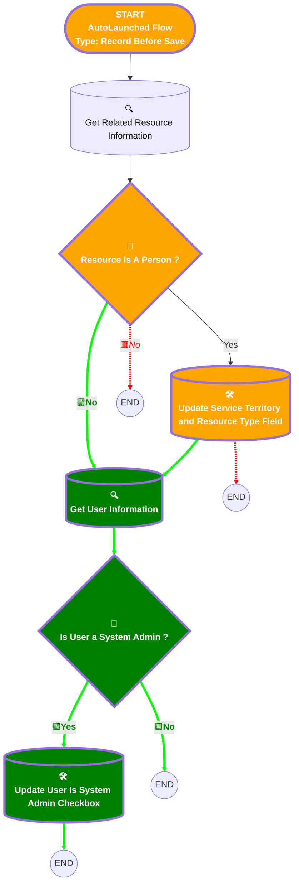

# [Assigned Resource] [Before-Save] [Record-Triggered] Identify Assigned Resource Type

## Flow Diagram

```mermaid
%% If you read this, your Markdown visualizer does not handle MermaidJS syntax.
%% - If you are in VsCode, install extension `Markdown Preview Mermaid Support` at https://marketplace.visualstudio.com/items?itemName=bierner.markdown-mermaid
%% - If you are using sfdx-hardis, try to define env variable `MERMAID_MODES=cli,docker` ,then run again the command to regenerate markdown with SVG images.
%% - If you are within mkdocs-material, define mermaid plugin in `mkdocs.yml` as described in https://squidfunk.github.io/mkdocs-material/extensions/mermaid/
%% - At last resort, you can copy-paste this MermaidJS code in https://mermaid.live/ to see the Flow Diagram

flowchart TB
START(["<b>START<br/><b>AutoLaunched Flow</b></br>Type: <b> Record Before Save</b></b>"]):::startClassChanged


click START "#general-information" "3326048780"


Is_User_a_System_Admin{"<b>🔀 <em></em><br/>Is User a System Admin ?</b>"}:::decisionsAdded
click Is_User_a_System_Admin "#is_user_a_system_admin" "477699806"


Resource_Is_A_Person{"<b>🔀 <em></em><br/>Resource Is A Person ?</b>"}:::decisionsChanged


click Resource_Is_A_Person "#resource_is_a_person" "3951251900"


Get_Related_Resource_Information[("🔍 <em></em><br/>Get Related Resource Information")]:::recordLookups
click Get_Related_Resource_Information "#get_related_resource_information" "1933292224"


Get_User_Information[("<b>🔍 <em></em><br/>Get User Information</b>")]:::recordLookupsAdded
click Get_User_Information "#get_user_information" "1132405804"


Update_Service_Territory_and_Resource_Type_Field[("<b>🛠️ <em></em><br/>Update Service Territory and Resource Type Field</b>")]:::recordUpdatesChanged


click Update_Service_Territory_and_Resource_Type_Field "#update_service_territory_and_resource_type_field" "3303598142"


Update_User_Is_System_Admin_Checkbox[("<b>🛠️ <em></em><br/>Update User Is System Admin Checkbox</b>")]:::recordUpdatesAdded
click Update_User_Is_System_Admin_Checkbox "#update_user_is_system_admin_checkbox" "1534350504"

Is_User_a_System_Admin ==> |"🟩<b>Yes</b>"| Update_User_Is_System_Admin_Checkbox
Is_User_a_System_Admin ==> |"🟩<b>No</b>"| END_Is_User_a_System_Admin

Resource_Is_A_Person --> |"Yes"| Update_Service_Territory_and_Resource_Type_Field

Resource_Is_A_Person -.-> |"🟥<i>No</i>"| END_Resource_Is_A_Person

Resource_Is_A_Person ==> |"🟩<b>No</b>"| Get_User_Information

Get_Related_Resource_Information --> Resource_Is_A_Person

Update_Service_Territory_and_Resource_Type_Field -.-> END_Update_Service_Territory_and_Resource_Type_Field

Get_User_Information ==> Is_User_a_System_Admin
Update_Service_Territory_and_Resource_Type_Field ==> Get_User_Information
Update_User_Is_System_Admin_Checkbox ==> END_Update_User_Is_System_Admin_Checkbox

START -->  Get_Related_Resource_Information

END_Resource_Is_A_Person(( END )):::endClassRemoved
END_Update_Service_Territory_and_Resource_Type_Field(( END )):::endClassRemoved

END_Is_User_a_System_Admin(( END )):::endClassAdded
END_Update_User_Is_System_Admin_Checkbox(( END )):::endClassAdded


classDef actionCalls fill:#D4E4FC,color:black,text-decoration:none,max-height:100px
classDef assignments fill:#FBEED7,color:black,text-decoration:none,max-height:100px
classDef collectionProcessors fill:#F0E3FA,color:black,text-decoration:none,max-height:100px
classDef customErrors fill:#FFE9E9,color:black,text-decoration:none,max-height:100px
classDef decisions fill:#FDEAF6,color:black,text-decoration:none,max-height:100px
classDef loops fill:#FDEAF6,color:black,text-decoration:none,max-height:100px
classDef recordCreates fill:#FFF8C9,color:black,text-decoration:none,max-height:100px
classDef recordDeletes fill:#FFF8C9,color:black,text-decoration:none,max-height:100px
classDef recordLookups fill:#EDEAFF,color:black,text-decoration:none,max-height:100px
classDef recordUpdates fill:#FFF8C9,color:black,text-decoration:none,max-height:100px
classDef screens fill:#DFF6FF,color:black,text-decoration:none,max-height:100px
classDef subflows fill:#D4E4FC,color:black,text-decoration:none,max-height:100px
classDef startClass fill:#D9F2E6,color:black,text-decoration:none,max-height:100px
classDef endClass fill:#F9BABA,color:black,text-decoration:none,max-height:100px


classDef actionCallsAdded fill:green,color:white,stroke-width:4px,text-decoration:none,max-height:100px
classDef assignmentsAdded fill:green,color:white,stroke-width:4px,text-decoration:none,max-height:100px
classDef collectionProcessorsAdded fill:green,color:white,stroke-width:4px,text-decoration:none,max-height:100px
classDef customErrorsAdded fill:green,color:white,stroke-width:4px,text-decoration:none,max-height:100px
classDef decisionsAdded fill:green,color:white,stroke-width:4px,text-decoration:none,max-height:100px
classDef loopsAdded fill:green,color:white,stroke-width:4px,text-decoration:none,max-height:100px
classDef recordCreatesAdded fill:green,color:white,stroke-width:4px,text-decoration:none,max-height:100px
classDef recordDeletesAdded fill:green,color:white,stroke-width:4px,text-decoration:none,max-height:100px
classDef recordLookupsAdded fill:green,color:white,stroke-width:4px,text-decoration:none,max-height:100px
classDef recordUpdatesAdded fill:green,color:white,stroke-width:4px,text-decoration:none,max-height:100px
classDef screensAdded fill:green,color:white,stroke-width:4px,text-decoration:none,max-height:100px
classDef subflowsAdded fill:green,color:white,stroke-width:4px,text-decoration:none,max-height:100px
classDef startClassAdded fill:green,color:white,stroke-width:4px,text-decoration:none,max-height:100px

classDef actionCallsRemoved fill:red,color:white,stroke-width:4px,text-decoration:none,max-height:100px
classDef assignmentsRemoved fill:red,color:white,stroke-width:4px,text-decoration:none,max-height:100px
classDef collectionProcessorsRemoved fill:red,color:white,stroke-width:4px,text-decoration:none,max-height:100px
classDef customErrorsRemoved fill:red,color:white,stroke-width:4px,text-decoration:none,max-height:100px
classDef decisionsRemoved fill:red,color:white,stroke-width:4px,text-decoration:none,max-height:100px
classDef loopsRemoved fill:red,color:white,stroke-width:4px,text-decoration:none,max-height:100px
classDef recordCreatesRemoved fill:red,color:white,stroke-width:4px,text-decoration:none,max-height:100px
classDef recordDeletesRemoved fill:red,color:white,stroke-width:4px,text-decoration:none,max-height:100px
classDef recordLookupsRemoved fill:red,color:white,stroke-width:4px,text-decoration:none,max-height:100px
classDef recordUpdatesRemoved fill:red,color:white,stroke-width:4px,text-decoration:none,max-height:100px
classDef screensRemoved fill:red,color:white,stroke-width:4px,text-decoration:none,max-height:100px
classDef subflowsRemoved fill:red,color:white,stroke-width:4px,text-decoration:none,max-height:100px
classDef startClassRemoved fill:red,color:white,stroke-width:4px,text-decoration:none,max-height:100px

classDef actionCallsChanged fill:orange,color:white,stroke-width:4px,text-decoration:none,max-height:100px
classDef assignmentsChanged fill:orange,color:white,stroke-width:4px,text-decoration:none,max-height:100px
classDef collectionProcessorsChanged fill:orange,color:white,stroke-width:4px,text-decoration:none,max-height:100px
classDef customErrorsChanged fill:orange,color:white,stroke-width:4px,text-decoration:none,max-height:100px
classDef decisionsChanged fill:orange,color:white,stroke-width:4px,text-decoration:none,max-height:100px
classDef loopsChanged fill:orange,color:white,stroke-width:4px,text-decoration:none,max-height:100px
classDef recordCreatesChanged fill:orange,color:white,stroke-width:4px,text-decoration:none,max-height:100px
classDef recordDeletesChanged fill:orange,color:white,stroke-width:4px,text-decoration:none,max-height:100px
classDef recordLookupsChanged fill:orange,color:white,stroke-width:4px,text-decoration:none,max-height:100px
classDef recordUpdatesChanged fill:orange,color:white,stroke-width:4px,text-decoration:none,max-height:100px
classDef screensChanged fill:orange,color:white,stroke-width:4px,text-decoration:none,max-height:100px
classDef subflowsChanged fill:orange,color:white,stroke-width:4px,text-decoration:none,max-height:100px
classDef startClassChanged fill:orange,color:white,stroke-width:4px,text-decoration:none,max-height:100px
  
linkStyle 0,1,4,7,8,9 stroke:#00ff00,stroke-width:4px,color:green;
linkStyle 3,6 stroke:#ff0000,stroke-width:4px,color:red;
```

<!-- Flow description -->

## General Information

|<!-- -->|<!-- -->|
|:---|:---|
|🟥<i>Description</i>|<i>For reporting purposes, this flow will allow identifying the type of resource assigned to a service appointment.</i>|
|🟩<b>Description</b>|<b>For reporting purposes, this flow will allow identifying the type of resource assigned to a service appointment.  This flow will also allow the identification of whether the assigned resource is linked to a system admin user for the purpose of timesheet entry creation.</b>|

## Flow Nodes Details

### 🟩Is_User_a_System_Admin

|<!-- -->|<!-- -->|
|:---|:---|
|🟩<b>Type</b>|<b>Decision</b>|
|🟩<b>Label</b>|<b>Is User a System Admin ?</b>|
|🟩<b>Default Connector Label</b>|<b>No</b>|

#### 🟩Rule Yes_Is_User_a_System_Admin (Yes)

|<!-- -->|<!-- -->|
|:---|:---|
|🟩<b>Connector</b>|<b>[Update_User_Is_System_Admin_Checkbox](#update_user_is_system_admin_checkbox)</b>|
|🟩<b>Condition Logic</b>|<b>and</b>|

|Condition Id|Left Value Reference|Operator|Right Value|
|:-- |:-- |:--:|:--: |
|🟩<b>1</b>|<b>Get_User_Information.Profile.Name</b>|<b> Equal To</b>|<b>System Administrator</b>|
|🟩<b>2</b>|<b>[Get_User_Information](#get_user_information)</b>|<b> Is Null</b>|<b>⬜</b>|

### Resource_Is_A_Person

|<!-- -->|<!-- -->|
|:---|:---|
|🟩<b>Default Connector</b>|<b>[Get_User_Information](#get_user_information)</b>|

### 🟩Get_User_Information

|<!-- -->|<!-- -->|
|:---|:---|
|🟩<b>Type</b>|<b>Record Lookup</b>|
|🟩<b>Object</b>|<b>User</b>|
|🟩<b>Label</b>|<b>Get User Information</b>|
|🟩<b>Assign Null Values If No Records Found</b>|<b>⬜</b>|
|🟩<b>Get First Record Only</b>|<b>✅</b>|
|🟩<b>Store Output Automatically</b>|<b>✅</b>|
|🟩<b>Connector</b>|<b>[Is_User_a_System_Admin](#is_user_a_system_admin)</b>|

#### 🟩Filters (logic: **and**)

|Filter Id|Field|Operator|Value|
|:-- |:-- |:--:|:--: |
|🟩<b>1</b>|<b>Id</b>|<b> Equal To</b>|<b>Get_Related_Resource_Information.RelatedRecordId</b>|

### Update_Service_Territory_and_Resource_Type_Field

|<!-- -->|<!-- -->|
|:---|:---|
|🟩<b>Connector</b>|<b>[Get_User_Information](#get_user_information)</b>|

### 🟩Update_User_Is_System_Admin_Checkbox

|<!-- -->|<!-- -->|
|:---|:---|
|🟩<b>Type</b>|<b>Record Update</b>|
|🟩<b>Label</b>|<b>Update User Is System Admin Checkbox</b>|
|🟩<b>Input Reference</b>|<b>$Record</b>|

#### 🟩Input Assignments

|Field|Value|
|:-- |:--: |
|🟩<b>User_Is_System_Admin__c</b>|<b>✅</b>|

___

_Documentation generated from branch monitoring_krinkelsgreencare__upeodev_sandbox by [sfdx-hardis](https://sfdx-hardis.cloudity.com), featuring [salesforce-flow-visualiser](https://github.com/toddhalfpenny/salesforce-flow-visualiser)_