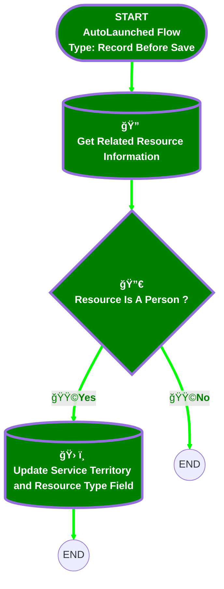

<b>🟩# [Assigned Resource] [Before-Save] [Record-Triggered] Identify Assigned Resource Type</b>

## 🟩Flow Diagram

```mermaid
%% If you read this, your Markdown visualizer does not handle MermaidJS syntax.
%% - If you are in VsCode, install extension `Markdown Preview Mermaid Support` at https://marketplace.visualstudio.com/items?itemName=bierner.markdown-mermaid
%% - If you are using sfdx-hardis, try to define env variable `MERMAID_MODES=cli,docker` ,then run again the command to regenerate markdown with SVG images.
%% - If you are within mkdocs-material, define mermaid plugin in `mkdocs.yml` as described in https://squidfunk.github.io/mkdocs-material/extensions/mermaid/
%% - At last resort, you can copy-paste this MermaidJS code in https://mermaid.live/ to see the Flow Diagram

flowchart TB
START(["<b>START<br/><b>AutoLaunched Flow</b></br>Type: <b> Record Before Save</b></b>"]):::startClassAdded
click START "#general-information" "4029137502"

Resource_Is_A_Person{"<b>🔀 <em></em><br/>Resource Is A Person ?</b>"}:::decisionsAdded
click Resource_Is_A_Person "#resource_is_a_person" "176898045"

Get_Related_Resource_Information[("<b>🔠<em></em><br/>Get Related Resource Information</b>")]:::recordLookupsAdded
click Get_Related_Resource_Information "#get_related_resource_information" "1933292224"

Update_Service_Territory_and_Resource_Type_Field[("<b>ğŸ› ï¸ <em></em><br/>Update Service Territory and Resource Type Field</b>")]:::recordUpdatesAdded
click Update_Service_Territory_and_Resource_Type_Field "#update_service_territory_and_resource_type_field" "1186660456"

Resource_Is_A_Person ==> |"🟩<b>Yes</b>"| Update_Service_Territory_and_Resource_Type_Field
Resource_Is_A_Person ==> |"🟩<b>No</b>"| END_Resource_Is_A_Person
Get_Related_Resource_Information ==> Resource_Is_A_Person
Update_Service_Territory_and_Resource_Type_Field ==> END_Update_Service_Territory_and_Resource_Type_Field
START ==>  Get_Related_Resource_Information
END_Resource_Is_A_Person(( END )):::endClassAdded
END_Update_Service_Territory_and_Resource_Type_Field(( END )):::endClassAdded


classDef actionCalls fill:#D4E4FC,color:black,text-decoration:none,max-height:100px
classDef assignments fill:#FBEED7,color:black,text-decoration:none,max-height:100px
classDef collectionProcessors fill:#F0E3FA,color:black,text-decoration:none,max-height:100px
classDef customErrors fill:#FFE9E9,color:black,text-decoration:none,max-height:100px
classDef decisions fill:#FDEAF6,color:black,text-decoration:none,max-height:100px
classDef loops fill:#FDEAF6,color:black,text-decoration:none,max-height:100px
classDef recordCreates fill:#FFF8C9,color:black,text-decoration:none,max-height:100px
classDef recordDeletes fill:#FFF8C9,color:black,text-decoration:none,max-height:100px
classDef recordLookups fill:#EDEAFF,color:black,text-decoration:none,max-height:100px
classDef recordUpdates fill:#FFF8C9,color:black,text-decoration:none,max-height:100px
classDef screens fill:#DFF6FF,color:black,text-decoration:none,max-height:100px
classDef subflows fill:#D4E4FC,color:black,text-decoration:none,max-height:100px
classDef startClass fill:#D9F2E6,color:black,text-decoration:none,max-height:100px
classDef endClass fill:#F9BABA,color:black,text-decoration:none,max-height:100px


classDef actionCallsAdded fill:green,color:white,stroke-width:4px,text-decoration:none,max-height:100px
classDef assignmentsAdded fill:green,color:white,stroke-width:4px,text-decoration:none,max-height:100px
classDef collectionProcessorsAdded fill:green,color:white,stroke-width:4px,text-decoration:none,max-height:100px
classDef customErrorsAdded fill:green,color:white,stroke-width:4px,text-decoration:none,max-height:100px
classDef decisionsAdded fill:green,color:white,stroke-width:4px,text-decoration:none,max-height:100px
classDef loopsAdded fill:green,color:white,stroke-width:4px,text-decoration:none,max-height:100px
classDef recordCreatesAdded fill:green,color:white,stroke-width:4px,text-decoration:none,max-height:100px
classDef recordDeletesAdded fill:green,color:white,stroke-width:4px,text-decoration:none,max-height:100px
classDef recordLookupsAdded fill:green,color:white,stroke-width:4px,text-decoration:none,max-height:100px
classDef recordUpdatesAdded fill:green,color:white,stroke-width:4px,text-decoration:none,max-height:100px
classDef screensAdded fill:green,color:white,stroke-width:4px,text-decoration:none,max-height:100px
classDef subflowsAdded fill:green,color:white,stroke-width:4px,text-decoration:none,max-height:100px
classDef startClassAdded fill:green,color:white,stroke-width:4px,text-decoration:none,max-height:100px

classDef actionCallsRemoved fill:red,color:white,stroke-width:4px,text-decoration:none,max-height:100px
classDef assignmentsRemoved fill:red,color:white,stroke-width:4px,text-decoration:none,max-height:100px
classDef collectionProcessorsRemoved fill:red,color:white,stroke-width:4px,text-decoration:none,max-height:100px
classDef customErrorsRemoved fill:red,color:white,stroke-width:4px,text-decoration:none,max-height:100px
classDef decisionsRemoved fill:red,color:white,stroke-width:4px,text-decoration:none,max-height:100px
classDef loopsRemoved fill:red,color:white,stroke-width:4px,text-decoration:none,max-height:100px
classDef recordCreatesRemoved fill:red,color:white,stroke-width:4px,text-decoration:none,max-height:100px
classDef recordDeletesRemoved fill:red,color:white,stroke-width:4px,text-decoration:none,max-height:100px
classDef recordLookupsRemoved fill:red,color:white,stroke-width:4px,text-decoration:none,max-height:100px
classDef recordUpdatesRemoved fill:red,color:white,stroke-width:4px,text-decoration:none,max-height:100px
classDef screensRemoved fill:red,color:white,stroke-width:4px,text-decoration:none,max-height:100px
classDef subflowsRemoved fill:red,color:white,stroke-width:4px,text-decoration:none,max-height:100px
classDef startClassRemoved fill:red,color:white,stroke-width:4px,text-decoration:none,max-height:100px

classDef actionCallsChanged fill:orange,color:white,stroke-width:4px,text-decoration:none,max-height:100px
classDef assignmentsChanged fill:orange,color:white,stroke-width:4px,text-decoration:none,max-height:100px
classDef collectionProcessorsChanged fill:orange,color:white,stroke-width:4px,text-decoration:none,max-height:100px
classDef customErrorsChanged fill:orange,color:white,stroke-width:4px,text-decoration:none,max-height:100px
classDef decisionsChanged fill:orange,color:white,stroke-width:4px,text-decoration:none,max-height:100px
classDef loopsChanged fill:orange,color:white,stroke-width:4px,text-decoration:none,max-height:100px
classDef recordCreatesChanged fill:orange,color:white,stroke-width:4px,text-decoration:none,max-height:100px
classDef recordDeletesChanged fill:orange,color:white,stroke-width:4px,text-decoration:none,max-height:100px
classDef recordLookupsChanged fill:orange,color:white,stroke-width:4px,text-decoration:none,max-height:100px
classDef recordUpdatesChanged fill:orange,color:white,stroke-width:4px,text-decoration:none,max-height:100px
classDef screensChanged fill:orange,color:white,stroke-width:4px,text-decoration:none,max-height:100px
classDef subflowsChanged fill:orange,color:white,stroke-width:4px,text-decoration:none,max-height:100px
classDef startClassChanged fill:orange,color:white,stroke-width:4px,text-decoration:none,max-height:100px
  
linkStyle 0,1,2,3,4 stroke:#00ff00,stroke-width:4px,color:green;
```

<b>🟩<!-- Flow description --></b>

## 🟩General Information

|🟩<b><!-- --></b>|<b><!-- --></b>|
|:---|:---|
|🟩<b>Object</b>|<b>AssignedResource</b>|
|🟩<b>Process Type</b>|<b> Auto Launched Flow</b>|
|🟩<b>Trigger Type</b>|<b> Record Before Save</b>|
|🟩<b>Record Trigger Type</b>|<b> Create And Update</b>|
|🟩<b>Label</b>|<b>[Assigned Resource] [Before-Save] [Record-Triggered] Identify Assigned Resource Type</b>|
|🟩<b>Status</b>|<b>Active</b>|
|🟩<b>Description</b>|<b>For reporting purposes, this flow will allow identifying the type of resource assigned to a service appointment.</b>|
|🟩<b>Environments</b>|<b>Default</b>|
|🟩<b>Interview Label</b>|<b>[Assigned Resource] [Before save] [RecordTriggered] Account Fields duplication {!$Flow.CurrentDateTime}</b>|
|🟩<b> Builder Type (PM)</b>|<b>LightningFlowBuilder</b>|
|🟩<b> Canvas Mode (PM)</b>|<b>AUTO_LAYOUT_CANVAS</b>|
|🟩<b> Origin Builder Type (PM)</b>|<b>LightningFlowBuilder</b>|
|🟩<b>Connector</b>|<b>[Get_Related_Resource_Information](#get_related_resource_information)</b>|
|🟩<b>Next Node</b>|<b>[Get_Related_Resource_Information](#get_related_resource_information)</b>|

## 🟩Flow Nodes Details

### 🟩Resource_Is_A_Person

|🟩<b><!-- --></b>|<b><!-- --></b>|
|:---|:---|
|🟩<b>Type</b>|<b>Decision</b>|
|🟩<b>Label</b>|<b>Resource Is A Person ?</b>|
|🟩<b>Default Connector Label</b>|<b>No</b>|

#### 🟩Rule Yes (Yes)

|🟩<b><!-- --></b>|<b><!-- --></b>|
|:---|:---|
|🟩<b>Connector</b>|<b>[Update_Service_Territory_and_Resource_Type_Field](#update_service_territory_and_resource_type_field)</b>|
|🟩<b>Condition Logic</b>|<b>and</b>|

|🟩<b>Condition Id</b>|<b>Left Value Reference</b>|<b>Operator</b>|<b>Right Value</b>|
|:-- |:-- |:--:|:--: |
|🟩<b>1</b>|<b>[Get_Related_Resource_Information](#get_related_resource_information)</b>|<b> Is Null</b>|<b>⬜</b>|

### 🟩Get_Related_Resource_Information

|🟩<b><!-- --></b>|<b><!-- --></b>|
|:---|:---|
|🟩<b>Type</b>|<b>Record Lookup</b>|
|🟩<b>Object</b>|<b>ServiceResource</b>|
|🟩<b>Label</b>|<b>Get Related Resource Information</b>|
|🟩<b>Assign Null Values If No Records Found</b>|<b>⬜</b>|
|🟩<b>Get First Record Only</b>|<b>✅</b>|
|🟩<b>Store Output Automatically</b>|<b>✅</b>|
|🟩<b>Connector</b>|<b>[Resource_Is_A_Person](#resource_is_a_person)</b>|

#### 🟩Filters (logic: **and**)

|🟩<b>Filter Id</b>|<b>Field</b>|<b>Operator</b>|<b>Value</b>|
|:-- |:-- |:--:|:--: |
|🟩<b>1</b>|<b>Id</b>|<b> Equal To</b>|<b>$Record.ServiceResourceId</b>|
|🟩<b>2</b>|<b>ResourceType</b>|<b> Equal To</b>|<b>T</b>|

### 🟩Update_Service_Territory_and_Resource_Type_Field

|🟩<b><!-- --></b>|<b><!-- --></b>|
|:---|:---|
|🟩<b>Type</b>|<b>Record Update</b>|
|🟩<b>Label</b>|<b>Update Service Territory and Resource Type Field</b>|
|🟩<b>Input Reference</b>|<b>$Record</b>|

#### 🟩Input Assignments

|🟩<b>Field</b>|<b>Value</b>|
|:-- |:--: |
|🟩<b>Resource_Is_A_Person__c</b>|<b>✅</b>|

___

<b>🟩_Documentation generated from branch monitoring_krinkelsgreencare__upeodev_sandbox by [sfdx-hardis](https://sfdx-hardis.cloudity.com), featuring [salesforce-flow-visualiser](https://github.com/toddhalfpenny/salesforce-flow-visualiser)_</b>