# Datatable Configuration Wizard

## Flow Diagram

```mermaid
%% If you read this, your Markdown visualizer does not handle MermaidJS syntax.
%% - If you are in VsCode, install extension `Markdown Preview Mermaid Support` at https://marketplace.visualstudio.com/items?itemName=bierner.markdown-mermaid
%% - If you are using sfdx-hardis, try to define env variable `MERMAID_MODES=cli,docker` ,then run again the command to regenerate markdown with SVG images.
%% - If you are within mkdocs-material, define mermaid plugin in `mkdocs.yml` as described in https://squidfunk.github.io/mkdocs-material/extensions/mermaid/
%% - At last resort, you can copy-paste this MermaidJS code in https://mermaid.live/ to see the Flow Diagram

flowchart TB
START(["START<br/><b>Screen Flow</b>"]):::startClass
click START "#general-information" "2375696828"

Decode_Cell_Attribute("⚙️ <em></em><br/>Decode Cell Attribute"):::actionCalls
click Decode_Cell_Attribute "#decode_cell_attribute" "874721483"

Decode_Other_Attribute("⚙️ <em></em><br/>Decode Other Attribute"):::actionCalls
click Decode_Other_Attribute "#decode_other_attribute" "3673743272"

Decode_Type_Attribute("⚙️ <em></em><br/>Decode Type Attribute"):::actionCalls
click Decode_Type_Attribute "#decode_type_attribute" "3859672525"

Get_Field_Information_usf("⚙️ <em></em><br/>Get Field Information usf"):::actionCalls
click Get_Field_Information_usf "#get_field_information_usf" "3386397676"

Get_First_xx_Records("⚙️ <em></em><br/>Get First xx Records"):::actionCalls
click Get_First_xx_Records "#get_first_xx_records" "4129286520"

Add_Config_Quick_Choice_Option[\"🟰 <em></em><br/>Add Config Quick Choice Option"/]:::assignments
click Add_Config_Quick_Choice_Option "#add_config_quick_choice_option" "1030059084"

Add_Last_Field[\"🟰 <em></em><br/>Add Last Field"/]:::assignments
click Add_Last_Field "#add_last_field" "2279991723"

Assign_Config_Fields[\"🟰 <em></em><br/>Assign Config Fields"/]:::assignments
click Assign_Config_Fields "#assign_config_fields" "1615532576"

Assign_PreSelected[\"🟰 <em></em><br/>Assign PreSelected"/]:::assignments
click Assign_PreSelected "#assign_preselected" "2296498435"

Clear_Early_Exit_Flag[\"🟰 <em></em><br/>Clear Early Exit Flag"/]:::assignments
click Clear_Early_Exit_Flag "#clear_early_exit_flag" "4051994753"

Clear_Record_Id[\"🟰 <em></em><br/>Clear Record Id"/]:::assignments
click Clear_Record_Id "#clear_record_id" "2033844329"

Get_Config_Record_Count[\"🟰 <em></em><br/>Get Config Record Count"/]:::assignments
click Get_Config_Record_Count "#get_config_record_count" "2200194865"

Initialize_Width_Flex_Processing[\"🟰 <em></em><br/>Initialize Width & Flex Processing"/]:::assignments
click Initialize_Width_Flex_Processing "#initialize_width_flex_processing" "4106133173"

Process_Config_Field[\"🟰 <em></em><br/>Process Config Field"/]:::assignments
click Process_Config_Field "#process_config_field" "3541671277"

Save_Configuration_Data[\"🟰 <em></em><br/>Save Configuration Data"/]:::assignments
click Save_Configuration_Data "#save_configuration_data" "505924692"

Save_Selected_Config_Record[\"🟰 <em></em><br/>Save Selected Config Record"/]:::assignments
click Save_Selected_Config_Record "#save_selected_config_record" "1691595781"

Save_Selection_Method[\"🟰 <em></em><br/>Save Selection Method"/]:::assignments
click Save_Selection_Method "#save_selection_method" "1637289576"

Separate_Width_Flex_Attributes[\"🟰 <em></em><br/>Separate Width & Flex Attributes"/]:::assignments
click Separate_Width_Flex_Attributes "#separate_width_flex_attributes" "514345019"

Set_Error_Flag[\"🟰 <em></em><br/>Set Error Flag"/]:::assignments
click Set_Error_Flag "#set_error_flag" "1804098044"

Set_Field_List_Parameter[\"🟰 <em></em><br/>Set Field List Parameter"/]:::assignments
click Set_Field_List_Parameter "#set_field_list_parameter" "4272019610"

Set_Field_List_Parameter_0[\"🟰 <em></em><br/>Set Field List Parameter"/]:::assignments
click Set_Field_List_Parameter_0 "#set_field_list_parameter_0" "3102834937"

Set_Field_Name[\"🟰 <em></em><br/>Set Field Name"/]:::assignments
click Set_Field_Name "#set_field_name" "3887661395"

Set_Metadata_Name_create[\"🟰 <em></em><br/>Set Metadata Name"/]:::assignments
click Set_Metadata_Name_create "#set_metadata_name_create" "742188221"

Set_Quick_Choice_Options[\"🟰 <em></em><br/>Set Quick Choice Options"/]:::assignments
click Set_Quick_Choice_Options "#set_quick_choice_options" "2252898726"

Update_Selected_Field_Descriptors[\"🟰 <em></em><br/>Update Selected Field Descriptors"/]:::assignments
click Update_Selected_Field_Descriptors "#update_selected_field_descriptors" "2374819184"

Update_Special_Attributes[\"🟰 <em></em><br/>Update Special Attributes"/]:::assignments
click Update_Special_Attributes "#update_special_attributes" "2265768017"

Wizard_Finish_ass[\"🟰 <em></em><br/>Wizard Finish"/]:::assignments
click Wizard_Finish_ass "#wizard_finish_ass" "3990498152"

Any_Fields_Selected{"🔀 <em></em><br/>Any Fields Selected?"}:::decisions
click Any_Fields_Selected "#any_fields_selected" "668711498"

Check_Field_Selection_Method{"🔀 <em></em><br/>Check Field Selection Method"}:::decisions
click Check_Field_Selection_Method "#check_field_selection_method" "2984253220"

Config_Record{"🔀 <em></em><br/>Config Record?"}:::decisions
click Config_Record "#config_record" "3848494445"

Did_User_Enter_Field_List{"🔀 <em></em><br/>Did User Enter Field List?"}:::decisions
click Did_User_Enter_Field_List "#did_user_enter_field_list" "1221131264"

Found_Config_Records{"🔀 <em></em><br/>Found Config Records?"}:::decisions
click Found_Config_Records "#found_config_records" "2746918949"

Get_Records_Result{"🔀 <em></em><br/>Get Records Result"}:::decisions
click Get_Records_Result "#get_records_result" "4023783364"

How_Many_Records{"🔀 <em></em><br/>How Many Records?"}:::decisions
click How_Many_Records "#how_many_records" "714098291"

Last_Field{"🔀 <em></em><br/>Last Field?"}:::decisions
click Last_Field "#last_field" "1490617037"

Name_Already_Exists{"🔀 <em></em><br/>Name Already Exists?"}:::decisions
click Name_Already_Exists "#name_already_exists" "258195568"

Selected_Option{"🔀 <em></em><br/>Selected Option?"}:::decisions
click Selected_Option "#selected_option" "693103386"

Special_Attribute_Changes{"🔀 <em></em><br/>Special Attribute Changes?"}:::decisions
click Special_Attribute_Changes "#special_attribute_changes" "1957481370"

Loop_Previously_Selected_Fields{{"🔁 <em></em><br/>Loop Previously Selected Fields"}}:::loops
click Loop_Previously_Selected_Fields "#loop_previously_selected_fields" "2306050286"

Create_New_Config_Record[("➕ <em></em><br/>Create New Config Record")]:::recordCreates
click Create_New_Config_Record "#create_new_config_record" "1815140951"

Check_For_Existing_Config_Record[("🔍 <em></em><br/>Check For Existing Config Record")]:::recordLookups
click Check_For_Existing_Config_Record "#check_for_existing_config_record" "1467806784"

Get_Available_Config_Records[("🔍 <em></em><br/>Get Available Config Records")]:::recordLookups
click Get_Available_Config_Records "#get_available_config_records" "1601241843"

Save_Config_Record[("🛠️ <em></em><br/>Save Config Record")]:::recordUpdates
click Save_Config_Record "#save_config_record" "522580193"

Field_Selection_Method_Screen(["💻 <em></em><br/>Field Selection Method Screen"]):::screens
click Field_Selection_Method_Screen "#field_selection_method_screen" "2552415750"

Select_Config_Record(["💻 <em></em><br/>Select Config Record"]):::screens
click Select_Config_Record "#select_config_record" "2067752136"

Select_Fields(["💻 <em></em><br/>Select Fields"]):::screens
click Select_Fields "#select_fields" "3999436670"

Wizard_Exit(["💻 <em></em><br/>Wizard Exit"]):::screens
click Wizard_Exit "#wizard_exit" "829042340"

Wizard_Screen(["💻 <em></em><br/>Wizard Screen"]):::screens
click Wizard_Screen "#wizard_screen" "4101617784"

Decode_Cell_Attribute --> Decode_Type_Attribute
Decode_Other_Attribute --> Set_Quick_Choice_Options
Decode_Type_Attribute --> Decode_Other_Attribute
Get_Field_Information_usf --> Select_Fields
Get_First_xx_Records --> Get_Records_Result
Add_Config_Quick_Choice_Option --> Field_Selection_Method_Screen
Add_Last_Field --> Loop_Previously_Selected_Fields
Assign_Config_Fields --> Initialize_Width_Flex_Processing
Assign_PreSelected --> Add_Config_Quick_Choice_Option
Clear_Early_Exit_Flag --> Save_Configuration_Data
Clear_Record_Id --> Create_New_Config_Record
Get_Config_Record_Count --> How_Many_Records
Initialize_Width_Flex_Processing --> Separate_Width_Flex_Attributes
Process_Config_Field --> Last_Field
Save_Configuration_Data --> Config_Record
Save_Selected_Config_Record --> Special_Attribute_Changes
Save_Selection_Method --> Selected_Option
Separate_Width_Flex_Attributes --> Last_Field
Set_Error_Flag --> Wizard_Screen
Set_Field_List_Parameter --> Did_User_Enter_Field_List
Set_Field_List_Parameter_0 --> Get_First_xx_Records
Set_Field_Name --> Update_Selected_Field_Descriptors
Set_Metadata_Name_create --> Clear_Record_Id
Set_Quick_Choice_Options --> Get_Available_Config_Records
Update_Selected_Field_Descriptors --> Loop_Previously_Selected_Fields
Update_Special_Attributes --> Clear_Early_Exit_Flag
Wizard_Finish_ass --> END_Wizard_Finish_ass
Any_Fields_Selected --> |"YES"| Set_Field_List_Parameter_0
Any_Fields_Selected --> |"NONE"| Select_Fields
Check_Field_Selection_Method --> |"PICK"| Any_Fields_Selected
Check_Field_Selection_Method --> |"MANUAL"| Set_Field_List_Parameter
Check_Field_Selection_Method --> |"Error"| END_Check_Field_Selection_Method
Config_Record --> |"SAVE"| Save_Config_Record
Config_Record --> |"CREATE"| Check_For_Existing_Config_Record
Config_Record --> |"NO CONFIG RECORD"| Wizard_Finish_ass
Did_User_Enter_Field_List --> |"YES"| Get_First_xx_Records
Did_User_Enter_Field_List --> |"NO"| Any_Fields_Selected
Did_User_Enter_Field_List --> |"Error"| END_Did_User_Enter_Field_List
Found_Config_Records --> |"YES"| Get_Config_Record_Count
Found_Config_Records --> |"NO"| Field_Selection_Method_Screen
Get_Records_Result --> |"NO RECORDS"| Wizard_Exit
Get_Records_Result --> |"RECORDS FOUND"| Wizard_Screen
How_Many_Records --> |"JUST ONE"| Assign_PreSelected
How_Many_Records --> |"MULTIPLE"| Add_Config_Quick_Choice_Option
Last_Field --> |"YES"| Add_Last_Field
Last_Field --> |"NO"| Process_Config_Field
Name_Already_Exists --> |"NAME EXISTS"| Set_Error_Flag
Name_Already_Exists --> |"NEW NAME"| Set_Metadata_Name_create
Selected_Option --> |"Config"| Select_Config_Record
Selected_Option --> |"Pick or Type"| Loop_Previously_Selected_Fields
Special_Attribute_Changes --> |"SAVE"| Update_Special_Attributes
Special_Attribute_Changes --> |"IGNORE"| Clear_Early_Exit_Flag
Loop_Previously_Selected_Fields --> |"For Each"|Set_Field_Name
Loop_Previously_Selected_Fields ---> |"After Last"|Get_Field_Information_usf
Create_New_Config_Record --> Wizard_Finish_ass
Check_For_Existing_Config_Record --> Name_Already_Exists
Get_Available_Config_Records --> Found_Config_Records
Save_Config_Record --> Wizard_Finish_ass
Field_Selection_Method_Screen --> Save_Selection_Method
Select_Config_Record --> Assign_Config_Fields
Select_Fields --> Check_Field_Selection_Method
Wizard_Exit --> END_Wizard_Exit
Wizard_Screen --> Save_Selected_Config_Record
START -->  Decode_Cell_Attribute
END_Wizard_Finish_ass(( END )):::endClass
END_Check_Field_Selection_Method(( END )):::endClass
END_Did_User_Enter_Field_List(( END )):::endClass
END_Wizard_Exit(( END )):::endClass


classDef actionCalls fill:#D4E4FC,color:black,text-decoration:none,max-height:100px
classDef assignments fill:#FBEED7,color:black,text-decoration:none,max-height:100px
classDef collectionProcessors fill:#F0E3FA,color:black,text-decoration:none,max-height:100px
classDef customErrors fill:#FFE9E9,color:black,text-decoration:none,max-height:100px
classDef decisions fill:#FDEAF6,color:black,text-decoration:none,max-height:100px
classDef loops fill:#FDEAF6,color:black,text-decoration:none,max-height:100px
classDef recordCreates fill:#FFF8C9,color:black,text-decoration:none,max-height:100px
classDef recordDeletes fill:#FFF8C9,color:black,text-decoration:none,max-height:100px
classDef recordLookups fill:#EDEAFF,color:black,text-decoration:none,max-height:100px
classDef recordUpdates fill:#FFF8C9,color:black,text-decoration:none,max-height:100px
classDef screens fill:#DFF6FF,color:black,text-decoration:none,max-height:100px
classDef subflows fill:#D4E4FC,color:black,text-decoration:none,max-height:100px
classDef startClass fill:#D9F2E6,color:black,text-decoration:none,max-height:100px
classDef endClass fill:#F9BABA,color:black,text-decoration:none,max-height:100px


```

## General Information

|<!-- -->|<!-- -->|
|:---|:---|
|Process Type| Flow|
|Label|Datatable Configuration Wizard|
|Status|Active|
|Description|Flow designed to run inside of the datatable CPE to select and set component attributes by interacting with a sample datatable.|
|Environments|Default|
|Interview Label|Datatable Configuration Wizard {!$Flow.CurrentDateTime}|
| Builder Type (PM)|LightningFlowBuilder|
| Canvas Mode (PM)|AUTO_LAYOUT_CANVAS|
| Origin Builder Type (PM)|LightningFlowBuilder|
|Connector|[Decode_Cell_Attribute](#decode_cell_attribute)|
|Next Node|[Decode_Cell_Attribute](#decode_cell_attribute)|

## Variables

|Name|Data Type|Is Collection|Is Input|Is Output|Object Type|
|:-- |:--:|:--:|:--:|:--:|:--: |
|apexColFieldDescriptors_usf|Apex|✅|⬜|⬜|<!-- -->|
|apexColSelectedFieldDescriptors_usf|Apex|✅|⬜|⬜|<!-- -->|
|apexFieldDescriptor|Apex|⬜|⬜|⬜|<!-- -->|
|colDescriptions|String|✅|⬜|⬜|<!-- -->|
|colFieldList|String|✅|✅|⬜|<!-- -->|
|colIcons|String|✅|⬜|⬜|<!-- -->|
|colPreSelectedConfigs|SObject|✅|⬜|⬜|FlowTableViewDefinition__c|
|colTitles|String|✅|⬜|⬜|<!-- -->|
|objConfig|SObject|⬜|⬜|⬜|FlowTableViewDefinition__c|
|vCombinedAttribute|String|⬜|⬜|⬜|<!-- -->|
|vConfigCount|Number|⬜|⬜|⬜|<!-- -->|
|vConfigFields|String|⬜|⬜|⬜|<!-- -->|
|vConfigToggleStatus|Boolean|⬜|⬜|⬜|<!-- -->|
|vDebugMode|Boolean|⬜|✅|⬜|<!-- -->|
|vDuplicateNameError|Boolean|⬜|⬜|⬜|<!-- -->|
|vEarlyExit|Boolean|⬜|⬜|✅|<!-- -->|
|vFieldList|String|⬜|✅|✅|<!-- -->|
|vLoadedConfig|Boolean|⬜|⬜|⬜|<!-- -->|
|vNewConfigName|String|⬜|⬜|⬜|<!-- -->|
|vRecordList|String|⬜|⬜|⬜|<!-- -->|
|vSelectionMethod|String|⬜|✅|✅|<!-- -->|
|vSeparatorLength|Number|⬜|⬜|⬜|<!-- -->|
|vSeparatorLocation|Number|⬜|⬜|⬜|<!-- -->|
|vSObject|String|⬜|✅|⬜|<!-- -->|
|vWizRecordCount|Number|⬜|✅|⬜|<!-- -->|
|wiz_columnAlignments|String|⬜|✅|✅|<!-- -->|
|wiz_columnCellAttribs|String|⬜|✅|✅|<!-- -->|
|wiz_columnEdits|String|⬜|✅|✅|<!-- -->|
|wiz_columnFields|String|⬜|✅|✅|<!-- -->|
|wiz_columnFilters|String|⬜|✅|✅|<!-- -->|
|wiz_columnFlexes|String|⬜|✅|✅|<!-- -->|
|wiz_columnIcons|String|⬜|✅|✅|<!-- -->|
|wiz_columnLabels|String|⬜|✅|✅|<!-- -->|
|wiz_columnOtherAttribs|String|⬜|✅|✅|<!-- -->|
|wiz_columnTypeAttribs|String|⬜|✅|✅|<!-- -->|
|wiz_columnWidths|String|⬜|✅|✅|<!-- -->|
|wiz_columnWraps|String|⬜|✅|✅|<!-- -->|
|wiz_objectName|String|⬜|⬜|⬜|<!-- -->|

## Formulas

|Name|Data Type|Expression|
|:-- |:--:|:--  |
|fFirstField|String|TRIM(LEFT({!vConfigFields},FIND(",",{!vConfigFields})-1))|
|fGetFlexAttribute|String|IF( {!vSeparatorLocation} > 0, RIGHT( {!vCombinedAttribute}, LEN( {!vCombinedAttribute} ) - {!vSeparatorLocation} - {!vSeparatorLength} + 1 ) , "" )|
|fGetWidthAttribute|String|IF( {!vSeparatorLocation} > 0, LEFT( {!vCombinedAttribute}, {!vSeparatorLocation} - 1 ), {!vCombinedAttribute} )|
|fHasComma|Boolean|FIND(",",{!vConfigFields})>0|
|fListLength|Number|LEN({!vFieldList})|
|fRemoveField|String|MID({!vConfigFields},FIND(",",{!vConfigFields})+1,999)|
|fSeparatorLength|Number|LEN( {!cSeparator} )|
|fSeparatorLocation|Number|FIND( {!cSeparator}, {!ConfigTable_select.outputSelectedRow.Widths__c} )|
|fSetWidthFlexAttribute|String|{!wiz_columnWidths} & IF( LEN( {!wiz_columnFlexes} ) > 0, {!cSeparator} & {!wiz_columnFlexes}, "" )|
|fTrimFieldList|String|TRIM({!vFieldList})|

## Constants

|Name|Data Type|Value|
|:-- |:--:|:--: |
|cConfig|String|Config|
|cPick|String|Pick|
|cSeparator|String||~||
|cType|String|Type|

## Flow Nodes Details

### Decode_Cell_Attribute

|<!-- -->|<!-- -->|
|:---|:---|
|Type|Action Call|
|Label|Decode Cell Attribute|
|Action Type|Apex|
|Action Name|ers_EncodeDecodeURL|
|Flow Transaction Model|CurrentTransaction|
|Name Segment|ers_EncodeDecodeURL|
|Store Output Automatically|✅|
|Version Segment|1|
|Input Str (input)|wiz_columnCellAttribs|
|Connector|[Decode_Type_Attribute](#decode_type_attribute)|

### Decode_Other_Attribute

|<!-- -->|<!-- -->|
|:---|:---|
|Type|Action Call|
|Label|Decode Other Attribute|
|Action Type|Apex|
|Action Name|ers_EncodeDecodeURL|
|Flow Transaction Model|CurrentTransaction|
|Name Segment|ers_EncodeDecodeURL|
|Store Output Automatically|✅|
|Version Segment|1|
|Input Str (input)|wiz_columnOtherAttribs|
|Connector|[Set_Quick_Choice_Options](#set_quick_choice_options)|

### Decode_Type_Attribute

|<!-- -->|<!-- -->|
|:---|:---|
|Type|Action Call|
|Label|Decode Type Attribute|
|Action Type|Apex|
|Action Name|ers_EncodeDecodeURL|
|Flow Transaction Model|CurrentTransaction|
|Name Segment|ers_EncodeDecodeURL|
|Store Output Automatically|✅|
|Version Segment|1|
|Input Str (input)|wiz_columnTypeAttribs|
|Connector|[Decode_Other_Attribute](#decode_other_attribute)|

### Get_Field_Information_usf

|<!-- -->|<!-- -->|
|:---|:---|
|Type|Action Call|
|Label|Get Field Information usf|
|Action Type|Apex|
|Action Name|usf3__GetFieldInformation|
|Flow Transaction Model|CurrentTransaction|
|Name Segment|usf3__GetFieldInformation|
|Output Parameters|assignToReference: apexColFieldDescriptors_usf name: fields |
|Version Segment|1|
|Object Name (input)|vSObject|
|Connector|[Select_Fields](#select_fields)|

### Get_First_xx_Records

|<!-- -->|<!-- -->|
|:---|:---|
|Type|Action Call|
|Label|Get First xx Records|
|Action Type|Apex|
|Action Name|ers_QueryNRecords|
|Flow Transaction Model|CurrentTransaction|
|Name Segment|ers_QueryNRecords|
|Output Parameters|assignToReference: vRecordList name: recordString |
|Version Segment|1|
|Object Api Name (input)|vSObject|
|Fields To Query (input)|vFieldList|
|Number Of Records (input)|vWizRecordCount|
|Connector|[Get_Records_Result](#get_records_result)|

### Add_Config_Quick_Choice_Option

|<!-- -->|<!-- -->|
|:---|:---|
|Type|Assignment|
|Label|Add Config Quick Choice Option|
|Connector|[Field_Selection_Method_Screen](#field_selection_method_screen)|

#### Assignments

|Assign To Reference|Operator|Value|
|:-- |:--:|:--: |
|colTitles| Add|cConfig|
|colDescriptions| Add|Load the column configuration from a custom Configuration record|
|colIcons| Add|utility:component_customization|

### Add_Last_Field

|<!-- -->|<!-- -->|
|:---|:---|
|Type|Assignment|
|Label|Add Last Field|
|Connector|[Loop_Previously_Selected_Fields](#loop_previously_selected_fields)|

#### Assignments

|Assign To Reference|Operator|Value|
|:-- |:--:|:--: |
|colFieldList| Add|vConfigFields|
|wiz_columnWidths| Assign|fGetWidthAttribute|
|wiz_columnFlexes| Assign|fGetFlexAttribute|

### Assign_Config_Fields

|<!-- -->|<!-- -->|
|:---|:---|
|Type|Assignment|
|Label|Assign Config Fields|
|Connector|[Initialize_Width_Flex_Processing](#initialize_width_flex_processing)|

#### Assignments

|Assign To Reference|Operator|Value|
|:-- |:--:|:--: |
|colFieldList| Assign|<!-- -->|
|vLoadedConfig| Assign|✅|
|vFieldList| Assign|ConfigTable_select.outputSelectedRow.Field_API_Names__c|
|vConfigFields| Assign|ConfigTable_select.outputSelectedRow.Field_API_Names__c|
|vSelectionMethod| Assign|ConfigTable_select.outputSelectedRow.Selection_Method__c|
|wiz_columnAlignments| Assign|ConfigTable_select.outputSelectedRow.Alignments__c|
|wiz_columnEdits| Assign|ConfigTable_select.outputSelectedRow.Edits__c|
|wiz_columnFields| Assign|ConfigTable_select.outputSelectedRow.Field_API_Names__c|
|wiz_columnFilters| Assign|ConfigTable_select.outputSelectedRow.Filters__c|
|wiz_columnIcons| Assign|ConfigTable_select.outputSelectedRow.Icons__c|
|wiz_columnLabels| Assign|ConfigTable_select.outputSelectedRow.Labels__c|
|wiz_columnWidths| Assign|ConfigTable_select.outputSelectedRow.Widths__c|
|wiz_columnWraps| Assign|ConfigTable_select.outputSelectedRow.Wraps__c|
|wiz_columnCellAttribs| Assign|ConfigTable_select.outputSelectedRow.Cell_Attributes__c|
|wiz_columnOtherAttribs| Assign|ConfigTable_select.outputSelectedRow.Other_Attributes__c|
|wiz_columnTypeAttribs| Assign|ConfigTable_select.outputSelectedRow.Type_Attributes__c|
|objConfig| Assign|ConfigTable_select.outputSelectedRow|
|colPreSelectedConfigs| Assign|ConfigTable_select.outputSelectedRows|
|vConfigToggleStatus| Assign|✅|

### Assign_PreSelected

|<!-- -->|<!-- -->|
|:---|:---|
|Type|Assignment|
|Label|Assign PreSelected|
|Connector|[Add_Config_Quick_Choice_Option](#add_config_quick_choice_option)|

#### Assignments

|Assign To Reference|Operator|Value|
|:-- |:--:|:--: |
|colPreSelectedConfigs| Assign|[Get_Available_Config_Records](#get_available_config_records)|

### Clear_Early_Exit_Flag

|<!-- -->|<!-- -->|
|:---|:---|
|Type|Assignment|
|Label|Clear Early Exit Flag|
|Connector|[Save_Configuration_Data](#save_configuration_data)|

#### Assignments

|Assign To Reference|Operator|Value|
|:-- |:--:|:--: |
|vEarlyExit| Assign|⬜|

### Clear_Record_Id

|<!-- -->|<!-- -->|
|:---|:---|
|Type|Assignment|
|Label|Clear Record Id|
|Connector|[Create_New_Config_Record](#create_new_config_record)|

#### Assignments

|Assign To Reference|Operator|Value|
|:-- |:--:|:--: |
|objConfig.Id| Assign|<!-- -->|

### Get_Config_Record_Count

|<!-- -->|<!-- -->|
|:---|:---|
|Type|Assignment|
|Label|Get Config Record Count|
|Connector|[How_Many_Records](#how_many_records)|

#### Assignments

|Assign To Reference|Operator|Value|
|:-- |:--:|:--: |
|vConfigCount| Assign Count|[Get_Available_Config_Records](#get_available_config_records)|

### Initialize_Width_Flex_Processing

|<!-- -->|<!-- -->|
|:---|:---|
|Type|Assignment|
|Label|Initialize Width & Flex Processing|
|Connector|[Separate_Width_Flex_Attributes](#separate_width_flex_attributes)|

#### Assignments

|Assign To Reference|Operator|Value|
|:-- |:--:|:--: |
|vSeparatorLength| Assign|fSeparatorLength|
|vSeparatorLocation| Assign|fSeparatorLocation|
|vCombinedAttribute| Assign|ConfigTable_select.outputSelectedRow.Widths__c|

### Process_Config_Field

|<!-- -->|<!-- -->|
|:---|:---|
|Type|Assignment|
|Label|Process Config Field|
|Connector|isGoTo: true targetReference: Last_Field |

#### Assignments

|Assign To Reference|Operator|Value|
|:-- |:--:|:--: |
|colFieldList| Add|fFirstField|
|vConfigFields| Assign|fRemoveField|

### Save_Configuration_Data

|<!-- -->|<!-- -->|
|:---|:---|
|Type|Assignment|
|Label|Save Configuration Data|
|Connector|[Config_Record](#config_record)|

#### Assignments

|Assign To Reference|Operator|Value|
|:-- |:--:|:--: |
|objConfig.Selection_Method__c| Assign|vSelectionMethod|
|objConfig.Object_API_Name__c| Assign|vSObject|
|objConfig.Alignments__c| Assign|wiz_columnAlignments|
|objConfig.Edits__c| Assign|wiz_columnEdits|
|objConfig.Field_API_Names__c| Assign|wiz_columnFields|
|objConfig.Filters__c| Assign|wiz_columnFilters|
|objConfig.Icons__c| Assign|wiz_columnIcons|
|objConfig.Labels__c| Assign|wiz_columnLabels|
|objConfig.Widths__c| Assign|fSetWidthFlexAttribute|
|objConfig.Wraps__c| Assign|wiz_columnWraps|
|objConfig.Cell_Attributes__c| Assign|wiz_columnCellAttribs|
|objConfig.Type_Attributes__c| Assign|wiz_columnTypeAttribs|
|objConfig.Other_Attributes__c| Assign|wiz_columnOtherAttribs|

### Save_Selected_Config_Record

|<!-- -->|<!-- -->|
|:---|:---|
|Type|Assignment|
|Label|Save Selected Config Record|
|Connector|[Special_Attribute_Changes](#special_attribute_changes)|

#### Assignments

|Assign To Reference|Operator|Value|
|:-- |:--:|:--: |
|objConfig| Assign|ConfigTable_saveas.outputSelectedRow|
|vNewConfigName| Assign|Configuration_Record_Name|
|vConfigToggleStatus| Assign|ConfigToggle.value|

### Save_Selection_Method

|<!-- -->|<!-- -->|
|:---|:---|
|Type|Assignment|
|Label|Save Selection Method|
|Connector|[Selected_Option](#selected_option)|

#### Assignments

|Assign To Reference|Operator|Value|
|:-- |:--:|:--: |
|vSelectionMethod| Assign|FieldSelectionMethod.value|

### Separate_Width_Flex_Attributes

|<!-- -->|<!-- -->|
|:---|:---|
|Type|Assignment|
|Label|Separate Width & Flex Attributes|
|Connector|[Last_Field](#last_field)|

#### Assignments

|Assign To Reference|Operator|Value|
|:-- |:--:|:--: |
|wiz_columnWidths| Assign|fGetWidthAttribute|
|wiz_columnFlexes| Assign|fGetFlexAttribute|

### Set_Error_Flag

|<!-- -->|<!-- -->|
|:---|:---|
|Type|Assignment|
|Label|Set Error Flag|
|Connector|isGoTo: true targetReference: Wizard_Screen |

#### Assignments

|Assign To Reference|Operator|Value|
|:-- |:--:|:--: |
|vDuplicateNameError| Assign|✅|
|vConfigToggleStatus| Assign|✅|

### Set_Field_List_Parameter

|<!-- -->|<!-- -->|
|:---|:---|
|Type|Assignment|
|Label|Set Field List Parameter|
|Connector|[Did_User_Enter_Field_List](#did_user_enter_field_list)|

#### Assignments

|Assign To Reference|Operator|Value|
|:-- |:--:|:--: |
|vFieldList| Assign|List_of_Field_Names|
|wiz_columnFields| Assign|List_of_Field_Names|

### Set_Field_List_Parameter_0

|<!-- -->|<!-- -->|
|:---|:---|
|Type|Assignment|
|Label|Set Field List Parameter|
|Connector|[Get_First_xx_Records](#get_first_xx_records)|

#### Assignments

|Assign To Reference|Operator|Value|
|:-- |:--:|:--: |
|wiz_columnFields| Assign|List_of_Field_Names|

### Set_Field_Name

|<!-- -->|<!-- -->|
|:---|:---|
|Type|Assignment|
|Label|Set Field Name|
|Connector|[Update_Selected_Field_Descriptors](#update_selected_field_descriptors)|

#### Assignments

|Assign To Reference|Operator|Value|
|:-- |:--:|:--: |
|apexFieldDescriptor.name| Assign|[Loop_Previously_Selected_Fields](#loop_previously_selected_fields)|

### Set_Metadata_Name_create

|<!-- -->|<!-- -->|
|:---|:---|
|Type|Assignment|
|Label|Set Metadata Name|
|Connector|[Clear_Record_Id](#clear_record_id)|

#### Assignments

|Assign To Reference|Operator|Value|
|:-- |:--:|:--: |
|objConfig.Name| Assign|vNewConfigName|
|objConfig.View_Name__c| Assign|vNewConfigName|

### Set_Quick_Choice_Options

|<!-- -->|<!-- -->|
|:---|:---|
|Type|Assignment|
|Label|Set Quick Choice Options|
|Connector|[Get_Available_Config_Records](#get_available_config_records)|

#### Assignments

|Assign To Reference|Operator|Value|
|:-- |:--:|:--: |
|colTitles| Add|cPick|
|colTitles| Add|cType|
|colDescriptions| Add|Pick your table columns from a list|
|colDescriptions| Add|Manually specify the column fields|
|colIcons| Add|standard:picklist_choice|
|colIcons| Add|standard:text|
|vEarlyExit| Assign|✅|
|wiz_columnFields| Assign|vFieldList|
|vDebugMode| Assign|⬜|
|vConfigFields| Assign|fTrimFieldList|

### Update_Selected_Field_Descriptors

|<!-- -->|<!-- -->|
|:---|:---|
|Type|Assignment|
|Label|Update Selected Field Descriptors|
|Connector|[Loop_Previously_Selected_Fields](#loop_previously_selected_fields)|

#### Assignments

|Assign To Reference|Operator|Value|
|:-- |:--:|:--: |
|apexColSelectedFieldDescriptors_usf| Add|apexFieldDescriptor|

### Update_Special_Attributes

|<!-- -->|<!-- -->|
|:---|:---|
|Type|Assignment|
|Label|Update Special Attributes|
|Connector|[Clear_Early_Exit_Flag](#clear_early_exit_flag)|

#### Assignments

|Assign To Reference|Operator|Value|
|:-- |:--:|:--: |
|wiz_columnCellAttribs| Assign|Special_Cell_Attributes|
|wiz_columnTypeAttribs| Assign|Special_Type_Attributes|
|wiz_columnOtherAttribs| Assign|Special_Other_Attributes|

### Wizard_Finish_ass

|<!-- -->|<!-- -->|
|:---|:---|
|Type|Assignment|
|Label|Wizard Finish|

#### Assignments

|Assign To Reference|Operator|Value|
|:-- |:--:|:--: |
|vEarlyExit| Assign|⬜|

### Any_Fields_Selected

|<!-- -->|<!-- -->|
|:---|:---|
|Type|Decision|
|Label|Any Fields Selected?|
|Default Connector|isGoTo: true targetReference: Select_Fields |
|Default Connector Label|NONE|

#### Rule YES_fs (YES)

|<!-- -->|<!-- -->|
|:---|:---|
|Connector|[Set_Field_List_Parameter_0](#set_field_list_parameter_0)|
|Condition Logic|and|

|Condition Id|Left Value Reference|Operator|Right Value|
|:-- |:-- |:--:|:--: |
|1|fListLength| Greater Than|numberValue: 0 |

### Check_Field_Selection_Method

|<!-- -->|<!-- -->|
|:---|:---|
|Type|Decision|
|Label|Check Field Selection Method|
|Default Connector Label|Error|

#### Rule PICK (PICK)

|<!-- -->|<!-- -->|
|:---|:---|
|Connector|[Any_Fields_Selected](#any_fields_selected)|
|Condition Logic|and|

|Condition Id|Left Value Reference|Operator|Right Value|
|:-- |:-- |:--:|:--: |
|1|vSelectionMethod| Equal To|cPick|

#### Rule MANUAL (MANUAL)

|<!-- -->|<!-- -->|
|:---|:---|
|Connector|[Set_Field_List_Parameter](#set_field_list_parameter)|
|Condition Logic|and|

|Condition Id|Left Value Reference|Operator|Right Value|
|:-- |:-- |:--:|:--: |
|1|vSelectionMethod| Equal To|cType|

### Config_Record

|<!-- -->|<!-- -->|
|:---|:---|
|Type|Decision|
|Label|Config Record?|
|Default Connector|[Wizard_Finish_ass](#wizard_finish_ass)|
|Default Connector Label|NO CONFIG RECORD|

#### Rule SAVE (SAVE)

|<!-- -->|<!-- -->|
|:---|:---|
|Connector|[Save_Config_Record](#save_config_record)|
|Condition Logic|and|

|Condition Id|Left Value Reference|Operator|Right Value|
|:-- |:-- |:--:|:--: |
|1|ConfigButtonSave.value| Equal To|Save|
|2|ConfigTable_saveas.numberOfRowsSelected| Equal To|1|

#### Rule CREATE (CREATE)

|<!-- -->|<!-- -->|
|:---|:---|
|Connector|[Check_For_Existing_Config_Record](#check_for_existing_config_record)|
|Condition Logic|and|

|Condition Id|Left Value Reference|Operator|Right Value|
|:-- |:-- |:--:|:--: |
|1|ConfigButtonCreate.value| Equal To|Create|
|2|vNewConfigName| Is Null|⬜|

### Did_User_Enter_Field_List

|<!-- -->|<!-- -->|
|:---|:---|
|Type|Decision|
|Label|Did User Enter Field List?|
|Default Connector Label|Error|

#### Rule YES (YES)

|<!-- -->|<!-- -->|
|:---|:---|
|Connector|[Get_First_xx_Records](#get_first_xx_records)|
|Condition Logic|and|

|Condition Id|Left Value Reference|Operator|Right Value|
|:-- |:-- |:--:|:--: |
|1|fListLength| Greater Than|numberValue: 0 |

#### Rule NO (NO)

|<!-- -->|<!-- -->|
|:---|:---|
|Connector|isGoTo: true targetReference: Any_Fields_Selected |
|Condition Logic|and|

|Condition Id|Left Value Reference|Operator|Right Value|
|:-- |:-- |:--:|:--: |
|1|fListLength| Equal To|numberValue: 0 |

### Found_Config_Records

|<!-- -->|<!-- -->|
|:---|:---|
|Type|Decision|
|Label|Found Config Records?|
|Default Connector|[Field_Selection_Method_Screen](#field_selection_method_screen)|
|Default Connector Label|NO|

#### Rule YES_md (YES)

|<!-- -->|<!-- -->|
|:---|:---|
|Connector|[Get_Config_Record_Count](#get_config_record_count)|
|Condition Logic|and|

|Condition Id|Left Value Reference|Operator|Right Value|
|:-- |:-- |:--:|:--: |
|1|[Get_Available_Config_Records](#get_available_config_records)| Is Null|⬜|

### Get_Records_Result

|<!-- -->|<!-- -->|
|:---|:---|
|Type|Decision|
|Label|Get Records Result|
|Default Connector|[Wizard_Screen](#wizard_screen)|
|Default Connector Label|RECORDS FOUND|

#### Rule NO_RECORDS (NO RECORDS)

|<!-- -->|<!-- -->|
|:---|:---|
|Connector|[Wizard_Exit](#wizard_exit)|
|Condition Logic|and|

|Condition Id|Left Value Reference|Operator|Right Value|
|:-- |:-- |:--:|:--: |
|1|vRecordList| Equal To|[]|

### How_Many_Records

|<!-- -->|<!-- -->|
|:---|:---|
|Type|Decision|
|Label|How Many Records?|
|Default Connector|[Add_Config_Quick_Choice_Option](#add_config_quick_choice_option)|
|Default Connector Label|MULTIPLE|

#### Rule JUST_ONE (JUST ONE)

|<!-- -->|<!-- -->|
|:---|:---|
|Connector|[Assign_PreSelected](#assign_preselected)|
|Condition Logic|and|

|Condition Id|Left Value Reference|Operator|Right Value|
|:-- |:-- |:--:|:--: |
|1|vConfigCount| Equal To|1|

### Last_Field

|<!-- -->|<!-- -->|
|:---|:---|
|Type|Decision|
|Label|Last Field?|
|Default Connector|[Process_Config_Field](#process_config_field)|
|Default Connector Label|NO|

#### Rule YES_lf (YES)

|<!-- -->|<!-- -->|
|:---|:---|
|Connector|[Add_Last_Field](#add_last_field)|
|Condition Logic|and|

|Condition Id|Left Value Reference|Operator|Right Value|
|:-- |:-- |:--:|:--: |
|1|fHasComma| Equal To|⬜|

### Name_Already_Exists

|<!-- -->|<!-- -->|
|:---|:---|
|Type|Decision|
|Label|Name Already Exists?|
|Default Connector|[Set_Metadata_Name_create](#set_metadata_name_create)|
|Default Connector Label|NEW NAME|

#### Rule NAME_EXISTS (NAME EXISTS)

|<!-- -->|<!-- -->|
|:---|:---|
|Connector|[Set_Error_Flag](#set_error_flag)|
|Condition Logic|and|

|Condition Id|Left Value Reference|Operator|Right Value|
|:-- |:-- |:--:|:--: |
|1|[Check_For_Existing_Config_Record](#check_for_existing_config_record)| Is Null|⬜|

### Selected_Option

|<!-- -->|<!-- -->|
|:---|:---|
|Type|Decision|
|Label|Selected Option?|
|Default Connector|[Loop_Previously_Selected_Fields](#loop_previously_selected_fields)|
|Default Connector Label|Pick or Type|

#### Rule Config (Config)

|<!-- -->|<!-- -->|
|:---|:---|
|Connector|[Select_Config_Record](#select_config_record)|
|Condition Logic|and|

|Condition Id|Left Value Reference|Operator|Right Value|
|:-- |:-- |:--:|:--: |
|1|vSelectionMethod| Equal To|cConfig|

### Special_Attribute_Changes

|<!-- -->|<!-- -->|
|:---|:---|
|Type|Decision|
|Label|Special Attribute Changes?|
|Default Connector|[Clear_Early_Exit_Flag](#clear_early_exit_flag)|
|Default Connector Label|IGNORE|

#### Rule SAVE_atrib (SAVE)

|<!-- -->|<!-- -->|
|:---|:---|
|Connector|[Update_Special_Attributes](#update_special_attributes)|
|Condition Logic|and|

|Condition Id|Left Value Reference|Operator|Right Value|
|:-- |:-- |:--:|:--: |
|1|SaveAttributes.value| Equal To|Save|

### Loop_Previously_Selected_Fields

|<!-- -->|<!-- -->|
|:---|:---|
|Type|Loop|
|Label|Loop Previously Selected Fields|
|Collection Reference|colFieldList|
|Iteration Order|Asc|
|Next Value Connector|[Set_Field_Name](#set_field_name)|
|No More Values Connector|[Get_Field_Information_usf](#get_field_information_usf)|

### Create_New_Config_Record

|<!-- -->|<!-- -->|
|:---|:---|
|Type|Record Create|
|Label|Create New Config Record|
|Input Reference|objConfig|
|Connector|[Wizard_Finish_ass](#wizard_finish_ass)|

### Check_For_Existing_Config_Record

|<!-- -->|<!-- -->|
|:---|:---|
|Type|Record Lookup|
|Object|FlowTableViewDefinition__c|
|Label|Check For Existing Config Record|
|Assign Null Values If No Records Found|⬜|
|Get First Record Only|✅|
|Store Output Automatically|✅|
|Connector|[Name_Already_Exists](#name_already_exists)|

#### Filters (logic: **and**)

|Filter Id|Field|Operator|Value|
|:-- |:-- |:--:|:--: |
|1|Name| Equal To|vNewConfigName|

### Get_Available_Config_Records

|<!-- -->|<!-- -->|
|:---|:---|
|Type|Record Lookup|
|Object|FlowTableViewDefinition__c|
|Label|Get Available Config Records|
|Assign Null Values If No Records Found|⬜|
|Get First Record Only|⬜|
|Sort Field|Name|
|Sort Order|Asc|
|Store Output Automatically|✅|
|Connector|[Found_Config_Records](#found_config_records)|

#### Filters (logic: **and**)

|Filter Id|Field|Operator|Value|
|:-- |:-- |:--:|:--: |
|1|Active__c| Equal To|✅|
|2|Object_API_Name__c| Equal To|vSObject|

### Save_Config_Record

|<!-- -->|<!-- -->|
|:---|:---|
|Type|Record Update|
|Label|Save Config Record|
|Input Reference|objConfig|
|Connector|[Wizard_Finish_ass](#wizard_finish_ass)|

### Field_Selection_Method_Screen

|<!-- -->|<!-- -->|
|:---|:---|
|Type|Screen|
|Label|Field Selection Method Screen|
|Allow Back|⬜|
|Allow Finish|✅|
|Allow Pause|⬜|
|Show Footer|⬜|
|Show Header|⬜|
|Connector|[Save_Selection_Method](#save_selection_method)|

#### qcHeader

|<!-- -->|<!-- -->|
|:---|:---|
|Field Text|
<b style="font-size: 18px; background-color: rgb(255, 255, 255); color: rgb(62, 62, 60);">{!vSObject}</b>
|
|Field Type| Display Text|

#### FieldSelectionMethod

|<!-- -->|<!-- -->|
|:---|:---|
|Extension Name|c:fsc_quickChoiceFSC|
|Field Type| Component Instance|
|Inputs On Next Nav To Assoc Scrn| Use Stored Values|
|Is Required|✅|
|Store Output Automatically|✅|
|Display Mode (input)|Visual|
|Input Mode (input)|Dual String Collections|
|Number Of Columns (input)|1|
|Include Icons (input)|✅|
|Nav On Select (input)|✅|
|Choice Icons (input)|colIcons|
|Choice Labels (input)|colTitles|
|Choice Values (input)|colDescriptions|
|Required (input)|✅|
|Master Label (input)|How do you want to select your columns?|
|Icon Size (input)|large|
|Value (input)|vSelectionMethod|

### Select_Config_Record

|<!-- -->|<!-- -->|
|:---|:---|
|Type|Screen|
|Label|Select Config Record|
|Allow Back|✅|
|Allow Finish|✅|
|Allow Pause|✅|
|Show Footer|✅|
|Show Header|✅|
|Connector|[Assign_Config_Fields](#assign_config_fields)|

#### ConfigTable_select

|<!-- -->|<!-- -->|
|:---|:---|
|Data Type Mappings|typeName: T typeValue: FlowTableViewDefinition__c |
|Extension Name|c:datatable|
|Field Type| Component Instance|
|Inputs On Next Nav To Assoc Scrn| Use Stored Values|
|Is Required|✅|
|Store Output Automatically|✅|
|Object Name (input)|FlowTableViewDefinition__c|
|Is Display Header (input)|✅|
|Cb_is Display Header (input)|CB_TRUE|
|Table Label (input)|Select a Datatable Configuration|
|Table Icon (input)|utility:component_customization|
|Column Fields (input)|Name,Object_API_Name__c,Field_API_Names__c,CreatedDate,LastModifiedDate|
|Cb_match Case On Filters (input)|CB_FALSE|
|Column Labels (input)|Name:Configuration Name, Object_API_Name__c:Object, Field_API_Names__c:Columns, CreatedDate:Created, LastModifiedDate:Modified|
|Column Widths (input)|Name:225, Object_API_Name__c:125, Field_API_Names__c:310, CreatedDate:110, LastModifiedDate:110|
|Column Wraps (input)|Name:true, Object_API_Name__c:true, Field_API_Names__c:true, Labels__c:true, CreatedDate:true, LastModifiedDate:true|
|Hide Clear Selection Button (input)|✅|
|Cb_hide Clear Selection Button (input)|CB_TRUE|
|Single Row Selection (input)|✅|
|Cb_single Row Selection (input)|CB_TRUE|
|Column Filters (input)|All|
|Table Data (input)|[Get_Available_Config_Records](#get_available_config_records)|
|Pre Selected Rows (input)|colPreSelectedConfigs|
|Cb_suppress Bottom Bar (input)|CB_FALSE|
|Cb_navigate Next On Save (input)|CB_FALSE|

### Select_Fields

|<!-- -->|<!-- -->|
|:---|:---|
|Type|Screen|
|Label|Select Fields|
|Allow Back|⬜|
|Allow Finish|✅|
|Allow Pause|⬜|
|Show Footer|✅|
|Show Header|⬜|
|Connector|[Check_Field_Selection_Method](#check_field_selection_method)|

#### Object

|<!-- -->|<!-- -->|
|:---|:---|
|Field Text|
<b style="font-size: 18px;">{!vSObject}</b>
|
|Field Type| Display Text|

#### SelectFields

|<!-- -->|<!-- -->|
|:---|:---|
|Extension Name|c:fsc_dualListBox3|
|Field Type| Component Instance|
|Inputs On Next Nav To Assoc Scrn| Use Stored Values|
|Is Required|✅|
|Output Parameters|- assignToReference: vFieldList &nbsp;&nbsp;name: selectedOptionsCSV - assignToReference: apexColSelectedFieldDescriptors_usf &nbsp;&nbsp;name: selectedOptionsFieldDescriptorList |
|Visibility Rule|conditionLogic: or conditions: &nbsp;&nbsp;- leftValueReference: vSelectionMethod &nbsp;&nbsp;&nbsp;&nbsp;operator: EqualTo &nbsp;&nbsp;&nbsp;&nbsp;rightValue: &nbsp;&nbsp;&nbsp;&nbsp;&nbsp;&nbsp;elementReference: cPick &nbsp;&nbsp;- leftValueReference: vSelectionMethod &nbsp;&nbsp;&nbsp;&nbsp;operator: EqualTo &nbsp;&nbsp;&nbsp;&nbsp;rightValue: &nbsp;&nbsp;&nbsp;&nbsp;&nbsp;&nbsp;elementReference: cConfig |
|All Options String Format (input)|object|
|Use Which Object Key For Data (input)|name|
|Use Which Object Key For Sort (input)|[label](#label)|
|Selected Label (input)|Selected|
|Min (input)|1|
|Max (input)|20|
|Size (input)|7|
|All Options Field Descriptor List (input)|apexColFieldDescriptors_usf|
|Label (input)|Select and Order your Datatable Fields|
|Source Label (input)|Available|
|Selected Options Field Descriptor List (input)|apexColSelectedFieldDescriptors_usf|

#### List_of_Field_Names

|<!-- -->|<!-- -->|
|:---|:---|
|Data Type|String|
|Default Value|vFieldList|
|Field Text|Enter a comma separated list of field API names|
|Field Type| Input Field|
|Is Required|⬜|
|Visibility Rule|conditionLogic: and conditions: &nbsp;&nbsp;leftValueReference: vSelectionMethod &nbsp;&nbsp;operator: EqualTo &nbsp;&nbsp;rightValue: &nbsp;&nbsp;&nbsp;&nbsp;elementReference: cType |

### Wizard_Exit

|<!-- -->|<!-- -->|
|:---|:---|
|Type|Screen|
|Label|Wizard Exit|
|Allow Back|⬜|
|Allow Finish|✅|
|Allow Pause|⬜|
|Next Or Finish Button Label|Cancel|
|Show Footer|✅|
|Show Header|⬜|

#### FinishMessage_0

|<!-- -->|<!-- -->|
|:---|:---|
|Field Text|
<b style="color: rgb(182, 56, 56); font-size: 24px;"><i>The ÔªøÔªøColumn Wizard requires that the selected Object ({!vSObject}) has at least one record!</i></b>
|
|Field Type| Display Text|

### Wizard_Screen

|<!-- -->|<!-- -->|
|:---|:---|
|Type|Screen|
|Label|Wizard Screen|
|Allow Back|⬜|
|Allow Finish|✅|
|Allow Pause|⬜|
|Show Footer|⬜|
|Show Header|⬜|
|Connector|[Save_Selected_Config_Record](#save_selected_config_record)|

#### debug

|<!-- -->|<!-- -->|
|:---|:---|
|Field Text|
Debug Mode: {!vDebugMode}

Selected Object: {!vSObject}

Selected Fields: {!vFieldList}

Selected Field Descriptors: {!apexColSelectedFieldDescriptors_usf}

10 Records: {!vRecordList}

 

<u>Wizard Attributes</u>

Alignments: {!wiz_columnAlignments}

Edits: {!wiz_columnEdits}

Filters: {!wiz_columnFilters}

Labels: {!wiz_columnLabels}

Icons: {!wiz_columnIcons}

Widths: {!wiz_columnWidths}

Flexes: {!wiz_columnFlexes}

Wraps: {!wiz_columnWraps}
|
|Field Type| Display Text|
|Visibility Rule|conditionLogic: and conditions: &nbsp;&nbsp;leftValueReference: vDebugMode &nbsp;&nbsp;operator: EqualTo &nbsp;&nbsp;rightValue: &nbsp;&nbsp;&nbsp;&nbsp;booleanValue: true |

#### WizardTable

|<!-- -->|<!-- -->|
|:---|:---|
|Data Type Mappings|typeName: T typeValue: User |
|Extension Name|c:datatable|
|Field Type| Component Instance|
|Inputs On Next Nav To Assoc Scrn| Use Stored Values|
|Is Required|✅|
|Output Parameters|- assignToReference: wiz_columnLabels &nbsp;&nbsp;name: wizColumnLabels - assignToReference: wiz_columnFields &nbsp;&nbsp;name: wizColumnFields - assignToReference: wiz_columnAlignments &nbsp;&nbsp;name: wizColumnAlignments - assignToReference: wiz_columnEdits &nbsp;&nbsp;name: wizColumnEdits - assignToReference: wiz_columnFilters &nbsp;&nbsp;name: wizColumnFilters - assignToReference: wiz_columnIcons &nbsp;&nbsp;name: wizColumnIcons - assignToReference: wiz_columnWidths &nbsp;&nbsp;name: wizColumnWidths - assignToReference: wiz_columnFlexes &nbsp;&nbsp;name: wizColumnFlexes - assignToReference: wiz_columnWraps &nbsp;&nbsp;name: wizColumnWraps - assignToReference: wiz_objectName &nbsp;&nbsp;name: wizSObject |
|Is Config Mode (input)|✅|
|Column Fields (input)|vFieldList|
|Table Data String (input)|vRecordList|
|Hide Checkbox Column (input)|✅|
|Is User Defined Object (input)|✅|
|Column Alignments (input)|wiz_columnAlignments|
|Column Edits (input)|wiz_columnEdits|
|Column Filters (input)|wiz_columnFilters|
|Column Icons (input)|wiz_columnIcons|
|Column Labels (input)|wiz_columnLabels|
|Column Widths (input)|wiz_columnWidths|
|Column Wraps (input)|wiz_columnWraps|
|Cb_is User Defined Object (input)|CB_TRUE|
|Column Cell Attribs (input)|wiz_columnCellAttribs|
|Column Type Attribs (input)|wiz_columnTypeAttribs|
|Column Other Attribs (input)|wiz_columnOtherAttribs|
|Column Flexes (input)|wiz_columnFlexes|

#### AttributeToggle

|<!-- -->|<!-- -->|
|:---|:---|
|Extension Name|flowruntime:toggle|
|Field Type| Component Instance|
|Inputs On Next Nav To Assoc Scrn| Use Stored Values|
|Is Required|✅|
|Store Output Automatically|✅|
|Label (input)|Edit Special Attributes|
|Message Toggle Active (input)|Edit|
|Message Toggle Inactive (input)|Hide|
|Value (input)|⬜|

#### Special_Cell_Attributes

|<!-- -->|<!-- -->|
|:---|:---|
|Data Type|String|
|Default Value|Decode_Cell_Attribute.outputStr|
|Field Text|Special Cell Attributes|
|Field Type| Input Field|
|Is Required|⬜|
|Visibility Rule|conditionLogic: or conditions: &nbsp;&nbsp;leftValueReference: AttributeToggle.value &nbsp;&nbsp;operator: EqualTo &nbsp;&nbsp;rightValue: &nbsp;&nbsp;&nbsp;&nbsp;booleanValue: true |

#### Special_Type_Attributes

|<!-- -->|<!-- -->|
|:---|:---|
|Data Type|String|
|Default Value|Decode_Type_Attribute.outputStr|
|Field Text|Special Type Attributes|
|Field Type| Input Field|
|Is Required|⬜|
|Visibility Rule|conditionLogic: or conditions: &nbsp;&nbsp;leftValueReference: AttributeToggle.value &nbsp;&nbsp;operator: EqualTo &nbsp;&nbsp;rightValue: &nbsp;&nbsp;&nbsp;&nbsp;booleanValue: true |

#### Special_Other_Attributes

|<!-- -->|<!-- -->|
|:---|:---|
|Data Type|String|
|Default Value|Decode_Other_Attribute.outputStr|
|Field Text|Special Other Attributes|
|Field Type| Input Field|
|Is Required|⬜|
|Visibility Rule|conditionLogic: or conditions: &nbsp;&nbsp;leftValueReference: AttributeToggle.value &nbsp;&nbsp;operator: EqualTo &nbsp;&nbsp;rightValue: &nbsp;&nbsp;&nbsp;&nbsp;booleanValue: true |

#### SaveAttributes

|<!-- -->|<!-- -->|
|:---|:---|
|Extension Name|c:fsc_flowButtonBar|
|Field Type| Component Instance|
|Inputs On Next Nav To Assoc Scrn| Use Stored Values|
|Is Required|✅|
|Store Output Automatically|✅|
|Visibility Rule|conditionLogic: and conditions: &nbsp;&nbsp;leftValueReference: AttributeToggle.value &nbsp;&nbsp;operator: EqualTo &nbsp;&nbsp;rightValue: &nbsp;&nbsp;&nbsp;&nbsp;booleanValue: true |
|Alignment (input)|left|
|Orientation (input)|horizontal|
|Show Lines (input)|below|
|Action Mode (input)|selection|
|Buttons (input)|[{"label":"Ignore Changes","value":"Ignore","iconPosition":"left","variant":"neutral","index":0},{"label":"Save Changes","value":"Save","iconPosition":"left","variant":"neutral","index":1}]|

#### ConfigToggle

|<!-- -->|<!-- -->|
|:---|:---|
|Extension Name|flowruntime:toggle|
|Field Type| Component Instance|
|Inputs On Next Nav To Assoc Scrn| Use Stored Values|
|Is Required|✅|
|Store Output Automatically|✅|
|Label (input)|Show Configuration Record Options|
|Message Toggle Active (input)|Show|
|Message Toggle Inactive (input)|Hide|
|Value (input)|vConfigToggleStatus|

#### ConfigTable_saveas

|<!-- -->|<!-- -->|
|:---|:---|
|Data Type Mappings|typeName: T typeValue: FlowTableViewDefinition__c |
|Extension Name|c:datatable|
|Field Type| Component Instance|
|Inputs On Next Nav To Assoc Scrn| Use Stored Values|
|Is Required|✅|
|Store Output Automatically|✅|
|Visibility Rule|conditionLogic: and conditions: &nbsp;&nbsp;leftValueReference: ConfigToggle.value &nbsp;&nbsp;operator: EqualTo &nbsp;&nbsp;rightValue: &nbsp;&nbsp;&nbsp;&nbsp;booleanValue: true |
|Object Name (input)|FlowTableViewDefinition__c|
|Table Data (input)|[Get_Available_Config_Records](#get_available_config_records)|
|Is Display Header (input)|✅|
|Cb_is Display Header (input)|CB_TRUE|
|Table Label (input)|Select a Configuration Record to Update|
|Table Icon (input)|utility:component_customization|
|Cb_suppress Bottom Bar (input)|CB_FALSE|
|Cb_navigate Next On Save (input)|CB_FALSE|
|Column Fields (input)|Name,Object_API_Name__c,Field_API_Names__c,CreatedDate,LastModifiedDate|
|Column Filters (input)|All|
|Column Labels (input)|Name:Configuration Name, Object_API_Name__c:Object, Field_API_Names__c:Columns, CreatedDate:Created, LastModifiedDate:Modified|
|Column Widths (input)|Name:225, Object_API_Name__c:125, Field_API_Names__c:310, CreatedDate:110, LastModifiedDate:110|
|Column Wraps (input)|Name:true, Object_API_Name__c:true, Field_API_Names__c:true, Labels__c:true, CreatedDate:true, LastModifiedDate:true|
|Single Row Selection (input)|✅|
|Cb_single Row Selection (input)|CB_TRUE|
|Pre Selected Rows (input)|colPreSelectedConfigs|
|Hide Clear Selection Button (input)|✅|
|Cb_hide Clear Selection Button (input)|CB_TRUE|

#### ConfigButtonSave

|<!-- -->|<!-- -->|
|:---|:---|
|Extension Name|c:fsc_flowButtonBar|
|Field Type| Component Instance|
|Inputs On Next Nav To Assoc Scrn| Use Stored Values|
|Is Required|✅|
|Store Output Automatically|✅|
|Visibility Rule|conditionLogic: and conditions: &nbsp;&nbsp;leftValueReference: ConfigToggle.value &nbsp;&nbsp;operator: EqualTo &nbsp;&nbsp;rightValue: &nbsp;&nbsp;&nbsp;&nbsp;booleanValue: true |
|Alignment (input)|left|
|Orientation (input)|horizontal|
|Show Lines (input)|below|
|Action Mode (input)|navigation|
|Buttons (input)|[{"label":"Save As Selected Configuration Record","value":"Save","iconPosition":"left","variant":"brand-outline","iconName":"utility:save","index":0}]|

#### Configuration_Record_Name

|<!-- -->|<!-- -->|
|:---|:---|
|Data Type|String|
|Default Value|vNewConfigName|
|Field Text|New Configuration Record Name (Enter a name here if you want to create a new record of this configuration for reuse later)|
|Field Type| Input Field|
|Is Required|⬜|
|Visibility Rule|conditionLogic: and conditions: &nbsp;&nbsp;leftValueReference: ConfigToggle.value &nbsp;&nbsp;operator: EqualTo &nbsp;&nbsp;rightValue: &nbsp;&nbsp;&nbsp;&nbsp;booleanValue: true |

#### DuplicateNameErrorMessage

|<!-- -->|<!-- -->|
|:---|:---|
|Field Text|
<i style="color: rgb(255, 0, 0);">A Configuration Record with the name </i><b style="color: rgb(255, 0, 0);"><i>{!vNewConfigName}</i></b><i style="color: rgb(255, 0, 0);"> already exists. Please provide a unique name for a new record.</i>
|
|Field Type| Display Text|
|Visibility Rule|conditionLogic: and conditions: &nbsp;&nbsp;leftValueReference: vDuplicateNameError &nbsp;&nbsp;operator: EqualTo &nbsp;&nbsp;rightValue: &nbsp;&nbsp;&nbsp;&nbsp;booleanValue: true |

#### ConfigButtonCreate

|<!-- -->|<!-- -->|
|:---|:---|
|Extension Name|c:fsc_flowButtonBar|
|Field Type| Component Instance|
|Inputs On Next Nav To Assoc Scrn| Use Stored Values|
|Is Required|✅|
|Store Output Automatically|✅|
|Visibility Rule|conditionLogic: and conditions: &nbsp;&nbsp;leftValueReference: ConfigToggle.value &nbsp;&nbsp;operator: EqualTo &nbsp;&nbsp;rightValue: &nbsp;&nbsp;&nbsp;&nbsp;booleanValue: true |
|Alignment (input)|left|
|Orientation (input)|horizontal|
|Show Lines (input)|neither|
|Action Mode (input)|navigation|
|Buttons (input)|[{"label":"Create New Configuration Record","value":"Create","iconPosition":"left","variant":"brand-outline","iconName":"utility:new","index":0}]|

#### NoLoadConfig

|<!-- -->|<!-- -->|
|:---|:---|
|Extension Name|c:fsc_flowButtonBar|
|Field Type| Component Instance|
|Inputs On Next Nav To Assoc Scrn| Use Stored Values|
|Is Required|✅|
|Store Output Automatically|✅|
|Alignment (input)|right|
|Orientation (input)|horizontal|
|Show Lines (input)|above|
|Action Mode (input)|navigation|
|Buttons (input)|[{"label":"Done","value":"Done","iconPosition":"left","variant":"brand","iconName":null,"index":0}]|

___

_Documentation generated from branch monitoring_krinkelsgreencare__upeodev_sandbox by [sfdx-hardis](https://sfdx-hardis.cloudity.com), featuring [salesforce-flow-visualiser](https://github.com/toddhalfpenny/salesforce-flow-visualiser)_