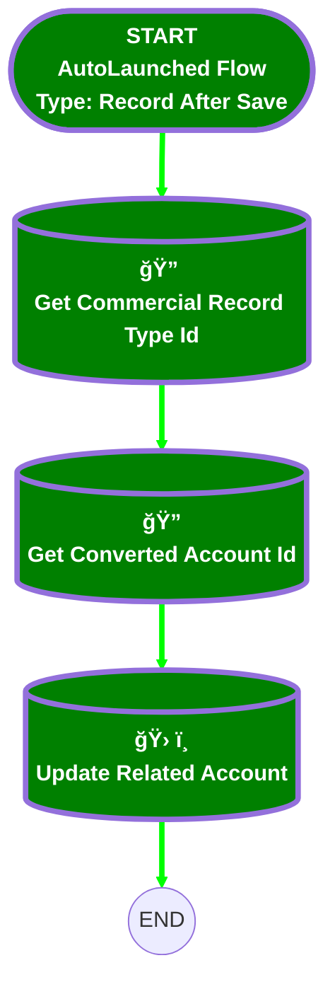

<b>🟩# [Lead][After-Save][Record-Triggered] Populate Client Sector & Industry Type on Account</b>

## 🟩Flow Diagram

```mermaid
%% If you read this, your Markdown visualizer does not handle MermaidJS syntax.
%% - If you are in VsCode, install extension `Markdown Preview Mermaid Support` at https://marketplace.visualstudio.com/items?itemName=bierner.markdown-mermaid
%% - If you are using sfdx-hardis, try to define env variable `MERMAID_MODES=cli,docker` ,then run again the command to regenerate markdown with SVG images.
%% - If you are within mkdocs-material, define mermaid plugin in `mkdocs.yml` as described in https://squidfunk.github.io/mkdocs-material/extensions/mermaid/
%% - At last resort, you can copy-paste this MermaidJS code in https://mermaid.live/ to see the Flow Diagram

flowchart TB
START(["<b>START<br/><b>AutoLaunched Flow</b></br>Type: <b> Record After Save</b></b>"]):::startClassAdded
click START "#general-information" "648770409"

Get_Commercial_Record_Type_Id[("<b>🔠<em></em><br/>Get Commercial Record Type Id</b>")]:::recordLookupsAdded
click Get_Commercial_Record_Type_Id "#get_commercial_record_type_id" "3924753702"

Get_Converted_Account_Id[("<b>🔠<em></em><br/>Get Converted Account Id</b>")]:::recordLookupsAdded
click Get_Converted_Account_Id "#get_converted_account_id" "1374846696"

Update_Related_Account[("<b>ğŸ› ï¸ <em></em><br/>Update Related Account</b>")]:::recordUpdatesAdded
click Update_Related_Account "#update_related_account" "1226822149"

Get_Commercial_Record_Type_Id ==> Get_Converted_Account_Id
Get_Converted_Account_Id ==> Update_Related_Account
Update_Related_Account ==> END_Update_Related_Account
START ==>  Get_Commercial_Record_Type_Id
END_Update_Related_Account(( END )):::endClassAdded


classDef actionCalls fill:#D4E4FC,color:black,text-decoration:none,max-height:100px
classDef assignments fill:#FBEED7,color:black,text-decoration:none,max-height:100px
classDef collectionProcessors fill:#F0E3FA,color:black,text-decoration:none,max-height:100px
classDef customErrors fill:#FFE9E9,color:black,text-decoration:none,max-height:100px
classDef decisions fill:#FDEAF6,color:black,text-decoration:none,max-height:100px
classDef loops fill:#FDEAF6,color:black,text-decoration:none,max-height:100px
classDef recordCreates fill:#FFF8C9,color:black,text-decoration:none,max-height:100px
classDef recordDeletes fill:#FFF8C9,color:black,text-decoration:none,max-height:100px
classDef recordLookups fill:#EDEAFF,color:black,text-decoration:none,max-height:100px
classDef recordUpdates fill:#FFF8C9,color:black,text-decoration:none,max-height:100px
classDef screens fill:#DFF6FF,color:black,text-decoration:none,max-height:100px
classDef subflows fill:#D4E4FC,color:black,text-decoration:none,max-height:100px
classDef startClass fill:#D9F2E6,color:black,text-decoration:none,max-height:100px
classDef endClass fill:#F9BABA,color:black,text-decoration:none,max-height:100px


classDef actionCallsAdded fill:green,color:white,stroke-width:4px,text-decoration:none,max-height:100px
classDef assignmentsAdded fill:green,color:white,stroke-width:4px,text-decoration:none,max-height:100px
classDef collectionProcessorsAdded fill:green,color:white,stroke-width:4px,text-decoration:none,max-height:100px
classDef customErrorsAdded fill:green,color:white,stroke-width:4px,text-decoration:none,max-height:100px
classDef decisionsAdded fill:green,color:white,stroke-width:4px,text-decoration:none,max-height:100px
classDef loopsAdded fill:green,color:white,stroke-width:4px,text-decoration:none,max-height:100px
classDef recordCreatesAdded fill:green,color:white,stroke-width:4px,text-decoration:none,max-height:100px
classDef recordDeletesAdded fill:green,color:white,stroke-width:4px,text-decoration:none,max-height:100px
classDef recordLookupsAdded fill:green,color:white,stroke-width:4px,text-decoration:none,max-height:100px
classDef recordUpdatesAdded fill:green,color:white,stroke-width:4px,text-decoration:none,max-height:100px
classDef screensAdded fill:green,color:white,stroke-width:4px,text-decoration:none,max-height:100px
classDef subflowsAdded fill:green,color:white,stroke-width:4px,text-decoration:none,max-height:100px
classDef startClassAdded fill:green,color:white,stroke-width:4px,text-decoration:none,max-height:100px

classDef actionCallsRemoved fill:red,color:white,stroke-width:4px,text-decoration:none,max-height:100px
classDef assignmentsRemoved fill:red,color:white,stroke-width:4px,text-decoration:none,max-height:100px
classDef collectionProcessorsRemoved fill:red,color:white,stroke-width:4px,text-decoration:none,max-height:100px
classDef customErrorsRemoved fill:red,color:white,stroke-width:4px,text-decoration:none,max-height:100px
classDef decisionsRemoved fill:red,color:white,stroke-width:4px,text-decoration:none,max-height:100px
classDef loopsRemoved fill:red,color:white,stroke-width:4px,text-decoration:none,max-height:100px
classDef recordCreatesRemoved fill:red,color:white,stroke-width:4px,text-decoration:none,max-height:100px
classDef recordDeletesRemoved fill:red,color:white,stroke-width:4px,text-decoration:none,max-height:100px
classDef recordLookupsRemoved fill:red,color:white,stroke-width:4px,text-decoration:none,max-height:100px
classDef recordUpdatesRemoved fill:red,color:white,stroke-width:4px,text-decoration:none,max-height:100px
classDef screensRemoved fill:red,color:white,stroke-width:4px,text-decoration:none,max-height:100px
classDef subflowsRemoved fill:red,color:white,stroke-width:4px,text-decoration:none,max-height:100px
classDef startClassRemoved fill:red,color:white,stroke-width:4px,text-decoration:none,max-height:100px

classDef actionCallsChanged fill:orange,color:white,stroke-width:4px,text-decoration:none,max-height:100px
classDef assignmentsChanged fill:orange,color:white,stroke-width:4px,text-decoration:none,max-height:100px
classDef collectionProcessorsChanged fill:orange,color:white,stroke-width:4px,text-decoration:none,max-height:100px
classDef customErrorsChanged fill:orange,color:white,stroke-width:4px,text-decoration:none,max-height:100px
classDef decisionsChanged fill:orange,color:white,stroke-width:4px,text-decoration:none,max-height:100px
classDef loopsChanged fill:orange,color:white,stroke-width:4px,text-decoration:none,max-height:100px
classDef recordCreatesChanged fill:orange,color:white,stroke-width:4px,text-decoration:none,max-height:100px
classDef recordDeletesChanged fill:orange,color:white,stroke-width:4px,text-decoration:none,max-height:100px
classDef recordLookupsChanged fill:orange,color:white,stroke-width:4px,text-decoration:none,max-height:100px
classDef recordUpdatesChanged fill:orange,color:white,stroke-width:4px,text-decoration:none,max-height:100px
classDef screensChanged fill:orange,color:white,stroke-width:4px,text-decoration:none,max-height:100px
classDef subflowsChanged fill:orange,color:white,stroke-width:4px,text-decoration:none,max-height:100px
classDef startClassChanged fill:orange,color:white,stroke-width:4px,text-decoration:none,max-height:100px
  
linkStyle 0,1,2,3 stroke:#00ff00,stroke-width:4px,color:green;
```

<b>🟩<!-- Flow description --></b>

## 🟩General Information

|🟩<b><!-- --></b>|<b><!-- --></b>|
|:---|:---|
|🟩<b>Object</b>|<b>Lead</b>|
|🟩<b>Process Type</b>|<b> Auto Launched Flow</b>|
|🟩<b>Trigger Type</b>|<b> Record After Save</b>|
|🟩<b>Record Trigger Type</b>|<b> Update</b>|
|🟩<b>Label</b>|<b>[Lead][After-Save][Record-Triggered] Populate Client Sector & Industry Type on Account</b>|
|🟩<b>Status</b>|<b>Active</b>|
|🟩<b>Environments</b>|<b>Default</b>|
|🟩<b>Interview Label</b>|<b>[Location Passport][Mobile Flow][Screen flow] View Location Passport Information {!$Flow.CurrentDateTime}</b>|
|🟩<b> Builder Type (PM)</b>|<b>LightningFlowBuilder</b>|
|🟩<b> Canvas Mode (PM)</b>|<b>AUTO_LAYOUT_CANVAS</b>|
|🟩<b> Origin Builder Type (PM)</b>|<b>LightningFlowBuilder</b>|
|🟩<b>Connector</b>|<b>[Get_Commercial_Record_Type_Id](#get_commercial_record_type_id)</b>|
|🟩<b>Next Node</b>|<b>[Get_Commercial_Record_Type_Id](#get_commercial_record_type_id)</b>|

#### 🟩Filters (logic: **1 AND (2 OR 3)**)

|🟩<b>Filter Id</b>|<b>Field</b>|<b>Operator</b>|<b>Value</b>|
|:-- |:-- |:--:|:--: |
|🟩<b>1</b>|<b>IsConverted</b>|<b> Equal To</b>|<b>✅</b>|
|🟩<b>2</b>|<b>Client_Sector__c</b>|<b> Is Null</b>|<b><!-- --></b>|
|🟩<b>3</b>|<b>Industry_Type__c</b>|<b> Is Null</b>|<b><!-- --></b>|

## 🟩Flow Nodes Details

### 🟩Get_Commercial_Record_Type_Id

|🟩<b><!-- --></b>|<b><!-- --></b>|
|:---|:---|
|🟩<b>Type</b>|<b>Record Lookup</b>|
|🟩<b>Object</b>|<b>RecordType</b>|
|🟩<b>Label</b>|<b>Get Commercial Record Type Id</b>|
|🟩<b>Assign Null Values If No Records Found</b>|<b>⬜</b>|
|🟩<b>Get First Record Only</b>|<b>✅</b>|
|🟩<b>Store Output Automatically</b>|<b>✅</b>|
|🟩<b>Connector</b>|<b>[Get_Converted_Account_Id](#get_converted_account_id)</b>|

#### 🟩Filters (logic: **and**)

|🟩<b>Filter Id</b>|<b>Field</b>|<b>Operator</b>|<b>Value</b>|
|:-- |:-- |:--:|:--: |
|🟩<b>1</b>|<b>Name</b>|<b> Equal To</b>|<b>Commercial_Account</b>|

### 🟩Get_Converted_Account_Id

|🟩<b><!-- --></b>|<b><!-- --></b>|
|:---|:---|
|🟩<b>Type</b>|<b>Record Lookup</b>|
|🟩<b>Object</b>|<b>Account</b>|
|🟩<b>Label</b>|<b>Get Converted Account Id</b>|
|🟩<b>Assign Null Values If No Records Found</b>|<b>⬜</b>|
|🟩<b>Get First Record Only</b>|<b>✅</b>|
|🟩<b>Store Output Automatically</b>|<b>✅</b>|
|🟩<b>Connector</b>|<b>[Update_Related_Account](#update_related_account)</b>|

#### 🟩Filters (logic: **and**)

|🟩<b>Filter Id</b>|<b>Field</b>|<b>Operator</b>|<b>Value</b>|
|:-- |:-- |:--:|:--: |
|🟩<b>1</b>|<b>Id</b>|<b> Equal To</b>|<b>$Record.ConvertedAccountId</b>|

### 🟩Update_Related_Account

|🟩<b><!-- --></b>|<b><!-- --></b>|
|:---|:---|
|🟩<b>Type</b>|<b>Record Update</b>|
|🟩<b>Object</b>|<b>Account</b>|
|🟩<b>Label</b>|<b>Update Related Account</b>|

#### 🟩Filters (logic: **and**)

|🟩<b>Filter Id</b>|<b>Field</b>|<b>Operator</b>|<b>Value</b>|
|:-- |:-- |:--:|:--: |
|🟩<b>1</b>|<b>Id</b>|<b> Equal To</b>|<b>Get_Converted_Account_Id.Id</b>|

#### 🟩Input Assignments

|🟩<b>Field</b>|<b>Value</b>|
|:-- |:--: |
|🟩<b>Industry</b>|<b>$Record.Industry_Type__c</b>|
|🟩<b>Type</b>|<b>$Record.Client_Sector__c</b>|

___

<b>🟩_Documentation generated from branch monitoring_krinkelsgreencare__upeodev_sandbox by [sfdx-hardis](https://sfdx-hardis.cloudity.com), featuring [salesforce-flow-visualiser](https://github.com/toddhalfpenny/salesforce-flow-visualiser)_</b>