# [Location Passport][Mobile Flow][Screen flow] View Location Passport Information

## Flow Diagram

```mermaid
%% If you read this, your Markdown visualizer does not handle MermaidJS syntax.
%% - If you are in VsCode, install extension `Markdown Preview Mermaid Support` at https://marketplace.visualstudio.com/items?itemName=bierner.markdown-mermaid
%% - If you are using sfdx-hardis, try to define env variable `MERMAID_MODES=cli,docker` ,then run again the command to regenerate markdown with SVG images.
%% - If you are within mkdocs-material, define mermaid plugin in `mkdocs.yml` as described in https://squidfunk.github.io/mkdocs-material/extensions/mermaid/
%% - At last resort, you can copy-paste this MermaidJS code in https://mermaid.live/ to see the Flow Diagram

flowchart TB
START(["START"]):::startClass
click START "#general-information" "743928599"


Post_Changes_to_chatter("<b>⚡ <em></em><br/>Post Changes to chatter</b>"):::actionCallsAdded
click Post_Changes_to_chatter "#post_changes_to_chatter" "1944103437"


Get_Account_Information[("<b>🔍 <em></em><br/>Get Account Information</b>")]:::recordLookupsChanged


click Get_Account_Information "#get_account_information" "920832389"



Get_Location_Passport_Info[("<i>🔍 <em></em><br/>Get Location Passport Info</i>")]:::recordLookupsRemoved
click Get_Location_Passport_Info "#get_location_passport_info" "874722932"

Get_Contract_Manager[("<b>🔍 <em></em><br/>Get Contract Manager</b>")]:::recordLookupsAdded
click Get_Contract_Manager "#get_contract_manager" "1067364005"



Get_Service_Territory[("<b>🔍 <em></em><br/>Get Service Territory</b>")]:::recordLookupsAdded
click Get_Service_Territory "#get_service_territory" "3197260144"


Get_Work_Order_Info[("<b>🔍 <em></em><br/>Get Work Order Info</b>")]:::recordLookupsChanged


click Get_Work_Order_Info "#get_work_order_info" "308662686"


Display_Location_Passport_Information(["<b>💻 <em></em><br/>Display Location Passport Information</b>"]):::screensChanged


click Display_Location_Passport_Information "#display_location_passport_information" "1578684319"



Post_Changes_to_chatter ==> END_Post_Changes_to_chatter

Get_Account_Information --> Display_Location_Passport_Information

Get_Location_Passport_Info -.-> Get_Account_Information
Get_Work_Order_Info -.-> Get_Location_Passport_Info
Display_Location_Passport_Information -.-> END_Display_Location_Passport_Information

Get_Contract_Manager ==> Post_Changes_to_chatter
Get_Service_Territory ==> Get_Contract_Manager
Get_Work_Order_Info ==> Get_Account_Information
Display_Location_Passport_Information ==> Get_Service_Territory

START -->  Get_Work_Order_Info

END_Display_Location_Passport_Information(( END )):::endClassRemoved

END_Post_Changes_to_chatter(( END )):::endClassAdded



classDef actionCalls fill:#D4E4FC,color:black,max-height:100px
classDef assignments fill:#FBEED7,color:black,max-height:100px
classDef collectionProcessors fill:#F0E3FA,color:black,max-height:100px
classDef customErrors fill:#FFE9E9,color:black,max-height:100px
classDef decisions fill:#FDEAF6,color:black,max-height:100px
classDef loops fill:#FDEAF6,color:black,max-height:100px
classDef recordCreates fill:#FFF8C9,color:black,max-height:100px
classDef recordDeletes fill:#FFF8C9,color:black,max-height:100px
classDef recordLookups fill:#EDEAFF,color:black,max-height:100px
classDef recordUpdates fill:#FFF8C9,color:black,max-height:100px
classDef screens fill:#DFF6FF,color:black,max-height:100px
classDef subflows fill:#D4E4FC,color:black,max-height:100px
classDef startClass fill:#D9F2E6,color:black,max-height:100px
classDef endClass fill:#F9BABA,color:black,max-height:100px



classDef actionCallsAdded fill:green,color:white,stroke-width:4px,max-height:100px
classDef assignmentsAdded fill:green,color:white,stroke-width:4px,max-height:100px
classDef collectionProcessorsAdded fill:green,color:white,stroke-width:4px,max-height:100px
classDef customErrorsAdded fill:green,color:white,stroke-width:4px,max-height:100px
classDef decisionsAdded fill:green,color:white,stroke-width:4px,max-height:100px
classDef loopsAdded fill:green,color:white,stroke-width:4px,max-height:100px
classDef recordCreatesAdded fill:green,color:white,stroke-width:4px,max-height:100px
classDef recordDeletesAdded fill:green,color:white,stroke-width:4px,max-height:100px
classDef recordLookupsAdded fill:green,color:white,stroke-width:4px,max-height:100px
classDef recordUpdatesAdded fill:green,color:white,stroke-width:4px,max-height:100px
classDef screensAdded fill:green,color:white,stroke-width:4px,max-height:100px
classDef subflowsAdded fill:green,color:white,stroke-width:4px,max-height:100px
classDef startClassAdded fill:green,color:white,stroke-width:4px,max-height:100px

classDef actionCallsRemoved fill:red,color:white,stroke-width:4px,max-height:100px
classDef assignmentsRemoved fill:red,color:white,stroke-width:4px,max-height:100px
classDef collectionProcessorsRemoved fill:red,color:white,stroke-width:4px,max-height:100px
classDef customErrorsRemoved fill:red,color:white,stroke-width:4px,max-height:100px
classDef decisionsRemoved fill:red,color:white,stroke-width:4px,max-height:100px
classDef loopsRemoved fill:red,color:white,stroke-width:4px,max-height:100px
classDef recordCreatesRemoved fill:red,color:white,stroke-width:4px,max-height:100px
classDef recordDeletesRemoved fill:red,color:white,stroke-width:4px,max-height:100px
classDef recordLookupsRemoved fill:red,color:white,stroke-width:4px,max-height:100px
classDef recordUpdatesRemoved fill:red,color:white,stroke-width:4px,max-height:100px
classDef screensRemoved fill:red,color:white,stroke-width:4px,max-height:100px
classDef subflowsRemoved fill:red,color:white,stroke-width:4px,max-height:100px
classDef startClassRemoved fill:red,color:white,stroke-width:4px,max-height:100px

classDef actionCallsChanged fill:orange,color:white,stroke-width:4px,max-height:100px
classDef assignmentsChanged fill:orange,color:white,stroke-width:4px,max-height:100px
classDef collectionProcessorsChanged fill:orange,color:white,stroke-width:4px,max-height:100px
classDef customErrorsChanged fill:orange,color:white,stroke-width:4px,max-height:100px
classDef decisionsChanged fill:orange,color:white,stroke-width:4px,max-height:100px
classDef loopsChanged fill:orange,color:white,stroke-width:4px,max-height:100px
classDef recordCreatesChanged fill:orange,color:white,stroke-width:4px,max-height:100px
classDef recordDeletesChanged fill:orange,color:white,stroke-width:4px,max-height:100px
classDef recordLookupsChanged fill:orange,color:white,stroke-width:4px,max-height:100px
classDef recordUpdatesChanged fill:orange,color:white,stroke-width:4px,max-height:100px
classDef screensChanged fill:orange,color:white,stroke-width:4px,max-height:100px
classDef subflowsChanged fill:orange,color:white,stroke-width:4px,max-height:100px
classDef startClassChanged fill:orange,color:white,stroke-width:4px,max-height:100px
  
linkStyle 0,5,6,7,8 stroke:#00ff00,stroke-width:4px,color:green;
linkStyle 2,3,4 stroke:#ff0000,stroke-width:4px,color:red;
```

## Variables

|Name|Data Type|Is Collection|Is Input|Is Output|Object Type|
|:-- |:--:|:--:|:--:|:--:|:--: |
|🟩<b>ContentDocumentlinks</b>|<b>SObject</b>|<b>✅</b>|<b>⬜</b>|<b>⬜</b>|<b>ContentDocumentLink</b>|
|🟩<b>ServiceTerritoryRecord</b>|<b>SObject</b>|<b>⬜</b>|<b>⬜</b>|<b>⬜</b>|<b>ServiceTerritory</b>|
|🟩<b>UserRecord</b>|<b>SObject</b>|<b>⬜</b>|<b>⬜</b>|<b>⬜</b>|<b>User</b>|

## Flow Nodes Details

### 🟩Post_Changes_to_chatter

|<!-- -->|<!-- -->|
|:---|:---|
|🟩<b>Type</b>|<b>Action Call</b>|
|🟩<b>Label</b>|<b>Post Changes to chatter</b>|
|🟩<b>Action Type</b>|<b>Chatter Post</b>|
|🟩<b>Action Name</b>|<b>chatterPost</b>|
|🟩<b>Flow Transaction Model</b>|<b>CurrentTransaction</b>|
|🟩<b>Name Segment</b>|<b>chatterPost</b>|
|🟩<b>Offset</b>|<b>0</b>|
|🟩<b>Version Segment</b>|<b>1</b>|
|🟩<b>Text (input)</b>|<b>templateChatterText</b>|
|🟩<b>Subject Name Or Id (input)</b>|<b>WorkOrderRecord.Id</b>|

### Get_Account_Information

|<!-- -->|<!-- -->|
|:---|:---|
|🟥<i>Queried Fields</i>|<i>- Id - Name </i>|
|🟩<b>Queried Fields</b>|<b>- Id - Name - Access_Information__c - Attention_points_for_execution__c - Opening_hours__c - Closing_Days__c </b>|

### 🟥Get_Location_Passport_Info

### 🟩Get_Contract_Manager

|<!-- -->|<!-- -->|
|:---|:---|
|🟥<i>Object</i>|<i>Location_Passport__c</i>|
|🟥<i>Label</i>|<i>Get Location Passport Info</i>|
|🟩<b>Object</b>|<b>User</b>|
|🟩<b>Label</b>|<b>Get Contract Manager</b>|
|🟥<i>Output Reference</i>|<i>LocationPassportRecord</i>|
|🟥<i>Queried Fields</i>|<i>- Id - Access_Information__c - Attention_points_for_execution__c - Account__c - Opening_hours__c - Closing_Days__c - Contact__c - Name </i>|
|🟥<i>Connector</i>|<i>[Get_Account_Information](#get_account_information)</i>|
|🟩<b>Output Reference</b>|<b>UserRecord</b>|
|🟩<b>Queried Fields</b>|<b>Id</b>|
|🟩<b>Connector</b>|<b>[Post_Changes_to_chatter](#post_changes_to_chatter)</b>|

#### Filters (logic: **and**)

|Filter Id|Field|Operator|Value|
|:-- |:-- |:--:|:--: |
|🟥<i>1</i>|<i>Account__c</i>|<i> Equal To</i>|<i>WorkOrderRecord.AccountId</i>|
|🟩<b>1</b>|<b>Id</b>|<b> Equal To</b>|<b>ServiceTerritoryRecord.OwnerId</b>|

### 🟩Get_Service_Territory

|<!-- -->|<!-- -->|
|:---|:---|
|🟩<b>Type</b>|<b>Record Lookup</b>|
|🟩<b>Object</b>|<b>ServiceTerritory</b>|
|🟩<b>Label</b>|<b>Get Service Territory</b>|
|🟩<b>Assign Null Values If No Records Found</b>|<b>⬜</b>|
|🟩<b>Output Reference</b>|<b>ServiceTerritoryRecord</b>|
|🟩<b>Queried Fields</b>|<b>- Id - OwnerId </b>|
|🟩<b>Connector</b>|<b>[Get_Contract_Manager](#get_contract_manager)</b>|

#### 🟩Filters (logic: **and**)

|Filter Id|Field|Operator|Value|
|:-- |:-- |:--:|:--: |
|🟩<b>1</b>|<b>Id</b>|<b> Equal To</b>|<b>WorkOrderRecord.ServiceTerritoryId</b>|

### Get_Work_Order_Info

|<!-- -->|<!-- -->|
|:---|:---|
|🟥<i>Queried Fields</i>|<i>- Id - AccountId </i>|
|🟥<i>Connector</i>|<i>[Get_Location_Passport_Info](#get_location_passport_info)</i>|
|🟩<b>Queried Fields</b>|<b>- Id - AccountId - ServiceTerritoryId </b>|
|🟩<b>Connector</b>|<b>[Get_Account_Information](#get_account_information)</b>|

### Display_Location_Passport_Information

|<!-- -->|<!-- -->|
|:---|:---|
|🟩<b>Connector</b>|<b>[Get_Service_Territory](#get_service_territory)</b>|

#### Access_Information

|<!-- -->|<!-- -->|
|:---|:---|
|🟥<i>Default Value</i>|<i>{!LocationPassportRecord.Access_Information__c}</i>|
|🟩<b>Default Value</b>|<b>{!AccountRecord.Access_Information__c}</b>|

#### Attention_Points_of_Execution

|<!-- -->|<!-- -->|
|:---|:---|
|🟥<i>Default Value</i>|<i>{!LocationPassportRecord.Attention_points_for_execution__c}</i>|
|🟩<b>Default Value</b>|<b>{!AccountRecord.Attention_points_for_execution__c}</b>|

#### Opening_Hours

|<!-- -->|<!-- -->|
|:---|:---|
|🟥<i>Default Value</i>|<i>{!LocationPassportRecord.Opening_hours__c}</i>|
|🟩<b>Default Value</b>|<b>{!AccountRecord.Opening_hours__c}</b>|

#### Closing_Days

|<!-- -->|<!-- -->|
|:---|:---|
|🟥<i>Default Value</i>|<i>{!LocationPassportRecord.Closing_Days__c}</i>|
|🟩<b>Default Value</b>|<b>{!AccountRecord.Closing_Days__c}</b>|

#### 🟩Changes_Needed

|<!-- -->|<!-- -->|
|:---|:---|
|🟩<b>Field Text</b>|<b>If any, please indicate here what changes are needed for this Location Passport?</b>|
|🟩<b>Field Type</b>|<b> Large Text Area</b>|
|🟩<b>Inputs On Next Nav To Assoc Scrn</b>|<b> Use Stored Values</b>|
|🟩<b>Is Required</b>|<b>⬜</b>|

#### LocationPassportAttachmentsInfo

|<!-- -->|<!-- -->|
|:---|:---|
|🟥<i>Field Text</i>|<i>
<em>To view attachments, go to the location passport record linked to the operational account.</em>
</i>|
|🟩<b>Field Text</b>|<b>
<em>To view attachments, go to the related files linked to the operational account.</em>
</b>|

___

_Documentation generated from branch monitoring_krinkelsgreencare__upeodev_sandbox by [sfdx-hardis](https://sfdx-hardis.cloudity.com), featuring [salesforce-flow-visualiser](https://github.com/toddhalfpenny/salesforce-flow-visualiser)_