# [Location Passport][Mobile Flow][Screen flow] View Location Passport Information

## Flow Diagram

```mermaid
%% If you read this, your Markdown visualizer does not handle MermaidJS syntax.
%% - If you are in VsCode, install extension `Markdown Preview Mermaid Support` at https://marketplace.visualstudio.com/items?itemName=bierner.markdown-mermaid
%% - If you are using sfdx-hardis, try to define env variable `MERMAID_MODES=cli,docker` ,then run again the command to regenerate markdown with SVG images.
%% - If you are within mkdocs-material, define mermaid plugin in `mkdocs.yml` as described in https://squidfunk.github.io/mkdocs-material/extensions/mermaid/
%% - At last resort, you can copy-paste this MermaidJS code in https://mermaid.live/ to see the Flow Diagram

flowchart TB
START(["START"]):::startClass
click START "#general-information" "743928599"

Get_Account_Information[("🔍 <em></em><br/>Get Account Information")]:::recordLookups
click Get_Account_Information "#get_account_information" "4072692767"

Get_Location_Passport_Info[("🔍 <em></em><br/>Get Location Passport Info")]:::recordLookups
click Get_Location_Passport_Info "#get_location_passport_info" "874722932"

Get_Work_Order_Info[("🔍 <em></em><br/>Get Work Order Info")]:::recordLookups
click Get_Work_Order_Info "#get_work_order_info" "3048679562"

Display_Location_Passport_Information(["💻 <em></em><br/>Display Location Passport Information"]):::screens
click Display_Location_Passport_Information "#display_location_passport_information" "407387293"

Get_Account_Information --> Display_Location_Passport_Information
Get_Location_Passport_Info --> Get_Account_Information
Get_Work_Order_Info --> Get_Location_Passport_Info
Display_Location_Passport_Information --> END_Display_Location_Passport_Information
START -->  Get_Work_Order_Info
END_Display_Location_Passport_Information(( END )):::endClass


classDef actionCalls fill:#D4E4FC,color:black,text-decoration:none,max-height:100px
classDef assignments fill:#FBEED7,color:black,text-decoration:none,max-height:100px
classDef collectionProcessors fill:#F0E3FA,color:black,text-decoration:none,max-height:100px
classDef customErrors fill:#FFE9E9,color:black,text-decoration:none,max-height:100px
classDef decisions fill:#FDEAF6,color:black,text-decoration:none,max-height:100px
classDef loops fill:#FDEAF6,color:black,text-decoration:none,max-height:100px
classDef recordCreates fill:#FFF8C9,color:black,text-decoration:none,max-height:100px
classDef recordDeletes fill:#FFF8C9,color:black,text-decoration:none,max-height:100px
classDef recordLookups fill:#EDEAFF,color:black,text-decoration:none,max-height:100px
classDef recordUpdates fill:#FFF8C9,color:black,text-decoration:none,max-height:100px
classDef screens fill:#DFF6FF,color:black,text-decoration:none,max-height:100px
classDef subflows fill:#D4E4FC,color:black,text-decoration:none,max-height:100px
classDef startClass fill:#D9F2E6,color:black,text-decoration:none,max-height:100px
classDef endClass fill:#F9BABA,color:black,text-decoration:none,max-height:100px


```

## General Information

|<!-- -->|<!-- -->|
|:---|:---|
|Process Type| Field Service Mobile|
|Label|[Location Passport][Mobile Flow][Screen flow] View Location Passport Information|
|Status|Active|
|Environments|Default|
|Interview Label|[Location Passport][Mobile Flow][Screen flow] Get Location Passport Information {!$Flow.CurrentDateTime}|
| Builder Type (PM)|LightningFlowBuilder|
| Canvas Mode (PM)|AUTO_LAYOUT_CANVAS|
| Origin Builder Type (PM)|LightningFlowBuilder|
|Connector|[Get_Work_Order_Info](#get_work_order_info)|
|Next Node|[Get_Work_Order_Info](#get_work_order_info)|

## Variables

|Name|Data Type|Is Collection|Is Input|Is Output|Object Type|
|:-- |:--:|:--:|:--:|:--:|:--: |
|AccountRecord|SObject|⬜|✅|⬜|Account|
|ContentDocumentLinkRecord|SObject|⬜|✅|⬜|ContentDocumentLink|
|ContentDocumentRecord|SObject|⬜|✅|⬜|ContentDocument|
|Id|String|⬜|✅|⬜|<!-- -->|
|LocationPassportRecord|SObject|⬜|✅|⬜|Location_Passport__c|
|WorkOrderRecord|SObject|⬜|✅|⬜|WorkOrder|

## Flow Nodes Details

### Get_Account_Information

|<!-- -->|<!-- -->|
|:---|:---|
|Type|Record Lookup|
|Object|Account|
|Label|Get Account Information|
|Assign Null Values If No Records Found|⬜|
|Output Reference|AccountRecord|
|Queried Fields|- Id - Name |
|Connector|[Display_Location_Passport_Information](#display_location_passport_information)|

#### Filters (logic: **and**)

|Filter Id|Field|Operator|Value|
|:-- |:-- |:--:|:--: |
|1|Id| Equal To|LocationPassportRecord.Account__c|

### Get_Location_Passport_Info

|<!-- -->|<!-- -->|
|:---|:---|
|Type|Record Lookup|
|Object|Location_Passport__c|
|Label|Get Location Passport Info|
|Assign Null Values If No Records Found|⬜|
|Output Reference|LocationPassportRecord|
|Queried Fields|- Id - Access_Information__c - Attention_points_for_execution__c - Account__c - Opening_hours__c - Closing_Days__c - Contact__c - Name |
|Connector|[Get_Account_Information](#get_account_information)|

#### Filters (logic: **and**)

|Filter Id|Field|Operator|Value|
|:-- |:-- |:--:|:--: |
|1|Account__c| Equal To|WorkOrderRecord.AccountId|

### Get_Work_Order_Info

|<!-- -->|<!-- -->|
|:---|:---|
|Type|Record Lookup|
|Object|WorkOrder|
|Label|Get Work Order Info|
|Assign Null Values If No Records Found|⬜|
|Output Reference|WorkOrderRecord|
|Queried Fields|- Id - AccountId |
|Connector|[Get_Location_Passport_Info](#get_location_passport_info)|

#### Filters (logic: **and**)

|Filter Id|Field|Operator|Value|
|:-- |:-- |:--:|:--: |
|1|Id| Equal To|Id|

### Display_Location_Passport_Information

|<!-- -->|<!-- -->|
|:---|:---|
|Type|Screen|
|Label|Display Location Passport Information|
|Allow Back|⬜|
|Allow Finish|✅|
|Allow Pause|⬜|
|Next Or Finish Button Label|Close|
|Show Footer|✅|
|Show Header|⬜|

#### Account

|<!-- -->|<!-- -->|
|:---|:---|
|Data Type|String|
|Default Value|AccountRecord.Name|
|Field Text|Account|
|Field Type| Input Field|
|Inputs On Next Nav To Assoc Scrn| Use Stored Values|
|Is Disabled|true|
|Is Read Only|true|
|Is Required|⬜|

#### Access_Information

|<!-- -->|<!-- -->|
|:---|:---|
|Default Value|{!LocationPassportRecord.Access_Information__c}|
|Field Text|Access Information|
|Field Type| Large Text Area|
|Inputs On Next Nav To Assoc Scrn| Use Stored Values|
|Is Disabled|true|
|Is Read Only|true|
|Is Required|⬜|

#### Attention_Points_of_Execution

|<!-- -->|<!-- -->|
|:---|:---|
|Default Value|{!LocationPassportRecord.Attention_points_for_execution__c}|
|Field Text|Attention Points of Execution|
|Field Type| Large Text Area|
|Inputs On Next Nav To Assoc Scrn| Use Stored Values|
|Is Disabled|true|
|Is Read Only|true|
|Is Required|⬜|

#### Opening_Hours

|<!-- -->|<!-- -->|
|:---|:---|
|Default Value|{!LocationPassportRecord.Opening_hours__c}|
|Field Text|Opening Hours|
|Field Type| Large Text Area|
|Inputs On Next Nav To Assoc Scrn| Use Stored Values|
|Is Disabled|true|
|Is Read Only|true|
|Is Required|⬜|

#### Closing_Days

|<!-- -->|<!-- -->|
|:---|:---|
|Default Value|{!LocationPassportRecord.Closing_Days__c}|
|Field Text|Closing Days|
|Field Type| Large Text Area|
|Inputs On Next Nav To Assoc Scrn| Use Stored Values|
|Is Disabled|true|
|Is Read Only|true|
|Is Required|⬜|

#### LocationPassportAttachmentsInfo

|<!-- -->|<!-- -->|
|:---|:---|
|Field Text|
<em>To view attachments, go to the location passport record linked to the operational account.</em>
|
|Field Type| Display Text|

___

_Documentation generated from branch monitoring_krinkelsgreencare__upeodev_sandbox by [sfdx-hardis](https://sfdx-hardis.cloudity.com), featuring [salesforce-flow-visualiser](https://github.com/toddhalfpenny/salesforce-flow-visualiser)_