# [Location Passport][Mobile Flow][Screen flow] View Location Passport Information

## Flow Diagram

```mermaid
%% If you read this, your Markdown visualizer does not handle MermaidJS syntax.
%% - If you are in VsCode, install extension `Markdown Preview Mermaid Support` at https://marketplace.visualstudio.com/items?itemName=bierner.markdown-mermaid
%% - If you are using sfdx-hardis, try to define env variable `MERMAID_MODES=cli,docker` ,then run again the command to regenerate markdown with SVG images.
%% - If you are within mkdocs-material, define mermaid plugin in `mkdocs.yml` as described in https://squidfunk.github.io/mkdocs-material/extensions/mermaid/
%% - At last resort, you can copy-paste this MermaidJS code in https://mermaid.live/ to see the Flow Diagram

flowchart TB
START(["START"]):::startClass
click START "#general-information" "743928599"

Post_Changes_to_chatter("⚡ <em></em><br/>Post Changes to chatter"):::actionCalls
click Post_Changes_to_chatter "#post_changes_to_chatter" "1944103437"


Add_to_Details_list[\"<b>🟰 <em></em><br/>Add to Details list</b>"/]:::assignmentsAdded
click Add_to_Details_list "#add_to_details_list" "3781968440"


Information_on_Location_Passport_Present{"<b>🔀 <em></em><br/>Information on Location Passport Present ?</b>"}:::decisionsChanged


click Information_on_Location_Passport_Present "#information_on_location_passport_present" "3491349704"



Loop_Through_Operating_Hours{{"<b>🔁 <em></em><br/>Loop Through Operating Hours</b>"}}:::loopsAdded
click Loop_Through_Operating_Hours "#loop_through_operating_hours" "2425986851"


Get_Account_Information[("<b>🔍 <em></em><br/>Get Account Information</b>")]:::recordLookupsChanged


click Get_Account_Information "#get_account_information" "2375899122"


Get_Contract_Manager[("🔍 <em></em><br/>Get Contract Manager")]:::recordLookups
click Get_Contract_Manager "#get_contract_manager" "1067364005"


Get_Operating_Hours[("<b>🔍 <em></em><br/>Get Operating Hours</b>")]:::recordLookupsAdded
click Get_Operating_Hours "#get_operating_hours" "2178021119"


Get_Service_Territory[("🔍 <em></em><br/>Get Service Territory")]:::recordLookups
click Get_Service_Territory "#get_service_territory" "3197260144"

Get_Work_Order_Info[("🔍 <em></em><br/>Get Work Order Info")]:::recordLookups
click Get_Work_Order_Info "#get_work_order_info" "308662686"

Display_Location_Passport_Information(["<b>💻 <em></em><br/>Display Location Passport Information</b>"]):::screensChanged


click Display_Location_Passport_Information "#display_location_passport_information" "1554028954"


No_Location_Passport_Information(["💻 <em></em><br/>No Location Passport Information"]):::screens
click No_Location_Passport_Information "#no_location_passport_information" "2172723602"

Post_Changes_to_chatter --> END_Post_Changes_to_chatter

Add_to_Details_list ==> Loop_Through_Operating_Hours

Information_on_Location_Passport_Present --> |"No"| No_Location_Passport_Information
Information_on_Location_Passport_Present --> |"Yes"| Display_Location_Passport_Information

Get_Account_Information -.-> Information_on_Location_Passport_Present

Loop_Through_Operating_Hours ==> |"🟩<b>For Each</b>"|Add_to_Details_list
Loop_Through_Operating_Hours ===> |"🟩<b>After Last</b>"|Information_on_Location_Passport_Present
Get_Account_Information ==> Get_Operating_Hours

Get_Contract_Manager --> Post_Changes_to_chatter

Get_Operating_Hours ==> Loop_Through_Operating_Hours

Get_Service_Territory --> Get_Contract_Manager
Get_Work_Order_Info --> Get_Account_Information
Display_Location_Passport_Information --> Get_Service_Territory
No_Location_Passport_Information --> END_No_Location_Passport_Information
START -->  Get_Work_Order_Info
END_Post_Changes_to_chatter(( END )):::endClass
END_No_Location_Passport_Information(( END )):::endClass


classDef actionCalls fill:#D4E4FC,color:black,text-decoration:none,max-height:100px
classDef assignments fill:#FBEED7,color:black,text-decoration:none,max-height:100px
classDef collectionProcessors fill:#F0E3FA,color:black,text-decoration:none,max-height:100px
classDef customErrors fill:#FFE9E9,color:black,text-decoration:none,max-height:100px
classDef decisions fill:#FDEAF6,color:black,text-decoration:none,max-height:100px
classDef loops fill:#FDEAF6,color:black,text-decoration:none,max-height:100px
classDef recordCreates fill:#FFF8C9,color:black,text-decoration:none,max-height:100px
classDef recordDeletes fill:#FFF8C9,color:black,text-decoration:none,max-height:100px
classDef recordLookups fill:#EDEAFF,color:black,text-decoration:none,max-height:100px
classDef recordUpdates fill:#FFF8C9,color:black,text-decoration:none,max-height:100px
classDef screens fill:#DFF6FF,color:black,text-decoration:none,max-height:100px
classDef subflows fill:#D4E4FC,color:black,text-decoration:none,max-height:100px
classDef startClass fill:#D9F2E6,color:black,text-decoration:none,max-height:100px
classDef endClass fill:#F9BABA,color:black,text-decoration:none,max-height:100px



classDef actionCallsAdded fill:green,color:white,stroke-width:4px,text-decoration:none,max-height:100px
classDef assignmentsAdded fill:green,color:white,stroke-width:4px,text-decoration:none,max-height:100px
classDef collectionProcessorsAdded fill:green,color:white,stroke-width:4px,text-decoration:none,max-height:100px
classDef customErrorsAdded fill:green,color:white,stroke-width:4px,text-decoration:none,max-height:100px
classDef decisionsAdded fill:green,color:white,stroke-width:4px,text-decoration:none,max-height:100px
classDef loopsAdded fill:green,color:white,stroke-width:4px,text-decoration:none,max-height:100px
classDef recordCreatesAdded fill:green,color:white,stroke-width:4px,text-decoration:none,max-height:100px
classDef recordDeletesAdded fill:green,color:white,stroke-width:4px,text-decoration:none,max-height:100px
classDef recordLookupsAdded fill:green,color:white,stroke-width:4px,text-decoration:none,max-height:100px
classDef recordUpdatesAdded fill:green,color:white,stroke-width:4px,text-decoration:none,max-height:100px
classDef screensAdded fill:green,color:white,stroke-width:4px,text-decoration:none,max-height:100px
classDef subflowsAdded fill:green,color:white,stroke-width:4px,text-decoration:none,max-height:100px
classDef startClassAdded fill:green,color:white,stroke-width:4px,text-decoration:none,max-height:100px

classDef actionCallsRemoved fill:red,color:white,stroke-width:4px,text-decoration:none,max-height:100px
classDef assignmentsRemoved fill:red,color:white,stroke-width:4px,text-decoration:none,max-height:100px
classDef collectionProcessorsRemoved fill:red,color:white,stroke-width:4px,text-decoration:none,max-height:100px
classDef customErrorsRemoved fill:red,color:white,stroke-width:4px,text-decoration:none,max-height:100px
classDef decisionsRemoved fill:red,color:white,stroke-width:4px,text-decoration:none,max-height:100px
classDef loopsRemoved fill:red,color:white,stroke-width:4px,text-decoration:none,max-height:100px
classDef recordCreatesRemoved fill:red,color:white,stroke-width:4px,text-decoration:none,max-height:100px
classDef recordDeletesRemoved fill:red,color:white,stroke-width:4px,text-decoration:none,max-height:100px
classDef recordLookupsRemoved fill:red,color:white,stroke-width:4px,text-decoration:none,max-height:100px
classDef recordUpdatesRemoved fill:red,color:white,stroke-width:4px,text-decoration:none,max-height:100px
classDef screensRemoved fill:red,color:white,stroke-width:4px,text-decoration:none,max-height:100px
classDef subflowsRemoved fill:red,color:white,stroke-width:4px,text-decoration:none,max-height:100px
classDef startClassRemoved fill:red,color:white,stroke-width:4px,text-decoration:none,max-height:100px

classDef actionCallsChanged fill:orange,color:white,stroke-width:4px,text-decoration:none,max-height:100px
classDef assignmentsChanged fill:orange,color:white,stroke-width:4px,text-decoration:none,max-height:100px
classDef collectionProcessorsChanged fill:orange,color:white,stroke-width:4px,text-decoration:none,max-height:100px
classDef customErrorsChanged fill:orange,color:white,stroke-width:4px,text-decoration:none,max-height:100px
classDef decisionsChanged fill:orange,color:white,stroke-width:4px,text-decoration:none,max-height:100px
classDef loopsChanged fill:orange,color:white,stroke-width:4px,text-decoration:none,max-height:100px
classDef recordCreatesChanged fill:orange,color:white,stroke-width:4px,text-decoration:none,max-height:100px
classDef recordDeletesChanged fill:orange,color:white,stroke-width:4px,text-decoration:none,max-height:100px
classDef recordLookupsChanged fill:orange,color:white,stroke-width:4px,text-decoration:none,max-height:100px
classDef recordUpdatesChanged fill:orange,color:white,stroke-width:4px,text-decoration:none,max-height:100px
classDef screensChanged fill:orange,color:white,stroke-width:4px,text-decoration:none,max-height:100px
classDef subflowsChanged fill:orange,color:white,stroke-width:4px,text-decoration:none,max-height:100px
classDef startClassChanged fill:orange,color:white,stroke-width:4px,text-decoration:none,max-height:100px
  
linkStyle 1,5,6,7,9 stroke:#00ff00,stroke-width:4px,color:green;
linkStyle 4 stroke:#ff0000,stroke-width:4px,color:red;
```

<!-- Flow description -->

## Variables

|Name|Data Type|Is Collection|Is Input|Is Output|Object Type|Description|
|:-- |:--:|:--:|:--:|:--:|:--:|:--  |
|AccountRecord|SObject|⬜|✅|⬜|Account|<!-- -->|
|ContentDocumentLinkRecord|SObject|⬜|✅|⬜|ContentDocumentLink|<!-- -->|
|ContentDocumentlinks|SObject|✅|⬜|⬜|ContentDocumentLink|<!-- -->|
|ContentDocumentRecord|SObject|⬜|✅|⬜|ContentDocument|<!-- -->|
|Id|String|⬜|✅|⬜|<!-- -->|<!-- -->|
|🟩<b>OperatingHours_TimeSlots</b>|<b>SObject</b>|<b>✅</b>|<b>⬜</b>|<b>⬜</b>|<b>TimeSlot</b>|<b><!-- --></b>|
|🟩<b>OperatingHoursDetails</b>|<b>String</b>|<b>⬜</b>|<b>⬜</b>|<b>⬜</b>|<b><!-- --></b>|<b><!-- --></b>|
|ServiceTerritoryRecord|SObject|⬜|⬜|⬜|ServiceTerritory|<!-- -->|
|🟩<b>TimeSlots</b>|<b>SObject</b>|<b>⬜</b>|<b>⬜</b>|<b>⬜</b>|<b>TimeSlot</b>|<b><!-- --></b>|
|UserRecord|SObject|⬜|⬜|⬜|User|<!-- -->|
|WorkOrderRecord|SObject|⬜|✅|⬜|WorkOrder|<!-- -->|

## 🟩Formulas

|🟩<b>Name</b>|<b>Data Type</b>|<b>Expression</b>|<b>Description</b>|
|:-- |:--:|:-- |:--  |
|🟩<b>formTimeSlotDetail</b>|<b>String</b>|<b>{!TimeSlots.Timeslot_Details__c}&BR()</b>|<b><!-- --></b>|

## Flow Nodes Details

### 🟩Add_to_Details_list

|🟩<b><!-- --></b>|<b><!-- --></b>|
|:---|:---|
|🟩<b>Type</b>|<b>Assignment</b>|
|🟩<b>Label</b>|<b>Add to Details list</b>|
|🟩<b>Connector</b>|<b>[Loop_Through_Operating_Hours](#loop_through_operating_hours)</b>|

#### 🟩Assignments

|🟩<b>Assign To Reference</b>|<b>Operator</b>|<b>Value</b>|
|:-- |:--:|:--: |
|🟩<b>OperatingHoursDetails</b>|<b> Add</b>|<b>formTimeSlotDetail</b>|

### Information_on_Location_Passport_Present

|<!-- -->|<!-- -->|
|:---|:---|
|Type|Decision|
|Label|Information on Location Passport Present ?|
|Default Connector|[Display_Location_Passport_Information](#display_location_passport_information)|
|Default Connector Label|Yes|

#### Rule No (No)

|<!-- -->|<!-- -->|
|:---|:---|
|Connector|[No_Location_Passport_Information](#no_location_passport_information)|
|Condition Logic|and|

|Condition Id|Left Value Reference|Operator|Right Value|
|:-- |:-- |:--:|:--: |
|1|AccountRecord.Access_Information__c| Is Null|✅|
|2|AccountRecord.Attention_points_for_execution__c| Is Null|✅|
|🟥<i>3</i>|<i>AccountRecord.Opening_hours__c</i>|<i> Is Null</i>|<i>✅</i>|
|🟩<b>3</b>|<b>AccountRecord.OperatingHoursId</b>|<b> Is Null</b>|<b>✅</b>|
|4|Closing_Days| Is Null|✅|

### 🟩Loop_Through_Operating_Hours

|🟩<b><!-- --></b>|<b><!-- --></b>|
|:---|:---|
|🟩<b>Type</b>|<b>Loop</b>|
|🟩<b>Label</b>|<b>Loop Through Operating Hours</b>|
|🟩<b>Assign Next Value To Reference</b>|<b>TimeSlots</b>|
|🟩<b>Collection Reference</b>|<b>OperatingHours_TimeSlots</b>|
|🟩<b>Iteration Order</b>|<b>Asc</b>|
|🟩<b>Next Value Connector</b>|<b>[Add_to_Details_list](#add_to_details_list)</b>|
|🟩<b>No More Values Connector</b>|<b>[Information_on_Location_Passport_Present](#information_on_location_passport_present)</b>|

### Get_Account_Information

|<!-- -->|<!-- -->|
|:---|:---|
|Type|Record Lookup|
|Object|Account|
|Label|Get Account Information|
|Assign Null Values If No Records Found|⬜|
|Output Reference|AccountRecord|
|🟥<i>Queried Fields</i>|<i>- Id - Name - Access_Information__c - Attention_points_for_execution__c - Opening_hours__c - Closing_Days__c </i>|
|🟥<i>Connector</i>|<i>[Information_on_Location_Passport_Present](#information_on_location_passport_present)</i>|
|🟩<b>Queried Fields</b>|<b>- Id - Name - Access_Information__c - Attention_points_for_execution__c - Closing_Days__c - OperatingHoursId </b>|
|🟩<b>Connector</b>|<b>[Get_Operating_Hours](#get_operating_hours)</b>|

### 🟩Get_Operating_Hours

|🟩<b><!-- --></b>|<b><!-- --></b>|
|:---|:---|
|🟩<b>Type</b>|<b>Record Lookup</b>|
|🟩<b>Object</b>|<b>TimeSlot</b>|
|🟩<b>Label</b>|<b>Get Operating Hours</b>|
|🟩<b>Assign Null Values If No Records Found</b>|<b>⬜</b>|
|🟩<b>Output Reference</b>|<b>OperatingHours_TimeSlots</b>|
|🟩<b>Queried Fields</b>|<b>- Id - StartTime - EndTime - DayOfWeek - Timeslot_Details__c </b>|
|🟩<b>Connector</b>|<b>[Loop_Through_Operating_Hours](#loop_through_operating_hours)</b>|

#### 🟩Filters (logic: **and**)

|🟩<b>Filter Id</b>|<b>Field</b>|<b>Operator</b>|<b>Value</b>|
|:-- |:-- |:--:|:--: |
|🟩<b>1</b>|<b>OperatingHoursId</b>|<b> Equal To</b>|<b>AccountRecord.OperatingHoursId</b>|

### Display_Location_Passport_Information

|<!-- -->|<!-- -->|
|:---|:---|
|Type|Screen|
|Label|Display Location Passport Information|
|Allow Back|⬜|
|Allow Finish|✅|
|Allow Pause|⬜|
|Next Or Finish Button Label|Close|
|Show Footer|✅|
|Show Header|⬜|
|Connector|[Get_Service_Territory](#get_service_territory)|

#### Opening_Hours

|<!-- -->|<!-- -->|
|:---|:---|
|🟥<i>Default Value</i>|<i>{!AccountRecord.Opening_hours__c}</i>|
|🟩<b>Default Value</b>|<b>{!OperatingHoursDetails}</b>|
|Field Text|Opening Hours|
|Field Type| Large Text Area|
|Inputs On Next Nav To Assoc Scrn| Use Stored Values|
|Is Disabled|true|
|Is Read Only|true|
|Is Required|⬜|

___

_Documentation generated from branch monitoring_krinkelsgreencare__upeodev_sandbox by [sfdx-hardis](https://sfdx-hardis.cloudity.com), featuring [salesforce-flow-visualiser](https://github.com/toddhalfpenny/salesforce-flow-visualiser)_