# [Location Visit][After-Save][Record-Triggered] Inform visitor when Opportunity visit

## Flow Diagram

```mermaid
%% If you read this, your Markdown visualizer does not handle MermaidJS syntax.
%% - If you are in VsCode, install extension `Markdown Preview Mermaid Support` at https://marketplace.visualstudio.com/items?itemName=bierner.markdown-mermaid
%% - If you are using sfdx-hardis, try to define env variable `MERMAID_MODES=cli,docker` ,then run again the command to regenerate markdown with SVG images.
%% - If you are within mkdocs-material, define mermaid plugin in `mkdocs.yml` as described in https://squidfunk.github.io/mkdocs-material/extensions/mermaid/
%% - At last resort, you can copy-paste this MermaidJS code in https://mermaid.live/ to see the Flow Diagram

flowchart TB
START(["<b>START<br/><b>AutoLaunched Flow</b></br>Type: <b> Record After Save</b></b>"]):::startClassChanged


click START "#general-information" "2335033166"



New_Location_Visit_Notification("<b>⚡ <em></em><br/>New Location Visit Notification</b>"):::actionCallsAdded
click New_Location_Visit_Notification "#new_location_visit_notification" "233160756"

Planned_Location_Visit_Notification("<b>⚡ <em></em><br/>Planned Location Visit Notification</b>"):::actionCallsAdded
click Planned_Location_Visit_Notification "#planned_location_visit_notification" "1036259048"

Visitor_ID[\"<b>🟰 <em></em><br/>Visitor ID</b>"/]:::assignmentsAdded
click Visitor_ID "#visitor_id" "406092534"

Location_Visit_Planned{"<b>🔀 <em></em><br/>Location Visit Planned ?</b>"}:::decisionsAdded
click Location_Visit_Planned "#location_visit_planned" "622861650"

Visitor_Filled_In{"<b>🔀 <em></em><br/>Visitor Filled In ?</b>"}:::decisionsAdded
click Visitor_Filled_In "#visitor_filled_in" "241890594"


Get_Notification[("<b>🔍 <em></em><br/>Get Notification</b>")]:::recordLookupsChanged


click Get_Notification "#get_notification" "3148319973"



Get_Notification -.-> END_Get_Notification
START -.->  Get_Notification
END_Get_Notification(( END )):::endClassRemoved

Update[("<b>🛠️ <em></em><br/>Update</b>")]:::recordUpdatesAdded
click Update "#update" "2443626981"



New_Location_Visit_Notification ==> Update
Planned_Location_Visit_Notification ==> Update
Visitor_ID ==> Visitor_Filled_In
Location_Visit_Planned ==> |"🟩<b>Yes</b>"| Planned_Location_Visit_Notification
Location_Visit_Planned ==> |"🟩<b>No</b>"| New_Location_Visit_Notification
Visitor_Filled_In ==> |"🟩<b>Yes</b>"| Get_Notification
Visitor_Filled_In ==> |"🟩<b>No</b>"| END_Visitor_Filled_In
Get_Notification ==> Location_Visit_Planned
Update ==> END_Update
START ==>  Visitor_ID
END_Visitor_Filled_In(( END )):::endClassAdded
END_Update(( END )):::endClassAdded





classDef actionCalls fill:#D4E4FC,color:black,text-decoration:none,max-height:100px
classDef assignments fill:#FBEED7,color:black,text-decoration:none,max-height:100px
classDef collectionProcessors fill:#F0E3FA,color:black,text-decoration:none,max-height:100px
classDef customErrors fill:#FFE9E9,color:black,text-decoration:none,max-height:100px
classDef decisions fill:#FDEAF6,color:black,text-decoration:none,max-height:100px
classDef loops fill:#FDEAF6,color:black,text-decoration:none,max-height:100px
classDef recordCreates fill:#FFF8C9,color:black,text-decoration:none,max-height:100px
classDef recordDeletes fill:#FFF8C9,color:black,text-decoration:none,max-height:100px
classDef recordLookups fill:#EDEAFF,color:black,text-decoration:none,max-height:100px
classDef recordUpdates fill:#FFF8C9,color:black,text-decoration:none,max-height:100px
classDef screens fill:#DFF6FF,color:black,text-decoration:none,max-height:100px
classDef subflows fill:#D4E4FC,color:black,text-decoration:none,max-height:100px
classDef startClass fill:#D9F2E6,color:black,text-decoration:none,max-height:100px
classDef endClass fill:#F9BABA,color:black,text-decoration:none,max-height:100px



classDef actionCallsAdded fill:green,color:white,stroke-width:4px,text-decoration:none,max-height:100px
classDef assignmentsAdded fill:green,color:white,stroke-width:4px,text-decoration:none,max-height:100px
classDef collectionProcessorsAdded fill:green,color:white,stroke-width:4px,text-decoration:none,max-height:100px
classDef customErrorsAdded fill:green,color:white,stroke-width:4px,text-decoration:none,max-height:100px
classDef decisionsAdded fill:green,color:white,stroke-width:4px,text-decoration:none,max-height:100px
classDef loopsAdded fill:green,color:white,stroke-width:4px,text-decoration:none,max-height:100px
classDef recordCreatesAdded fill:green,color:white,stroke-width:4px,text-decoration:none,max-height:100px
classDef recordDeletesAdded fill:green,color:white,stroke-width:4px,text-decoration:none,max-height:100px
classDef recordLookupsAdded fill:green,color:white,stroke-width:4px,text-decoration:none,max-height:100px
classDef recordUpdatesAdded fill:green,color:white,stroke-width:4px,text-decoration:none,max-height:100px
classDef screensAdded fill:green,color:white,stroke-width:4px,text-decoration:none,max-height:100px
classDef subflowsAdded fill:green,color:white,stroke-width:4px,text-decoration:none,max-height:100px
classDef startClassAdded fill:green,color:white,stroke-width:4px,text-decoration:none,max-height:100px

classDef actionCallsRemoved fill:red,color:white,stroke-width:4px,text-decoration:none,max-height:100px
classDef assignmentsRemoved fill:red,color:white,stroke-width:4px,text-decoration:none,max-height:100px
classDef collectionProcessorsRemoved fill:red,color:white,stroke-width:4px,text-decoration:none,max-height:100px
classDef customErrorsRemoved fill:red,color:white,stroke-width:4px,text-decoration:none,max-height:100px
classDef decisionsRemoved fill:red,color:white,stroke-width:4px,text-decoration:none,max-height:100px
classDef loopsRemoved fill:red,color:white,stroke-width:4px,text-decoration:none,max-height:100px
classDef recordCreatesRemoved fill:red,color:white,stroke-width:4px,text-decoration:none,max-height:100px
classDef recordDeletesRemoved fill:red,color:white,stroke-width:4px,text-decoration:none,max-height:100px
classDef recordLookupsRemoved fill:red,color:white,stroke-width:4px,text-decoration:none,max-height:100px
classDef recordUpdatesRemoved fill:red,color:white,stroke-width:4px,text-decoration:none,max-height:100px
classDef screensRemoved fill:red,color:white,stroke-width:4px,text-decoration:none,max-height:100px
classDef subflowsRemoved fill:red,color:white,stroke-width:4px,text-decoration:none,max-height:100px
classDef startClassRemoved fill:red,color:white,stroke-width:4px,text-decoration:none,max-height:100px

classDef actionCallsChanged fill:orange,color:white,stroke-width:4px,text-decoration:none,max-height:100px
classDef assignmentsChanged fill:orange,color:white,stroke-width:4px,text-decoration:none,max-height:100px
classDef collectionProcessorsChanged fill:orange,color:white,stroke-width:4px,text-decoration:none,max-height:100px
classDef customErrorsChanged fill:orange,color:white,stroke-width:4px,text-decoration:none,max-height:100px
classDef decisionsChanged fill:orange,color:white,stroke-width:4px,text-decoration:none,max-height:100px
classDef loopsChanged fill:orange,color:white,stroke-width:4px,text-decoration:none,max-height:100px
classDef recordCreatesChanged fill:orange,color:white,stroke-width:4px,text-decoration:none,max-height:100px
classDef recordDeletesChanged fill:orange,color:white,stroke-width:4px,text-decoration:none,max-height:100px
classDef recordLookupsChanged fill:orange,color:white,stroke-width:4px,text-decoration:none,max-height:100px
classDef recordUpdatesChanged fill:orange,color:white,stroke-width:4px,text-decoration:none,max-height:100px
classDef screensChanged fill:orange,color:white,stroke-width:4px,text-decoration:none,max-height:100px
classDef subflowsChanged fill:orange,color:white,stroke-width:4px,text-decoration:none,max-height:100px
classDef startClassChanged fill:orange,color:white,stroke-width:4px,text-decoration:none,max-height:100px
  
linkStyle 2,3,4,5,6,7,8,9,10,11 stroke:#00ff00,stroke-width:4px,color:green;
linkStyle 0,1 stroke:#ff0000,stroke-width:4px,color:red;
```

<!-- Flow description -->

## General Information

|<!-- -->|<!-- -->|
|:---|:---|
|🟥<i>Status</i>|<i>⚠️ Draft</i>|
|🟥<i>Filter Formula</i>|<i>(ISNEW() && NOT(ISNULL( {!$Record.Visitor_Internal__c}))) </i>|<i> (ISCHANGED({!$Record.Visitor_Internal__c})&&NOT(ISNULL( {!$Record.Visitor_Internal__c})))</i>|
|🟩<b>Status</b>|<b>Active</b>|
|🟩<b>Filter Formula</b>|<b>AND(     NOT(ISBLANK({!$Record.Visitor_Internal__c})),     OR(         ISNEW(),         ISCHANGED({!$Record.Visitor_Internal__c})     ) )</b>|
|🟥<i>Connector</i>|<i>[Get_Notification](#get_notification)</i>|
|🟥<i>Next Node</i>|<i>[Get_Notification](#get_notification)</i>|
|🟩<b>Connector</b>|<b>[Visitor_ID](#visitor_id)</b>|
|🟩<b>Next Node</b>|<b>[Visitor_ID](#visitor_id)</b>|

## 🟩Variables

|Name|Data Type|Is Collection|Is Input|Is Output|Object Type|Description|
|:-- |:--:|:--:|:--:|:--:|:--:|:--  |
|🟩<b>CreatorName</b>|<b>String</b>|<b>⬜</b>|<b>✅</b>|<b>⬜</b>|<b><!-- --></b>|<b><!-- --></b>|
|🟩<b>VisitorId</b>|<b>String</b>|<b>✅</b>|<b>✅</b>|<b>⬜</b>|<b><!-- --></b>|<b><!-- --></b>|

## 🟩Text Templates

|Name|Text|Description|
|:-- |:-- |:--  |
|🟩<b>NewVisitBody</b>|<b>A(n) {!$Record.Location_Visit_Type__c} visit has been assigned to you by {!$Record.CreatedBy.FirstName} {!$Record.CreatedBy.LastName}. Please plan a visit.</b>|<b><!-- --></b>|
|🟩<b>NewVisitTitle</b>|<b>New Location Visit</b>|<b><!-- --></b>|
|🟩<b>VisitPlannedBody</b>|<b>A(n) {!$Record.Location_Visit_Type__c} visit has been scheduled for {!$Record.Visit_Date__c} by {!$Record.CreatedBy.FirstName} {!$Record.CreatedBy.LastName}.</b>|<b><!-- --></b>|
|🟩<b>VisitPlannedTitle</b>|<b>Location Visit Planned</b>|<b><!-- --></b>|

## Flow Nodes Details

### 🟩New_Location_Visit_Notification

|<!-- -->|<!-- -->|
|:---|:---|
|🟩<b>Type</b>|<b>Action Call</b>|
|🟩<b>Label</b>|<b>New Location Visit Notification</b>|
|🟩<b>Action Type</b>|<b>Custom Notification Action</b>|
|🟩<b>Action Name</b>|<b>customNotificationAction</b>|
|🟩<b>Flow Transaction Model</b>|<b>CurrentTransaction</b>|
|🟩<b>Name Segment</b>|<b>customNotificationAction</b>|
|🟩<b>Offset</b>|<b>0</b>|
|🟩<b>Version Segment</b>|<b>1</b>|
|🟩<b>Custom Notif Type Id (input)</b>|<b>Get_Notification.Id</b>|
|🟩<b>Recipient Ids (input)</b>|<b>VisitorId</b>|
|🟩<b>Title (input)</b>|<b>NewVisitTitle</b>|
|🟩<b>Body (input)</b>|<b>NewVisitBody</b>|
|🟩<b>Target Id (input)</b>|<b>$Record.Id</b>|
|🟩<b>Connector</b>|<b>[Update](#update)</b>|

### 🟩Planned_Location_Visit_Notification

|<!-- -->|<!-- -->|
|:---|:---|
|🟩<b>Type</b>|<b>Action Call</b>|
|🟩<b>Label</b>|<b>Planned Location Visit Notification</b>|
|🟩<b>Action Type</b>|<b>Custom Notification Action</b>|
|🟩<b>Action Name</b>|<b>customNotificationAction</b>|
|🟩<b>Flow Transaction Model</b>|<b>CurrentTransaction</b>|
|🟩<b>Name Segment</b>|<b>customNotificationAction</b>|
|🟩<b>Offset</b>|<b>0</b>|
|🟩<b>Version Segment</b>|<b>1</b>|
|🟩<b>Custom Notif Type Id (input)</b>|<b>Get_Notification.Id</b>|
|🟩<b>Recipient Ids (input)</b>|<b>VisitorId</b>|
|🟩<b>Title (input)</b>|<b>VisitPlannedTitle</b>|
|🟩<b>Body (input)</b>|<b>VisitPlannedBody</b>|
|🟩<b>Target Id (input)</b>|<b>$Record.Id</b>|
|🟩<b>Connector</b>|<b>[Update](#update)</b>|

### 🟩Visitor_ID

|<!-- -->|<!-- -->|
|:---|:---|
|🟩<b>Type</b>|<b>Assignment</b>|
|🟩<b>Label</b>|<b>Visitor ID</b>|
|🟩<b>Connector</b>|<b>[Visitor_Filled_In](#visitor_filled_in)</b>|

#### 🟩Assignments

|Assign To Reference|Operator|Value|
|:-- |:--:|:--: |
|🟩<b>VisitorId</b>|<b> Add</b>|<b>$Record.Visitor_Internal__c</b>|

### 🟩Location_Visit_Planned

|<!-- -->|<!-- -->|
|:---|:---|
|🟩<b>Type</b>|<b>Decision</b>|
|🟩<b>Label</b>|<b>Location Visit Planned ?</b>|
|🟩<b>Default Connector</b>|<b>[New_Location_Visit_Notification](#new_location_visit_notification)</b>|
|🟩<b>Default Connector Label</b>|<b>No</b>|

#### 🟩Rule Yes (Yes)

|<!-- -->|<!-- -->|
|:---|:---|
|🟩<b>Connector</b>|<b>[Planned_Location_Visit_Notification](#planned_location_visit_notification)</b>|
|🟩<b>Condition Logic</b>|<b>and</b>|

|Condition Id|Left Value Reference|Operator|Right Value|
|:-- |:-- |:--:|:--: |
|🟩<b>1</b>|<b>$Record.Fixed_date_Already_planned__c</b>|<b> Equal To</b>|<b>✅</b>|

### 🟩Visitor_Filled_In

|<!-- -->|<!-- -->|
|:---|:---|
|🟩<b>Type</b>|<b>Decision</b>|
|🟩<b>Label</b>|<b>Visitor Filled In ?</b>|
|🟩<b>Default Connector Label</b>|<b>No</b>|

#### 🟩Rule Yes_Visitor_Filled_In (Yes)

|<!-- -->|<!-- -->|
|:---|:---|
|🟩<b>Connector</b>|<b>[Get_Notification](#get_notification)</b>|
|🟩<b>Condition Logic</b>|<b>and</b>|

|Condition Id|Left Value Reference|Operator|Right Value|
|:-- |:-- |:--:|:--: |
|🟩<b>1</b>|<b>VisitorId</b>|<b> Is Empty</b>|<b>⬜</b>|

### Get_Notification

|<!-- -->|<!-- -->|
|:---|:---|
|🟩<b>Connector</b>|<b>[Location_Visit_Planned](#location_visit_planned)</b>|

### 🟩Update

|<!-- -->|<!-- -->|
|:---|:---|
|🟩<b>Type</b>|<b>Record Update</b>|
|🟩<b>Label</b>|<b>[Update](#update)</b>|
|🟩<b>Input Reference</b>|<b>$Record</b>|

#### 🟩Input Assignments

|Field|Value|
|:-- |:--: |
|🟩<b>OwnerId</b>|<b>$Record.Visitor_Internal__r.Id</b>|

___

_Documentation generated from branch monitoring_krinkelsgreencare__upeodev_sandbox by [sfdx-hardis](https://sfdx-hardis.cloudity.com), featuring [salesforce-flow-visualiser](https://github.com/toddhalfpenny/salesforce-flow-visualiser)_