# [Opportunity][After-Save][Record-Triggered] Sync Amount and stages to Quote

## Flow Diagram

```mermaid
%% If you read this, your Markdown visualizer does not handle MermaidJS syntax.
%% - If you are in VsCode, install extension `Markdown Preview Mermaid Support` at https://marketplace.visualstudio.com/items?itemName=bierner.markdown-mermaid
%% - If you are using sfdx-hardis, try to define env variable `MERMAID_MODES=cli,docker` ,then run again the command to regenerate markdown with SVG images.
%% - If you are within mkdocs-material, define mermaid plugin in `mkdocs.yml` as described in https://squidfunk.github.io/mkdocs-material/extensions/mermaid/
%% - At last resort, you can copy-paste this MermaidJS code in https://mermaid.live/ to see the Flow Diagram

flowchart TB
START(["START<br/><b>AutoLaunched Flow</b></br>Type: <b> Record After Save</b>"]):::startClass
click START "#general-information" "1435106702"

Quote_Found{"🔀 <em></em><br/>Quote Found?"}:::decisions
click Quote_Found "#quote_found" "2612636205"

Status{"🔀 <em></em><br/>Status"}:::decisions
click Status "#status" "3603588043"

Get_Synced_Quote[("🔍 <em></em><br/>Get Synced Quote")]:::recordLookups
click Get_Synced_Quote "#get_synced_quote" "1298821066"

Update_Quote_to_Accepted[("🛠️ <em></em><br/>Update Quote to Accepted")]:::recordUpdates
click Update_Quote_to_Accepted "#update_quote_to_accepted" "958942517"

Update_Quote_to_Denied[("🛠️ <em></em><br/>Update Quote to Denied")]:::recordUpdates
click Update_Quote_to_Denied "#update_quote_to_denied" "3958151075"

Update_Quote_to_Draft[("🛠️ <em></em><br/>Update Quote to Draft")]:::recordUpdates
click Update_Quote_to_Draft "#update_quote_to_draft" "2144086580"

Update_Quote_to_Presented[("🛠️ <em></em><br/>Update Quote to Presented")]:::recordUpdates
click Update_Quote_to_Presented "#update_quote_to_presented" "497563539"

Quote_Found --> |"Yes"| Status
Quote_Found --> |"No"| END_Quote_Found
Status --> |"To Draft"| Update_Quote_to_Draft
Status --> |"To Presented"| Update_Quote_to_Presented
Status --> |"To Accepted"| Update_Quote_to_Accepted
Status --> |"To Denied"| Update_Quote_to_Denied
Status --> |"Default Outcome"| END_Status
Get_Synced_Quote --> Quote_Found
Update_Quote_to_Accepted --> END_Update_Quote_to_Accepted
Update_Quote_to_Denied --> END_Update_Quote_to_Denied
Update_Quote_to_Draft --> END_Update_Quote_to_Draft
Update_Quote_to_Presented --> END_Update_Quote_to_Presented
START -->  Get_Synced_Quote
END_Quote_Found(( END )):::endClass
END_Status(( END )):::endClass
END_Update_Quote_to_Accepted(( END )):::endClass
END_Update_Quote_to_Denied(( END )):::endClass
END_Update_Quote_to_Draft(( END )):::endClass
END_Update_Quote_to_Presented(( END )):::endClass


classDef actionCalls fill:#D4E4FC,color:black,text-decoration:none,max-height:100px
classDef assignments fill:#FBEED7,color:black,text-decoration:none,max-height:100px
classDef collectionProcessors fill:#F0E3FA,color:black,text-decoration:none,max-height:100px
classDef customErrors fill:#FFE9E9,color:black,text-decoration:none,max-height:100px
classDef decisions fill:#FDEAF6,color:black,text-decoration:none,max-height:100px
classDef loops fill:#FDEAF6,color:black,text-decoration:none,max-height:100px
classDef recordCreates fill:#FFF8C9,color:black,text-decoration:none,max-height:100px
classDef recordDeletes fill:#FFF8C9,color:black,text-decoration:none,max-height:100px
classDef recordLookups fill:#EDEAFF,color:black,text-decoration:none,max-height:100px
classDef recordUpdates fill:#FFF8C9,color:black,text-decoration:none,max-height:100px
classDef screens fill:#DFF6FF,color:black,text-decoration:none,max-height:100px
classDef subflows fill:#D4E4FC,color:black,text-decoration:none,max-height:100px
classDef startClass fill:#D9F2E6,color:black,text-decoration:none,max-height:100px
classDef endClass fill:#F9BABA,color:black,text-decoration:none,max-height:100px


```

<!-- Flow description -->

## General Information

|<!-- -->|<!-- -->|
|:---|:---|
|Object|Opportunity|
|Process Type| Auto Launched Flow|
|Trigger Type| Record After Save|
|Record Trigger Type| Create And Update|
|Label|[Opportunity][After-Save][Record-Triggered] Sync Amount and stages to Quote|
|Status|Active|
|Description|Keeps quote in sync when opportunity amounts are changed|
|Environments|Default|
|Interview Label|[Opportunity][After-Save][Record-Triggered] Sync Amount and stages to Quote {!$Flow.CurrentDateTime}|
| Builder Type (PM)|LightningFlowBuilder|
| Canvas Mode (PM)|AUTO_LAYOUT_CANVAS|
| Origin Builder Type (PM)|LightningFlowBuilder|
|Connector|[Get_Synced_Quote](#get_synced_quote)|
|Next Node|[Get_Synced_Quote](#get_synced_quote)|

#### Filters (logic: **1 OR  (2 AND (3 OR 4 OR 5 OR 6 OR 7 OR 8 OR 9 OR 10))**)

|Filter Id|Field|Operator|Value|
|:-- |:-- |:--:|:--: |
|1|Amount__c| Is Changed|✅|
|2|StageName| Is Changed|✅|
|3|StageName| Equal To|New|
|4|StageName| Equal To|Evaluation|
|5|StageName| Equal To|Pricing|
|6|StageName| Equal To|Quote Sent|
|7|StageName| Equal To|Negotiation|
|8|StageName| Equal To|BAFO|
|9|StageName| Equal To|Closed Won|
|10|StageName| Equal To|Closed Lost|

## Flow Nodes Details

### Quote_Found

|<!-- -->|<!-- -->|
|:---|:---|
|Type|Decision|
|Label|Quote Found?|
|Description|is there a synced quote|
|Default Connector Label|No|

#### Rule Yes (Yes)

|<!-- -->|<!-- -->|
|:---|:---|
|Connector|[Status](#status)|
|Condition Logic|and|

|Condition Id|Left Value Reference|Operator|Right Value|
|:-- |:-- |:--:|:--: |
|1|[Get_Synced_Quote](#get_synced_quote)| Is Null|⬜|

### Status

|<!-- -->|<!-- -->|
|:---|:---|
|Type|Decision|
|Label|[Status](#status)|
|Description|to which status the quote needs to be updated?|
|Default Connector Label|Default Outcome|

#### Rule To_Draft (To Draft)

|<!-- -->|<!-- -->|
|:---|:---|
|Connector|[Update_Quote_to_Draft](#update_quote_to_draft)|
|Condition Logic|or|

|Condition Id|Left Value Reference|Operator|Right Value|
|:-- |:-- |:--:|:--: |
|1|$Record.StageName| Equal To|New|
|2|$Record.StageName| Equal To|Evaluation|
|3|$Record.StageName| Equal To|Pricing|

#### Rule To_Presented (To Presented)

|<!-- -->|<!-- -->|
|:---|:---|
|Connector|[Update_Quote_to_Presented](#update_quote_to_presented)|
|Condition Logic|and|

|Condition Id|Left Value Reference|Operator|Right Value|
|:-- |:-- |:--:|:--: |
|1|$Record.StageName| Equal To|Quote Sent|

#### Rule To_Accepted (To Accepted)

|<!-- -->|<!-- -->|
|:---|:---|
|Connector|[Update_Quote_to_Accepted](#update_quote_to_accepted)|
|Condition Logic|and|

|Condition Id|Left Value Reference|Operator|Right Value|
|:-- |:-- |:--:|:--: |
|1|$Record.StageName| Equal To|Closed Won|

#### Rule To_Denied (To Denied)

|<!-- -->|<!-- -->|
|:---|:---|
|Connector|[Update_Quote_to_Denied](#update_quote_to_denied)|
|Condition Logic|and|

|Condition Id|Left Value Reference|Operator|Right Value|
|:-- |:-- |:--:|:--: |
|1|$Record.StageName| Equal To|Closed Lost|

### Get_Synced_Quote

|<!-- -->|<!-- -->|
|:---|:---|
|Type|Record Lookup|
|Object|Quote|
|Label|Get Synced Quote|
|Description|Get the synced quote to update|
|Assign Null Values If No Records Found|⬜|
|Get First Record Only|✅|
|Queried Fields|- Id - Status - Amount__c |
|Store Output Automatically|✅|
|Connector|[Quote_Found](#quote_found)|

#### Filters (logic: **and**)

|Filter Id|Field|Operator|Value|
|:-- |:-- |:--:|:--: |
|1|OpportunityId| Equal To|$Record.Id|
|2|IsSyncing| Equal To|✅|

### Update_Quote_to_Accepted

|<!-- -->|<!-- -->|
|:---|:---|
|Type|Record Update|
|Object|Quote|
|Label|Update Quote to Accepted|
|Description|Update quote status + amount|

#### Filters (logic: **and**)

|Filter Id|Field|Operator|Value|
|:-- |:-- |:--:|:--: |
|1|Id| Equal To|Get_Synced_Quote.Id|

#### Input Assignments

|Field|Value|
|:-- |:--: |
|Amount__c|$Record.Amount__c|
|[Status](#status)|Accepted|

### Update_Quote_to_Denied

|<!-- -->|<!-- -->|
|:---|:---|
|Type|Record Update|
|Object|Quote|
|Label|Update Quote to Denied|
|Description|Update quote status + amount|

#### Filters (logic: **and**)

|Filter Id|Field|Operator|Value|
|:-- |:-- |:--:|:--: |
|1|Id| Equal To|Get_Synced_Quote.Id|

#### Input Assignments

|Field|Value|
|:-- |:--: |
|Amount__c|$Record.Amount__c|
|[Status](#status)|Denied|

### Update_Quote_to_Draft

|<!-- -->|<!-- -->|
|:---|:---|
|Type|Record Update|
|Object|Quote|
|Label|Update Quote to Draft|
|Description|Update quote status + amount|

#### Filters (logic: **and**)

|Filter Id|Field|Operator|Value|
|:-- |:-- |:--:|:--: |
|1|Id| Equal To|Get_Synced_Quote.Id|

#### Input Assignments

|Field|Value|
|:-- |:--: |
|Amount__c|$Record.Amount__c|
|[Status](#status)|Draft|

### Update_Quote_to_Presented

|<!-- -->|<!-- -->|
|:---|:---|
|Type|Record Update|
|Object|Quote|
|Label|Update Quote to Presented|
|Description|Update quote status + amount|

#### Filters (logic: **and**)

|Filter Id|Field|Operator|Value|
|:-- |:-- |:--:|:--: |
|1|Id| Equal To|Get_Synced_Quote.Id|

#### Input Assignments

|Field|Value|
|:-- |:--: |
|Amount__c|$Record.Amount__c|
|[Status](#status)|Presented|

___

_Documentation generated from branch monitoring_krinkelsgreencare__upeodev_sandbox by [sfdx-hardis](https://sfdx-hardis.cloudity.com), featuring [salesforce-flow-visualiser](https://github.com/toddhalfpenny/salesforce-flow-visualiser)_