# [Opportunity][After-Save][Record-Triggered] Sync Amount and stages to Quote

## Flow Diagram

```mermaid
%% If you read this, your Markdown visualizer does not handle MermaidJS syntax.
%% - If you are in VsCode, install extension `Markdown Preview Mermaid Support` at https://marketplace.visualstudio.com/items?itemName=bierner.markdown-mermaid
%% - If you are using sfdx-hardis, try to define env variable `MERMAID_MODES=cli,docker` ,then run again the command to regenerate markdown with SVG images.
%% - If you are within mkdocs-material, define mermaid plugin in `mkdocs.yml` as described in https://squidfunk.github.io/mkdocs-material/extensions/mermaid/
%% - At last resort, you can copy-paste this MermaidJS code in https://mermaid.live/ to see the Flow Diagram

flowchart TB
START(["START<br/><b>AutoLaunched Flow</b></br>Type: <b> Record After Save</b>"]):::startClass
click START "#general-information" "1435106702"

Quote_Found{"🔀 <em></em><br/>Quote Found?"}:::decisions
click Quote_Found "#quote_found" "2612636205"

Status{"<b>🔀 <em></em><br/>Status</b>"}:::decisionsChanged


click Status "#status" "2078131733"


Get_Synced_Quote[("🔍 <em></em><br/>Get Synced Quote")]:::recordLookups
click Get_Synced_Quote "#get_synced_quote" "1298821066"

Update_Quote_to_Accepted[("🛠️ <em></em><br/>Update Quote to Accepted")]:::recordUpdates
click Update_Quote_to_Accepted "#update_quote_to_accepted" "958942517"

Update_Quote_to_Denied[("🛠️ <em></em><br/>Update Quote to Denied")]:::recordUpdates
click Update_Quote_to_Denied "#update_quote_to_denied" "3958151075"

Update_Quote_to_Draft[("<b>🛠️ <em></em><br/>Update Quote to Draft</b>")]:::recordUpdatesChanged


click Update_Quote_to_Draft "#update_quote_to_draft" "1870751152"


Update_Quote_to_Presented[("🛠️ <em></em><br/>Update Quote to Presented")]:::recordUpdates
click Update_Quote_to_Presented "#update_quote_to_presented" "497563539"

Quote_Found --> |"Yes"| Status
Quote_Found --> |"No"| END_Quote_Found

Status -.-> |"🟥<i>To Draft</i>"| Update_Quote_to_Draft

Status ==> |"🟩<b>To Pricing</b>"| Update_Quote_to_Draft

Status --> |"To Presented"| Update_Quote_to_Presented
Status --> |"To Accepted"| Update_Quote_to_Accepted
Status --> |"To Denied"| Update_Quote_to_Denied
Status --> |"Default Outcome"| END_Status
Get_Synced_Quote --> Quote_Found
Update_Quote_to_Accepted --> END_Update_Quote_to_Accepted
Update_Quote_to_Denied --> END_Update_Quote_to_Denied
Update_Quote_to_Draft --> END_Update_Quote_to_Draft
Update_Quote_to_Presented --> END_Update_Quote_to_Presented
START -->  Get_Synced_Quote
END_Quote_Found(( END )):::endClass
END_Status(( END )):::endClass
END_Update_Quote_to_Accepted(( END )):::endClass
END_Update_Quote_to_Denied(( END )):::endClass
END_Update_Quote_to_Draft(( END )):::endClass
END_Update_Quote_to_Presented(( END )):::endClass


classDef actionCalls fill:#D4E4FC,color:black,text-decoration:none,max-height:100px
classDef assignments fill:#FBEED7,color:black,text-decoration:none,max-height:100px
classDef collectionProcessors fill:#F0E3FA,color:black,text-decoration:none,max-height:100px
classDef customErrors fill:#FFE9E9,color:black,text-decoration:none,max-height:100px
classDef decisions fill:#FDEAF6,color:black,text-decoration:none,max-height:100px
classDef loops fill:#FDEAF6,color:black,text-decoration:none,max-height:100px
classDef recordCreates fill:#FFF8C9,color:black,text-decoration:none,max-height:100px
classDef recordDeletes fill:#FFF8C9,color:black,text-decoration:none,max-height:100px
classDef recordLookups fill:#EDEAFF,color:black,text-decoration:none,max-height:100px
classDef recordUpdates fill:#FFF8C9,color:black,text-decoration:none,max-height:100px
classDef screens fill:#DFF6FF,color:black,text-decoration:none,max-height:100px
classDef subflows fill:#D4E4FC,color:black,text-decoration:none,max-height:100px
classDef startClass fill:#D9F2E6,color:black,text-decoration:none,max-height:100px
classDef endClass fill:#F9BABA,color:black,text-decoration:none,max-height:100px



classDef actionCallsAdded fill:green,color:white,stroke-width:4px,text-decoration:none,max-height:100px
classDef assignmentsAdded fill:green,color:white,stroke-width:4px,text-decoration:none,max-height:100px
classDef collectionProcessorsAdded fill:green,color:white,stroke-width:4px,text-decoration:none,max-height:100px
classDef customErrorsAdded fill:green,color:white,stroke-width:4px,text-decoration:none,max-height:100px
classDef decisionsAdded fill:green,color:white,stroke-width:4px,text-decoration:none,max-height:100px
classDef loopsAdded fill:green,color:white,stroke-width:4px,text-decoration:none,max-height:100px
classDef recordCreatesAdded fill:green,color:white,stroke-width:4px,text-decoration:none,max-height:100px
classDef recordDeletesAdded fill:green,color:white,stroke-width:4px,text-decoration:none,max-height:100px
classDef recordLookupsAdded fill:green,color:white,stroke-width:4px,text-decoration:none,max-height:100px
classDef recordUpdatesAdded fill:green,color:white,stroke-width:4px,text-decoration:none,max-height:100px
classDef screensAdded fill:green,color:white,stroke-width:4px,text-decoration:none,max-height:100px
classDef subflowsAdded fill:green,color:white,stroke-width:4px,text-decoration:none,max-height:100px
classDef startClassAdded fill:green,color:white,stroke-width:4px,text-decoration:none,max-height:100px

classDef actionCallsRemoved fill:red,color:white,stroke-width:4px,text-decoration:none,max-height:100px
classDef assignmentsRemoved fill:red,color:white,stroke-width:4px,text-decoration:none,max-height:100px
classDef collectionProcessorsRemoved fill:red,color:white,stroke-width:4px,text-decoration:none,max-height:100px
classDef customErrorsRemoved fill:red,color:white,stroke-width:4px,text-decoration:none,max-height:100px
classDef decisionsRemoved fill:red,color:white,stroke-width:4px,text-decoration:none,max-height:100px
classDef loopsRemoved fill:red,color:white,stroke-width:4px,text-decoration:none,max-height:100px
classDef recordCreatesRemoved fill:red,color:white,stroke-width:4px,text-decoration:none,max-height:100px
classDef recordDeletesRemoved fill:red,color:white,stroke-width:4px,text-decoration:none,max-height:100px
classDef recordLookupsRemoved fill:red,color:white,stroke-width:4px,text-decoration:none,max-height:100px
classDef recordUpdatesRemoved fill:red,color:white,stroke-width:4px,text-decoration:none,max-height:100px
classDef screensRemoved fill:red,color:white,stroke-width:4px,text-decoration:none,max-height:100px
classDef subflowsRemoved fill:red,color:white,stroke-width:4px,text-decoration:none,max-height:100px
classDef startClassRemoved fill:red,color:white,stroke-width:4px,text-decoration:none,max-height:100px

classDef actionCallsChanged fill:orange,color:white,stroke-width:4px,text-decoration:none,max-height:100px
classDef assignmentsChanged fill:orange,color:white,stroke-width:4px,text-decoration:none,max-height:100px
classDef collectionProcessorsChanged fill:orange,color:white,stroke-width:4px,text-decoration:none,max-height:100px
classDef customErrorsChanged fill:orange,color:white,stroke-width:4px,text-decoration:none,max-height:100px
classDef decisionsChanged fill:orange,color:white,stroke-width:4px,text-decoration:none,max-height:100px
classDef loopsChanged fill:orange,color:white,stroke-width:4px,text-decoration:none,max-height:100px
classDef recordCreatesChanged fill:orange,color:white,stroke-width:4px,text-decoration:none,max-height:100px
classDef recordDeletesChanged fill:orange,color:white,stroke-width:4px,text-decoration:none,max-height:100px
classDef recordLookupsChanged fill:orange,color:white,stroke-width:4px,text-decoration:none,max-height:100px
classDef recordUpdatesChanged fill:orange,color:white,stroke-width:4px,text-decoration:none,max-height:100px
classDef screensChanged fill:orange,color:white,stroke-width:4px,text-decoration:none,max-height:100px
classDef subflowsChanged fill:orange,color:white,stroke-width:4px,text-decoration:none,max-height:100px
classDef startClassChanged fill:orange,color:white,stroke-width:4px,text-decoration:none,max-height:100px
  
linkStyle 3 stroke:#00ff00,stroke-width:4px,color:green;
linkStyle 2 stroke:#ff0000,stroke-width:4px,color:red;
```

<!-- Flow description -->

## Flow Nodes Details

### Status

#### 🟥Rule To_Draft (To Draft)

#### 🟩Rule To_Pricing (To Pricing)

### Update_Quote_to_Draft

#### Input Assignments

|Field|Value|
|:-- |:--: |
|🟥<i>[Status](#status)</i>|<i>Draft</i>|
|🟩<b>[Status](#status)</b>|<b>Pricing</b>|

___

_Documentation generated from branch monitoring_krinkelsgreencare__upeodev_sandbox by [sfdx-hardis](https://sfdx-hardis.cloudity.com), featuring [salesforce-flow-visualiser](https://github.com/toddhalfpenny/salesforce-flow-visualiser)_