# [Opportunity][Scheduled-Flow] Reminders for Deadlines

## Flow Diagram [(_View History_)](Opportunity_Scheduled_Flow_Reminders_for_Deadlines-history.md)

```mermaid
%% If you read this, your Markdown visualizer does not handle MermaidJS syntax.
%% - If you are in VsCode, install extension `Markdown Preview Mermaid Support` at https://marketplace.visualstudio.com/items?itemName=bierner.markdown-mermaid
%% - If you are using sfdx-hardis, try to define env variable `MERMAID_MODES=cli,docker` ,then run again the command to regenerate markdown with SVG images.
%% - If you are within mkdocs-material, define mermaid plugin in `mkdocs.yml` as described in https://squidfunk.github.io/mkdocs-material/extensions/mermaid/
%% - At last resort, you can copy-paste this MermaidJS code in https://mermaid.live/ to see the Flow Diagram

flowchart TB
START(["START<br/><b>AutoLaunched Flow</b></br>Type: <b> Scheduled</b>"]):::startClass
click START "#general-information" "4041438541"

Location_Visit_Custom_Notification("⚡ <em></em><br/>Location Visit Custom Notification"):::actionCalls
click Location_Visit_Custom_Notification "#location_visit_custom_notification" "929374878"

Send_Custom_Notification_Action_1("⚡ <em></em><br/>Send Custom Notification Action 1"):::actionCalls
click Send_Custom_Notification_Action_1 "#send_custom_notification_action_1" "650745163"

Send_Email_QA("📧 <em></em><br/>Send Email QA"):::actionCalls
click Send_Email_QA "#send_email_qa" "3827095010"

Send_Email_Submission_Deadline("📧 <em></em><br/>Send Email Submission Deadline"):::actionCalls
click Send_Email_Submission_Deadline "#send_email_submission_deadline" "1013667695"

Send_Internal_Validation_email("📧 <em></em><br/>Send Internal Validation email"):::actionCalls
click Send_Internal_Validation_email "#send_internal_validation_email" "2870558260"

Send_Location_Visit_Email("📧 <em></em><br/>Send Location Visit Email"):::actionCalls
click Send_Location_Visit_Email "#send_location_visit_email" "3124515104"

Send_QA_Deadline_Notification("⚡ <em></em><br/>Send QA Deadline Notification"):::actionCalls
click Send_QA_Deadline_Notification "#send_qa_deadline_notification" "4247960973"

Send_Submission_Notification("⚡ <em></em><br/>Send Submission Notification"):::actionCalls
click Send_Submission_Notification "#send_submission_notification" "3564043075"

Assign_Recipient_Id_Internal_Validation[\"🟰 <em></em><br/>Assign Recipient Id Internal Validation"/]:::assignments
click Assign_Recipient_Id_Internal_Validation "#assign_recipient_id_internal_validation" "2767012710"

Assign_Recipient_Id_Location_Visit[\"🟰 <em></em><br/>Assign Recipient Id Location Visit"/]:::assignments
click Assign_Recipient_Id_Location_Visit "#assign_recipient_id_location_visit" "1306911015"

Assign_Recipient_Id_QA[\"🟰 <em></em><br/>Assign Recipient Id QA"/]:::assignments
click Assign_Recipient_Id_QA "#assign_recipient_id_qa" "3447942828"

Assign_Recipient_Id_Submission[\"🟰 <em></em><br/>Assign Recipient Id Submission"/]:::assignments
click Assign_Recipient_Id_Submission "#assign_recipient_id_submission" "3422302239"

Remove_Recipient_Id_Internal_Validation[\"🟰 <em></em><br/>Remove Recipient Id Internal Validation"/]:::assignments
click Remove_Recipient_Id_Internal_Validation "#remove_recipient_id_internal_validation" "816592672"

Remove_Recipient_Id_Location_Visit[\"🟰 <em></em><br/>Remove Recipient Id Location Visit"/]:::assignments
click Remove_Recipient_Id_Location_Visit "#remove_recipient_id_location_visit" "2187813462"

Remove_Recipient_Id_QA[\"🟰 <em></em><br/>Remove Recipient Id QA"/]:::assignments
click Remove_Recipient_Id_QA "#remove_recipient_id_qa" "4268725784"

Remove_Recipient_Id_Submission[\"🟰 <em></em><br/>Remove Recipient Id Submission"/]:::assignments
click Remove_Recipient_Id_Submission "#remove_recipient_id_submission" "1943802468"

Record_Found_QA_Date{"🔀 <em></em><br/>Record Found QA Date"}:::decisions
click Record_Found_QA_Date "#record_found_qa_date" "276349155"

Records_Found_Internal_Validation_Date{"🔀 <em></em><br/>Records Found Internal Validation Date"}:::decisions
click Records_Found_Internal_Validation_Date "#records_found_internal_validation_date" "4268903697"

Records_Found_Location_Visit{"🔀 <em></em><br/>Records Found Location Visit"}:::decisions
click Records_Found_Location_Visit "#records_found_location_visit" "3321061587"

Records_Found_Submission_Date{"🔀 <em></em><br/>Records Found Submission Date"}:::decisions
click Records_Found_Submission_Date "#records_found_submission_date" "1376080834"

Loop_Through_Location{{"🔁 <em></em><br/>Loop Through Location"}}:::loops
click Loop_Through_Location "#loop_through_location" "3325767106"

Loop_Through_Opportunities{{"🔁 <em></em><br/>Loop Through Opportunities"}}:::loops
click Loop_Through_Opportunities "#loop_through_opportunities" "2541293652"

Loop_Through_QA{{"🔁 <em></em><br/>Loop Through QA"}}:::loops
click Loop_Through_QA "#loop_through_qa" "973928290"

Loop_Through_Submission{{"🔁 <em></em><br/>Loop Through Submission"}}:::loops
click Loop_Through_Submission "#loop_through_submission" "1512060174"

Get_Location_Visit_Date[("🔍 <em></em><br/>Get Location Visit Date")]:::recordLookups
click Get_Location_Visit_Date "#get_location_visit_date" "2873555524"

Get_Notification_Type[("🔍 <em></em><br/>Get Notification Type")]:::recordLookups
click Get_Notification_Type "#get_notification_type" "970759879"

Get_Opportunities_Internal_Validation_Date[("🔍 <em></em><br/>Get Opportunities Internal Validation Date")]:::recordLookups
click Get_Opportunities_Internal_Validation_Date "#get_opportunities_internal_validation_date" "1873973434"

Get_Opportunities_QA_Date[("🔍 <em></em><br/>Get Opportunities QA Date")]:::recordLookups
click Get_Opportunities_QA_Date "#get_opportunities_qa_date" "3246680170"

Get_Opportunities_Submission_Date[("🔍 <em></em><br/>Get Opportunities Submission Date")]:::recordLookups
click Get_Opportunities_Submission_Date "#get_opportunities_submission_date" "3219406408"

Location_Visit_Custom_Notification --> Send_Location_Visit_Email
Send_Custom_Notification_Action_1 --> Send_Internal_Validation_email
Send_Email_QA --> Remove_Recipient_Id_QA
Send_Email_Submission_Deadline --> Remove_Recipient_Id_Submission
Send_Internal_Validation_email --> Remove_Recipient_Id_Internal_Validation
Send_Location_Visit_Email --> Remove_Recipient_Id_Location_Visit
Send_QA_Deadline_Notification --> Send_Email_QA
Send_Submission_Notification --> Send_Email_Submission_Deadline
Assign_Recipient_Id_Internal_Validation --> Send_Custom_Notification_Action_1
Assign_Recipient_Id_Location_Visit --> Location_Visit_Custom_Notification
Assign_Recipient_Id_QA --> Send_QA_Deadline_Notification
Assign_Recipient_Id_Submission --> Send_Submission_Notification
Remove_Recipient_Id_Internal_Validation --> Loop_Through_Opportunities
Remove_Recipient_Id_Location_Visit --> Loop_Through_Location
Remove_Recipient_Id_QA --> Loop_Through_QA
Remove_Recipient_Id_Submission --> Loop_Through_Submission
Record_Found_QA_Date --> |"Record Found"| Loop_Through_QA
Record_Found_QA_Date --> |"Default Outcome"| Get_Opportunities_Submission_Date
Records_Found_Internal_Validation_Date --> |"Records Found"| Loop_Through_Opportunities
Records_Found_Internal_Validation_Date --> |"Default Outcome"| Get_Opportunities_QA_Date
Records_Found_Location_Visit --> |"Records Found"| Loop_Through_Location
Records_Found_Location_Visit --> |"Default Outcome"| END_Records_Found_Location_Visit
Records_Found_Submission_Date --> |"Records Found"| Loop_Through_Submission
Records_Found_Submission_Date --> |"Default Outcome"| Get_Location_Visit_Date
Loop_Through_Location --> |"For Each"|Assign_Recipient_Id_Location_Visit
Loop_Through_Location ---> |"After Last"|END
Loop_Through_Opportunities --> |"For Each"|Assign_Recipient_Id_Internal_Validation
Loop_Through_Opportunities ---> |"After Last"|Get_Opportunities_QA_Date
Loop_Through_QA --> |"For Each"|Assign_Recipient_Id_QA
Loop_Through_QA ---> |"After Last"|Get_Opportunities_Submission_Date
Loop_Through_Submission --> |"For Each"|Assign_Recipient_Id_Submission
Loop_Through_Submission ---> |"After Last"|Get_Location_Visit_Date
Get_Location_Visit_Date --> Records_Found_Location_Visit
Get_Notification_Type --> Get_Opportunities_Internal_Validation_Date
Get_Opportunities_Internal_Validation_Date --> Records_Found_Internal_Validation_Date
Get_Opportunities_QA_Date --> Record_Found_QA_Date
Get_Opportunities_Submission_Date --> Records_Found_Submission_Date
START -->  Get_Notification_Type
END_Records_Found_Location_Visit(( END )):::endClass


classDef actionCalls fill:#D4E4FC,color:black,text-decoration:none,max-height:100px
classDef assignments fill:#FBEED7,color:black,text-decoration:none,max-height:100px
classDef collectionProcessors fill:#F0E3FA,color:black,text-decoration:none,max-height:100px
classDef customErrors fill:#FFE9E9,color:black,text-decoration:none,max-height:100px
classDef decisions fill:#FDEAF6,color:black,text-decoration:none,max-height:100px
classDef loops fill:#FDEAF6,color:black,text-decoration:none,max-height:100px
classDef recordCreates fill:#FFF8C9,color:black,text-decoration:none,max-height:100px
classDef recordDeletes fill:#FFF8C9,color:black,text-decoration:none,max-height:100px
classDef recordLookups fill:#EDEAFF,color:black,text-decoration:none,max-height:100px
classDef recordUpdates fill:#FFF8C9,color:black,text-decoration:none,max-height:100px
classDef screens fill:#DFF6FF,color:black,text-decoration:none,max-height:100px
classDef subflows fill:#D4E4FC,color:black,text-decoration:none,max-height:100px
classDef startClass fill:#D9F2E6,color:black,text-decoration:none,max-height:100px
classDef endClass fill:#F9BABA,color:black,text-decoration:none,max-height:100px


```

<!-- Flow description -->

## General Information

|<!-- -->|<!-- -->|
|:---|:---|
|Process Type| Auto Launched Flow|
|Trigger Type| Scheduled|
|Label|[Opportunity][Scheduled-Flow] Reminders for Deadlines|
|Status|Active|
|Environments|Default|
|Interview Label|[Opportunity][Scheduled-Flow] Reminders for Deadlines {!$Flow.CurrentDateTime}|
| Builder Type (PM)|LightningFlowBuilder|
| Canvas Mode (PM)|AUTO_LAYOUT_CANVAS|
| Origin Builder Type (PM)|LightningFlowBuilder|
|Connector|[Get_Notification_Type](#get_notification_type)|
|Next Node|[Get_Notification_Type](#get_notification_type)|

#### Schedules

|Frequency|Start Date|Start Time|
|:-- |:--:|:--: |
|Daily|Jan 31, 2025|08:00|

## Variables

|Name|Data Type|Is Collection|Is Input|Is Output|Object Type|Description|
|:-- |:--:|:--:|:--:|:--:|:--:|:--  |
|RecipientIdsInternalValidation|String|✅|⬜|✅|<!-- -->|<!-- -->|
|RecipientIdsLocationVisit|String|✅|⬜|✅|<!-- -->|<!-- -->|
|RecipientIdsQA|String|✅|⬜|✅|<!-- -->|<!-- -->|
|RecipientIdsSubmission|String|✅|⬜|✅|<!-- -->|<!-- -->|

## Formulas

|Name|Data Type|Expression|Description|
|:-- |:--:|:-- |:--  |
|AlertInternalValidation|String|"Internal Validation Deadline Alert - "&{!Loop_Through_Opportunities.Name}|<!-- -->|
|AlertLocationVisit|String|"Location Visit Deadline Alert - "&{!Loop_Through_Location.Name}|<!-- -->|
|AlertQA|String|"Q&A Deadline Alert - "&{!Loop_Through_QA.Name}|<!-- -->|
|AlertSubmission|String|"Submission Deadline Alert - "&{!Loop_Through_Submission.Name}|<!-- -->|
|InternalValidationCurrentItemOwner|String|{!Loop_Through_Opportunities.OwnerId}|<!-- -->|
|TodayDateTimePlus1|DateTime|{!$Flow.CurrentDateTime}+1|<!-- -->|
|TodayPlus1|Date|{!$Flow.CurrentDate}+1|<!-- -->|
|TodayPlus2|Date|{!$Flow.CurrentDate}+2|<!-- -->|

## Text Templates

|Name|Text|Description|
|:-- |:-- |:--  |
|InternalValidationEmailTemplate|
Dear,

 

This is to remind you that the Opportunity <strong>{!Loop_Through_Opportunities.Name} </strong>has an Internal Validation date deadline set to <strong>{!Loop_Through_Opportunities.Internal_validation_date__c}</strong>. 

 

Please make sure everything is ready for this deadline.

 

Thank you
|<!-- -->|
|InternalValidationSubject|Internal Validation Deadline - {!Loop_Through_Opportunities.Name}|<!-- -->|
|LocationVisitBody|
Dear,

 

This is to remind you that the Location Visit for <strong>{!Loop_Through_Location.Name}</strong> has a Visit date set to <strong>{!Loop_Through_Location.Visit_Date_date_only__c}</strong>.

 

Please make sure everything is ready for this deadline.

 

Thank you
|<!-- -->|
|LocationVisitSubject|Location Visit Date - {!Loop_Through_Location.Name}|<!-- -->|
|QABody|
Dear,

 

This is to remind you that the Opportunity <strong>{!Loop_Through_QA.Name} </strong>has a Q&amp;A date deadline set to <strong>{!Loop_Through_QA.Q_A__c}</strong>.

 

Please make sure everything is ready for this deadline.

 

Thank you
|<!-- -->|
|QASubject|Q&A Deadline - {!Loop_Through_QA.Name}|<!-- -->|
|SubmissionBody|
Dear,

 

This is to remind you that the Opportunity <strong>{!Loop_Through_Submission.Name} </strong>has a Submission date deadline set to <strong>{!Loop_Through_Submission.Submission_Date_date_only__c}</strong>.

 

Please make sure everything is ready for this deadline.

 

Thank you
|<!-- -->|
|SubmissionSubject|Submission Deadline - {!Loop_Through_Submission.Name}|<!-- -->|

## Flow Nodes Details

### Location_Visit_Custom_Notification

|<!-- -->|<!-- -->|
|:---|:---|
|Type|Action Call|
|Label|Location Visit Custom Notification|
|Action Type|Custom Notification Action|
|Action Name|customNotificationAction|
|Flow Transaction Model|CurrentTransaction|
|Name Segment|customNotificationAction|
|Offset|0|
|Version Segment|1|
|Custom Notif Type Id (input)|Get_Notification_Type.Id|
|Recipient Ids (input)|RecipientIdsLocationVisit|
|Title (input)|AlertLocationVisit|
|Body (input)|AlertLocationVisit|
|Target Id (input)|Loop_Through_Location.Id|
|Connector|[Send_Location_Visit_Email](#send_location_visit_email)|

### Send_Custom_Notification_Action_1

|<!-- -->|<!-- -->|
|:---|:---|
|Type|Action Call|
|Label|Send Custom Notification Action 1|
|Action Type|Custom Notification Action|
|Action Name|customNotificationAction|
|Flow Transaction Model|CurrentTransaction|
|Name Segment|customNotificationAction|
|Offset|0|
|Version Segment|1|
|Custom Notif Type Id (input)|Get_Notification_Type.Id|
|Recipient Ids (input)|RecipientIdsInternalValidation|
|Title (input)|AlertInternalValidation|
|Body (input)|AlertInternalValidation|
|Target Id (input)|Loop_Through_Opportunities.Id|
|Connector|[Send_Internal_Validation_email](#send_internal_validation_email)|

### Send_Email_QA

|<!-- -->|<!-- -->|
|:---|:---|
|Type|Action Call|
|Label|Send Email QA|
|Action Type|Email Simple|
|Action Name|emailSimple|
|Flow Transaction Model|CurrentTransaction|
|Name Segment|emailSimple|
|Offset|0|
|Version Segment|1|
|Email Addresses (input)|Loop_Through_QA.Owner.Email|
|Email Subject (input)|QASubject|
|Email Body (input)|QABody|
|Send Rich Body (input)|✅|
|Connector|[Remove_Recipient_Id_QA](#remove_recipient_id_qa)|

### Send_Email_Submission_Deadline

|<!-- -->|<!-- -->|
|:---|:---|
|Type|Action Call|
|Label|Send Email Submission Deadline|
|Action Type|Email Simple|
|Action Name|emailSimple|
|Flow Transaction Model|CurrentTransaction|
|Name Segment|emailSimple|
|Offset|0|
|Version Segment|1|
|Email Addresses (input)|Loop_Through_Submission.Owner.Email|
|Email Subject (input)|SubmissionSubject|
|Email Body (input)|SubmissionBody|
|Send Rich Body (input)|✅|
|Connector|[Remove_Recipient_Id_Submission](#remove_recipient_id_submission)|

### Send_Internal_Validation_email

|<!-- -->|<!-- -->|
|:---|:---|
|Type|Action Call|
|Label|Send Internal Validation email|
|Action Type|Email Simple|
|Action Name|emailSimple|
|Flow Transaction Model|CurrentTransaction|
|Name Segment|emailSimple|
|Offset|0|
|Version Segment|1|
|Email Addresses (input)|Loop_Through_Opportunities.Owner.Email|
|Email Subject (input)|InternalValidationSubject|
|Email Body (input)|InternalValidationEmailTemplate|
|Send Rich Body (input)|✅|
|Connector|[Remove_Recipient_Id_Internal_Validation](#remove_recipient_id_internal_validation)|

### Send_Location_Visit_Email

|<!-- -->|<!-- -->|
|:---|:---|
|Type|Action Call|
|Label|Send Location Visit Email|
|Action Type|Email Simple|
|Action Name|emailSimple|
|Flow Transaction Model|CurrentTransaction|
|Name Segment|emailSimple|
|Offset|0|
|Version Segment|1|
|Email Addresses (input)|Loop_Through_Location.Visitor_Internal__r.Email|
|Email Subject (input)|LocationVisitSubject|
|Email Body (input)|LocationVisitBody|
|Send Rich Body (input)|✅|
|Connector|[Remove_Recipient_Id_Location_Visit](#remove_recipient_id_location_visit)|

### Send_QA_Deadline_Notification

|<!-- -->|<!-- -->|
|:---|:---|
|Type|Action Call|
|Label|Send QA Deadline Notification|
|Action Type|Custom Notification Action|
|Action Name|customNotificationAction|
|Flow Transaction Model|CurrentTransaction|
|Name Segment|customNotificationAction|
|Offset|0|
|Version Segment|1|
|Custom Notif Type Id (input)|Get_Notification_Type.Id|
|Recipient Ids (input)|RecipientIdsQA|
|Title (input)|AlertQA|
|Body (input)|AlertQA|
|Target Id (input)|Loop_Through_QA.Id|
|Connector|[Send_Email_QA](#send_email_qa)|

### Send_Submission_Notification

|<!-- -->|<!-- -->|
|:---|:---|
|Type|Action Call|
|Label|Send Submission Notification|
|Action Type|Custom Notification Action|
|Action Name|customNotificationAction|
|Flow Transaction Model|CurrentTransaction|
|Name Segment|customNotificationAction|
|Offset|0|
|Version Segment|1|
|Custom Notif Type Id (input)|Get_Notification_Type.Id|
|Recipient Ids (input)|RecipientIdsSubmission|
|Title (input)|AlertSubmission|
|Body (input)|AlertSubmission|
|Target Id (input)|Loop_Through_Submission.Id|
|Connector|[Send_Email_Submission_Deadline](#send_email_submission_deadline)|

### Assign_Recipient_Id_Internal_Validation

|<!-- -->|<!-- -->|
|:---|:---|
|Type|Assignment|
|Label|Assign Recipient Id Internal Validation|
|Connector|[Send_Custom_Notification_Action_1](#send_custom_notification_action_1)|

#### Assignments

|Assign To Reference|Operator|Value|
|:-- |:--:|:--: |
|RecipientIdsInternalValidation| Add|Loop_Through_Opportunities.OwnerId|

### Assign_Recipient_Id_Location_Visit

|<!-- -->|<!-- -->|
|:---|:---|
|Type|Assignment|
|Label|Assign Recipient Id Location Visit|
|Connector|[Location_Visit_Custom_Notification](#location_visit_custom_notification)|

#### Assignments

|Assign To Reference|Operator|Value|
|:-- |:--:|:--: |
|RecipientIdsLocationVisit| Add|Loop_Through_Location.Visitor_Internal__c|

### Assign_Recipient_Id_QA

|<!-- -->|<!-- -->|
|:---|:---|
|Type|Assignment|
|Label|Assign Recipient Id QA|
|Connector|[Send_QA_Deadline_Notification](#send_qa_deadline_notification)|

#### Assignments

|Assign To Reference|Operator|Value|
|:-- |:--:|:--: |
|RecipientIdsQA| Add|Loop_Through_QA.OwnerId|

### Assign_Recipient_Id_Submission

|<!-- -->|<!-- -->|
|:---|:---|
|Type|Assignment|
|Label|Assign Recipient Id Submission|
|Connector|[Send_Submission_Notification](#send_submission_notification)|

#### Assignments

|Assign To Reference|Operator|Value|
|:-- |:--:|:--: |
|RecipientIdsSubmission| Add|Loop_Through_Submission.OwnerId|

### Remove_Recipient_Id_Internal_Validation

|<!-- -->|<!-- -->|
|:---|:---|
|Type|Assignment|
|Label|Remove Recipient Id Internal Validation|
|Connector|[Loop_Through_Opportunities](#loop_through_opportunities)|

#### Assignments

|Assign To Reference|Operator|Value|
|:-- |:--:|:--: |
|RecipientIdsInternalValidation| Remove All|Loop_Through_Opportunities.OwnerId|

### Remove_Recipient_Id_Location_Visit

|<!-- -->|<!-- -->|
|:---|:---|
|Type|Assignment|
|Label|Remove Recipient Id Location Visit|
|Connector|[Loop_Through_Location](#loop_through_location)|

#### Assignments

|Assign To Reference|Operator|Value|
|:-- |:--:|:--: |
|RecipientIdsLocationVisit| Remove All|Loop_Through_Location.Visitor_Internal__c|

### Remove_Recipient_Id_QA

|<!-- -->|<!-- -->|
|:---|:---|
|Type|Assignment|
|Label|Remove Recipient Id QA|
|Connector|[Loop_Through_QA](#loop_through_qa)|

#### Assignments

|Assign To Reference|Operator|Value|
|:-- |:--:|:--: |
|RecipientIdsQA| Remove All|Loop_Through_QA.OwnerId|

### Remove_Recipient_Id_Submission

|<!-- -->|<!-- -->|
|:---|:---|
|Type|Assignment|
|Label|Remove Recipient Id Submission|
|Connector|[Loop_Through_Submission](#loop_through_submission)|

#### Assignments

|Assign To Reference|Operator|Value|
|:-- |:--:|:--: |
|RecipientIdsSubmission| Remove All|Loop_Through_Submission.OwnerId|

### Record_Found_QA_Date

|<!-- -->|<!-- -->|
|:---|:---|
|Type|Decision|
|Label|Record Found QA Date|
|Default Connector|[Get_Opportunities_Submission_Date](#get_opportunities_submission_date)|
|Default Connector Label|Default Outcome|

#### Rule Record_Found2 (Record Found)

|<!-- -->|<!-- -->|
|:---|:---|
|Connector|[Loop_Through_QA](#loop_through_qa)|
|Condition Logic|and|

|Condition Id|Left Value Reference|Operator|Right Value|
|:-- |:-- |:--:|:--: |
|1|[Get_Opportunities_QA_Date](#get_opportunities_qa_date)| Is Empty|⬜|

### Records_Found_Internal_Validation_Date

|<!-- -->|<!-- -->|
|:---|:---|
|Type|Decision|
|Label|Records Found Internal Validation Date|
|Default Connector|[Get_Opportunities_QA_Date](#get_opportunities_qa_date)|
|Default Connector Label|Default Outcome|

#### Rule Records_Found1 (Records Found)

|<!-- -->|<!-- -->|
|:---|:---|
|Connector|[Loop_Through_Opportunities](#loop_through_opportunities)|
|Condition Logic|and|

|Condition Id|Left Value Reference|Operator|Right Value|
|:-- |:-- |:--:|:--: |
|1|[Get_Opportunities_Internal_Validation_Date](#get_opportunities_internal_validation_date)| Is Empty|⬜|

### Records_Found_Location_Visit

|<!-- -->|<!-- -->|
|:---|:---|
|Type|Decision|
|Label|Records Found Location Visit|
|Default Connector Label|Default Outcome|

#### Rule Records_Found4 (Records Found)

|<!-- -->|<!-- -->|
|:---|:---|
|Connector|[Loop_Through_Location](#loop_through_location)|
|Condition Logic|and|

|Condition Id|Left Value Reference|Operator|Right Value|
|:-- |:-- |:--:|:--: |
|1|[Get_Location_Visit_Date](#get_location_visit_date)| Is Empty|⬜|

### Records_Found_Submission_Date

|<!-- -->|<!-- -->|
|:---|:---|
|Type|Decision|
|Label|Records Found Submission Date|
|Default Connector|[Get_Location_Visit_Date](#get_location_visit_date)|
|Default Connector Label|Default Outcome|

#### Rule Records_Found3 (Records Found)

|<!-- -->|<!-- -->|
|:---|:---|
|Connector|[Loop_Through_Submission](#loop_through_submission)|
|Condition Logic|and|

|Condition Id|Left Value Reference|Operator|Right Value|
|:-- |:-- |:--:|:--: |
|1|[Get_Opportunities_Submission_Date](#get_opportunities_submission_date)| Is Empty|⬜|

### Loop_Through_Location

|<!-- -->|<!-- -->|
|:---|:---|
|Type|Loop|
|Label|Loop Through Location|
|Collection Reference|[Get_Location_Visit_Date](#get_location_visit_date)|
|Iteration Order|Asc|
|Next Value Connector|[Assign_Recipient_Id_Location_Visit](#assign_recipient_id_location_visit)|

### Loop_Through_Opportunities

|<!-- -->|<!-- -->|
|:---|:---|
|Type|Loop|
|Label|Loop Through Opportunities|
|Collection Reference|[Get_Opportunities_Internal_Validation_Date](#get_opportunities_internal_validation_date)|
|Iteration Order|Asc|
|Next Value Connector|[Assign_Recipient_Id_Internal_Validation](#assign_recipient_id_internal_validation)|
|No More Values Connector|[Get_Opportunities_QA_Date](#get_opportunities_qa_date)|

### Loop_Through_QA

|<!-- -->|<!-- -->|
|:---|:---|
|Type|Loop|
|Label|Loop Through QA|
|Collection Reference|[Get_Opportunities_QA_Date](#get_opportunities_qa_date)|
|Iteration Order|Asc|
|Next Value Connector|[Assign_Recipient_Id_QA](#assign_recipient_id_qa)|
|No More Values Connector|[Get_Opportunities_Submission_Date](#get_opportunities_submission_date)|

### Loop_Through_Submission

|<!-- -->|<!-- -->|
|:---|:---|
|Type|Loop|
|Label|Loop Through Submission|
|Collection Reference|[Get_Opportunities_Submission_Date](#get_opportunities_submission_date)|
|Iteration Order|Asc|
|Next Value Connector|[Assign_Recipient_Id_Submission](#assign_recipient_id_submission)|
|No More Values Connector|[Get_Location_Visit_Date](#get_location_visit_date)|

### Get_Location_Visit_Date

|<!-- -->|<!-- -->|
|:---|:---|
|Type|Record Lookup|
|Object|Location_Visit__c|
|Label|Get Location Visit Date|
|Assign Null Values If No Records Found|⬜|
|Get First Record Only|⬜|
|Store Output Automatically|✅|
|Connector|[Records_Found_Location_Visit](#records_found_location_visit)|

#### Filters (logic: **and**)

|Filter Id|Field|Operator|Value|
|:-- |:-- |:--:|:--: |
|1|Visit_Date_date_only__c| Equal To|TodayPlus1|

### Get_Notification_Type

|<!-- -->|<!-- -->|
|:---|:---|
|Type|Record Lookup|
|Object|CustomNotificationType|
|Label|Get Notification Type|
|Assign Null Values If No Records Found|⬜|
|Get First Record Only|✅|
|Store Output Automatically|✅|
|Connector|[Get_Opportunities_Internal_Validation_Date](#get_opportunities_internal_validation_date)|

#### Filters (logic: **and**)

|Filter Id|Field|Operator|Value|
|:-- |:-- |:--:|:--: |
|1|DeveloperName| Equal To|Deadlines|

### Get_Opportunities_Internal_Validation_Date

|<!-- -->|<!-- -->|
|:---|:---|
|Type|Record Lookup|
|Object|Opportunity|
|Label|Get Opportunities Internal Validation Date|
|Description|Get all opportunities where the internal validation date is in 2 days|
|Assign Null Values If No Records Found|⬜|
|Get First Record Only|⬜|
|Store Output Automatically|✅|
|Connector|[Records_Found_Internal_Validation_Date](#records_found_internal_validation_date)|

#### Filters (logic: **and**)

|Filter Id|Field|Operator|Value|
|:-- |:-- |:--:|:--: |
|1|Internal_validation_date__c| Equal To|TodayPlus2|

### Get_Opportunities_QA_Date

|<!-- -->|<!-- -->|
|:---|:---|
|Type|Record Lookup|
|Object|Opportunity|
|Label|Get Opportunities QA Date|
|Assign Null Values If No Records Found|⬜|
|Get First Record Only|⬜|
|Store Output Automatically|✅|
|Connector|[Record_Found_QA_Date](#record_found_qa_date)|

#### Filters (logic: **and**)

|Filter Id|Field|Operator|Value|
|:-- |:-- |:--:|:--: |
|1|Q_A__c| Equal To|TodayPlus2|

### Get_Opportunities_Submission_Date

|<!-- -->|<!-- -->|
|:---|:---|
|Type|Record Lookup|
|Object|Opportunity|
|Label|Get Opportunities Submission Date|
|Assign Null Values If No Records Found|⬜|
|Get First Record Only|⬜|
|Store Output Automatically|✅|
|Connector|[Records_Found_Submission_Date](#records_found_submission_date)|

#### Filters (logic: **and**)

|Filter Id|Field|Operator|Value|
|:-- |:-- |:--:|:--: |
|1|Submission_Date_date_only__c| Equal To|TodayPlus1|

___

_Documentation generated from branch monitoring_krinkelsgreencare__upeodev_sandbox by [sfdx-hardis](https://sfdx-hardis.cloudity.com), featuring [salesforce-flow-visualiser](https://github.com/toddhalfpenny/salesforce-flow-visualiser)_