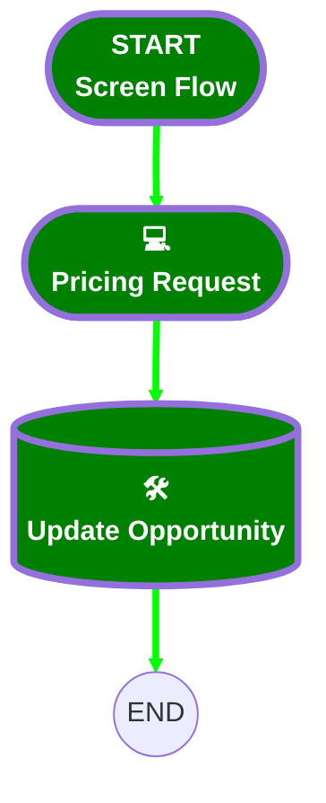

<b>🟩# [Opportunity][Screen-Flow] ATAK Project Request</b>

## 🟩Flow Diagram

```mermaid
%% If you read this, your Markdown visualizer does not handle MermaidJS syntax.
%% - If you are in VsCode, install extension `Markdown Preview Mermaid Support` at https://marketplace.visualstudio.com/items?itemName=bierner.markdown-mermaid
%% - If you are using sfdx-hardis, try to define env variable `MERMAID_MODES=cli,docker` ,then run again the command to regenerate markdown with SVG images.
%% - If you are within mkdocs-material, define mermaid plugin in `mkdocs.yml` as described in https://squidfunk.github.io/mkdocs-material/extensions/mermaid/
%% - At last resort, you can copy-paste this MermaidJS code in https://mermaid.live/ to see the Flow Diagram

flowchart TB
START(["<b>START<br/><b>Screen Flow</b></b>"]):::startClassAdded
click START "#general-information" "1827018670"

Update_Opportunity[("<b>🛠️ <em></em><br/>Update Opportunity</b>")]:::recordUpdatesAdded
click Update_Opportunity "#update_opportunity" "1027039105"

Pricing_Request(["<b>💻 <em></em><br/>Pricing Request</b>"]):::screensAdded
click Pricing_Request "#pricing_request" "724418737"

Update_Opportunity ==> END_Update_Opportunity
Pricing_Request ==> Update_Opportunity
START ==>  Pricing_Request
END_Update_Opportunity(( END )):::endClassAdded


classDef actionCalls fill:#D4E4FC,color:black,text-decoration:none,max-height:100px
classDef assignments fill:#FBEED7,color:black,text-decoration:none,max-height:100px
classDef collectionProcessors fill:#F0E3FA,color:black,text-decoration:none,max-height:100px
classDef customErrors fill:#FFE9E9,color:black,text-decoration:none,max-height:100px
classDef decisions fill:#FDEAF6,color:black,text-decoration:none,max-height:100px
classDef loops fill:#FDEAF6,color:black,text-decoration:none,max-height:100px
classDef recordCreates fill:#FFF8C9,color:black,text-decoration:none,max-height:100px
classDef recordDeletes fill:#FFF8C9,color:black,text-decoration:none,max-height:100px
classDef recordLookups fill:#EDEAFF,color:black,text-decoration:none,max-height:100px
classDef recordUpdates fill:#FFF8C9,color:black,text-decoration:none,max-height:100px
classDef screens fill:#DFF6FF,color:black,text-decoration:none,max-height:100px
classDef subflows fill:#D4E4FC,color:black,text-decoration:none,max-height:100px
classDef startClass fill:#D9F2E6,color:black,text-decoration:none,max-height:100px
classDef endClass fill:#F9BABA,color:black,text-decoration:none,max-height:100px


classDef actionCallsAdded fill:green,color:white,stroke-width:4px,text-decoration:none,max-height:100px
classDef assignmentsAdded fill:green,color:white,stroke-width:4px,text-decoration:none,max-height:100px
classDef collectionProcessorsAdded fill:green,color:white,stroke-width:4px,text-decoration:none,max-height:100px
classDef customErrorsAdded fill:green,color:white,stroke-width:4px,text-decoration:none,max-height:100px
classDef decisionsAdded fill:green,color:white,stroke-width:4px,text-decoration:none,max-height:100px
classDef loopsAdded fill:green,color:white,stroke-width:4px,text-decoration:none,max-height:100px
classDef recordCreatesAdded fill:green,color:white,stroke-width:4px,text-decoration:none,max-height:100px
classDef recordDeletesAdded fill:green,color:white,stroke-width:4px,text-decoration:none,max-height:100px
classDef recordLookupsAdded fill:green,color:white,stroke-width:4px,text-decoration:none,max-height:100px
classDef recordUpdatesAdded fill:green,color:white,stroke-width:4px,text-decoration:none,max-height:100px
classDef screensAdded fill:green,color:white,stroke-width:4px,text-decoration:none,max-height:100px
classDef subflowsAdded fill:green,color:white,stroke-width:4px,text-decoration:none,max-height:100px
classDef startClassAdded fill:green,color:white,stroke-width:4px,text-decoration:none,max-height:100px

classDef actionCallsRemoved fill:red,color:white,stroke-width:4px,text-decoration:none,max-height:100px
classDef assignmentsRemoved fill:red,color:white,stroke-width:4px,text-decoration:none,max-height:100px
classDef collectionProcessorsRemoved fill:red,color:white,stroke-width:4px,text-decoration:none,max-height:100px
classDef customErrorsRemoved fill:red,color:white,stroke-width:4px,text-decoration:none,max-height:100px
classDef decisionsRemoved fill:red,color:white,stroke-width:4px,text-decoration:none,max-height:100px
classDef loopsRemoved fill:red,color:white,stroke-width:4px,text-decoration:none,max-height:100px
classDef recordCreatesRemoved fill:red,color:white,stroke-width:4px,text-decoration:none,max-height:100px
classDef recordDeletesRemoved fill:red,color:white,stroke-width:4px,text-decoration:none,max-height:100px
classDef recordLookupsRemoved fill:red,color:white,stroke-width:4px,text-decoration:none,max-height:100px
classDef recordUpdatesRemoved fill:red,color:white,stroke-width:4px,text-decoration:none,max-height:100px
classDef screensRemoved fill:red,color:white,stroke-width:4px,text-decoration:none,max-height:100px
classDef subflowsRemoved fill:red,color:white,stroke-width:4px,text-decoration:none,max-height:100px
classDef startClassRemoved fill:red,color:white,stroke-width:4px,text-decoration:none,max-height:100px

classDef actionCallsChanged fill:orange,color:white,stroke-width:4px,text-decoration:none,max-height:100px
classDef assignmentsChanged fill:orange,color:white,stroke-width:4px,text-decoration:none,max-height:100px
classDef collectionProcessorsChanged fill:orange,color:white,stroke-width:4px,text-decoration:none,max-height:100px
classDef customErrorsChanged fill:orange,color:white,stroke-width:4px,text-decoration:none,max-height:100px
classDef decisionsChanged fill:orange,color:white,stroke-width:4px,text-decoration:none,max-height:100px
classDef loopsChanged fill:orange,color:white,stroke-width:4px,text-decoration:none,max-height:100px
classDef recordCreatesChanged fill:orange,color:white,stroke-width:4px,text-decoration:none,max-height:100px
classDef recordDeletesChanged fill:orange,color:white,stroke-width:4px,text-decoration:none,max-height:100px
classDef recordLookupsChanged fill:orange,color:white,stroke-width:4px,text-decoration:none,max-height:100px
classDef recordUpdatesChanged fill:orange,color:white,stroke-width:4px,text-decoration:none,max-height:100px
classDef screensChanged fill:orange,color:white,stroke-width:4px,text-decoration:none,max-height:100px
classDef subflowsChanged fill:orange,color:white,stroke-width:4px,text-decoration:none,max-height:100px
classDef startClassChanged fill:orange,color:white,stroke-width:4px,text-decoration:none,max-height:100px
  
linkStyle 0,1,2 stroke:#00ff00,stroke-width:4px,color:green;
```

<b>🟩<!-- Flow description --></b>

## 🟩General Information

|🟩<b><!-- --></b>|<b><!-- --></b>|
|:---|:---|
|🟩<b>Process Type</b>|<b> Flow</b>|
|🟩<b>Label</b>|<b>[Opportunity][Screen-Flow] ATAK Project Request</b>|
|🟩<b>Status</b>|<b>Active</b>|
|🟩<b>Environments</b>|<b>Default</b>|
|🟩<b>Interview Label</b>|<b>[Opportunity][Screen-Flow] ATAK Project Request {!$Flow.CurrentDateTime}</b>|
|🟩<b> Builder Type (PM)</b>|<b>LightningFlowBuilder</b>|
|🟩<b> Canvas Mode (PM)</b>|<b>AUTO_LAYOUT_CANVAS</b>|
|🟩<b> Origin Builder Type (PM)</b>|<b>LightningFlowBuilder</b>|
|🟩<b>Connector</b>|<b>[Pricing_Request](#pricing_request)</b>|
|🟩<b>Next Node</b>|<b>[Pricing_Request](#pricing_request)</b>|

## 🟩Variables

|🟩<b>Name</b>|<b>Data Type</b>|<b>Is Collection</b>|<b>Is Input</b>|<b>Is Output</b>|<b>Object Type</b>|<b>Description</b>|
|:-- |:--:|:--:|:--:|:--:|:--:|:--  |
|🟩<b>recordId</b>|<b>String</b>|<b>⬜</b>|<b>✅</b>|<b>⬜</b>|<b><!-- --></b>|<b><!-- --></b>|

## 🟩Flow Nodes Details

### 🟩Update_Opportunity

|🟩<b><!-- --></b>|<b><!-- --></b>|
|:---|:---|
|🟩<b>Type</b>|<b>Record Update</b>|
|🟩<b>Object</b>|<b>Opportunity</b>|
|🟩<b>Label</b>|<b>Update Opportunity</b>|

#### 🟩Filters (logic: **and**)

|🟩<b>Filter Id</b>|<b>Field</b>|<b>Operator</b>|<b>Value</b>|
|:-- |:-- |:--:|:--: |
|🟩<b>1</b>|<b>Id</b>|<b> Equal To</b>|<b>recordId</b>|

#### 🟩Input Assignments

|🟩<b>Field</b>|<b>Value</b>|
|:-- |:--: |
|🟩<b>ATAK_Project_Needed__c</b>|<b>✅</b>|
|🟩<b>ATAK_Project_Request_Comment__c</b>|<b>Request_Comments</b>|
|🟩<b>ATAK_Project_Request_Priority__c</b>|<b>Priority</b>|
|🟩<b>ATAK_Project_Request_Status__c</b>|<b>Requested</b>|

### 🟩Pricing_Request

|🟩<b><!-- --></b>|<b><!-- --></b>|
|:---|:---|
|🟩<b>Type</b>|<b>Screen</b>|
|🟩<b>Label</b>|<b>Pricing Request</b>|
|🟩<b>Allow Back</b>|<b>⬜</b>|
|🟩<b>Allow Finish</b>|<b>✅</b>|
|🟩<b>Allow Pause</b>|<b>⬜</b>|
|🟩<b>Next Or Finish Button Label</b>|<b>Request ATAK Project</b>|
|🟩<b>Show Footer</b>|<b>✅</b>|
|🟩<b>Show Header</b>|<b>⬜</b>|
|🟩<b>Connector</b>|<b>[Update_Opportunity](#update_opportunity)</b>|

#### 🟩ATAKProjectTitle

|🟩<b><!-- --></b>|<b><!-- --></b>|
|:---|:---|
|🟩<b>Field Text</b>|<b>
<strong style="font-size: 16px;">ATAK Project Request</strong>

 

This opportunity will be flagged so that Business Support can create the ATAK project. Please adapt the priority and add any additional comment to your request, if necessary.
</b>|
|🟩<b>Field Type</b>|<b> Display Text</b>|

#### 🟩Priority

|🟩<b><!-- --></b>|<b><!-- --></b>|
|:---|:---|
|🟩<b>Data Type</b>|<b>String</b>|
|🟩<b>Choice References</b>|<b>PricingRequestPriorityChoice</b>|
|🟩<b>Default Value</b>|<b>Medium</b>|
|🟩<b>Field Text</b>|<b>Priority</b>|
|🟩<b>Field Type</b>|<b> Dropdown Box</b>|
|🟩<b>Inputs On Next Nav To Assoc Scrn</b>|<b> Use Stored Values</b>|
|🟩<b>Is Required</b>|<b>✅</b>|

#### 🟩Request_Comments

|🟩<b><!-- --></b>|<b><!-- --></b>|
|:---|:---|
|🟩<b>Data Type</b>|<b>String</b>|
|🟩<b>Field Text</b>|<b>Any specific comments for this pricing request?</b>|
|🟩<b>Field Type</b>|<b> Input Field</b>|
|🟩<b>Inputs On Next Nav To Assoc Scrn</b>|<b> Use Stored Values</b>|
|🟩<b>Is Required</b>|<b>⬜</b>|

___

<b>🟩_Documentation generated from branch monitoring_krinkelsgreencare__upeodev_sandbox by [sfdx-hardis](https://sfdx-hardis.cloudity.com), featuring [salesforce-flow-visualiser](https://github.com/toddhalfpenny/salesforce-flow-visualiser)_</b>