# [Quote] - [After-Save] - Create Work Order on Acceptance

## Flow Diagram

```mermaid
%% If you read this, your Markdown visualizer does not handle MermaidJS syntax.
%% - If you are in VsCode, install extension `Markdown Preview Mermaid Support` at https://marketplace.visualstudio.com/items?itemName=bierner.markdown-mermaid
%% - If you are using sfdx-hardis, try to define env variable `MERMAID_MODES=cli,docker` ,then run again the command to regenerate markdown with SVG images.
%% - If you are within mkdocs-material, define mermaid plugin in `mkdocs.yml` as described in https://squidfunk.github.io/mkdocs-material/extensions/mermaid/
%% - At last resort, you can copy-paste this MermaidJS code in https://mermaid.live/ to see the Flow Diagram

flowchart TB
START(["START<br/><b>AutoLaunched Flow</b></br>Type: <b> Record After Save</b>"]):::startClass
click START "#general-information" "656897102"

Set_Work_Order_Initial_Values[\"🟰 <em></em><br/>Set Work Order Initial Values"/]:::assignments
click Set_Work_Order_Initial_Values "#set_work_order_initial_values" "3113885255"

Create_Asset[("➕ <em></em><br/>Create Asset")]:::recordCreates
click Create_Asset "#create_asset" "3973496147"

Create_Work_Order[("➕ <em></em><br/>Create Work Order")]:::recordCreates
click Create_Work_Order "#create_work_order" "476657433"

Get_Extra_Work_Asset_for_Operational_Account[("🔍 <em></em><br/>Get Extra Work Asset for Operational Account")]:::recordLookups
click Get_Extra_Work_Asset_for_Operational_Account "#get_extra_work_asset_for_operational_account" "2905031740"

Get_Extra_Work_Product[("🔍 <em></em><br/>Get Extra Work Product")]:::recordLookups
click Get_Extra_Work_Product "#get_extra_work_product" "1338484692"

Get_Product_Work_Type[("🔍 <em></em><br/>Get Product Work Type")]:::recordLookups
click Get_Product_Work_Type "#get_product_work_type" "3479751486"

Set_Work_Order_Initial_Values --> Create_Work_Order
Create_Asset --> Set_Work_Order_Initial_Values
Create_Work_Order --> END_Create_Work_Order
Get_Extra_Work_Asset_for_Operational_Account --> Create_Asset
Get_Extra_Work_Product --> Get_Extra_Work_Asset_for_Operational_Account
Get_Product_Work_Type --> Get_Extra_Work_Product
START -->  Get_Product_Work_Type
END_Create_Work_Order(( END )):::endClass


classDef actionCalls fill:#D4E4FC,color:black,text-decoration:none,max-height:100px
classDef assignments fill:#FBEED7,color:black,text-decoration:none,max-height:100px
classDef collectionProcessors fill:#F0E3FA,color:black,text-decoration:none,max-height:100px
classDef customErrors fill:#FFE9E9,color:black,text-decoration:none,max-height:100px
classDef decisions fill:#FDEAF6,color:black,text-decoration:none,max-height:100px
classDef loops fill:#FDEAF6,color:black,text-decoration:none,max-height:100px
classDef recordCreates fill:#FFF8C9,color:black,text-decoration:none,max-height:100px
classDef recordDeletes fill:#FFF8C9,color:black,text-decoration:none,max-height:100px
classDef recordLookups fill:#EDEAFF,color:black,text-decoration:none,max-height:100px
classDef recordUpdates fill:#FFF8C9,color:black,text-decoration:none,max-height:100px
classDef screens fill:#DFF6FF,color:black,text-decoration:none,max-height:100px
classDef subflows fill:#D4E4FC,color:black,text-decoration:none,max-height:100px
classDef startClass fill:#D9F2E6,color:black,text-decoration:none,max-height:100px
classDef endClass fill:#F9BABA,color:black,text-decoration:none,max-height:100px


```

<!-- Flow description -->

## General Information

|<!-- -->|<!-- -->|
|:---|:---|
|Object|Quote|
|Process Type| Auto Launched Flow|
|Trigger Type| Record After Save|
|Record Trigger Type| Update|
|Label|[Quote] - [After-Save] - Create Work Order on Acceptance|
|Status|⚠️ Draft|
|Does Require Record Changed To Meet Criteria|✅|
|Environments|Default|
|Interview Label|[Quote] - [After-Save] - Create Work Order on Acceptance {!$Flow.CurrentDateTime}|
| Builder Type (PM)|LightningFlowBuilder|
| Canvas Mode (PM)|AUTO_LAYOUT_CANVAS|
| Origin Builder Type (PM)|LightningFlowBuilder|
|Connector|[Get_Product_Work_Type](#get_product_work_type)|
|Next Node|[Get_Product_Work_Type](#get_product_work_type)|

#### Filters (logic: **and**)

|Filter Id|Field|Operator|Value|
|:-- |:-- |:--:|:--: |
|1|Status| Equal To|Accepted|

## Variables

|Name|Data Type|Is Collection|Is Input|Is Output|Object Type|Description|
|:-- |:--:|:--:|:--:|:--:|:--:|:--  |
|assetId|String|⬜|⬜|⬜|<!-- -->|<!-- -->|
|extraWorkOrder|SObject|⬜|⬜|⬜|WorkOrder|<!-- -->|

## Formulas

|Name|Data Type|Expression|Description|
|:-- |:--:|:-- |:--  |
|assetName|String|"Extra Work - " +{!$Record.Opportunity.Account.Alias_commercial_customer_name__c} +" - " + {!$Record.Opportunity.Account.ShippingStreet}|<!-- -->|

## Flow Nodes Details

### Set_Work_Order_Initial_Values

|<!-- -->|<!-- -->|
|:---|:---|
|Type|Assignment|
|Label|Set Work Order Initial Values|
|Connector|[Create_Work_Order](#create_work_order)|

#### Assignments

|Assign To Reference|Operator|Value|
|:-- |:--:|:--: |
|extraWorkOrder.AccountId| Assign|$Record.AccountId|
|extraWorkOrder.ServiceContractId| Assign|$Record.Opportunity.Service_Contract__c|
|extraWorkOrder.Subject| Assign|$Record.Name|
|extraWorkOrder.Opportunity__c| Assign|$Record.OpportunityId|
|extraWorkOrder.Priority| Assign|High|
|extraWorkOrder.Street| Assign|$Record.Opportunity.Account.ShippingStreet|
|extraWorkOrder.City| Assign|$Record.Opportunity.Account.ShippingCity|
|extraWorkOrder.PostalCode| Assign|$Record.Opportunity.Account.ShippingPostalCode|
|extraWorkOrder.Country| Assign|$Record.Opportunity.Account.ShippingCountry|
|extraWorkOrder.AssetId| Assign|[Create_Asset](#create_asset)|
|extraWorkOrder.Status| Assign|Unscheduled|
|extraWorkOrder.ServiceTerritoryId| Assign|$Record.Opportunity.ATAK_Projectx__r.Service_Territory__c|
|extraWorkOrder.WorkTypeId| Assign|Get_Product_Work_Type.Id|
|extraWorkOrder.SuggestedMaintenanceDate| Assign|$Record.Opportunity.CloseDate|

### Create_Asset

|<!-- -->|<!-- -->|
|:---|:---|
|Type|Record Create|
|Object|Asset|
|Label|Create Asset|
|Operation Mult Matching Records|UpdateLatestRecord|
|Operation One Matching Record|UpdateAllRecords|
|Operation Zero Matching Records|AddRecord|
|Store Output Automatically|✅|
|Connector|[Set_Work_Order_Initial_Values](#set_work_order_initial_values)|

#### Filters (logic: **and**)

|Filter Id|Field|Operator|Value|
|:-- |:-- |:--:|:--: |
|1|AccountId| Equal To|$Record__Prior.AccountId|
|2|Product2Id| Equal To|Get_Extra_Work_Product.Id|

#### Input Assignments

|Field|Value|
|:-- |:--: |
|ATAK_Project__c|$Record.Opportunity.ATAK_Projectx__c|
|AccountId|$Record.AccountId|
|Name|assetName|
|Product2Id|Get_Extra_Work_Product.Id|
|Service_Territory__c|$Record.Opportunity.ATAK_Projectx__r.Service_Territory__c|

### Create_Work_Order

|<!-- -->|<!-- -->|
|:---|:---|
|Type|Record Create|
|Label|Create Work Order|
|Input Reference|extraWorkOrder|

### Get_Extra_Work_Asset_for_Operational_Account

|<!-- -->|<!-- -->|
|:---|:---|
|Type|Record Lookup|
|Object|Asset|
|Label|Get Extra Work Asset for Operational Account|
|Assign Null Values If No Records Found|⬜|
|Get First Record Only|✅|
|Store Output Automatically|✅|
|Connector|[Create_Asset](#create_asset)|

#### Filters (logic: **and**)

|Filter Id|Field|Operator|Value|
|:-- |:-- |:--:|:--: |
|1|Product2Id| Equal To|Get_Extra_Work_Product.Id|
|2|AccountId| Equal To|$Record.AccountId|

### Get_Extra_Work_Product

|<!-- -->|<!-- -->|
|:---|:---|
|Type|Record Lookup|
|Object|Product2|
|Label|Get Extra Work Product|
|Assign Null Values If No Records Found|⬜|
|Get First Record Only|✅|
|Store Output Automatically|✅|
|Connector|[Get_Extra_Work_Asset_for_Operational_Account](#get_extra_work_asset_for_operational_account)|

#### Filters (logic: **and**)

|Filter Id|Field|Operator|Value|
|:-- |:-- |:--:|:--: |
|1|Name| Equal To|Extra Work|

### Get_Product_Work_Type

|<!-- -->|<!-- -->|
|:---|:---|
|Type|Record Lookup|
|Object|WorkType|
|Label|Get Product Work Type|
|Assign Null Values If No Records Found|⬜|
|Get First Record Only|✅|
|Store Output Automatically|✅|
|Connector|[Get_Extra_Work_Product](#get_extra_work_product)|

#### Filters (logic: **and**)

|Filter Id|Field|Operator|Value|
|:-- |:-- |:--:|:--: |
|1|Name| Equal To|Production Work|

___

_Documentation generated from branch monitoring_krinkelsgreencare__upeodev_sandbox by [sfdx-hardis](https://sfdx-hardis.cloudity.com), featuring [salesforce-flow-visualiser](https://github.com/toddhalfpenny/salesforce-flow-visualiser)_