# [Quote] - [After-Save] - Create Work Order on Acceptance

## Flow Diagram

```mermaid
%% If you read this, your Markdown visualizer does not handle MermaidJS syntax.
%% - If you are in VsCode, install extension `Markdown Preview Mermaid Support` at https://marketplace.visualstudio.com/items?itemName=bierner.markdown-mermaid
%% - If you are using sfdx-hardis, try to define env variable `MERMAID_MODES=cli,docker` ,then run again the command to regenerate markdown with SVG images.
%% - If you are within mkdocs-material, define mermaid plugin in `mkdocs.yml` as described in https://squidfunk.github.io/mkdocs-material/extensions/mermaid/
%% - At last resort, you can copy-paste this MermaidJS code in https://mermaid.live/ to see the Flow Diagram

flowchart TB
START(["<b>START<br/><b>AutoLaunched Flow</b></br>Type: <b> Record After Save</b></b>"]):::startClassChanged


click START "#general-information" "643246429"


Set_Work_Order_Initial_Values[\"<b>🟰 <em></em><br/>Set Work Order Initial Values</b>"/]:::assignmentsChanged


click Set_Work_Order_Initial_Values "#set_work_order_initial_values" "3871008794"


Create_Asset[("➕ <em></em><br/>Create Asset")]:::recordCreates
click Create_Asset "#create_asset" "3973496147"

Create_Work_Order[("➕ <em></em><br/>Create Work Order")]:::recordCreates
click Create_Work_Order "#create_work_order" "476657433"

Get_Extra_Work_Asset_for_Operational_Account[("🔍 <em></em><br/>Get Extra Work Asset for Operational Account")]:::recordLookups
click Get_Extra_Work_Asset_for_Operational_Account "#get_extra_work_asset_for_operational_account" "2905031740"

Get_Extra_Work_Product[("🔍 <em></em><br/>Get Extra Work Product")]:::recordLookups
click Get_Extra_Work_Product "#get_extra_work_product" "1338484692"

Get_Product_Work_Type[("🔍 <em></em><br/>Get Product Work Type")]:::recordLookups
click Get_Product_Work_Type "#get_product_work_type" "3479751486"

Set_Work_Order_Initial_Values --> Create_Work_Order
Create_Asset --> Set_Work_Order_Initial_Values
Create_Work_Order --> END_Create_Work_Order
Get_Extra_Work_Asset_for_Operational_Account --> Create_Asset
Get_Extra_Work_Product --> Get_Extra_Work_Asset_for_Operational_Account
Get_Product_Work_Type --> Get_Extra_Work_Product
START -->  Get_Product_Work_Type
END_Create_Work_Order(( END )):::endClass


classDef actionCalls fill:#D4E4FC,color:black,text-decoration:none,max-height:100px
classDef assignments fill:#FBEED7,color:black,text-decoration:none,max-height:100px
classDef collectionProcessors fill:#F0E3FA,color:black,text-decoration:none,max-height:100px
classDef customErrors fill:#FFE9E9,color:black,text-decoration:none,max-height:100px
classDef decisions fill:#FDEAF6,color:black,text-decoration:none,max-height:100px
classDef loops fill:#FDEAF6,color:black,text-decoration:none,max-height:100px
classDef recordCreates fill:#FFF8C9,color:black,text-decoration:none,max-height:100px
classDef recordDeletes fill:#FFF8C9,color:black,text-decoration:none,max-height:100px
classDef recordLookups fill:#EDEAFF,color:black,text-decoration:none,max-height:100px
classDef recordUpdates fill:#FFF8C9,color:black,text-decoration:none,max-height:100px
classDef screens fill:#DFF6FF,color:black,text-decoration:none,max-height:100px
classDef subflows fill:#D4E4FC,color:black,text-decoration:none,max-height:100px
classDef startClass fill:#D9F2E6,color:black,text-decoration:none,max-height:100px
classDef endClass fill:#F9BABA,color:black,text-decoration:none,max-height:100px



classDef actionCallsAdded fill:green,color:white,stroke-width:4px,text-decoration:none,max-height:100px
classDef assignmentsAdded fill:green,color:white,stroke-width:4px,text-decoration:none,max-height:100px
classDef collectionProcessorsAdded fill:green,color:white,stroke-width:4px,text-decoration:none,max-height:100px
classDef customErrorsAdded fill:green,color:white,stroke-width:4px,text-decoration:none,max-height:100px
classDef decisionsAdded fill:green,color:white,stroke-width:4px,text-decoration:none,max-height:100px
classDef loopsAdded fill:green,color:white,stroke-width:4px,text-decoration:none,max-height:100px
classDef recordCreatesAdded fill:green,color:white,stroke-width:4px,text-decoration:none,max-height:100px
classDef recordDeletesAdded fill:green,color:white,stroke-width:4px,text-decoration:none,max-height:100px
classDef recordLookupsAdded fill:green,color:white,stroke-width:4px,text-decoration:none,max-height:100px
classDef recordUpdatesAdded fill:green,color:white,stroke-width:4px,text-decoration:none,max-height:100px
classDef screensAdded fill:green,color:white,stroke-width:4px,text-decoration:none,max-height:100px
classDef subflowsAdded fill:green,color:white,stroke-width:4px,text-decoration:none,max-height:100px
classDef startClassAdded fill:green,color:white,stroke-width:4px,text-decoration:none,max-height:100px

classDef actionCallsRemoved fill:red,color:white,stroke-width:4px,text-decoration:none,max-height:100px
classDef assignmentsRemoved fill:red,color:white,stroke-width:4px,text-decoration:none,max-height:100px
classDef collectionProcessorsRemoved fill:red,color:white,stroke-width:4px,text-decoration:none,max-height:100px
classDef customErrorsRemoved fill:red,color:white,stroke-width:4px,text-decoration:none,max-height:100px
classDef decisionsRemoved fill:red,color:white,stroke-width:4px,text-decoration:none,max-height:100px
classDef loopsRemoved fill:red,color:white,stroke-width:4px,text-decoration:none,max-height:100px
classDef recordCreatesRemoved fill:red,color:white,stroke-width:4px,text-decoration:none,max-height:100px
classDef recordDeletesRemoved fill:red,color:white,stroke-width:4px,text-decoration:none,max-height:100px
classDef recordLookupsRemoved fill:red,color:white,stroke-width:4px,text-decoration:none,max-height:100px
classDef recordUpdatesRemoved fill:red,color:white,stroke-width:4px,text-decoration:none,max-height:100px
classDef screensRemoved fill:red,color:white,stroke-width:4px,text-decoration:none,max-height:100px
classDef subflowsRemoved fill:red,color:white,stroke-width:4px,text-decoration:none,max-height:100px
classDef startClassRemoved fill:red,color:white,stroke-width:4px,text-decoration:none,max-height:100px

classDef actionCallsChanged fill:orange,color:white,stroke-width:4px,text-decoration:none,max-height:100px
classDef assignmentsChanged fill:orange,color:white,stroke-width:4px,text-decoration:none,max-height:100px
classDef collectionProcessorsChanged fill:orange,color:white,stroke-width:4px,text-decoration:none,max-height:100px
classDef customErrorsChanged fill:orange,color:white,stroke-width:4px,text-decoration:none,max-height:100px
classDef decisionsChanged fill:orange,color:white,stroke-width:4px,text-decoration:none,max-height:100px
classDef loopsChanged fill:orange,color:white,stroke-width:4px,text-decoration:none,max-height:100px
classDef recordCreatesChanged fill:orange,color:white,stroke-width:4px,text-decoration:none,max-height:100px
classDef recordDeletesChanged fill:orange,color:white,stroke-width:4px,text-decoration:none,max-height:100px
classDef recordLookupsChanged fill:orange,color:white,stroke-width:4px,text-decoration:none,max-height:100px
classDef recordUpdatesChanged fill:orange,color:white,stroke-width:4px,text-decoration:none,max-height:100px
classDef screensChanged fill:orange,color:white,stroke-width:4px,text-decoration:none,max-height:100px
classDef subflowsChanged fill:orange,color:white,stroke-width:4px,text-decoration:none,max-height:100px
classDef startClassChanged fill:orange,color:white,stroke-width:4px,text-decoration:none,max-height:100px
  
```

<!-- Flow description -->

## General Information

|<!-- -->|<!-- -->|
|:---|:---|
|Object|Quote|
|Process Type| Auto Launched Flow|
|Trigger Type| Record After Save|
|Record Trigger Type| Update|
|Label|[Quote] - [After-Save] - Create Work Order on Acceptance|
|🟥<i>Status</i>|<i>⚠️ Draft</i>|
|🟩<b>Status</b>|<b>Active</b>|
|Does Require Record Changed To Meet Criteria|✅|
|Environments|Default|
|Interview Label|[Quote] - [After-Save] - Create Work Order on Acceptance {!$Flow.CurrentDateTime}|
| Builder Type (PM)|LightningFlowBuilder|
| Canvas Mode (PM)|AUTO_LAYOUT_CANVAS|
| Origin Builder Type (PM)|LightningFlowBuilder|
|Connector|[Get_Product_Work_Type](#get_product_work_type)|
|Next Node|[Get_Product_Work_Type](#get_product_work_type)|

## Flow Nodes Details

### Set_Work_Order_Initial_Values

|<!-- -->|<!-- -->|
|:---|:---|
|Type|Assignment|
|Label|Set Work Order Initial Values|
|Connector|[Create_Work_Order](#create_work_order)|

#### Assignments

|Assign To Reference|Operator|Value|
|:-- |:--:|:--: |
|🟥<i>extraWorkOrder.AccountId</i>|<i> Assign</i>|<i>$Record.AccountId</i>|
|🟥<i>extraWorkOrder.ServiceContractId</i>|<i> Assign</i>|<i>$Record.Opportunity.Service_Contract__c</i>|
|🟩<b>extraWorkOrder.AccountId</b>|<b> Assign</b>|<b>$Record.QuoteAccountId</b>|
|🟩<b>extraWorkOrder.ServiceContractId</b>|<b> Assign</b>|<b>$Record.Service_Contract__c</b>|
|extraWorkOrder.Subject| Assign|$Record.Name|
|🟥<i>extraWorkOrder.Opportunity__c</i>|<i> Assign</i>|<i>$Record.OpportunityId</i>|
|🟩<b>extraWorkOrder.Quote__c</b>|<b> Assign</b>|<b>$Record.Id</b>|
|extraWorkOrder.Priority| Assign|High|
|🟥<i>extraWorkOrder.Street</i>|<i> Assign</i>|<i>$Record.Opportunity.Account.ShippingStreet</i>|
|🟥<i>extraWorkOrder.City</i>|<i> Assign</i>|<i>$Record.Opportunity.Account.ShippingCity</i>|
|🟥<i>extraWorkOrder.PostalCode</i>|<i> Assign</i>|<i>$Record.Opportunity.Account.ShippingPostalCode</i>|
|🟥<i>extraWorkOrder.Country</i>|<i> Assign</i>|<i>$Record.Opportunity.Account.ShippingCountry</i>|
|🟩<b>extraWorkOrder.Street</b>|<b> Assign</b>|<b>$Record.QuoteAccount.ShippingStreet</b>|
|🟩<b>extraWorkOrder.City</b>|<b> Assign</b>|<b>$Record.QuoteAccount.ShippingCity</b>|
|🟩<b>extraWorkOrder.PostalCode</b>|<b> Assign</b>|<b>$Record.QuoteAccount.ShippingPostalCode</b>|
|🟩<b>extraWorkOrder.Country</b>|<b> Assign</b>|<b>$Record.QuoteAccount.ShippingCountry</b>|
|extraWorkOrder.AssetId| Assign|[Create_Asset](#create_asset)|
|extraWorkOrder.Status| Assign|Unscheduled|
|🟥<i>extraWorkOrder.ServiceTerritoryId</i>|<i> Assign</i>|<i>$Record.Opportunity.ATAK_Projectx__r.Service_Territory__c</i>|
|🟩<b>extraWorkOrder.ServiceTerritoryId</b>|<b> Assign</b>|<b>$Record.ATAK_Project__r.Service_Territory__c</b>|
|extraWorkOrder.WorkTypeId| Assign|Get_Product_Work_Type.Id|
|🟥<i>extraWorkOrder.SuggestedMaintenanceDate</i>|<i> Assign</i>|<i>$Record.Opportunity.CloseDate</i>|

___

_Documentation generated from branch monitoring_krinkelsgreencare__upeodev_sandbox by [sfdx-hardis](https://sfdx-hardis.cloudity.com), featuring [salesforce-flow-visualiser](https://github.com/toddhalfpenny/salesforce-flow-visualiser)_