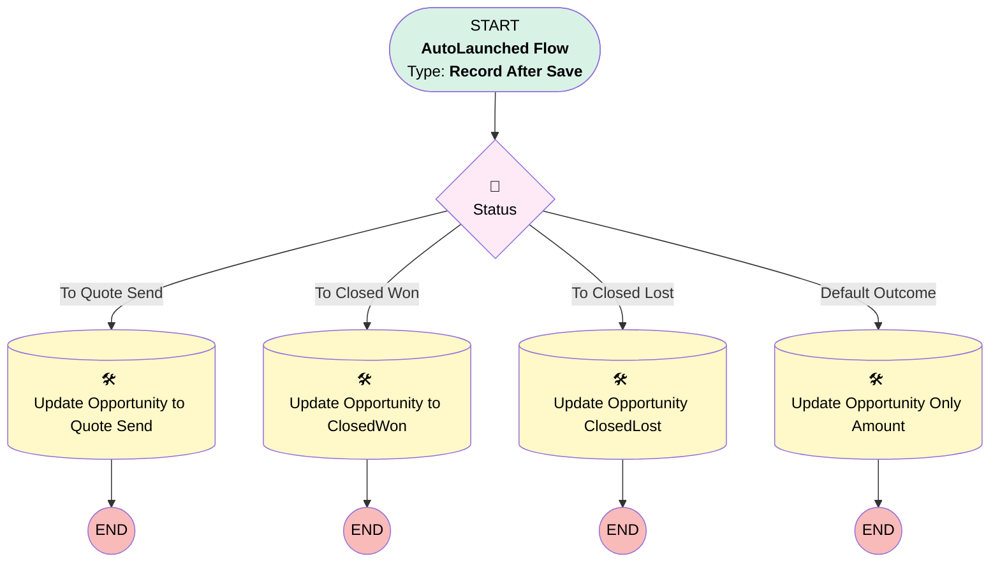

# [Quote][After-Save][Record-Triggered] Sync Amount and stages to Opportunity

## Flow Diagram

## General Information

|<!-- -->|<!-- -->|
|:---|:---|
|Object|Quote|
|Process Type| Auto Launched Flow|
|Trigger Type| Record After Save|
|Record Trigger Type| Create And Update|
|Label|[Quote][After-Save][Record-Triggered] Sync Amount and stages to Opportunity|
|Status|Active|
|Filter Formula|{!$Record.IsSyncing} = True && (ISNEW() || (ISCHANGED({!$Record.Amount__c})||ISCHANGED({!$Record.Status})))|
|Description|Keeps opportunity in sync when opportunity amounts are changed|
|Environments|Default|
|Interview Label|[Quote][After-Save][Record-Triggered] Sync Amount and stages to Opportunity {!$Flow.CurrentDateTime}|
| Builder Type (PM)|LightningFlowBuilder|
| Canvas Mode (PM)|AUTO_LAYOUT_CANVAS|
| Origin Builder Type (PM)|LightningFlowBuilder|
|Connector|[Status](#status)|
|Next Node|[Status](#status)|

## Flow Nodes Details

### Status

|<!-- -->|<!-- -->|
|:---|:---|
|Type|Decision|
|Label|[Status](#status)|
|Description|to chich status the oppty must go?|
|Default Connector|[Update_Opportunity_OnlyAmount](#update_opportunity_onlyamount)|
|Default Connector Label|Default Outcome|

#### Rule To_Quote_Send (To Quote Send)

|<!-- -->|<!-- -->|
|:---|:---|
|Connector|[Update_Opportunity](#update_opportunity)|
|Condition Logic|and|

|Condition Id|Left Value Reference|Operator|Right Value|
|:-- |:-- |:--:|:--: |
|1|$Record.Status| Equal To|Presented|

#### Rule To_Closed_Won (To Closed Won)

|<!-- -->|<!-- -->|
|:---|:---|
|Connector|[Update_Opportunity_to_ClosedWon](#update_opportunity_to_closedwon)|
|Condition Logic|and|

|Condition Id|Left Value Reference|Operator|Right Value|
|:-- |:-- |:--:|:--: |
|1|$Record.Status| Equal To|Accepted|

#### Rule To_Closed_Lost (To Closed Lost)

|<!-- -->|<!-- -->|
|:---|:---|
|Connector|[Update_Opportunity_ClsoedLost](#update_opportunity_clsoedlost)|
|Condition Logic|and|

|Condition Id|Left Value Reference|Operator|Right Value|
|:-- |:-- |:--:|:--: |
|1|$Record.Status| Equal To|Denied|

### Update_Opportunity

|<!-- -->|<!-- -->|
|:---|:---|
|Type|Record Update|
|Object|Opportunity|
|Label|Update Opportunity to Quote Send|

#### Filters (logic: **and**)

|Filter Id|Field|Operator|Value|
|:-- |:-- |:--:|:--: |
|1|Id| Equal To|$Record.OpportunityId|

#### Input Assignments

|Field|Value|
|:-- |:--: |
|Amount__c|$Record.Amount__c|
|StageName|Quote Sent|

### Update_Opportunity_ClsoedLost

|<!-- -->|<!-- -->|
|:---|:---|
|Type|Record Update|
|Object|Opportunity|
|Label|Update Opportunity ClosedLost|

#### Filters (logic: **and**)

|Filter Id|Field|Operator|Value|
|:-- |:-- |:--:|:--: |
|1|Id| Equal To|$Record.OpportunityId|

#### Input Assignments

|Field|Value|
|:-- |:--: |
|Amount__c|$Record.Amount__c|
|StageName|Closed Lost|

### Update_Opportunity_OnlyAmount

|<!-- -->|<!-- -->|
|:---|:---|
|Type|Record Update|
|Object|Opportunity|
|Label|Update Opportunity Only Amount|

#### Filters (logic: **and**)

|Filter Id|Field|Operator|Value|
|:-- |:-- |:--:|:--: |
|1|Id| Equal To|$Record.OpportunityId|

#### Input Assignments

|Field|Value|
|:-- |:--: |
|Amount__c|$Record.Amount__c|

### Update_Opportunity_to_ClosedWon

|<!-- -->|<!-- -->|
|:---|:---|
|Type|Record Update|
|Object|Opportunity|
|Label|Update Opportunity to ClosedWon|

#### Filters (logic: **and**)

|Filter Id|Field|Operator|Value|
|:-- |:-- |:--:|:--: |
|1|Id| Equal To|$Record.OpportunityId|

#### Input Assignments

|Field|Value|
|:-- |:--: |
|Amount__c|$Record.Amount__c|
|StageName|Closed Won|

___

_Documentation generated from branch monitoring_krinkelsgreencare__upeodev_sandbox by [sfdx-hardis](https://sfdx-hardis.cloudity.com), featuring [salesforce-flow-visualiser](https://github.com/toddhalfpenny/salesforce-flow-visualiser)_