# [ResourceAbsence] - After Save  - Copy Breaks from Crew to Agents

## Flow Diagram

```mermaid
%% If you read this, your Markdown visualizer does not handle MermaidJS syntax.
%% - If you are in VsCode, install extension `Markdown Preview Mermaid Support` at https://marketplace.visualstudio.com/items?itemName=bierner.markdown-mermaid
%% - If you are using sfdx-hardis, try to define env variable `MERMAID_MODES=cli,docker` ,then run again the command to regenerate markdown with SVG images.
%% - If you are within mkdocs-material, define mermaid plugin in `mkdocs.yml` as described in https://squidfunk.github.io/mkdocs-material/extensions/mermaid/
%% - At last resort, you can copy-paste this MermaidJS code in https://mermaid.live/ to see the Flow Diagram

flowchart TB
START(["START<br/><b>AutoLaunched Flow</b></br>Type: <b> Record After Save</b>"]):::startClass
click START "#general-information" "2629820792"

Add_to_Collection[\"🟰 <em></em><br/>Add to Collection"/]:::assignments
click Add_to_Collection "#add_to_collection" "2093847205"

Create_Resource_Absence_Break[\"🟰 <em></em><br/>Create Resource Absence Break"/]:::assignments
click Create_Resource_Absence_Break "#create_resource_absence_break" "3023409388"

Check_Resource_Type{"🔀 <em></em><br/>Check Resource Type"}:::decisions
click Check_Resource_Type "#check_resource_type" "52591280"

Loop_Crew_Members{{"🔁 <em></em><br/>Loop Crew Members"}}:::loops
click Loop_Crew_Members "#loop_crew_members" "4144468357"

Create_Absence_Records[("➕ <em></em><br/>Create Absence Records")]:::recordCreates
click Create_Absence_Records "#create_absence_records" "4286375857"

Get_All_Active_Crew_Members[("🔍 <em></em><br/>Get All Active Crew Members")]:::recordLookups
click Get_All_Active_Crew_Members "#get_all_active_crew_members" "2659357698"

Add_to_Collection --> Loop_Crew_Members
Create_Resource_Absence_Break --> Add_to_Collection
Check_Resource_Type --> |"Is Service Crew"| Get_All_Active_Crew_Members
Check_Resource_Type --> |"Default Outcome"| END_Check_Resource_Type
Loop_Crew_Members --> |"For Each"|Create_Resource_Absence_Break
Loop_Crew_Members ---> |"After Last"|Create_Absence_Records
Create_Absence_Records --> END_Create_Absence_Records
Get_All_Active_Crew_Members --> Loop_Crew_Members
START -->  Check_Resource_Type
END_Check_Resource_Type(( END )):::endClass
END_Create_Absence_Records(( END )):::endClass


classDef actionCalls fill:#D4E4FC,color:black,text-decoration:none,max-height:100px
classDef assignments fill:#FBEED7,color:black,text-decoration:none,max-height:100px
classDef collectionProcessors fill:#F0E3FA,color:black,text-decoration:none,max-height:100px
classDef customErrors fill:#FFE9E9,color:black,text-decoration:none,max-height:100px
classDef decisions fill:#FDEAF6,color:black,text-decoration:none,max-height:100px
classDef loops fill:#FDEAF6,color:black,text-decoration:none,max-height:100px
classDef recordCreates fill:#FFF8C9,color:black,text-decoration:none,max-height:100px
classDef recordDeletes fill:#FFF8C9,color:black,text-decoration:none,max-height:100px
classDef recordLookups fill:#EDEAFF,color:black,text-decoration:none,max-height:100px
classDef recordUpdates fill:#FFF8C9,color:black,text-decoration:none,max-height:100px
classDef screens fill:#DFF6FF,color:black,text-decoration:none,max-height:100px
classDef subflows fill:#D4E4FC,color:black,text-decoration:none,max-height:100px
classDef startClass fill:#D9F2E6,color:black,text-decoration:none,max-height:100px
classDef endClass fill:#F9BABA,color:black,text-decoration:none,max-height:100px


```

<!-- Flow description -->

## General Information

|<!-- -->|<!-- -->|
|:---|:---|
|Object|ResourceAbsence|
|Process Type| Auto Launched Flow|
|Trigger Type| Record After Save|
|Record Trigger Type| Create|
|Label|[ResourceAbsence] - After Save  - Copy Breaks from Crew to Agents|
|Status|Active|
|Environments|Default|
|Interview Label|[ResourceAbsence] - After Save  - Copy Breaks from Crew to Agents {!$Flow.CurrentDateTime}|
| Builder Type (PM)|LightningFlowBuilder|
| Canvas Mode (PM)|AUTO_LAYOUT_CANVAS|
| Origin Builder Type (PM)|LightningFlowBuilder|
|Connector|[Check_Resource_Type](#check_resource_type)|
|Next Node|[Check_Resource_Type](#check_resource_type)|

## Variables

|Name|Data Type|Is Collection|Is Input|Is Output|Object Type|Description|
|:-- |:--:|:--:|:--:|:--:|:--:|:--  |
|resourceAbsence|SObject|⬜|⬜|⬜|ResourceAbsence|<!-- -->|
|resourceAbsences|SObject|✅|⬜|⬜|ResourceAbsence|<!-- -->|

## Flow Nodes Details

### Add_to_Collection

|<!-- -->|<!-- -->|
|:---|:---|
|Type|Assignment|
|Label|Add to Collection|
|Connector|[Loop_Crew_Members](#loop_crew_members)|

#### Assignments

|Assign To Reference|Operator|Value|
|:-- |:--:|:--: |
|resourceAbsences| Add|resourceAbsence|

### Create_Resource_Absence_Break

|<!-- -->|<!-- -->|
|:---|:---|
|Type|Assignment|
|Label|Create Resource Absence Break|
|Connector|[Add_to_Collection](#add_to_collection)|

#### Assignments

|Assign To Reference|Operator|Value|
|:-- |:--:|:--: |
|resourceAbsence.ResourceId| Assign|Loop_Crew_Members.ServiceResourceId|
|resourceAbsence.Type| Assign|$Record.Type|
|resourceAbsence.Type_of_Absence__c| Assign|$Record.Type_of_Absence__c|
|resourceAbsence.Start| Assign|$Record.Start|
|resourceAbsence.End| Assign|$Record.End|

### Check_Resource_Type

|<!-- -->|<!-- -->|
|:---|:---|
|Type|Decision|
|Label|Check Resource Type|
|Default Connector Label|Default Outcome|

#### Rule Is_Service_Crew (Is Service Crew)

|<!-- -->|<!-- -->|
|:---|:---|
|Connector|[Get_All_Active_Crew_Members](#get_all_active_crew_members)|
|Condition Logic|and|

|Condition Id|Left Value Reference|Operator|Right Value|
|:-- |:-- |:--:|:--: |
|1|$Record.Resource.ResourceType| Equal To|C|

### Loop_Crew_Members

|<!-- -->|<!-- -->|
|:---|:---|
|Type|Loop|
|Label|Loop Crew Members|
|Collection Reference|[Get_All_Active_Crew_Members](#get_all_active_crew_members)|
|Iteration Order|Asc|
|Next Value Connector|[Create_Resource_Absence_Break](#create_resource_absence_break)|
|No More Values Connector|[Create_Absence_Records](#create_absence_records)|

### Create_Absence_Records

|<!-- -->|<!-- -->|
|:---|:---|
|Type|Record Create|
|Label|Create Absence Records|
|Input Reference|resourceAbsences|

### Get_All_Active_Crew_Members

|<!-- -->|<!-- -->|
|:---|:---|
|Type|Record Lookup|
|Object|ServiceCrewMember|
|Label|Get All Active Crew Members|
|Assign Null Values If No Records Found|⬜|
|Get First Record Only|⬜|
|Store Output Automatically|✅|
|Connector|[Loop_Crew_Members](#loop_crew_members)|

#### Filters (logic: **and**)

|Filter Id|Field|Operator|Value|
|:-- |:-- |:--:|:--: |
|1|ServiceCrewId| Equal To|$Record.Resource.ServiceCrewId|
|2|Active_Member__c| Equal To|✅|

___

_Documentation generated from branch monitoring_krinkelsgreencare__upeodev_sandbox by [sfdx-hardis](https://sfdx-hardis.cloudity.com), featuring [salesforce-flow-visualiser](https://github.com/toddhalfpenny/salesforce-flow-visualiser)_