# [ResourceAbsence] - After Save  - Copy Breaks from Crew to Agents

## Flow Diagram

```mermaid
%% If you read this, your Markdown visualizer does not handle MermaidJS syntax.
%% - If you are in VsCode, install extension `Markdown Preview Mermaid Support` at https://marketplace.visualstudio.com/items?itemName=bierner.markdown-mermaid
%% - If you are using sfdx-hardis, try to define env variable `MERMAID_MODES=cli,docker` ,then run again the command to regenerate markdown with SVG images.
%% - If you are within mkdocs-material, define mermaid plugin in `mkdocs.yml` as described in https://squidfunk.github.io/mkdocs-material/extensions/mermaid/
%% - At last resort, you can copy-paste this MermaidJS code in https://mermaid.live/ to see the Flow Diagram

flowchart TB
START(["<b>START<br/><b>AutoLaunched Flow</b></br>Type: <b> Record After Save</b></b>"]):::startClassChanged


click START "#general-information" "930083117"


Add_to_Collection[\"🟰 <em></em><br/>Add to Collection"/]:::assignments
click Add_to_Collection "#add_to_collection" "2093847205"

Create_Resource_Absence_Break[\"<b>🟰 <em></em><br/>Create Resource Absence Break</b>"/]:::assignmentsChanged


click Create_Resource_Absence_Break "#create_resource_absence_break" "1654522149"


Check_Resource_Type{"🔀 <em></em><br/>Check Resource Type"}:::decisions
click Check_Resource_Type "#check_resource_type" "52591280"

Loop_Crew_Members{{"🔁 <em></em><br/>Loop Crew Members"}}:::loops
click Loop_Crew_Members "#loop_crew_members" "4144468357"

Create_Absence_Records[("➕ <em></em><br/>Create Absence Records")]:::recordCreates
click Create_Absence_Records "#create_absence_records" "4286375857"

Get_All_Active_Crew_Members[("<b>🔍 <em></em><br/>Get All Active Crew Members</b>")]:::recordLookupsChanged


click Get_All_Active_Crew_Members "#get_all_active_crew_members" "3121819883"



Get_Record_Type[("<b>🔍 <em></em><br/>Get Record Type</b>")]:::recordLookupsAdded
click Get_Record_Type "#get_record_type" "4191922071"


Add_to_Collection --> Loop_Crew_Members
Create_Resource_Absence_Break --> Add_to_Collection
Check_Resource_Type --> |"Is Service Crew"| Get_All_Active_Crew_Members
Check_Resource_Type --> |"Default Outcome"| END_Check_Resource_Type
Loop_Crew_Members --> |"For Each"|Create_Resource_Absence_Break
Loop_Crew_Members ---> |"After Last"|Create_Absence_Records
Create_Absence_Records --> END_Create_Absence_Records

Get_All_Active_Crew_Members -.-> Loop_Crew_Members

Get_All_Active_Crew_Members ==> Get_Record_Type
Get_Record_Type ==> Loop_Crew_Members

START -->  Check_Resource_Type
END_Check_Resource_Type(( END )):::endClass
END_Create_Absence_Records(( END )):::endClass


classDef actionCalls fill:#D4E4FC,color:black,text-decoration:none,max-height:100px
classDef assignments fill:#FBEED7,color:black,text-decoration:none,max-height:100px
classDef collectionProcessors fill:#F0E3FA,color:black,text-decoration:none,max-height:100px
classDef customErrors fill:#FFE9E9,color:black,text-decoration:none,max-height:100px
classDef decisions fill:#FDEAF6,color:black,text-decoration:none,max-height:100px
classDef loops fill:#FDEAF6,color:black,text-decoration:none,max-height:100px
classDef recordCreates fill:#FFF8C9,color:black,text-decoration:none,max-height:100px
classDef recordDeletes fill:#FFF8C9,color:black,text-decoration:none,max-height:100px
classDef recordLookups fill:#EDEAFF,color:black,text-decoration:none,max-height:100px
classDef recordUpdates fill:#FFF8C9,color:black,text-decoration:none,max-height:100px
classDef screens fill:#DFF6FF,color:black,text-decoration:none,max-height:100px
classDef subflows fill:#D4E4FC,color:black,text-decoration:none,max-height:100px
classDef startClass fill:#D9F2E6,color:black,text-decoration:none,max-height:100px
classDef endClass fill:#F9BABA,color:black,text-decoration:none,max-height:100px



classDef actionCallsAdded fill:green,color:white,stroke-width:4px,text-decoration:none,max-height:100px
classDef assignmentsAdded fill:green,color:white,stroke-width:4px,text-decoration:none,max-height:100px
classDef collectionProcessorsAdded fill:green,color:white,stroke-width:4px,text-decoration:none,max-height:100px
classDef customErrorsAdded fill:green,color:white,stroke-width:4px,text-decoration:none,max-height:100px
classDef decisionsAdded fill:green,color:white,stroke-width:4px,text-decoration:none,max-height:100px
classDef loopsAdded fill:green,color:white,stroke-width:4px,text-decoration:none,max-height:100px
classDef recordCreatesAdded fill:green,color:white,stroke-width:4px,text-decoration:none,max-height:100px
classDef recordDeletesAdded fill:green,color:white,stroke-width:4px,text-decoration:none,max-height:100px
classDef recordLookupsAdded fill:green,color:white,stroke-width:4px,text-decoration:none,max-height:100px
classDef recordUpdatesAdded fill:green,color:white,stroke-width:4px,text-decoration:none,max-height:100px
classDef screensAdded fill:green,color:white,stroke-width:4px,text-decoration:none,max-height:100px
classDef subflowsAdded fill:green,color:white,stroke-width:4px,text-decoration:none,max-height:100px
classDef startClassAdded fill:green,color:white,stroke-width:4px,text-decoration:none,max-height:100px

classDef actionCallsRemoved fill:red,color:white,stroke-width:4px,text-decoration:none,max-height:100px
classDef assignmentsRemoved fill:red,color:white,stroke-width:4px,text-decoration:none,max-height:100px
classDef collectionProcessorsRemoved fill:red,color:white,stroke-width:4px,text-decoration:none,max-height:100px
classDef customErrorsRemoved fill:red,color:white,stroke-width:4px,text-decoration:none,max-height:100px
classDef decisionsRemoved fill:red,color:white,stroke-width:4px,text-decoration:none,max-height:100px
classDef loopsRemoved fill:red,color:white,stroke-width:4px,text-decoration:none,max-height:100px
classDef recordCreatesRemoved fill:red,color:white,stroke-width:4px,text-decoration:none,max-height:100px
classDef recordDeletesRemoved fill:red,color:white,stroke-width:4px,text-decoration:none,max-height:100px
classDef recordLookupsRemoved fill:red,color:white,stroke-width:4px,text-decoration:none,max-height:100px
classDef recordUpdatesRemoved fill:red,color:white,stroke-width:4px,text-decoration:none,max-height:100px
classDef screensRemoved fill:red,color:white,stroke-width:4px,text-decoration:none,max-height:100px
classDef subflowsRemoved fill:red,color:white,stroke-width:4px,text-decoration:none,max-height:100px
classDef startClassRemoved fill:red,color:white,stroke-width:4px,text-decoration:none,max-height:100px

classDef actionCallsChanged fill:orange,color:white,stroke-width:4px,text-decoration:none,max-height:100px
classDef assignmentsChanged fill:orange,color:white,stroke-width:4px,text-decoration:none,max-height:100px
classDef collectionProcessorsChanged fill:orange,color:white,stroke-width:4px,text-decoration:none,max-height:100px
classDef customErrorsChanged fill:orange,color:white,stroke-width:4px,text-decoration:none,max-height:100px
classDef decisionsChanged fill:orange,color:white,stroke-width:4px,text-decoration:none,max-height:100px
classDef loopsChanged fill:orange,color:white,stroke-width:4px,text-decoration:none,max-height:100px
classDef recordCreatesChanged fill:orange,color:white,stroke-width:4px,text-decoration:none,max-height:100px
classDef recordDeletesChanged fill:orange,color:white,stroke-width:4px,text-decoration:none,max-height:100px
classDef recordLookupsChanged fill:orange,color:white,stroke-width:4px,text-decoration:none,max-height:100px
classDef recordUpdatesChanged fill:orange,color:white,stroke-width:4px,text-decoration:none,max-height:100px
classDef screensChanged fill:orange,color:white,stroke-width:4px,text-decoration:none,max-height:100px
classDef subflowsChanged fill:orange,color:white,stroke-width:4px,text-decoration:none,max-height:100px
classDef startClassChanged fill:orange,color:white,stroke-width:4px,text-decoration:none,max-height:100px
  
linkStyle 8,9 stroke:#00ff00,stroke-width:4px,color:green;
linkStyle 7 stroke:#ff0000,stroke-width:4px,color:red;
```

<!-- Flow description -->

## General Information

|<!-- -->|<!-- -->|
|:---|:---|
|Object|ResourceAbsence|
|Process Type| Auto Launched Flow|
|Trigger Type| Record After Save|
|Record Trigger Type| Create|
|Label|[ResourceAbsence] - After Save  - Copy Breaks from Crew to Agents|
|🟥<i>Status</i>|<i>Active</i>|
|🟩<b>Status</b>|<b>⚠️ Draft</b>|
|Environments|Default|
|Interview Label|[ResourceAbsence] - After Save  - Copy Breaks from Crew to Agents {!$Flow.CurrentDateTime}|
| Builder Type (PM)|LightningFlowBuilder|
| Canvas Mode (PM)|AUTO_LAYOUT_CANVAS|
| Origin Builder Type (PM)|LightningFlowBuilder|
|Connector|[Check_Resource_Type](#check_resource_type)|
|Next Node|[Check_Resource_Type](#check_resource_type)|

## Flow Nodes Details

### Create_Resource_Absence_Break

|<!-- -->|<!-- -->|
|:---|:---|
|Type|Assignment|
|Label|Create Resource Absence Break|
|Connector|[Add_to_Collection](#add_to_collection)|

#### Assignments

|Assign To Reference|Operator|Value|
|:-- |:--:|:--: |
|resourceAbsence.ResourceId| Assign|Loop_Crew_Members.ServiceResourceId|
|resourceAbsence.Type| Assign|$Record.Type|
|resourceAbsence.Type_of_Absence__c| Assign|$Record.Type_of_Absence__c|
|resourceAbsence.Start| Assign|$Record.Start|
|resourceAbsence.End| Assign|$Record.End|
|🟩<b>resourceAbsence.RecordTypeId</b>|<b> Assign</b>|<b>Get_Record_Type.Id</b>|

### Get_All_Active_Crew_Members

|<!-- -->|<!-- -->|
|:---|:---|
|Type|Record Lookup|
|Object|ServiceCrewMember|
|Label|Get All Active Crew Members|
|Assign Null Values If No Records Found|⬜|
|Get First Record Only|⬜|
|Store Output Automatically|✅|
|🟥<i>Connector</i>|<i>[Loop_Crew_Members](#loop_crew_members)</i>|
|🟩<b>Connector</b>|<b>[Get_Record_Type](#get_record_type)</b>|

### 🟩Get_Record_Type

|🟩<b><!-- --></b>|<b><!-- --></b>|
|:---|:---|
|🟩<b>Type</b>|<b>Record Lookup</b>|
|🟩<b>Object</b>|<b>RecordType</b>|
|🟩<b>Label</b>|<b>Get Record Type</b>|
|🟩<b>Assign Null Values If No Records Found</b>|<b>⬜</b>|
|🟩<b>Get First Record Only</b>|<b>✅</b>|
|🟩<b>Store Output Automatically</b>|<b>✅</b>|
|🟩<b>Connector</b>|<b>[Loop_Crew_Members](#loop_crew_members)</b>|

#### 🟩Filters (logic: **and**)

|🟩<b>Filter Id</b>|<b>Field</b>|<b>Operator</b>|<b>Value</b>|
|:-- |:-- |:--:|:--: |
|🟩<b>1</b>|<b>SobjectType</b>|<b> Equal To</b>|<b>ResourceAbsence</b>|
|🟩<b>2</b>|<b>Name</b>|<b> Equal To</b>|<b>Break</b>|

___

_Documentation generated from branch monitoring_krinkelsgreencare__upeodev_sandbox by [sfdx-hardis](https://sfdx-hardis.cloudity.com), featuring [salesforce-flow-visualiser](https://github.com/toddhalfpenny/salesforce-flow-visualiser)_