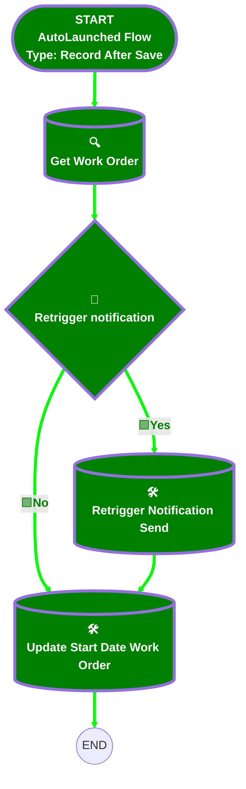

<b>🟩# [Service Appointment][After-Save][Record-Triggered] Add Start Date and Retrigger Notification Send</b>

## 🟩Flow Diagram

```mermaid
%% If you read this, your Markdown visualizer does not handle MermaidJS syntax.
%% - If you are in VsCode, install extension `Markdown Preview Mermaid Support` at https://marketplace.visualstudio.com/items?itemName=bierner.markdown-mermaid
%% - If you are using sfdx-hardis, try to define env variable `MERMAID_MODES=cli,docker` ,then run again the command to regenerate markdown with SVG images.
%% - If you are within mkdocs-material, define mermaid plugin in `mkdocs.yml` as described in https://squidfunk.github.io/mkdocs-material/extensions/mermaid/
%% - At last resort, you can copy-paste this MermaidJS code in https://mermaid.live/ to see the Flow Diagram

flowchart TB
START(["<b>START<br/><b>AutoLaunched Flow</b></br>Type: <b> Record After Save</b></b>"]):::startClassAdded
click START "#general-information" "768213183"

Retrigger_notification{"<b>🔀 <em></em><br/>Retrigger notification</b>"}:::decisionsAdded
click Retrigger_notification "#retrigger_notification" "1832325384"

Get_Work_Order[("<b>🔍 <em></em><br/>Get Work Order</b>")]:::recordLookupsAdded
click Get_Work_Order "#get_work_order" "2302282943"

Retrigger_Notification_Send[("<b>🛠️ <em></em><br/>Retrigger Notification Send</b>")]:::recordUpdatesAdded
click Retrigger_Notification_Send "#retrigger_notification_send" "1470581268"

Update_Start_Date_Work_Order[("<b>🛠️ <em></em><br/>Update Start Date Work Order</b>")]:::recordUpdatesAdded
click Update_Start_Date_Work_Order "#update_start_date_work_order" "3788572289"

Retrigger_notification ==> |"🟩<b>Yes</b>"| Retrigger_Notification_Send
Retrigger_notification ==> |"🟩<b>No</b>"| Update_Start_Date_Work_Order
Get_Work_Order ==> Retrigger_notification
Retrigger_Notification_Send ==> Update_Start_Date_Work_Order
Update_Start_Date_Work_Order ==> END_Update_Start_Date_Work_Order
START ==>  Get_Work_Order
END_Update_Start_Date_Work_Order(( END )):::endClassAdded


classDef actionCalls fill:#D4E4FC,color:black,text-decoration:none,max-height:100px
classDef assignments fill:#FBEED7,color:black,text-decoration:none,max-height:100px
classDef collectionProcessors fill:#F0E3FA,color:black,text-decoration:none,max-height:100px
classDef customErrors fill:#FFE9E9,color:black,text-decoration:none,max-height:100px
classDef decisions fill:#FDEAF6,color:black,text-decoration:none,max-height:100px
classDef loops fill:#FDEAF6,color:black,text-decoration:none,max-height:100px
classDef recordCreates fill:#FFF8C9,color:black,text-decoration:none,max-height:100px
classDef recordDeletes fill:#FFF8C9,color:black,text-decoration:none,max-height:100px
classDef recordLookups fill:#EDEAFF,color:black,text-decoration:none,max-height:100px
classDef recordUpdates fill:#FFF8C9,color:black,text-decoration:none,max-height:100px
classDef screens fill:#DFF6FF,color:black,text-decoration:none,max-height:100px
classDef subflows fill:#D4E4FC,color:black,text-decoration:none,max-height:100px
classDef startClass fill:#D9F2E6,color:black,text-decoration:none,max-height:100px
classDef endClass fill:#F9BABA,color:black,text-decoration:none,max-height:100px


classDef actionCallsAdded fill:green,color:white,stroke-width:4px,text-decoration:none,max-height:100px
classDef assignmentsAdded fill:green,color:white,stroke-width:4px,text-decoration:none,max-height:100px
classDef collectionProcessorsAdded fill:green,color:white,stroke-width:4px,text-decoration:none,max-height:100px
classDef customErrorsAdded fill:green,color:white,stroke-width:4px,text-decoration:none,max-height:100px
classDef decisionsAdded fill:green,color:white,stroke-width:4px,text-decoration:none,max-height:100px
classDef loopsAdded fill:green,color:white,stroke-width:4px,text-decoration:none,max-height:100px
classDef recordCreatesAdded fill:green,color:white,stroke-width:4px,text-decoration:none,max-height:100px
classDef recordDeletesAdded fill:green,color:white,stroke-width:4px,text-decoration:none,max-height:100px
classDef recordLookupsAdded fill:green,color:white,stroke-width:4px,text-decoration:none,max-height:100px
classDef recordUpdatesAdded fill:green,color:white,stroke-width:4px,text-decoration:none,max-height:100px
classDef screensAdded fill:green,color:white,stroke-width:4px,text-decoration:none,max-height:100px
classDef subflowsAdded fill:green,color:white,stroke-width:4px,text-decoration:none,max-height:100px
classDef startClassAdded fill:green,color:white,stroke-width:4px,text-decoration:none,max-height:100px

classDef actionCallsRemoved fill:red,color:white,stroke-width:4px,text-decoration:none,max-height:100px
classDef assignmentsRemoved fill:red,color:white,stroke-width:4px,text-decoration:none,max-height:100px
classDef collectionProcessorsRemoved fill:red,color:white,stroke-width:4px,text-decoration:none,max-height:100px
classDef customErrorsRemoved fill:red,color:white,stroke-width:4px,text-decoration:none,max-height:100px
classDef decisionsRemoved fill:red,color:white,stroke-width:4px,text-decoration:none,max-height:100px
classDef loopsRemoved fill:red,color:white,stroke-width:4px,text-decoration:none,max-height:100px
classDef recordCreatesRemoved fill:red,color:white,stroke-width:4px,text-decoration:none,max-height:100px
classDef recordDeletesRemoved fill:red,color:white,stroke-width:4px,text-decoration:none,max-height:100px
classDef recordLookupsRemoved fill:red,color:white,stroke-width:4px,text-decoration:none,max-height:100px
classDef recordUpdatesRemoved fill:red,color:white,stroke-width:4px,text-decoration:none,max-height:100px
classDef screensRemoved fill:red,color:white,stroke-width:4px,text-decoration:none,max-height:100px
classDef subflowsRemoved fill:red,color:white,stroke-width:4px,text-decoration:none,max-height:100px
classDef startClassRemoved fill:red,color:white,stroke-width:4px,text-decoration:none,max-height:100px

classDef actionCallsChanged fill:orange,color:white,stroke-width:4px,text-decoration:none,max-height:100px
classDef assignmentsChanged fill:orange,color:white,stroke-width:4px,text-decoration:none,max-height:100px
classDef collectionProcessorsChanged fill:orange,color:white,stroke-width:4px,text-decoration:none,max-height:100px
classDef customErrorsChanged fill:orange,color:white,stroke-width:4px,text-decoration:none,max-height:100px
classDef decisionsChanged fill:orange,color:white,stroke-width:4px,text-decoration:none,max-height:100px
classDef loopsChanged fill:orange,color:white,stroke-width:4px,text-decoration:none,max-height:100px
classDef recordCreatesChanged fill:orange,color:white,stroke-width:4px,text-decoration:none,max-height:100px
classDef recordDeletesChanged fill:orange,color:white,stroke-width:4px,text-decoration:none,max-height:100px
classDef recordLookupsChanged fill:orange,color:white,stroke-width:4px,text-decoration:none,max-height:100px
classDef recordUpdatesChanged fill:orange,color:white,stroke-width:4px,text-decoration:none,max-height:100px
classDef screensChanged fill:orange,color:white,stroke-width:4px,text-decoration:none,max-height:100px
classDef subflowsChanged fill:orange,color:white,stroke-width:4px,text-decoration:none,max-height:100px
classDef startClassChanged fill:orange,color:white,stroke-width:4px,text-decoration:none,max-height:100px
  
linkStyle 0,1,2,3,4,5 stroke:#00ff00,stroke-width:4px,color:green;
```

<b>🟩<!-- Flow description --></b>

## 🟩General Information

|🟩<b><!-- --></b>|<b><!-- --></b>|
|:---|:---|
|🟩<b>Object</b>|<b>ServiceAppointment</b>|
|🟩<b>Process Type</b>|<b> Auto Launched Flow</b>|
|🟩<b>Trigger Type</b>|<b> Record After Save</b>|
|🟩<b>Record Trigger Type</b>|<b> Create</b>|
|🟩<b>Label</b>|<b>[Service Appointment][After-Save][Record-Triggered] Add Start Date and Retrigger Notification Send</b>|
|🟩<b>Status</b>|<b>⚠️ Draft</b>|
|🟩<b>Filter Formula</b>|<b>(TEXT({!$Record.Status} )= "Scheduled" && ISCHANGED({!$Record.SchedStartTime}))</b>|
|🟩<b>Description</b>|<b>Flow that sents field to retrigger the notification to the customer if a SA is rescheduled</b>|
|🟩<b>Environments</b>|<b>Default</b>|
|🟩<b>Interview Label</b>|<b>[Service Appointment][After-Save][Record-Triggered] Add Start Date and Retrigger Notification Send {!$Flow.CurrentDateTime}</b>|
|🟩<b> Builder Type (PM)</b>|<b>LightningFlowBuilder</b>|
|🟩<b> Canvas Mode (PM)</b>|<b>AUTO_LAYOUT_CANVAS</b>|
|🟩<b> Origin Builder Type (PM)</b>|<b>LightningFlowBuilder</b>|
|🟩<b>Connector</b>|<b>[Get_Work_Order](#get_work_order)</b>|
|🟩<b>Next Node</b>|<b>[Get_Work_Order](#get_work_order)</b>|

## 🟩Formulas

|🟩<b>Name</b>|<b>Data Type</b>|<b>Expression</b>|<b>Description</b>|
|:-- |:--:|:-- |:--  |
|🟩<b>ScheduledDate</b>|<b>Date</b>|<b>DATEVALUE({!$Record.SchedStartTime})</b>|<b><!-- --></b>|

## 🟩Flow Nodes Details

### 🟩Retrigger_notification

|🟩<b><!-- --></b>|<b><!-- --></b>|
|:---|:---|
|🟩<b>Type</b>|<b>Decision</b>|
|🟩<b>Label</b>|<b>Retrigger notification</b>|
|🟩<b>Default Connector</b>|<b>[Update_Start_Date_Work_Order](#update_start_date_work_order)</b>|
|🟩<b>Default Connector Label</b>|<b>No</b>|

#### 🟩Rule Yes (Yes)

|🟩<b><!-- --></b>|<b><!-- --></b>|
|:---|:---|
|🟩<b>Connector</b>|<b>[Retrigger_Notification_Send](#retrigger_notification_send)</b>|
|🟩<b>Condition Logic</b>|<b>and</b>|

|🟩<b>Condition Id</b>|<b>Left Value Reference</b>|<b>Operator</b>|<b>Right Value</b>|
|:-- |:-- |:--:|:--: |
|🟩<b>1</b>|<b>$Record.Scheduling_Notification_Send__c</b>|<b> Equal To</b>|<b>Send</b>|

### 🟩Get_Work_Order

|🟩<b><!-- --></b>|<b><!-- --></b>|
|:---|:---|
|🟩<b>Type</b>|<b>Record Lookup</b>|
|🟩<b>Object</b>|<b>WorkOrder</b>|
|🟩<b>Label</b>|<b>Get Work Order</b>|
|🟩<b>Assign Null Values If No Records Found</b>|<b>⬜</b>|
|🟩<b>Get First Record Only</b>|<b>✅</b>|
|🟩<b>Store Output Automatically</b>|<b>✅</b>|
|🟩<b>Connector</b>|<b>[Retrigger_notification](#retrigger_notification)</b>|

#### 🟩Filters (logic: **and**)

|🟩<b>Filter Id</b>|<b>Field</b>|<b>Operator</b>|<b>Value</b>|
|:-- |:-- |:--:|:--: |
|🟩<b>1</b>|<b>Id</b>|<b> Equal To</b>|<b>$Record.ParentRecordId</b>|

### 🟩Retrigger_Notification_Send

|🟩<b><!-- --></b>|<b><!-- --></b>|
|:---|:---|
|🟩<b>Type</b>|<b>Record Update</b>|
|🟩<b>Label</b>|<b>Retrigger Notification Send</b>|
|🟩<b>Input Reference</b>|<b>$Record</b>|
|🟩<b>Connector</b>|<b>[Update_Start_Date_Work_Order](#update_start_date_work_order)</b>|

#### 🟩Input Assignments

|🟩<b>Field</b>|<b>Value</b>|
|:-- |:--: |
|🟩<b>Scheduling_Notification_Send__c</b>|<b>Resend Needed</b>|

### 🟩Update_Start_Date_Work_Order

|🟩<b><!-- --></b>|<b><!-- --></b>|
|:---|:---|
|🟩<b>Type</b>|<b>Record Update</b>|
|🟩<b>Object</b>|<b>WorkOrder</b>|
|🟩<b>Label</b>|<b>Update Start Date Work Order</b>|

#### 🟩Filters (logic: **and**)

|🟩<b>Filter Id</b>|<b>Field</b>|<b>Operator</b>|<b>Value</b>|
|:-- |:-- |:--:|:--: |
|🟩<b>1</b>|<b>Id</b>|<b> Equal To</b>|<b>$Record.ParentRecordId</b>|

#### 🟩Input Assignments

|🟩<b>Field</b>|<b>Value</b>|
|:-- |:--: |
|🟩<b>Scheduled_Date__c</b>|<b>ScheduledDate</b>|

___

<b>🟩_Documentation generated from branch monitoring_krinkelsgreencare__upeodev_sandbox by [sfdx-hardis](https://sfdx-hardis.cloudity.com), featuring [salesforce-flow-visualiser](https://github.com/toddhalfpenny/salesforce-flow-visualiser)_</b>