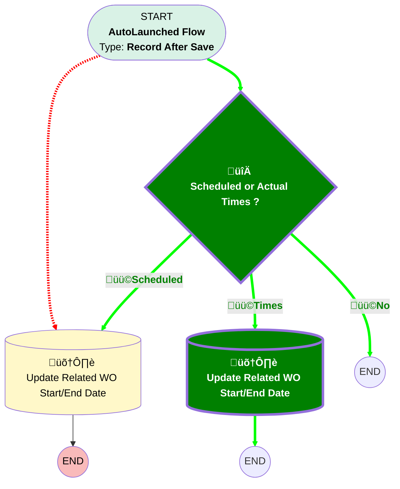

# [Service Appointment][After-Save][Record-Triggered] Populate Start/End Date on WO

## Flow Diagram

```mermaid
%% If you read this, your Markdown visualizer does not handle MermaidJS syntax.
%% - If you are in VsCode, install extension `Markdown Preview Mermaid Support` at https://marketplace.visualstudio.com/items?itemName=bierner.markdown-mermaid
%% - If you are using sfdx-hardis, try to define env variable `MERMAID_MODES=cli,docker` ,then run again the command to regenerate markdown with SVG images.
%% - If you are within mkdocs-material, define mermaid plugin in `mkdocs.yml` as described in https://squidfunk.github.io/mkdocs-material/extensions/mermaid/
%% - At last resort, you can copy-paste this MermaidJS code in https://mermaid.live/ to see the Flow Diagram

flowchart TB
START(["START<br/><b>AutoLaunched Flow</b></br>Type: <b> Record After Save</b>"]):::startClass
click START "#general-information" "4162120768"


Scheduled_or_Actual_Times{"<b>🔀 <em></em><br/>Scheduled or Actual Times ?</b>"}:::decisionsAdded
click Scheduled_or_Actual_Times "#scheduled_or_actual_times" "3184362973"

Copy_1_of_Update_Related_WO_Start_End_Date[("<b>🛠️ <em></em><br/>Update Related WO Start/End Date</b>")]:::recordUpdatesAdded
click Copy_1_of_Update_Related_WO_Start_End_Date "#copy_1_of_update_related_wo_start_end_date" "2686451256"


Update_Related_WO_Start_End_Date[("🛠️ <em></em><br/>Update Related WO Start/End Date")]:::recordUpdates
click Update_Related_WO_Start_End_Date "#update_related_wo_start_end_date" "3211896205"


Scheduled_or_Actual_Times ==> |"üü©<b>Scheduled</b>"| Update_Related_WO_Start_End_Date
Scheduled_or_Actual_Times ==> |"üü©<b>Times</b>"| Copy_1_of_Update_Related_WO_Start_End_Date
Scheduled_or_Actual_Times ==> |"üü©<b>No</b>"| END_Scheduled_or_Actual_Times
Copy_1_of_Update_Related_WO_Start_End_Date ==> END_Copy_1_of_Update_Related_WO_Start_End_Date

Update_Related_WO_Start_End_Date --> END_Update_Related_WO_Start_End_Date

START -.->  Update_Related_WO_Start_End_Date

START ==>  Scheduled_or_Actual_Times
END_Scheduled_or_Actual_Times(( END )):::endClassAdded
END_Copy_1_of_Update_Related_WO_Start_End_Date(( END )):::endClassAdded

END_Update_Related_WO_Start_End_Date(( END )):::endClass


classDef actionCalls fill:#D4E4FC,color:black,text-decoration:none,max-height:100px
classDef assignments fill:#FBEED7,color:black,text-decoration:none,max-height:100px
classDef collectionProcessors fill:#F0E3FA,color:black,text-decoration:none,max-height:100px
classDef customErrors fill:#FFE9E9,color:black,text-decoration:none,max-height:100px
classDef decisions fill:#FDEAF6,color:black,text-decoration:none,max-height:100px
classDef loops fill:#FDEAF6,color:black,text-decoration:none,max-height:100px
classDef recordCreates fill:#FFF8C9,color:black,text-decoration:none,max-height:100px
classDef recordDeletes fill:#FFF8C9,color:black,text-decoration:none,max-height:100px
classDef recordLookups fill:#EDEAFF,color:black,text-decoration:none,max-height:100px
classDef recordUpdates fill:#FFF8C9,color:black,text-decoration:none,max-height:100px
classDef screens fill:#DFF6FF,color:black,text-decoration:none,max-height:100px
classDef subflows fill:#D4E4FC,color:black,text-decoration:none,max-height:100px
classDef startClass fill:#D9F2E6,color:black,text-decoration:none,max-height:100px
classDef endClass fill:#F9BABA,color:black,text-decoration:none,max-height:100px


classDef actionCallsAdded fill:green,color:white,stroke-width:4px,text-decoration:none,max-height:100px
classDef assignmentsAdded fill:green,color:white,stroke-width:4px,text-decoration:none,max-height:100px
classDef collectionProcessorsAdded fill:green,color:white,stroke-width:4px,text-decoration:none,max-height:100px
classDef customErrorsAdded fill:green,color:white,stroke-width:4px,text-decoration:none,max-height:100px
classDef decisionsAdded fill:green,color:white,stroke-width:4px,text-decoration:none,max-height:100px
classDef loopsAdded fill:green,color:white,stroke-width:4px,text-decoration:none,max-height:100px
classDef recordCreatesAdded fill:green,color:white,stroke-width:4px,text-decoration:none,max-height:100px
classDef recordDeletesAdded fill:green,color:white,stroke-width:4px,text-decoration:none,max-height:100px
classDef recordLookupsAdded fill:green,color:white,stroke-width:4px,text-decoration:none,max-height:100px
classDef recordUpdatesAdded fill:green,color:white,stroke-width:4px,text-decoration:none,max-height:100px
classDef screensAdded fill:green,color:white,stroke-width:4px,text-decoration:none,max-height:100px
classDef subflowsAdded fill:green,color:white,stroke-width:4px,text-decoration:none,max-height:100px
classDef startClassAdded fill:green,color:white,stroke-width:4px,text-decoration:none,max-height:100px

classDef actionCallsRemoved fill:red,color:white,stroke-width:4px,text-decoration:none,max-height:100px
classDef assignmentsRemoved fill:red,color:white,stroke-width:4px,text-decoration:none,max-height:100px
classDef collectionProcessorsRemoved fill:red,color:white,stroke-width:4px,text-decoration:none,max-height:100px
classDef customErrorsRemoved fill:red,color:white,stroke-width:4px,text-decoration:none,max-height:100px
classDef decisionsRemoved fill:red,color:white,stroke-width:4px,text-decoration:none,max-height:100px
classDef loopsRemoved fill:red,color:white,stroke-width:4px,text-decoration:none,max-height:100px
classDef recordCreatesRemoved fill:red,color:white,stroke-width:4px,text-decoration:none,max-height:100px
classDef recordDeletesRemoved fill:red,color:white,stroke-width:4px,text-decoration:none,max-height:100px
classDef recordLookupsRemoved fill:red,color:white,stroke-width:4px,text-decoration:none,max-height:100px
classDef recordUpdatesRemoved fill:red,color:white,stroke-width:4px,text-decoration:none,max-height:100px
classDef screensRemoved fill:red,color:white,stroke-width:4px,text-decoration:none,max-height:100px
classDef subflowsRemoved fill:red,color:white,stroke-width:4px,text-decoration:none,max-height:100px
classDef startClassRemoved fill:red,color:white,stroke-width:4px,text-decoration:none,max-height:100px

classDef actionCallsChanged fill:orange,color:white,stroke-width:4px,text-decoration:none,max-height:100px
classDef assignmentsChanged fill:orange,color:white,stroke-width:4px,text-decoration:none,max-height:100px
classDef collectionProcessorsChanged fill:orange,color:white,stroke-width:4px,text-decoration:none,max-height:100px
classDef customErrorsChanged fill:orange,color:white,stroke-width:4px,text-decoration:none,max-height:100px
classDef decisionsChanged fill:orange,color:white,stroke-width:4px,text-decoration:none,max-height:100px
classDef loopsChanged fill:orange,color:white,stroke-width:4px,text-decoration:none,max-height:100px
classDef recordCreatesChanged fill:orange,color:white,stroke-width:4px,text-decoration:none,max-height:100px
classDef recordDeletesChanged fill:orange,color:white,stroke-width:4px,text-decoration:none,max-height:100px
classDef recordLookupsChanged fill:orange,color:white,stroke-width:4px,text-decoration:none,max-height:100px
classDef recordUpdatesChanged fill:orange,color:white,stroke-width:4px,text-decoration:none,max-height:100px
classDef screensChanged fill:orange,color:white,stroke-width:4px,text-decoration:none,max-height:100px
classDef subflowsChanged fill:orange,color:white,stroke-width:4px,text-decoration:none,max-height:100px
classDef startClassChanged fill:orange,color:white,stroke-width:4px,text-decoration:none,max-height:100px
  
linkStyle 0,1,2,3,6 stroke:#00ff00,stroke-width:4px,color:green;
linkStyle 5 stroke:#ff0000,stroke-width:4px,color:red;
```

## General Information

|<!-- -->|<!-- -->|
|:---|:---|
|üü•<i>Connector</i>|<i>[Update_Related_WO_Start_End_Date](#update_related_wo_start_end_date)</i>|
|üü•<i>Next Node</i>|<i>[Update_Related_WO_Start_End_Date](#update_related_wo_start_end_date)</i>|
|üü©<b>Connector</b>|<b>[Scheduled_or_Actual_Times](#scheduled_or_actual_times)</b>|
|üü©<b>Next Node</b>|<b>[Scheduled_or_Actual_Times](#scheduled_or_actual_times)</b>|

#### üü•Filters (logic: **(1 AND 2 ) OR (3 AND 4)**)

#### üü©Filters (logic: **(1 AND 2 ) OR (3 AND 4) OR (5 AND 6) OR (7 AND 8)**)

|Filter Id|Field|Operator|Value|
|:-- |:-- |:--:|:--: |
|üü©<b>5</b>|<b>ActualStartTime</b>|<b> Is Changed</b>|<b>‚úÖ</b>|
|üü©<b>6</b>|<b>ActualStartTime</b>|<b> Is Null</b>|<b><!-- --></b>|
|üü©<b>7</b>|<b>ActualEndTime</b>|<b> Is Changed</b>|<b>‚úÖ</b>|
|üü©<b>8</b>|<b>ActualEndTime</b>|<b> Is Null</b>|<b><!-- --></b>|

## Flow Nodes Details

### üü©Scheduled_or_Actual_Times

|<!-- -->|<!-- -->|
|:---|:---|
|üü©<b>Type</b>|<b>Decision</b>|
|üü©<b>Label</b>|<b>Scheduled or Actual Times ?</b>|
|üü©<b>Default Connector Label</b>|<b>No</b>|

#### üü©Rule Scheduled (Scheduled)

|<!-- -->|<!-- -->|
|:---|:---|
|üü©<b>Connector</b>|<b>[Update_Related_WO_Start_End_Date](#update_related_wo_start_end_date)</b>|
|üü©<b>Condition Logic</b>|<b>(1 AND 2) OR (3 AND 4)</b>|

|Condition Id|Left Value Reference|Operator|Right Value|
|:-- |:-- |:--:|:--: |
|üü©<b>1</b>|<b>$Record.SchedStartTime</b>|<b> Is Changed</b>|<b>‚úÖ</b>|
|🟩<b>2</b>|<b>$Record.SchedStartTime</b>|<b> Is Null</b>|<b>⬜</b>|
|üü©<b>3</b>|<b>$Record.SchedEndTime</b>|<b> Is Changed</b>|<b>‚úÖ</b>|
|🟩<b>4</b>|<b>$Record.SchedEndTime</b>|<b> Is Null</b>|<b>⬜</b>|

#### üü©Rule Times (Times)

|<!-- -->|<!-- -->|
|:---|:---|
|üü©<b>Connector</b>|<b>[Copy_1_of_Update_Related_WO_Start_End_Date](#copy_1_of_update_related_wo_start_end_date)</b>|
|üü©<b>Condition Logic</b>|<b>and</b>|

|Condition Id|Left Value Reference|Operator|Right Value|
|:-- |:-- |:--:|:--: |
|üü©<b>1</b>|<b>$Record.ActualStartTime</b>|<b> Is Changed</b>|<b>‚úÖ</b>|
|🟩<b>2</b>|<b>$Record.ActualStartTime</b>|<b> Is Null</b>|<b>⬜</b>|
|üü©<b>3</b>|<b>$Record.ActualEndTime</b>|<b> Is Changed</b>|<b>‚úÖ</b>|
|🟩<b>4</b>|<b>$Record.ActualEndTime</b>|<b> Is Null</b>|<b>⬜</b>|

### üü©Copy_1_of_Update_Related_WO_Start_End_Date

|<!-- -->|<!-- -->|
|:---|:---|
|üü©<b>Type</b>|<b>Record Update</b>|
|üü©<b>Object</b>|<b>WorkOrder</b>|
|üü©<b>Label</b>|<b>Update Related WO Start/End Date</b>|

#### üü©Filters (logic: **and**)

|Filter Id|Field|Operator|Value|
|:-- |:-- |:--:|:--: |
|üü©<b>1</b>|<b>Id</b>|<b> Equal To</b>|<b>$Record.ParentRecordId</b>|

#### üü©Input Assignments

|Field|Value|
|:-- |:--: |
|üü©<b>EndDate</b>|<b>$Record.ActualEndTime</b>|
|üü©<b>StartDate</b>|<b>$Record.ActualStartTime</b>|

___

_Documentation generated from branch monitoring_krinkelsgreencare__upeodev_sandbox by [sfdx-hardis](https://sfdx-hardis.cloudity.com), featuring [salesforce-flow-visualiser](https://github.com/toddhalfpenny/salesforce-flow-visualiser)_