# [Service Appointment][After-Save][Record-Triggered] Populate Start/End Date on WO

## Flow Diagram

```mermaid
%% If you read this, your Markdown visualizer does not handle MermaidJS syntax.
%% - If you are in VsCode, install extension `Markdown Preview Mermaid Support` at https://marketplace.visualstudio.com/items?itemName=bierner.markdown-mermaid
%% - If you are using sfdx-hardis, try to define env variable `MERMAID_MODES=cli,docker` ,then run again the command to regenerate markdown with SVG images.
%% - If you are within mkdocs-material, define mermaid plugin in `mkdocs.yml` as described in https://squidfunk.github.io/mkdocs-material/extensions/mermaid/
%% - At last resort, you can copy-paste this MermaidJS code in https://mermaid.live/ to see the Flow Diagram

flowchart TB
START(["<b>START<br/><b>AutoLaunched Flow</b></br>Type: <b> Record After Save</b></b>"]):::startClassChanged


click START "#general-information" "4162120768"


Scheduled_or_Actual_Times{"<b>🔀 <em></em><br/>Scheduled or Actual Times ?</b>"}:::decisionsChanged


click Scheduled_or_Actual_Times "#scheduled_or_actual_times" "4243140208"



Update_Earliest_Start_Permitted_and_Due_date[("<b>🛠️ <em></em><br/>Update Earliest Start Permitted and Due date</b>")]:::recordUpdatesAdded
click Update_Earliest_Start_Permitted_and_Due_date "#update_earliest_start_permitted_and_due_date" "2051787742"


Update_with_Actual_Times[("🛠️ <em></em><br/>Update with Actual Times")]:::recordUpdates
click Update_with_Actual_Times "#update_with_actual_times" "2552944206"

Update_with_Scheduled_Times[("<b>🛠️ <em></em><br/>Update with Scheduled Times</b>")]:::recordUpdatesChanged


click Update_with_Scheduled_Times "#update_with_scheduled_times" "1114663059"


Scheduled_or_Actual_Times --> |"Scheduled"| Update_with_Scheduled_Times
Scheduled_or_Actual_Times --> |"Times"| Update_with_Actual_Times
Scheduled_or_Actual_Times --> |"No"| END_Scheduled_or_Actual_Times

Update_Earliest_Start_Permitted_and_Due_date ==> END_Update_Earliest_Start_Permitted_and_Due_date

Update_with_Actual_Times --> END_Update_with_Actual_Times

Update_with_Scheduled_Times -.-> END_Update_with_Scheduled_Times

Update_with_Scheduled_Times ==> Update_Earliest_Start_Permitted_and_Due_date

START -->  Scheduled_or_Actual_Times
END_Scheduled_or_Actual_Times(( END )):::endClass

END_Update_Earliest_Start_Permitted_and_Due_date(( END )):::endClassAdded

END_Update_with_Actual_Times(( END )):::endClass

END_Update_with_Scheduled_Times(( END )):::endClassRemoved



classDef actionCalls fill:#D4E4FC,color:black,text-decoration:none,max-height:100px
classDef assignments fill:#FBEED7,color:black,text-decoration:none,max-height:100px
classDef collectionProcessors fill:#F0E3FA,color:black,text-decoration:none,max-height:100px
classDef customErrors fill:#FFE9E9,color:black,text-decoration:none,max-height:100px
classDef decisions fill:#FDEAF6,color:black,text-decoration:none,max-height:100px
classDef loops fill:#FDEAF6,color:black,text-decoration:none,max-height:100px
classDef recordCreates fill:#FFF8C9,color:black,text-decoration:none,max-height:100px
classDef recordDeletes fill:#FFF8C9,color:black,text-decoration:none,max-height:100px
classDef recordLookups fill:#EDEAFF,color:black,text-decoration:none,max-height:100px
classDef recordUpdates fill:#FFF8C9,color:black,text-decoration:none,max-height:100px
classDef screens fill:#DFF6FF,color:black,text-decoration:none,max-height:100px
classDef subflows fill:#D4E4FC,color:black,text-decoration:none,max-height:100px
classDef startClass fill:#D9F2E6,color:black,text-decoration:none,max-height:100px
classDef endClass fill:#F9BABA,color:black,text-decoration:none,max-height:100px



classDef actionCallsAdded fill:green,color:white,stroke-width:4px,text-decoration:none,max-height:100px
classDef assignmentsAdded fill:green,color:white,stroke-width:4px,text-decoration:none,max-height:100px
classDef collectionProcessorsAdded fill:green,color:white,stroke-width:4px,text-decoration:none,max-height:100px
classDef customErrorsAdded fill:green,color:white,stroke-width:4px,text-decoration:none,max-height:100px
classDef decisionsAdded fill:green,color:white,stroke-width:4px,text-decoration:none,max-height:100px
classDef loopsAdded fill:green,color:white,stroke-width:4px,text-decoration:none,max-height:100px
classDef recordCreatesAdded fill:green,color:white,stroke-width:4px,text-decoration:none,max-height:100px
classDef recordDeletesAdded fill:green,color:white,stroke-width:4px,text-decoration:none,max-height:100px
classDef recordLookupsAdded fill:green,color:white,stroke-width:4px,text-decoration:none,max-height:100px
classDef recordUpdatesAdded fill:green,color:white,stroke-width:4px,text-decoration:none,max-height:100px
classDef screensAdded fill:green,color:white,stroke-width:4px,text-decoration:none,max-height:100px
classDef subflowsAdded fill:green,color:white,stroke-width:4px,text-decoration:none,max-height:100px
classDef startClassAdded fill:green,color:white,stroke-width:4px,text-decoration:none,max-height:100px

classDef actionCallsRemoved fill:red,color:white,stroke-width:4px,text-decoration:none,max-height:100px
classDef assignmentsRemoved fill:red,color:white,stroke-width:4px,text-decoration:none,max-height:100px
classDef collectionProcessorsRemoved fill:red,color:white,stroke-width:4px,text-decoration:none,max-height:100px
classDef customErrorsRemoved fill:red,color:white,stroke-width:4px,text-decoration:none,max-height:100px
classDef decisionsRemoved fill:red,color:white,stroke-width:4px,text-decoration:none,max-height:100px
classDef loopsRemoved fill:red,color:white,stroke-width:4px,text-decoration:none,max-height:100px
classDef recordCreatesRemoved fill:red,color:white,stroke-width:4px,text-decoration:none,max-height:100px
classDef recordDeletesRemoved fill:red,color:white,stroke-width:4px,text-decoration:none,max-height:100px
classDef recordLookupsRemoved fill:red,color:white,stroke-width:4px,text-decoration:none,max-height:100px
classDef recordUpdatesRemoved fill:red,color:white,stroke-width:4px,text-decoration:none,max-height:100px
classDef screensRemoved fill:red,color:white,stroke-width:4px,text-decoration:none,max-height:100px
classDef subflowsRemoved fill:red,color:white,stroke-width:4px,text-decoration:none,max-height:100px
classDef startClassRemoved fill:red,color:white,stroke-width:4px,text-decoration:none,max-height:100px

classDef actionCallsChanged fill:orange,color:white,stroke-width:4px,text-decoration:none,max-height:100px
classDef assignmentsChanged fill:orange,color:white,stroke-width:4px,text-decoration:none,max-height:100px
classDef collectionProcessorsChanged fill:orange,color:white,stroke-width:4px,text-decoration:none,max-height:100px
classDef customErrorsChanged fill:orange,color:white,stroke-width:4px,text-decoration:none,max-height:100px
classDef decisionsChanged fill:orange,color:white,stroke-width:4px,text-decoration:none,max-height:100px
classDef loopsChanged fill:orange,color:white,stroke-width:4px,text-decoration:none,max-height:100px
classDef recordCreatesChanged fill:orange,color:white,stroke-width:4px,text-decoration:none,max-height:100px
classDef recordDeletesChanged fill:orange,color:white,stroke-width:4px,text-decoration:none,max-height:100px
classDef recordLookupsChanged fill:orange,color:white,stroke-width:4px,text-decoration:none,max-height:100px
classDef recordUpdatesChanged fill:orange,color:white,stroke-width:4px,text-decoration:none,max-height:100px
classDef screensChanged fill:orange,color:white,stroke-width:4px,text-decoration:none,max-height:100px
classDef subflowsChanged fill:orange,color:white,stroke-width:4px,text-decoration:none,max-height:100px
classDef startClassChanged fill:orange,color:white,stroke-width:4px,text-decoration:none,max-height:100px
  
linkStyle 3,6 stroke:#00ff00,stroke-width:4px,color:green;
linkStyle 5 stroke:#ff0000,stroke-width:4px,color:red;
```

<!-- Flow description -->

## General Information

|<!-- -->|<!-- -->|
|:---|:---|
|Object|ServiceAppointment|
|Process Type| Auto Launched Flow|
|Trigger Type| Record After Save|
|Record Trigger Type| Create And Update|
|Label|[Service Appointment][After-Save][Record-Triggered] Populate Start/End Date on WO|
|🟥<i>Status</i>|<i>Obsolete</i>|
|🟩<b>Status</b>|<b>Active</b>|
|Description|This flow updates the start date and end date fields on WO, based on the values of scheduled start and scheduled end fields on the related SA.|
|Environments|Default|
|Interview Label|[Service Appointment][After-Save][Record-Triggered] Populate Start/End Date on WO {!$Flow.CurrentDateTime}|
| Builder Type (PM)|LightningFlowBuilder|
| Canvas Mode (PM)|AUTO_LAYOUT_CANVAS|
| Origin Builder Type (PM)|LightningFlowBuilder|
|Connector|[Scheduled_or_Actual_Times](#scheduled_or_actual_times)|
|Next Node|[Scheduled_or_Actual_Times](#scheduled_or_actual_times)|

## Flow Nodes Details

### Scheduled_or_Actual_Times

|<!-- -->|<!-- -->|
|:---|:---|
|Type|Decision|
|Label|Scheduled or Actual Times ?|
|Default Connector Label|No|

#### Rule Times (Times)

|<!-- -->|<!-- -->|
|:---|:---|
|Connector|[Update_with_Actual_Times](#update_with_actual_times)|
|🟥<i>Condition Logic</i>|<i>and</i>|
|🟩<b>Condition Logic</b>|<b>(1 AND 2) OR (3 AND 4)</b>|

|Condition Id|Left Value Reference|Operator|Right Value|
|:-- |:-- |:--:|:--: |
|1|$Record.ActualStartTime| Is Changed|✅|
|2|$Record.ActualStartTime| Is Null|⬜|
|3|$Record.ActualEndTime| Is Changed|✅|
|4|$Record.ActualEndTime| Is Null|⬜|

### 🟩Update_Earliest_Start_Permitted_and_Due_date

|🟩<b><!-- --></b>|<b><!-- --></b>|
|:---|:---|
|🟩<b>Type</b>|<b>Record Update</b>|
|🟩<b>Label</b>|<b>Update Earliest Start Permitted and Due date</b>|
|🟩<b>Input Reference</b>|<b>$Record</b>|

#### 🟩Input Assignments

|🟩<b>Field</b>|<b>Value</b>|
|:-- |:--: |
|🟩<b>DueDate</b>|<b>NewDueDate</b>|
|🟩<b>EarliestStartTime</b>|<b>NewEarliestStartPermitted</b>|

### Update_with_Scheduled_Times

|<!-- -->|<!-- -->|
|:---|:---|
|Type|Record Update|
|Object|WorkOrder|
|Label|Update with Scheduled Times|
|🟩<b>Connector</b>|<b>[Update_Earliest_Start_Permitted_and_Due_date](#update_earliest_start_permitted_and_due_date)</b>|

___

_Documentation generated from branch monitoring_krinkelsgreencare__upeodev_sandbox by [sfdx-hardis](https://sfdx-hardis.cloudity.com), featuring [salesforce-flow-visualiser](https://github.com/toddhalfpenny/salesforce-flow-visualiser)_