# [Service Appointment][After-Save][Record-Triggered] Set Service Territory

## Flow Diagram

```mermaid
%% If you read this, your Markdown visualizer does not handle MermaidJS syntax.
%% - If you are in VsCode, install extension `Markdown Preview Mermaid Support` at https://marketplace.visualstudio.com/items?itemName=bierner.markdown-mermaid
%% - If you are using sfdx-hardis, try to define env variable `MERMAID_MODES=cli,docker` ,then run again the command to regenerate markdown with SVG images.
%% - If you are within mkdocs-material, define mermaid plugin in `mkdocs.yml` as described in https://squidfunk.github.io/mkdocs-material/extensions/mermaid/
%% - At last resort, you can copy-paste this MermaidJS code in https://mermaid.live/ to see the Flow Diagram

flowchart TB
START(["START<br/><b>AutoLaunched Flow</b></br>Type: <b> Record After Save</b>"]):::startClass
click START "#general-information" "2662881212"

Check_Parent_Record_Type{"🔀 <em></em><br/>Check Parent Record Type"}:::decisions
click Check_Parent_Record_Type "#check_parent_record_type" "804550009"

Get_Work_Order[("🔍 <em></em><br/>Get Work Order")]:::recordLookups
click Get_Work_Order "#get_work_order" "2708898728"

Set_Territory[("🛠️ <em></em><br/>Set Territory")]:::recordUpdates
click Set_Territory "#set_territory" "2723760997"

Check_Parent_Record_Type --> |"Work Order"| Get_Work_Order
Check_Parent_Record_Type --> |"Default Outcome"| END_Check_Parent_Record_Type
Get_Work_Order --> Set_Territory
Set_Territory --> END_Set_Territory
START -->  Check_Parent_Record_Type
END_Check_Parent_Record_Type(( END )):::endClass
END_Set_Territory(( END )):::endClass


classDef actionCalls fill:#D4E4FC,color:black,text-decoration:none,max-height:100px
classDef assignments fill:#FBEED7,color:black,text-decoration:none,max-height:100px
classDef collectionProcessors fill:#F0E3FA,color:black,text-decoration:none,max-height:100px
classDef customErrors fill:#FFE9E9,color:black,text-decoration:none,max-height:100px
classDef decisions fill:#FDEAF6,color:black,text-decoration:none,max-height:100px
classDef loops fill:#FDEAF6,color:black,text-decoration:none,max-height:100px
classDef recordCreates fill:#FFF8C9,color:black,text-decoration:none,max-height:100px
classDef recordDeletes fill:#FFF8C9,color:black,text-decoration:none,max-height:100px
classDef recordLookups fill:#EDEAFF,color:black,text-decoration:none,max-height:100px
classDef recordUpdates fill:#FFF8C9,color:black,text-decoration:none,max-height:100px
classDef screens fill:#DFF6FF,color:black,text-decoration:none,max-height:100px
classDef subflows fill:#D4E4FC,color:black,text-decoration:none,max-height:100px
classDef startClass fill:#D9F2E6,color:black,text-decoration:none,max-height:100px
classDef endClass fill:#F9BABA,color:black,text-decoration:none,max-height:100px


```

<!-- Flow description -->

## General Information

|<!-- -->|<!-- -->|
|:---|:---|
|Object|ServiceAppointment|
|Process Type| Auto Launched Flow|
|Trigger Type| Record After Save|
|Record Trigger Type| Create|
|Label|[Service Appointment][After-Save][Record-Triggered] Set Service Territory|
|Status|Obsolete|
|Environments|Default|
|Interview Label|[Service Appointment][After-Save][Record-Triggered] Set Service Territory {!$Flow.CurrentDateTime}|
| Builder Type (PM)|LightningFlowBuilder|
| Canvas Mode (PM)|AUTO_LAYOUT_CANVAS|
| Origin Builder Type (PM)|LightningFlowBuilder|
|Connector|[Check_Parent_Record_Type](#check_parent_record_type)|
|Next Node|[Check_Parent_Record_Type](#check_parent_record_type)|

#### Filters (logic: **and**)

|Filter Id|Field|Operator|Value|
|:-- |:-- |:--:|:--: |
|1|ServiceTerritoryId| Is Null|<!-- -->|

## Flow Nodes Details

### Check_Parent_Record_Type

|<!-- -->|<!-- -->|
|:---|:---|
|Type|Decision|
|Label|Check Parent Record Type|
|Default Connector Label|Default Outcome|

#### Rule Work_Order (Work Order)

|<!-- -->|<!-- -->|
|:---|:---|
|Connector|[Get_Work_Order](#get_work_order)|
|Condition Logic|and|

|Condition Id|Left Value Reference|Operator|Right Value|
|:-- |:-- |:--:|:--: |
|1|$Record.ParentRecordType| Equal To|WorkOrder|

### Get_Work_Order

|<!-- -->|<!-- -->|
|:---|:---|
|Type|Record Lookup|
|Object|WorkOrder|
|Label|Get Work Order|
|Assign Null Values If No Records Found|⬜|
|Get First Record Only|✅|
|Store Output Automatically|✅|
|Connector|[Set_Territory](#set_territory)|

#### Filters (logic: **and**)

|Filter Id|Field|Operator|Value|
|:-- |:-- |:--:|:--: |
|1|Id| Equal To|$Record.ParentRecordId|

### Set_Territory

|<!-- -->|<!-- -->|
|:---|:---|
|Type|Record Update|
|Label|Set Territory|
|Input Reference|$Record|

#### Input Assignments

|Field|Value|
|:-- |:--: |
|ServiceTerritoryId|Get_Work_Order.Asset.Service_Territory__c|

___

_Documentation generated from branch monitoring_krinkelsgreencare__upeodev_sandbox by [sfdx-hardis](https://sfdx-hardis.cloudity.com), featuring [salesforce-flow-visualiser](https://github.com/toddhalfpenny/salesforce-flow-visualiser)_