# [Service Appointment][Mobile flow][Screen flow] Send Service Report to Customer

## Flow Diagram

```mermaid
%% If you read this, your Markdown visualizer does not handle MermaidJS syntax.
%% - If you are in VsCode, install extension `Markdown Preview Mermaid Support` at https://marketplace.visualstudio.com/items?itemName=bierner.markdown-mermaid
%% - If you are using sfdx-hardis, try to define env variable `MERMAID_MODES=cli,docker` ,then run again the command to regenerate markdown with SVG images.
%% - If you are within mkdocs-material, define mermaid plugin in `mkdocs.yml` as described in https://squidfunk.github.io/mkdocs-material/extensions/mermaid/
%% - At last resort, you can copy-paste this MermaidJS code in https://mermaid.live/ to see the Flow Diagram

flowchart TB
START(["START"]):::startClass
click START "#general-information" "1873975147"

Send_Service_Report("⚙️ <em></em><br/>Send Service Report"):::actionCalls
click Send_Service_Report "#send_service_report" "2333225311"

Add_Content_Document_Link_In_Collection[\"🟰 <em></em><br/>Add Content Document Link In Collection"/]:::assignments
click Add_Content_Document_Link_In_Collection "#add_content_document_link_in_collection" "524559539"

Update_Email_Value[\"🟰 <em></em><br/>Update Email Value"/]:::assignments
click Update_Email_Value "#update_email_value" "3909883962"

Service_Report_Found{"🔀 <em></em><br/>Service Report Found ?"}:::decisions
click Service_Report_Found "#service_report_found" "773295066"

Get_Contact_Information[("🔍 <em></em><br/>Get Contact Information")]:::recordLookups
click Get_Contact_Information "#get_contact_information" "1104197006"

Get_Content_Document[("🔍 <em></em><br/>Get Content Document")]:::recordLookups
click Get_Content_Document "#get_content_document" "3713394822"

Get_Content_Document_Link[("🔍 <em></em><br/>Get Content Document Link")]:::recordLookups
click Get_Content_Document_Link "#get_content_document_link" "2995010475"

Get_Service_Appointment_Information[("🔍 <em></em><br/>Get Service Appointment Information")]:::recordLookups
click Get_Service_Appointment_Information "#get_service_appointment_information" "2601838773"

No_Service_Report_Found(["💻 <em></em><br/>No Service Report Found"]):::screens
click No_Service_Report_Found "#no_service_report_found" "3190209556"

Send_Service_Report_Information(["💻 <em></em><br/>Send Service Report Information"]):::screens
click Send_Service_Report_Information "#send_service_report_information" "1366204481"

Send_Service_Report --> END_Send_Service_Report
Add_Content_Document_Link_In_Collection --> Get_Content_Document
Update_Email_Value --> Send_Service_Report
Service_Report_Found --> |"No"| No_Service_Report_Found
Service_Report_Found --> |"Yes"| Send_Service_Report_Information
Get_Contact_Information --> Get_Content_Document_Link
Get_Content_Document --> Service_Report_Found
Get_Content_Document_Link --> Add_Content_Document_Link_In_Collection
Get_Service_Appointment_Information --> Get_Contact_Information
No_Service_Report_Found --> END_No_Service_Report_Found
Send_Service_Report_Information --> Update_Email_Value
START -->  Get_Service_Appointment_Information
END_Send_Service_Report(( END )):::endClass
END_No_Service_Report_Found(( END )):::endClass


classDef actionCalls fill:#D4E4FC,color:black,text-decoration:none,max-height:100px
classDef assignments fill:#FBEED7,color:black,text-decoration:none,max-height:100px
classDef collectionProcessors fill:#F0E3FA,color:black,text-decoration:none,max-height:100px
classDef customErrors fill:#FFE9E9,color:black,text-decoration:none,max-height:100px
classDef decisions fill:#FDEAF6,color:black,text-decoration:none,max-height:100px
classDef loops fill:#FDEAF6,color:black,text-decoration:none,max-height:100px
classDef recordCreates fill:#FFF8C9,color:black,text-decoration:none,max-height:100px
classDef recordDeletes fill:#FFF8C9,color:black,text-decoration:none,max-height:100px
classDef recordLookups fill:#EDEAFF,color:black,text-decoration:none,max-height:100px
classDef recordUpdates fill:#FFF8C9,color:black,text-decoration:none,max-height:100px
classDef screens fill:#DFF6FF,color:black,text-decoration:none,max-height:100px
classDef subflows fill:#D4E4FC,color:black,text-decoration:none,max-height:100px
classDef startClass fill:#D9F2E6,color:black,text-decoration:none,max-height:100px
classDef endClass fill:#F9BABA,color:black,text-decoration:none,max-height:100px


```

<!-- Flow description -->

## General Information

|<!-- -->|<!-- -->|
|:---|:---|
|Process Type| Field Service Mobile|
|Label|[Service Appointment][Mobile flow][Screen flow] Send Service Report to Customer|
|Status|Active|
|Description|This flow allows the operator to send the service report to the customer.|
|Environments|Default|
|Interview Label|[Service Appointment][Mobile][] {!$Flow.CurrentDateTime}|
| Builder Type (PM)|LightningFlowBuilder|
| Canvas Mode (PM)|AUTO_LAYOUT_CANVAS|
| Origin Builder Type (PM)|LightningFlowBuilder|
|Connector|[Get_Service_Appointment_Information](#get_service_appointment_information)|
|Next Node|[Get_Service_Appointment_Information](#get_service_appointment_information)|

## Variables

|Name|Data Type|Is Collection|Is Input|Is Output|Object Type|Description|
|:-- |:--:|:--:|:--:|:--:|:--:|:--  |
|ContactEmail|String|⬜|✅|⬜|<!-- -->|<!-- -->|
|ContactId|String|⬜|✅|⬜|<!-- -->|<!-- -->|
|ContactName|String|⬜|✅|⬜|<!-- -->|<!-- -->|
|ContentDocumentLinkCollection|SObject|✅|✅|⬜|ContentDocumentLink|<!-- -->|
|ContentDocumentLinkRecord|SObject|⬜|✅|⬜|ContentDocumentLink|<!-- -->|
|EmailTemplateRecord|SObject|⬜|✅|⬜|EmailTemplate|<!-- -->|
|Id|String|⬜|✅|⬜|<!-- -->|<!-- -->|
|ServiceAppointmentContactId|String|⬜|✅|⬜|<!-- -->|<!-- -->|
|ServiceAppointmentId|String|⬜|✅|⬜|<!-- -->|<!-- -->|
|ServiceReportRecord|SObject|⬜|✅|⬜|ServiceReport|<!-- -->|
|ServiceReportTitle|String|⬜|✅|⬜|<!-- -->|<!-- -->|
|WorkOrderId|String|⬜|✅|⬜|<!-- -->|<!-- -->|

## Text Templates

|Name|Text|Description|
|:-- |:-- |:--  |
|EmailBody|Hi, Please find attached the service report for the work order carried out today. Please do not hesitate to contact us for any additional information.  Krinkels Team|<!-- -->|
|EmailSubject|Krinkels - Service Report|<!-- -->|

## Flow Nodes Details

### Send_Service_Report

|<!-- -->|<!-- -->|
|:---|:---|
|Type|Action Call|
|Label|Send Service Report|
|Action Type|Apex|
|Action Name|SendBetterEmail|
|Flow Transaction Model|CurrentTransaction|
|Name Segment|SendBetterEmail|
|Offset|0|
|Version Segment|1|
|Cb_save As Activity (input)|CB_TRUE|
|Cb_save As Task (input)|CB_FALSE|
|Cb_set Treat Target Object As Recipient (input)|CB_TRUE|
|Content Document Attachments (input)|ContentDocumentLinkCollection|
| H T M Lbody (input)|EmailBody|
|Record Id (input)|<!-- -->|
|Save As Activity (input)|✅|
|Save As Task (input)|⬜|
|Sender Display Name (input)|<!-- -->|
| Send T Othis One Email Address (input)|ContactEmail|
|Set Treat Target Object As Recipient (input)|✅|
|Subject (input)|EmailSubject|
|Template I D (input)|<!-- -->|
|Template Name (input)|<!-- -->|
|Template Target Object Id (input)|ContactId|

### Add_Content_Document_Link_In_Collection

|<!-- -->|<!-- -->|
|:---|:---|
|Type|Assignment|
|Label|Add Content Document Link In Collection|
|Connector|[Get_Content_Document](#get_content_document)|

#### Assignments

|Assign To Reference|Operator|Value|
|:-- |:--:|:--: |
|ContentDocumentLinkCollection| Add|ContentDocumentLinkRecord|

### Update_Email_Value

|<!-- -->|<!-- -->|
|:---|:---|
|Type|Assignment|
|Label|Update Email Value|
|Connector|[Send_Service_Report](#send_service_report)|

#### Assignments

|Assign To Reference|Operator|Value|
|:-- |:--:|:--: |
|ContactEmail| Assign|Email|

### Service_Report_Found

|<!-- -->|<!-- -->|
|:---|:---|
|Type|Decision|
|Label|Service Report Found ?|
|Default Connector|[Send_Service_Report_Information](#send_service_report_information)|
|Default Connector Label|Yes|

#### Rule No (No)

|<!-- -->|<!-- -->|
|:---|:---|
|Connector|[No_Service_Report_Found](#no_service_report_found)|
|Condition Logic|and|

|Condition Id|Left Value Reference|Operator|Right Value|
|:-- |:-- |:--:|:--: |
|1|ContentDocumentLinkCollection| Is Empty|✅|

### Get_Contact_Information

|<!-- -->|<!-- -->|
|:---|:---|
|Type|Record Lookup|
|Object|Contact|
|Label|Get Contact Information|
|Assign Null Values If No Records Found|⬜|
|Output Assignments|- assignToReference: ContactEmail &nbsp;&nbsp;field: Email - assignToReference: ContactId &nbsp;&nbsp;field: Id - assignToReference: ContactName &nbsp;&nbsp;field: Name |
|Connector|[Get_Content_Document_Link](#get_content_document_link)|

#### Filters (logic: **and**)

|Filter Id|Field|Operator|Value|
|:-- |:-- |:--:|:--: |
|1|Id| Equal To|ServiceAppointmentContactId|

### Get_Content_Document

|<!-- -->|<!-- -->|
|:---|:---|
|Type|Record Lookup|
|Object|ContentDocument|
|Label|Get Content Document|
|Assign Null Values If No Records Found|⬜|
|Output Assignments|assignToReference: ServiceReportTitle field: Title |
|Connector|[Service_Report_Found](#service_report_found)|

#### Filters (logic: **and**)

|Filter Id|Field|Operator|Value|
|:-- |:-- |:--:|:--: |
|1|Id| Equal To|ContentDocumentLinkRecord.ContentDocumentId|

### Get_Content_Document_Link

|<!-- -->|<!-- -->|
|:---|:---|
|Type|Record Lookup|
|Object|ContentDocumentLink|
|Label|Get Content Document Link|
|Assign Null Values If No Records Found|⬜|
|Output Reference|ContentDocumentLinkRecord|
|Queried Fields|- Id - ContentDocumentId |
|Connector|[Add_Content_Document_Link_In_Collection](#add_content_document_link_in_collection)|

#### Filters (logic: **and**)

|Filter Id|Field|Operator|Value|
|:-- |:-- |:--:|:--: |
|1|LinkedEntityId| Equal To|ServiceAppointmentId|

### Get_Service_Appointment_Information

|<!-- -->|<!-- -->|
|:---|:---|
|Type|Record Lookup|
|Object|ServiceAppointment|
|Label|Get Service Appointment Information|
|Assign Null Values If No Records Found|⬜|
|Output Assignments|- assignToReference: ServiceAppointmentContactId &nbsp;&nbsp;field: ContactId - assignToReference: ServiceAppointmentId &nbsp;&nbsp;field: Id - assignToReference: WorkOrderId &nbsp;&nbsp;field: ParentRecordId |
|Connector|[Get_Contact_Information](#get_contact_information)|

#### Filters (logic: **and**)

|Filter Id|Field|Operator|Value|
|:-- |:-- |:--:|:--: |
|1|ParentRecordId| Equal To|Id|

### No_Service_Report_Found

|<!-- -->|<!-- -->|
|:---|:---|
|Type|Screen|
|Label|No Service Report Found|
|Allow Back|⬜|
|Allow Finish|✅|
|Allow Pause|⬜|
|Show Footer|✅|
|Show Header|⬜|

#### NoServiceReportFoundMessage

|<!-- -->|<!-- -->|
|:---|:---|
|Field Text|
No service report found. 

Verify that a service report is present for this work order and try again. If the problem persists, contact your Salesforce administrator.
|
|Field Type| Display Text|

### Send_Service_Report_Information

|<!-- -->|<!-- -->|
|:---|:---|
|Type|Screen|
|Label|Send Service Report Information|
|Allow Back|⬜|
|Allow Finish|✅|
|Allow Pause|⬜|
|Show Footer|✅|
|Show Header|⬜|
|Connector|[Update_Email_Value](#update_email_value)|

#### DocumentTitle

|<!-- -->|<!-- -->|
|:---|:---|
|Field Text|
Send service report: <strong>{!ServiceReportTitle}</strong>
|
|Field Type| Display Text|

#### Email

|<!-- -->|<!-- -->|
|:---|:---|
|Data Type|String|
|Default Value|ContactEmail|
|Field Text|Email|
|Field Type| Input Field|
|Inputs On Next Nav To Assoc Scrn| Use Stored Values|
|Is Required|⬜|

___

_Documentation generated from branch monitoring_krinkelsgreencare__upeodev_sandbox by [sfdx-hardis](https://sfdx-hardis.cloudity.com), featuring [salesforce-flow-visualiser](https://github.com/toddhalfpenny/salesforce-flow-visualiser)_