# [Service Appointment] [Scheduled] Customer Notification

## Flow Diagram

```mermaid
%% If you read this, your Markdown visualizer does not handle MermaidJS syntax.
%% - If you are in VsCode, install extension `Markdown Preview Mermaid Support` at https://marketplace.visualstudio.com/items?itemName=bierner.markdown-mermaid
%% - If you are using sfdx-hardis, try to define env variable `MERMAID_MODES=cli,docker` ,then run again the command to regenerate markdown with SVG images.
%% - If you are within mkdocs-material, define mermaid plugin in `mkdocs.yml` as described in https://squidfunk.github.io/mkdocs-material/extensions/mermaid/
%% - At last resort, you can copy-paste this MermaidJS code in https://mermaid.live/ to see the Flow Diagram

flowchart TB
START(["START<br/><b>AutoLaunched Flow</b></br>Type: <b> Scheduled</b>"]):::startClass
click START "#general-information" "1355914100"

Scheduled_WO_Send_NL_mail("📧 <em></em><br/>Scheduled WO - Send NL mail"):::actionCalls
click Scheduled_WO_Send_NL_mail "#scheduled_wo_send_nl_mail" "2046197523"

Assign_email_Recipients[\"🟰 <em></em><br/>Assign email Recipients"/]:::assignments
click Assign_email_Recipients "#assign_email_recipients" "1274736035"

Contact_Language{"🔀 <em></em><br/>Contact Language"}:::decisions
click Contact_Language "#contact_language" "2899482565"

First_send_or_Resend{"🔀 <em></em><br/>First send or Resend"}:::decisions
click First_send_or_Resend "#first_send_or_resend" "569918384"

First_send_or_Resend_FR{"🔀 <em></em><br/>First send or Resend FR"}:::decisions
click First_send_or_Resend_FR "#first_send_or_resend_fr" "4260263493"

Work_Order_Contact_with_Email_Found{"🔀 <em></em><br/>Work Order & Contact with Email Found?"}:::decisions
click Work_Order_Contact_with_Email_Found "#work_order_contact_with_email_found" "531392331"

Get_Contact_Relation[("🔍 <em></em><br/>Get Contact Relation")]:::recordLookups
click Get_Contact_Relation "#get_contact_relation" "1391895149"

Get_Contacts[("🔍 <em></em><br/>Get Contacts")]:::recordLookups
click Get_Contacts "#get_contacts" "1203573232"

Get_Email_Template_NL_Planned_WO[("🔍 <em></em><br/>Get Email Template NL Planned WO")]:::recordLookups
click Get_Email_Template_NL_Planned_WO "#get_email_template_nl_planned_wo" "1854158430"

Get_work_Order[("🔍 <em></em><br/>Get Work Order")]:::recordLookups
click Get_work_Order "#get_work_order" "2731704253"

Update_SA[("🛠️ <em></em><br/>Update SA")]:::recordUpdates
click Update_SA "#update_sa" "310899656"

Scheduled_WO_Send_NL_mail --> Update_SA
Assign_email_Recipients --> Work_Order_Contact_with_Email_Found
Contact_Language --> |"FR"| First_send_or_Resend_FR
Contact_Language --> |"NL"| First_send_or_Resend
First_send_or_Resend --> |"First Send"| Get_Email_Template_NL_Planned_WO
First_send_or_Resend --> |"Resend"| Update_SA
First_send_or_Resend_FR --> |"Copy 1 of First Send"| Update_SA
First_send_or_Resend_FR --> |"Resend"| Update_SA
Work_Order_Contact_with_Email_Found --> |"Yes"| Contact_Language
Work_Order_Contact_with_Email_Found --> |"No"| END_Work_Order_Contact_with_Email_Found
Get_Contact_Relation --> Get_Contacts
Get_Contacts --> Assign_email_Recipients
Get_Email_Template_NL_Planned_WO --> Scheduled_WO_Send_NL_mail
Get_work_Order --> Get_Contact_Relation
Update_SA --> END_Update_SA
START -->  Get_work_Order
END_Work_Order_Contact_with_Email_Found(( END )):::endClass
END_Update_SA(( END )):::endClass


classDef actionCalls fill:#D4E4FC,color:black,text-decoration:none,max-height:100px
classDef assignments fill:#FBEED7,color:black,text-decoration:none,max-height:100px
classDef collectionProcessors fill:#F0E3FA,color:black,text-decoration:none,max-height:100px
classDef customErrors fill:#FFE9E9,color:black,text-decoration:none,max-height:100px
classDef decisions fill:#FDEAF6,color:black,text-decoration:none,max-height:100px
classDef loops fill:#FDEAF6,color:black,text-decoration:none,max-height:100px
classDef recordCreates fill:#FFF8C9,color:black,text-decoration:none,max-height:100px
classDef recordDeletes fill:#FFF8C9,color:black,text-decoration:none,max-height:100px
classDef recordLookups fill:#EDEAFF,color:black,text-decoration:none,max-height:100px
classDef recordUpdates fill:#FFF8C9,color:black,text-decoration:none,max-height:100px
classDef screens fill:#DFF6FF,color:black,text-decoration:none,max-height:100px
classDef subflows fill:#D4E4FC,color:black,text-decoration:none,max-height:100px
classDef startClass fill:#D9F2E6,color:black,text-decoration:none,max-height:100px
classDef endClass fill:#F9BABA,color:black,text-decoration:none,max-height:100px


```

## General Information

|<!-- -->|<!-- -->|
|:---|:---|
|Object|ServiceAppointment|
|Process Type| Auto Launched Flow|
|Trigger Type| Scheduled|
|Label|[Service Appointment] [Scheduled] Customer Notification|
|Status|⚠️ Draft|
|Description|Flow that sends notification to customer when a service appointment is (re)scheduled|
|Environments|Default|
|Interview Label|[Service Appointment] [Scheduled] Customer Notification {!$Flow.CurrentDateTime}|
| Builder Type (PM)|LightningFlowBuilder|
| Canvas Mode (PM)|AUTO_LAYOUT_CANVAS|
| Origin Builder Type (PM)|LightningFlowBuilder|
|Connector|[Get_work_Order](#get_work_order)|
|Next Node|[Get_work_Order](#get_work_order)|

#### Schedules

|Frequency|Start Date|Start Time|
|:-- |:--:|:--: |
|Daily|Nov 18, 2024|01:00|

#### Filters (logic: **(1 AND 2 AND 3 AND 4) OR (1 AND 3 AND 5)**)

|Filter Id|Field|Operator|Value|
|:-- |:-- |:--:|:--: |
|1|Status| Equal To|Scheduled|
|2|Notification_Day__c| Equal To|✅|
|3|Intervention_Registration__c| Equal To|Yes|
|4|Scheduling_Notification_Send__c| Equal To|Not Send|
|5|Scheduling_Notification_Send__c| Equal To|Resend Needed|

## Variables

|Name|Data Type|Is Collection|Is Input|Is Output|Object Type|
|:-- |:--:|:--:|:--:|:--:|:--: |
|Recipients|String|✅|⬜|⬜|<!-- -->|

## Flow Nodes Details

### Scheduled_WO_Send_NL_mail

|<!-- -->|<!-- -->|
|:---|:---|
|Type|Action Call|
|Label|Scheduled WO - Send NL mail|
|Action Type|Email Simple|
|Action Name|emailSimple|
|Flow Transaction Model|CurrentTransaction|
|Name Segment|emailSimple|
|Offset|0|
|Version Segment|1|
|Email Addresses Array (input)|Recipients|
|Sender Type (input)|<!-- -->|
|Sender Address (input)|<!-- -->|
|Recipient Id (input)|{!Get_Contacts.Id}|
|Log Email On Send (input)|✅|
|Email Template Id (input)|Get_Email_Template_NL_Planned_WO.Id|
|Connector|[Update_SA](#update_sa)|

### Assign_email_Recipients

|<!-- -->|<!-- -->|
|:---|:---|
|Type|Assignment|
|Label|Assign email Recipients|
|Connector|[Work_Order_Contact_with_Email_Found](#work_order_contact_with_email_found)|

#### Assignments

|Assign To Reference|Operator|Value|
|:-- |:--:|:--: |
|Recipients| Add|Get_Contacts.Email|

### Contact_Language

|<!-- -->|<!-- -->|
|:---|:---|
|Type|Decision|
|Label|Contact Language|
|Default Connector|[First_send_or_Resend](#first_send_or_resend)|
|Default Connector Label|NL|

#### Rule FR (FR)

|<!-- -->|<!-- -->|
|:---|:---|
|Connector|[First_send_or_Resend_FR](#first_send_or_resend_fr)|
|Condition Logic|and|

|Condition Id|Left Value Reference|Operator|Right Value|
|:-- |:-- |:--:|:--: |
|1|Get_Contacts.Language__c| Equal To|French|

### First_send_or_Resend

|<!-- -->|<!-- -->|
|:---|:---|
|Type|Decision|
|Label|First send or Resend|
|Default Connector|[Update_SA](#update_sa)|
|Default Connector Label|Resend|

#### Rule First_Send (First Send)

|<!-- -->|<!-- -->|
|:---|:---|
|Connector|[Get_Email_Template_NL_Planned_WO](#get_email_template_nl_planned_wo)|
|Condition Logic|and|

|Condition Id|Left Value Reference|Operator|Right Value|
|:-- |:-- |:--:|:--: |
|1|$Record.Scheduling_Notification_Send__c| Equal To|Not Send|

### First_send_or_Resend_FR

|<!-- -->|<!-- -->|
|:---|:---|
|Type|Decision|
|Label|First send or Resend FR|
|Default Connector|[Update_SA](#update_sa)|
|Default Connector Label|Resend|

#### Rule Copy_1_of_First_Send (Copy 1 of First Send)

|<!-- -->|<!-- -->|
|:---|:---|
|Connector|[Update_SA](#update_sa)|
|Condition Logic|and|

|Condition Id|Left Value Reference|Operator|Right Value|
|:-- |:-- |:--:|:--: |
|1|$Record.Scheduling_Notification_Send__c| Equal To|Not Send|

### Work_Order_Contact_with_Email_Found

|<!-- -->|<!-- -->|
|:---|:---|
|Type|Decision|
|Label|Work Order & Contact with Email Found?|
|Default Connector Label|No|

#### Rule Yes (Yes)

|<!-- -->|<!-- -->|
|:---|:---|
|Connector|[Contact_Language](#contact_language)|
|Condition Logic|and|

|Condition Id|Left Value Reference|Operator|Right Value|
|:-- |:-- |:--:|:--: |
|1|[Get_work_Order](#get_work_order)| Is Null|⬜|
|2|[Get_Contacts](#get_contacts)| Is Null|⬜|

### Get_Contact_Relation

|<!-- -->|<!-- -->|
|:---|:---|
|Type|Record Lookup|
|Object|AccountContactRelation|
|Label|Get Contact Relation|
|Assign Null Values If No Records Found|⬜|
|Get First Record Only|✅|
|Store Output Automatically|✅|
|Connector|[Get_Contacts](#get_contacts)|

#### Filters (logic: **and**)

|Filter Id|Field|Operator|Value|
|:-- |:-- |:--:|:--: |
|1|Intervention_Registration_Contact__c| Equal To|✅|
|2|AccountId| Equal To|Get_work_Order.AccountId|

### Get_Contacts

|<!-- -->|<!-- -->|
|:---|:---|
|Type|Record Lookup|
|Object|Contact|
|Label|Get Contacts|
|Assign Null Values If No Records Found|⬜|
|Get First Record Only|✅|
|Store Output Automatically|✅|
|Connector|[Assign_email_Recipients](#assign_email_recipients)|

#### Filters (logic: **and**)

|Filter Id|Field|Operator|Value|
|:-- |:-- |:--:|:--: |
|1|Id| Equal To|Get_Contact_Relation.ContactId|

### Get_Email_Template_NL_Planned_WO

|<!-- -->|<!-- -->|
|:---|:---|
|Type|Record Lookup|
|Object|EmailTemplate|
|Label|Get Email Template NL Planned WO|
|Assign Null Values If No Records Found|⬜|
|Get First Record Only|✅|
|Store Output Automatically|✅|
|Connector|[Scheduled_WO_Send_NL_mail](#scheduled_wo_send_nl_mail)|

#### Filters (logic: **and**)

|Filter Id|Field|Operator|Value|
|:-- |:-- |:--:|:--: |
|1|DeveloperName| Equal To|Notification_Planned_WO_NL_1731941363446|

### Get_work_Order

|<!-- -->|<!-- -->|
|:---|:---|
|Type|Record Lookup|
|Object|WorkOrder|
|Label|Get Work Order|
|Assign Null Values If No Records Found|⬜|
|Get First Record Only|✅|
|Store Output Automatically|✅|
|Connector|[Get_Contact_Relation](#get_contact_relation)|

#### Filters (logic: **and**)

|Filter Id|Field|Operator|Value|
|:-- |:-- |:--:|:--: |
|1|WorkTypeId| Equal To|$Record.ParentRecordId|

### Update_SA

|<!-- -->|<!-- -->|
|:---|:---|
|Type|Record Update|
|Label|Update SA|
|Input Reference|$Record|

#### Input Assignments

|Field|Value|
|:-- |:--: |
|Scheduling_Notification_Send__c|Send|

___

_Documentation generated from branch monitoring_krinkelsgreencare__upeodev_sandbox by [sfdx-hardis](https://sfdx-hardis.cloudity.com), featuring [salesforce-flow-visualiser](https://github.com/toddhalfpenny/salesforce-flow-visualiser)_