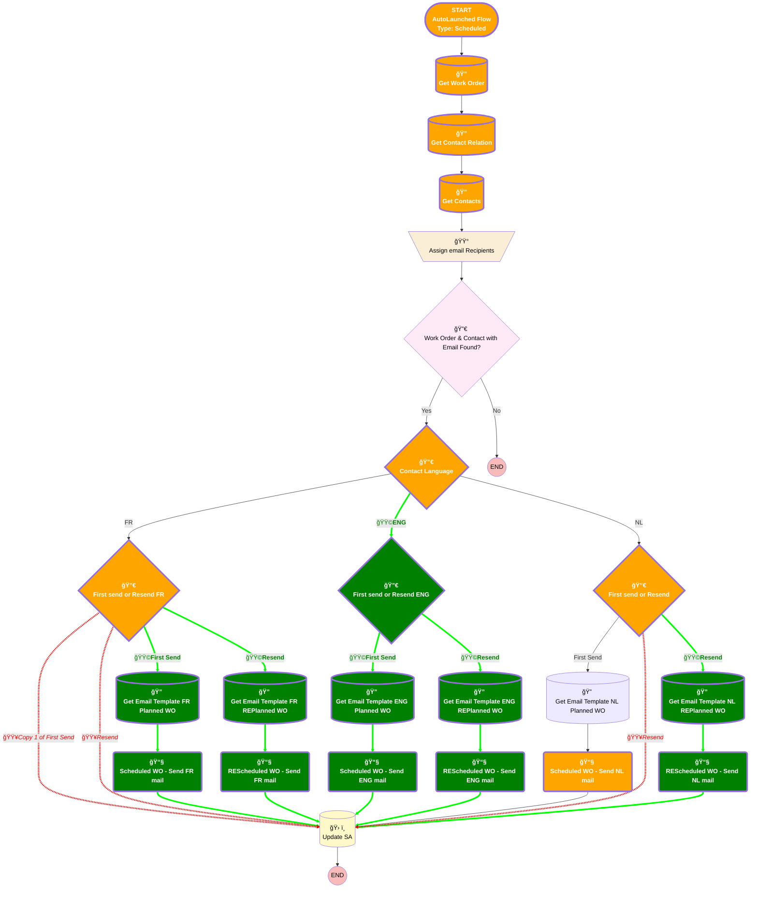

# [Service Appointment] [Scheduled] Customer Notification

## Flow Diagram

```mermaid
%% If you read this, your Markdown visualizer does not handle MermaidJS syntax.
%% - If you are in VsCode, install extension `Markdown Preview Mermaid Support` at https://marketplace.visualstudio.com/items?itemName=bierner.markdown-mermaid
%% - If you are using sfdx-hardis, try to define env variable `MERMAID_MODES=cli,docker` ,then run again the command to regenerate markdown with SVG images.
%% - If you are within mkdocs-material, define mermaid plugin in `mkdocs.yml` as described in https://squidfunk.github.io/mkdocs-material/extensions/mermaid/
%% - At last resort, you can copy-paste this MermaidJS code in https://mermaid.live/ to see the Flow Diagram

flowchart TB
START(["<b>START<br/><b>AutoLaunched Flow</b></br>Type: <b> Scheduled</b></b>"]):::startClassChanged


click START "#general-information" "1013521487"


REScheduled_WO_Send_ENG_mail("<b>📧 <em></em><br/>REScheduled WO - Send ENG mail</b>"):::actionCallsAdded
click REScheduled_WO_Send_ENG_mail "#rescheduled_wo_send_eng_mail" "2135964102"

REScheduled_WO_Send_FR_mail("<b>📧 <em></em><br/>REScheduled WO - Send FR mail</b>"):::actionCallsAdded
click REScheduled_WO_Send_FR_mail "#rescheduled_wo_send_fr_mail" "1298286610"

REScheduled_WO_Send_NL_mail("<b>📧 <em></em><br/>REScheduled WO - Send NL mail</b>"):::actionCallsAdded
click REScheduled_WO_Send_NL_mail "#rescheduled_wo_send_nl_mail" "3265677256"

Scheduled_WO_Send_ENG_mail("<b>📧 <em></em><br/>Scheduled WO - Send ENG mail</b>"):::actionCallsAdded
click Scheduled_WO_Send_ENG_mail "#scheduled_wo_send_eng_mail" "3544746943"

Scheduled_WO_Send_FR_mail("<b>📧 <em></em><br/>Scheduled WO - Send FR mail</b>"):::actionCallsAdded
click Scheduled_WO_Send_FR_mail "#scheduled_wo_send_fr_mail" "3198771491"


Scheduled_WO_Send_NL_mail("<b>📧 <em></em><br/>Scheduled WO - Send NL mail</b>"):::actionCallsChanged


click Scheduled_WO_Send_NL_mail "#scheduled_wo_send_nl_mail" "4240238333"


Assign_email_Recipients[\"🟰 <em></em><br/>Assign email Recipients"/]:::assignments
click Assign_email_Recipients "#assign_email_recipients" "1274736035"

Contact_Language{"<b>🔀 <em></em><br/>Contact Language</b>"}:::decisionsChanged


click Contact_Language "#contact_language" "3593304308"


First_send_or_Resend{"<b>🔀 <em></em><br/>First send or Resend</b>"}:::decisionsChanged


click First_send_or_Resend "#first_send_or_resend" "3045810356"


First_send_or_Resend_ENG{"<b>🔀 <em></em><br/>First send or Resend ENG</b>"}:::decisionsAdded
click First_send_or_Resend_ENG "#first_send_or_resend_eng" "1805869661"


First_send_or_Resend_FR{"<b>🔀 <em></em><br/>First send or Resend FR</b>"}:::decisionsChanged


click First_send_or_Resend_FR "#first_send_or_resend_fr" "3510732964"


Work_Order_Contact_with_Email_Found{"🔀 <em></em><br/>Work Order & Contact with Email Found?"}:::decisions
click Work_Order_Contact_with_Email_Found "#work_order_contact_with_email_found" "531392331"

Get_Contact_Relation[("<b>🔠<em></em><br/>Get Contact Relation</b>")]:::recordLookupsChanged


click Get_Contact_Relation "#get_contact_relation" "1669882529"


Get_Contacts[("<b>🔠<em></em><br/>Get Contacts</b>")]:::recordLookupsChanged


click Get_Contacts "#get_contacts" "1157115469"


Get_Email_Template_ENG_Planned_WO[("<b>🔠<em></em><br/>Get Email Template ENG Planned WO</b>")]:::recordLookupsAdded
click Get_Email_Template_ENG_Planned_WO "#get_email_template_eng_planned_wo" "2513349678"

Get_Email_Template_ENG_REPlanned_WO[("<b>🔠<em></em><br/>Get Email Template ENG REPlanned WO</b>")]:::recordLookupsAdded
click Get_Email_Template_ENG_REPlanned_WO "#get_email_template_eng_replanned_wo" "3189420705"

Get_Email_Template_FR_Planned_WO[("<b>🔠<em></em><br/>Get Email Template FR Planned WO</b>")]:::recordLookupsAdded
click Get_Email_Template_FR_Planned_WO "#get_email_template_fr_planned_wo" "2811645755"

Get_Email_Template_FR_REPlanned_WO[("<b>🔠<em></em><br/>Get Email Template FR REPlanned WO</b>")]:::recordLookupsAdded
click Get_Email_Template_FR_REPlanned_WO "#get_email_template_fr_replanned_wo" "1431363291"


Get_Email_Template_NL_Planned_WO[("🔠<em></em><br/>Get Email Template NL Planned WO")]:::recordLookups
click Get_Email_Template_NL_Planned_WO "#get_email_template_nl_planned_wo" "1854158430"


Get_Email_Template_NL_REPlanned_WO[("<b>🔠<em></em><br/>Get Email Template NL REPlanned WO</b>")]:::recordLookupsAdded
click Get_Email_Template_NL_REPlanned_WO "#get_email_template_nl_replanned_wo" "992326223"


Get_work_Order[("<b>🔠<em></em><br/>Get Work Order</b>")]:::recordLookupsChanged


click Get_work_Order "#get_work_order" "4186512945"


Update_SA[("ğŸ› ï¸ <em></em><br/>Update SA")]:::recordUpdates
click Update_SA "#update_sa" "310899656"


REScheduled_WO_Send_ENG_mail ==> Update_SA
REScheduled_WO_Send_FR_mail ==> Update_SA
REScheduled_WO_Send_NL_mail ==> Update_SA
Scheduled_WO_Send_ENG_mail ==> Update_SA
Scheduled_WO_Send_FR_mail ==> Update_SA

Scheduled_WO_Send_NL_mail --> Update_SA
Assign_email_Recipients --> Work_Order_Contact_with_Email_Found
Contact_Language --> |"FR"| First_send_or_Resend_FR

Contact_Language ==> |"🟩<b>ENG</b>"| First_send_or_Resend_ENG

Contact_Language --> |"NL"| First_send_or_Resend
First_send_or_Resend --> |"First Send"| Get_Email_Template_NL_Planned_WO

First_send_or_Resend -.-> |"🟥<i>Resend</i>"| Update_SA
First_send_or_Resend_FR -.-> |"🟥<i>Copy 1 of First Send</i>"| Update_SA
First_send_or_Resend_FR -.-> |"🟥<i>Resend</i>"| Update_SA

First_send_or_Resend ==> |"🟩<b>Resend</b>"| Get_Email_Template_NL_REPlanned_WO
First_send_or_Resend_ENG ==> |"🟩<b>First Send</b>"| Get_Email_Template_ENG_Planned_WO
First_send_or_Resend_ENG ==> |"🟩<b>Resend</b>"| Get_Email_Template_ENG_REPlanned_WO
First_send_or_Resend_FR ==> |"🟩<b>First Send</b>"| Get_Email_Template_FR_Planned_WO
First_send_or_Resend_FR ==> |"🟩<b>Resend</b>"| Get_Email_Template_FR_REPlanned_WO

Work_Order_Contact_with_Email_Found --> |"Yes"| Contact_Language
Work_Order_Contact_with_Email_Found --> |"No"| END_Work_Order_Contact_with_Email_Found
Get_Contact_Relation --> Get_Contacts
Get_Contacts --> Assign_email_Recipients

Get_Email_Template_ENG_Planned_WO ==> Scheduled_WO_Send_ENG_mail
Get_Email_Template_ENG_REPlanned_WO ==> REScheduled_WO_Send_ENG_mail
Get_Email_Template_FR_Planned_WO ==> Scheduled_WO_Send_FR_mail
Get_Email_Template_FR_REPlanned_WO ==> REScheduled_WO_Send_FR_mail

Get_Email_Template_NL_Planned_WO --> Scheduled_WO_Send_NL_mail

Get_Email_Template_NL_REPlanned_WO ==> REScheduled_WO_Send_NL_mail

Get_work_Order --> Get_Contact_Relation
Update_SA --> END_Update_SA
START -->  Get_work_Order
END_Work_Order_Contact_with_Email_Found(( END )):::endClass
END_Update_SA(( END )):::endClass


classDef actionCalls fill:#D4E4FC,color:black,text-decoration:none,max-height:100px
classDef assignments fill:#FBEED7,color:black,text-decoration:none,max-height:100px
classDef collectionProcessors fill:#F0E3FA,color:black,text-decoration:none,max-height:100px
classDef customErrors fill:#FFE9E9,color:black,text-decoration:none,max-height:100px
classDef decisions fill:#FDEAF6,color:black,text-decoration:none,max-height:100px
classDef loops fill:#FDEAF6,color:black,text-decoration:none,max-height:100px
classDef recordCreates fill:#FFF8C9,color:black,text-decoration:none,max-height:100px
classDef recordDeletes fill:#FFF8C9,color:black,text-decoration:none,max-height:100px
classDef recordLookups fill:#EDEAFF,color:black,text-decoration:none,max-height:100px
classDef recordUpdates fill:#FFF8C9,color:black,text-decoration:none,max-height:100px
classDef screens fill:#DFF6FF,color:black,text-decoration:none,max-height:100px
classDef subflows fill:#D4E4FC,color:black,text-decoration:none,max-height:100px
classDef startClass fill:#D9F2E6,color:black,text-decoration:none,max-height:100px
classDef endClass fill:#F9BABA,color:black,text-decoration:none,max-height:100px


classDef actionCallsAdded fill:green,color:white,stroke-width:4px,text-decoration:none,max-height:100px
classDef assignmentsAdded fill:green,color:white,stroke-width:4px,text-decoration:none,max-height:100px
classDef collectionProcessorsAdded fill:green,color:white,stroke-width:4px,text-decoration:none,max-height:100px
classDef customErrorsAdded fill:green,color:white,stroke-width:4px,text-decoration:none,max-height:100px
classDef decisionsAdded fill:green,color:white,stroke-width:4px,text-decoration:none,max-height:100px
classDef loopsAdded fill:green,color:white,stroke-width:4px,text-decoration:none,max-height:100px
classDef recordCreatesAdded fill:green,color:white,stroke-width:4px,text-decoration:none,max-height:100px
classDef recordDeletesAdded fill:green,color:white,stroke-width:4px,text-decoration:none,max-height:100px
classDef recordLookupsAdded fill:green,color:white,stroke-width:4px,text-decoration:none,max-height:100px
classDef recordUpdatesAdded fill:green,color:white,stroke-width:4px,text-decoration:none,max-height:100px
classDef screensAdded fill:green,color:white,stroke-width:4px,text-decoration:none,max-height:100px
classDef subflowsAdded fill:green,color:white,stroke-width:4px,text-decoration:none,max-height:100px
classDef startClassAdded fill:green,color:white,stroke-width:4px,text-decoration:none,max-height:100px

classDef actionCallsRemoved fill:red,color:white,stroke-width:4px,text-decoration:none,max-height:100px
classDef assignmentsRemoved fill:red,color:white,stroke-width:4px,text-decoration:none,max-height:100px
classDef collectionProcessorsRemoved fill:red,color:white,stroke-width:4px,text-decoration:none,max-height:100px
classDef customErrorsRemoved fill:red,color:white,stroke-width:4px,text-decoration:none,max-height:100px
classDef decisionsRemoved fill:red,color:white,stroke-width:4px,text-decoration:none,max-height:100px
classDef loopsRemoved fill:red,color:white,stroke-width:4px,text-decoration:none,max-height:100px
classDef recordCreatesRemoved fill:red,color:white,stroke-width:4px,text-decoration:none,max-height:100px
classDef recordDeletesRemoved fill:red,color:white,stroke-width:4px,text-decoration:none,max-height:100px
classDef recordLookupsRemoved fill:red,color:white,stroke-width:4px,text-decoration:none,max-height:100px
classDef recordUpdatesRemoved fill:red,color:white,stroke-width:4px,text-decoration:none,max-height:100px
classDef screensRemoved fill:red,color:white,stroke-width:4px,text-decoration:none,max-height:100px
classDef subflowsRemoved fill:red,color:white,stroke-width:4px,text-decoration:none,max-height:100px
classDef startClassRemoved fill:red,color:white,stroke-width:4px,text-decoration:none,max-height:100px

classDef actionCallsChanged fill:orange,color:white,stroke-width:4px,text-decoration:none,max-height:100px
classDef assignmentsChanged fill:orange,color:white,stroke-width:4px,text-decoration:none,max-height:100px
classDef collectionProcessorsChanged fill:orange,color:white,stroke-width:4px,text-decoration:none,max-height:100px
classDef customErrorsChanged fill:orange,color:white,stroke-width:4px,text-decoration:none,max-height:100px
classDef decisionsChanged fill:orange,color:white,stroke-width:4px,text-decoration:none,max-height:100px
classDef loopsChanged fill:orange,color:white,stroke-width:4px,text-decoration:none,max-height:100px
classDef recordCreatesChanged fill:orange,color:white,stroke-width:4px,text-decoration:none,max-height:100px
classDef recordDeletesChanged fill:orange,color:white,stroke-width:4px,text-decoration:none,max-height:100px
classDef recordLookupsChanged fill:orange,color:white,stroke-width:4px,text-decoration:none,max-height:100px
classDef recordUpdatesChanged fill:orange,color:white,stroke-width:4px,text-decoration:none,max-height:100px
classDef screensChanged fill:orange,color:white,stroke-width:4px,text-decoration:none,max-height:100px
classDef subflowsChanged fill:orange,color:white,stroke-width:4px,text-decoration:none,max-height:100px
classDef startClassChanged fill:orange,color:white,stroke-width:4px,text-decoration:none,max-height:100px
  
linkStyle 0,1,2,3,4,8,14,15,16,17,18,23,24,25,26,28 stroke:#00ff00,stroke-width:4px,color:green;
linkStyle 11,12,13 stroke:#ff0000,stroke-width:4px,color:red;
```

<!-- Flow description -->

## General Information

|<!-- -->|<!-- -->|
|:---|:---|
|Object|ServiceAppointment|
|Process Type| Auto Launched Flow|
|Trigger Type| Scheduled|
|Label|[Service Appointment] [Scheduled] Customer Notification|
|🟥<i>Status</i>|<i>âš ï¸ Draft</i>|
|🟩<b>Status</b>|<b>Active</b>|
|Description|Flow that sends notification to customer when a service appointment is (re)scheduled|
|Environments|Default|
|Interview Label|[Service Appointment] [Scheduled] Customer Notification {!$Flow.CurrentDateTime}|
| Builder Type (PM)|LightningFlowBuilder|
| Canvas Mode (PM)|AUTO_LAYOUT_CANVAS|
| Origin Builder Type (PM)|LightningFlowBuilder|
|Connector|[Get_work_Order](#get_work_order)|
|Next Node|[Get_work_Order](#get_work_order)|

#### Schedules

|Frequency|Start Date|Start Time|
|:-- |:--:|:--: |
|🟥<i>Daily</i>|<i>Nov 18, 2024</i>|<i>01:00</i>|
|🟩<b>Daily</b>|<b>Nov 20, 2024</b>|<b>06:00</b>|

## Flow Nodes Details

### 🟩REScheduled_WO_Send_ENG_mail

|🟩<b><!-- --></b>|<b><!-- --></b>|
|:---|:---|
|🟩<b>Type</b>|<b>Action Call</b>|
|🟩<b>Label</b>|<b>REScheduled WO - Send ENG mail</b>|
|🟩<b>Action Type</b>|<b>Email Simple</b>|
|🟩<b>Action Name</b>|<b>emailSimple</b>|
|🟩<b>Flow Transaction Model</b>|<b>CurrentTransaction</b>|
|🟩<b>Name Segment</b>|<b>emailSimple</b>|
|🟩<b>Offset</b>|<b>0</b>|
|🟩<b>Version Segment</b>|<b>1</b>|
|🟩<b>Email Addresses Array (input)</b>|<b>Recipients</b>|
|🟩<b>Sender Type (input)</b>|<b>OrgWideEmailAddress</b>|
|🟩<b>Sender Address (input)</b>|<b>info@upeoconsulting.com</b>|
|🟩<b>Related Record Id (input)</b>|<b>Get_work_Order.Id</b>|
|🟩<b>Recipient Id (input)</b>|<b>{!Get_Contacts.Id}</b>|
|🟩<b>Log Email On Send (input)</b>|<b>✅</b>|
|🟩<b>Email Template Id (input)</b>|<b>Get_Email_Template_ENG_REPlanned_WO.Id</b>|
|🟩<b>Connector</b>|<b>[Update_SA](#update_sa)</b>|

### 🟩REScheduled_WO_Send_FR_mail

|🟩<b><!-- --></b>|<b><!-- --></b>|
|:---|:---|
|🟩<b>Type</b>|<b>Action Call</b>|
|🟩<b>Label</b>|<b>REScheduled WO - Send FR mail</b>|
|🟩<b>Action Type</b>|<b>Email Simple</b>|
|🟩<b>Action Name</b>|<b>emailSimple</b>|
|🟩<b>Flow Transaction Model</b>|<b>CurrentTransaction</b>|
|🟩<b>Name Segment</b>|<b>emailSimple</b>|
|🟩<b>Offset</b>|<b>0</b>|
|🟩<b>Version Segment</b>|<b>1</b>|
|🟩<b>Email Addresses Array (input)</b>|<b>Recipients</b>|
|🟩<b>Sender Type (input)</b>|<b>OrgWideEmailAddress</b>|
|🟩<b>Sender Address (input)</b>|<b>info@upeoconsulting.com</b>|
|🟩<b>Related Record Id (input)</b>|<b>Get_work_Order.Id</b>|
|🟩<b>Recipient Id (input)</b>|<b>{!Get_Contacts.Id}</b>|
|🟩<b>Log Email On Send (input)</b>|<b>✅</b>|
|🟩<b>Email Template Id (input)</b>|<b>Get_Email_Template_FR_REPlanned_WO.Id</b>|
|🟩<b>Connector</b>|<b>[Update_SA](#update_sa)</b>|

### 🟩REScheduled_WO_Send_NL_mail

|🟩<b><!-- --></b>|<b><!-- --></b>|
|:---|:---|
|🟩<b>Type</b>|<b>Action Call</b>|
|🟩<b>Label</b>|<b>REScheduled WO - Send NL mail</b>|
|🟩<b>Action Type</b>|<b>Email Simple</b>|
|🟩<b>Action Name</b>|<b>emailSimple</b>|
|🟩<b>Flow Transaction Model</b>|<b>CurrentTransaction</b>|
|🟩<b>Name Segment</b>|<b>emailSimple</b>|
|🟩<b>Offset</b>|<b>0</b>|
|🟩<b>Version Segment</b>|<b>1</b>|
|🟩<b>Email Addresses Array (input)</b>|<b>Recipients</b>|
|🟩<b>Sender Type (input)</b>|<b>OrgWideEmailAddress</b>|
|🟩<b>Sender Address (input)</b>|<b>info@upeoconsulting.com</b>|
|🟩<b>Related Record Id (input)</b>|<b>Get_work_Order.Id</b>|
|🟩<b>Recipient Id (input)</b>|<b>{!Get_Contacts.Id}</b>|
|🟩<b>Log Email On Send (input)</b>|<b>✅</b>|
|🟩<b>Email Template Id (input)</b>|<b>Get_Email_Template_NL_REPlanned_WO.Id</b>|
|🟩<b>Connector</b>|<b>[Update_SA](#update_sa)</b>|

### 🟩Scheduled_WO_Send_ENG_mail

|🟩<b><!-- --></b>|<b><!-- --></b>|
|:---|:---|
|🟩<b>Type</b>|<b>Action Call</b>|
|🟩<b>Label</b>|<b>Scheduled WO - Send ENG mail</b>|
|🟩<b>Action Type</b>|<b>Email Simple</b>|
|🟩<b>Action Name</b>|<b>emailSimple</b>|
|🟩<b>Flow Transaction Model</b>|<b>CurrentTransaction</b>|
|🟩<b>Name Segment</b>|<b>emailSimple</b>|
|🟩<b>Offset</b>|<b>0</b>|
|🟩<b>Version Segment</b>|<b>1</b>|
|🟩<b>Email Addresses Array (input)</b>|<b>Recipients</b>|
|🟩<b>Sender Type (input)</b>|<b>OrgWideEmailAddress</b>|
|🟩<b>Sender Address (input)</b>|<b>info@upeoconsulting.com</b>|
|🟩<b>Related Record Id (input)</b>|<b>Get_work_Order.Id</b>|
|🟩<b>Recipient Id (input)</b>|<b>{!Get_Contacts.Id}</b>|
|🟩<b>Log Email On Send (input)</b>|<b>✅</b>|
|🟩<b>Email Template Id (input)</b>|<b>Get_Email_Template_ENG_Planned_WO.Id</b>|
|🟩<b>Connector</b>|<b>[Update_SA](#update_sa)</b>|

### 🟩Scheduled_WO_Send_FR_mail

|🟩<b><!-- --></b>|<b><!-- --></b>|
|:---|:---|
|🟩<b>Type</b>|<b>Action Call</b>|
|🟩<b>Label</b>|<b>Scheduled WO - Send FR mail</b>|
|🟩<b>Action Type</b>|<b>Email Simple</b>|
|🟩<b>Action Name</b>|<b>emailSimple</b>|
|🟩<b>Flow Transaction Model</b>|<b>CurrentTransaction</b>|
|🟩<b>Name Segment</b>|<b>emailSimple</b>|
|🟩<b>Offset</b>|<b>0</b>|
|🟩<b>Version Segment</b>|<b>1</b>|
|🟩<b>Email Addresses Array (input)</b>|<b>Recipients</b>|
|🟩<b>Sender Type (input)</b>|<b>OrgWideEmailAddress</b>|
|🟩<b>Sender Address (input)</b>|<b>info@upeoconsulting.com</b>|
|🟩<b>Related Record Id (input)</b>|<b>Get_work_Order.Id</b>|
|🟩<b>Recipient Id (input)</b>|<b>{!Get_Contacts.Id}</b>|
|🟩<b>Log Email On Send (input)</b>|<b>✅</b>|
|🟩<b>Email Template Id (input)</b>|<b>Get_Email_Template_FR_Planned_WO.Id</b>|
|🟩<b>Connector</b>|<b>[Update_SA](#update_sa)</b>|

### Scheduled_WO_Send_NL_mail

|<!-- -->|<!-- -->|
|:---|:---|
|Type|Action Call|
|Label|Scheduled WO - Send NL mail|
|Action Type|Email Simple|
|Action Name|emailSimple|
|Flow Transaction Model|CurrentTransaction|
|Name Segment|emailSimple|
|Offset|0|
|Version Segment|1|
|Email Addresses Array (input)|Recipients|
|🟥<i>Sender Type (input)</i>|<i><!-- --></i>|
|🟥<i>Sender Address (input)</i>|<i><!-- --></i>|
|🟩<b>Sender Type (input)</b>|<b>OrgWideEmailAddress</b>|
|🟩<b>Sender Address (input)</b>|<b>info@upeoconsulting.com</b>|
|🟩<b>Related Record Id (input)</b>|<b>Get_work_Order.Id</b>|
|Recipient Id (input)|{!Get_Contacts.Id}|
|Log Email On Send (input)|✅|
|Email Template Id (input)|Get_Email_Template_NL_Planned_WO.Id|
|Connector|[Update_SA](#update_sa)|

### Contact_Language

|<!-- -->|<!-- -->|
|:---|:---|
|Type|Decision|
|Label|Contact Language|
|Default Connector|[First_send_or_Resend](#first_send_or_resend)|
|Default Connector Label|NL|

#### 🟩Rule ENG (ENG)

|🟩<b><!-- --></b>|<b><!-- --></b>|
|:---|:---|
|🟩<b>Connector</b>|<b>[First_send_or_Resend_ENG](#first_send_or_resend_eng)</b>|
|🟩<b>Condition Logic</b>|<b>and</b>|

|🟩<b>Condition Id</b>|<b>Left Value Reference</b>|<b>Operator</b>|<b>Right Value</b>|
|:-- |:-- |:--:|:--: |
|🟩<b>1</b>|<b>Get_Contacts.Language__c</b>|<b> Equal To</b>|<b>English</b>|

### First_send_or_Resend

|<!-- -->|<!-- -->|
|:---|:---|
|Type|Decision|
|Label|First send or Resend|
|🟥<i>Default Connector</i>|<i>[Update_SA](#update_sa)</i>|
|🟩<b>Default Connector</b>|<b>[Get_Email_Template_NL_REPlanned_WO](#get_email_template_nl_replanned_wo)</b>|
|Default Connector Label|Resend|

### 🟩First_send_or_Resend_ENG

|🟩<b><!-- --></b>|<b><!-- --></b>|
|:---|:---|
|🟩<b>Type</b>|<b>Decision</b>|
|🟩<b>Label</b>|<b>First send or Resend ENG</b>|
|🟩<b>Default Connector</b>|<b>[Get_Email_Template_ENG_REPlanned_WO](#get_email_template_eng_replanned_wo)</b>|
|🟩<b>Default Connector Label</b>|<b>Resend</b>|

#### 🟩Rule First_SendENG (First Send)

|🟩<b><!-- --></b>|<b><!-- --></b>|
|:---|:---|
|🟩<b>Connector</b>|<b>[Get_Email_Template_ENG_Planned_WO](#get_email_template_eng_planned_wo)</b>|
|🟩<b>Condition Logic</b>|<b>and</b>|

|🟩<b>Condition Id</b>|<b>Left Value Reference</b>|<b>Operator</b>|<b>Right Value</b>|
|:-- |:-- |:--:|:--: |
|🟩<b>1</b>|<b>$Record.Scheduling_Notification_Send__c</b>|<b> Equal To</b>|<b>Not Send</b>|

### First_send_or_Resend_FR

|<!-- -->|<!-- -->|
|:---|:---|
|Type|Decision|
|Label|First send or Resend FR|
|🟥<i>Default Connector</i>|<i>[Update_SA](#update_sa)</i>|
|🟩<b>Default Connector</b>|<b>[Get_Email_Template_FR_REPlanned_WO](#get_email_template_fr_replanned_wo)</b>|
|Default Connector Label|Resend|

#### 🟥Rule Copy_1_of_First_Send (Copy 1 of First Send)

#### 🟩Rule First_SendFR (First Send)

|<!-- -->|<!-- -->|
|:---|:---|
|🟥<i>Connector</i>|<i>[Update_SA](#update_sa)</i>|
|🟩<b>Connector</b>|<b>[Get_Email_Template_FR_Planned_WO](#get_email_template_fr_planned_wo)</b>|
|Condition Logic|and|

|Condition Id|Left Value Reference|Operator|Right Value|
|:-- |:-- |:--:|:--: |
|1|$Record.Scheduling_Notification_Send__c| Equal To|Not Send|

### Get_Contact_Relation

|<!-- -->|<!-- -->|
|:---|:---|
|Type|Record Lookup|
|Object|AccountContactRelation|
|Label|Get Contact Relation|
|Assign Null Values If No Records Found|⬜|
|Get First Record Only|✅|
|Store Output Automatically|✅|
|Connector|[Get_Contacts](#get_contacts)|

#### Filters (logic: **and**)

|Filter Id|Field|Operator|Value|
|:-- |:-- |:--:|:--: |
|🟥<i>1</i>|<i>Intervention_Registration_Contact__c</i>|<i> Equal To</i>|<i>✅</i>|
|🟩<b>1</b>|<b>Operational_SPOC__c</b>|<b> Equal To</b>|<b>✅</b>|
|2|AccountId| Equal To|Get_work_Order.AccountId|

### Get_Contacts

|<!-- -->|<!-- -->|
|:---|:---|
|Type|Record Lookup|
|Object|Contact|
|Label|Get Contacts|
|Assign Null Values If No Records Found|⬜|
|Get First Record Only|✅|
|Store Output Automatically|✅|
|Connector|[Assign_email_Recipients](#assign_email_recipients)|

#### Filters (logic: **and**)

|Filter Id|Field|Operator|Value|
|:-- |:-- |:--:|:--: |
|1|Id| Equal To|Get_Contact_Relation.ContactId|
|🟩<b>2</b>|<b>Email</b>|<b> Is Null</b>|<b><!-- --></b>|

### 🟩Get_Email_Template_ENG_Planned_WO

|🟩<b><!-- --></b>|<b><!-- --></b>|
|:---|:---|
|🟩<b>Type</b>|<b>Record Lookup</b>|
|🟩<b>Object</b>|<b>EmailTemplate</b>|
|🟩<b>Label</b>|<b>Get Email Template ENG Planned WO</b>|
|🟩<b>Assign Null Values If No Records Found</b>|<b>⬜</b>|
|🟩<b>Get First Record Only</b>|<b>✅</b>|
|🟩<b>Store Output Automatically</b>|<b>✅</b>|
|🟩<b>Connector</b>|<b>[Scheduled_WO_Send_ENG_mail](#scheduled_wo_send_eng_mail)</b>|

#### 🟩Filters (logic: **and**)

|🟩<b>Filter Id</b>|<b>Field</b>|<b>Operator</b>|<b>Value</b>|
|:-- |:-- |:--:|:--: |
|🟩<b>1</b>|<b>DeveloperName</b>|<b> Equal To</b>|<b>Notification_Scheduled_WO_ENG_1732012994513</b>|

### 🟩Get_Email_Template_ENG_REPlanned_WO

|🟩<b><!-- --></b>|<b><!-- --></b>|
|:---|:---|
|🟩<b>Type</b>|<b>Record Lookup</b>|
|🟩<b>Object</b>|<b>EmailTemplate</b>|
|🟩<b>Label</b>|<b>Get Email Template ENG REPlanned WO</b>|
|🟩<b>Assign Null Values If No Records Found</b>|<b>⬜</b>|
|🟩<b>Get First Record Only</b>|<b>✅</b>|
|🟩<b>Store Output Automatically</b>|<b>✅</b>|
|🟩<b>Connector</b>|<b>[REScheduled_WO_Send_ENG_mail](#rescheduled_wo_send_eng_mail)</b>|

#### 🟩Filters (logic: **and**)

|🟩<b>Filter Id</b>|<b>Field</b>|<b>Operator</b>|<b>Value</b>|
|:-- |:-- |:--:|:--: |
|🟩<b>1</b>|<b>DeveloperName</b>|<b> Equal To</b>|<b>Notification_REScheduled_WO_ENG_1732012846597</b>|

### 🟩Get_Email_Template_FR_Planned_WO

|🟩<b><!-- --></b>|<b><!-- --></b>|
|:---|:---|
|🟩<b>Type</b>|<b>Record Lookup</b>|
|🟩<b>Object</b>|<b>EmailTemplate</b>|
|🟩<b>Label</b>|<b>Get Email Template FR Planned WO</b>|
|🟩<b>Assign Null Values If No Records Found</b>|<b>⬜</b>|
|🟩<b>Get First Record Only</b>|<b>✅</b>|
|🟩<b>Store Output Automatically</b>|<b>✅</b>|
|🟩<b>Connector</b>|<b>[Scheduled_WO_Send_FR_mail](#scheduled_wo_send_fr_mail)</b>|

#### 🟩Filters (logic: **and**)

|🟩<b>Filter Id</b>|<b>Field</b>|<b>Operator</b>|<b>Value</b>|
|:-- |:-- |:--:|:--: |
|🟩<b>1</b>|<b>DeveloperName</b>|<b> Equal To</b>|<b>Notification_Scheduled_WO_FR_1732000418709</b>|

### 🟩Get_Email_Template_FR_REPlanned_WO

|🟩<b><!-- --></b>|<b><!-- --></b>|
|:---|:---|
|🟩<b>Type</b>|<b>Record Lookup</b>|
|🟩<b>Object</b>|<b>EmailTemplate</b>|
|🟩<b>Label</b>|<b>Get Email Template FR REPlanned WO</b>|
|🟩<b>Assign Null Values If No Records Found</b>|<b>⬜</b>|
|🟩<b>Get First Record Only</b>|<b>✅</b>|
|🟩<b>Store Output Automatically</b>|<b>✅</b>|
|🟩<b>Connector</b>|<b>[REScheduled_WO_Send_FR_mail](#rescheduled_wo_send_fr_mail)</b>|

#### 🟩Filters (logic: **and**)

|🟩<b>Filter Id</b>|<b>Field</b>|<b>Operator</b>|<b>Value</b>|
|:-- |:-- |:--:|:--: |
|🟩<b>1</b>|<b>DeveloperName</b>|<b> Equal To</b>|<b>Notification_REScheduled_WO_FR_1732001152863</b>|

### 🟩Get_Email_Template_NL_REPlanned_WO

|🟩<b><!-- --></b>|<b><!-- --></b>|
|:---|:---|
|🟩<b>Type</b>|<b>Record Lookup</b>|
|🟩<b>Object</b>|<b>EmailTemplate</b>|
|🟩<b>Label</b>|<b>Get Email Template NL REPlanned WO</b>|
|🟩<b>Assign Null Values If No Records Found</b>|<b>⬜</b>|
|🟩<b>Get First Record Only</b>|<b>✅</b>|
|🟩<b>Store Output Automatically</b>|<b>✅</b>|
|🟩<b>Connector</b>|<b>[REScheduled_WO_Send_NL_mail](#rescheduled_wo_send_nl_mail)</b>|

#### 🟩Filters (logic: **and**)

|🟩<b>Filter Id</b>|<b>Field</b>|<b>Operator</b>|<b>Value</b>|
|:-- |:-- |:--:|:--: |
|🟩<b>1</b>|<b>DeveloperName</b>|<b> Equal To</b>|<b>Notification_REScheduled_WO_NL_1732001423106</b>|

### Get_work_Order

|<!-- -->|<!-- -->|
|:---|:---|
|Type|Record Lookup|
|Object|WorkOrder|
|Label|Get Work Order|
|Assign Null Values If No Records Found|⬜|
|Get First Record Only|✅|
|Store Output Automatically|✅|
|Connector|[Get_Contact_Relation](#get_contact_relation)|

#### Filters (logic: **and**)

|Filter Id|Field|Operator|Value|
|:-- |:-- |:--:|:--: |
|🟥<i>1</i>|<i>WorkTypeId</i>|<i> Equal To</i>|<i>$Record.ParentRecordId</i>|
|🟩<b>1</b>|<b>Id</b>|<b> Equal To</b>|<b>$Record.ParentRecordId</b>|

___

_Documentation generated from branch monitoring_krinkelsgreencare__upeodev_sandbox by [sfdx-hardis](https://sfdx-hardis.cloudity.com), featuring [salesforce-flow-visualiser](https://github.com/toddhalfpenny/salesforce-flow-visualiser)_