# [Service Appointment] [Scheduled] High Prio Work Order Overdue

## Flow Diagram

```mermaid
%% If you read this, your Markdown visualizer does not handle MermaidJS syntax.
%% - If you are in VsCode, install extension `Markdown Preview Mermaid Support` at https://marketplace.visualstudio.com/items?itemName=bierner.markdown-mermaid
%% - If you are using sfdx-hardis, try to define env variable `MERMAID_MODES=cli,docker` ,then run again the command to regenerate markdown with SVG images.
%% - If you are within mkdocs-material, define mermaid plugin in `mkdocs.yml` as described in https://squidfunk.github.io/mkdocs-material/extensions/mermaid/
%% - At last resort, you can copy-paste this MermaidJS code in https://mermaid.live/ to see the Flow Diagram

flowchart TB
START(["START<br/><b>AutoLaunched Flow</b></br>Type: <b> Scheduled</b>"]):::startClass
click START "#general-information" "1170684062"

Send_Delay_Notification_to_Contract_Manager("⚡ <em></em><br/>Send Delay Notification to Contract Manager"):::actionCalls
click Send_Delay_Notification_to_Contract_Manager "#send_delay_notification_to_contract_manager" "3251200823"

Assign_Recipient_ID[\"<b>🟰 <em></em><br/>Assign Recipient ID</b>"/]:::assignmentsChanged


click Assign_Recipient_ID "#assign_recipient_id" "2163312426"



Contract_Manager_Found{"<b>🔀 <em></em><br/>Contract Manager Found</b>"}:::decisionsAdded
click Contract_Manager_Found "#contract_manager_found" "389672017"


Get_Contract_Manager[("<b>🔍 <em></em><br/>Get Contract Manager</b>")]:::recordLookupsChanged


click Get_Contract_Manager "#get_contract_manager" "1599379453"


Get_Custom_Notification[("<b>🔍 <em></em><br/>Get Custom Notification</b>")]:::recordLookupsChanged


click Get_Custom_Notification "#get_custom_notification" "780256630"


Set_Reminder_send_checkbox_to_True[("<b>🛠️ <em></em><br/>Set Reminder send checkbox to True</b>")]:::recordUpdatesChanged


click Set_Reminder_send_checkbox_to_True "#set_reminder_send_checkbox_to_true" "1277794440"


Send_Delay_Notification_to_Contract_Manager --> Set_Reminder_send_checkbox_to_True
Assign_Recipient_ID --> Get_Custom_Notification

Get_Contract_Manager -.-> Assign_Recipient_ID

Contract_Manager_Found ==> |"🟩<b>Yes</b>"| Assign_Recipient_ID
Get_Contract_Manager ==> Contract_Manager_Found

Get_Custom_Notification --> Send_Delay_Notification_to_Contract_Manager
Set_Reminder_send_checkbox_to_True --> END_Set_Reminder_send_checkbox_to_True
START -->  Get_Contract_Manager
END_Set_Reminder_send_checkbox_to_True(( END )):::endClass


classDef actionCalls fill:#D4E4FC,color:black,text-decoration:none,max-height:100px
classDef assignments fill:#FBEED7,color:black,text-decoration:none,max-height:100px
classDef collectionProcessors fill:#F0E3FA,color:black,text-decoration:none,max-height:100px
classDef customErrors fill:#FFE9E9,color:black,text-decoration:none,max-height:100px
classDef decisions fill:#FDEAF6,color:black,text-decoration:none,max-height:100px
classDef loops fill:#FDEAF6,color:black,text-decoration:none,max-height:100px
classDef recordCreates fill:#FFF8C9,color:black,text-decoration:none,max-height:100px
classDef recordDeletes fill:#FFF8C9,color:black,text-decoration:none,max-height:100px
classDef recordLookups fill:#EDEAFF,color:black,text-decoration:none,max-height:100px
classDef recordUpdates fill:#FFF8C9,color:black,text-decoration:none,max-height:100px
classDef screens fill:#DFF6FF,color:black,text-decoration:none,max-height:100px
classDef subflows fill:#D4E4FC,color:black,text-decoration:none,max-height:100px
classDef startClass fill:#D9F2E6,color:black,text-decoration:none,max-height:100px
classDef endClass fill:#F9BABA,color:black,text-decoration:none,max-height:100px



classDef actionCallsAdded fill:green,color:white,stroke-width:4px,text-decoration:none,max-height:100px
classDef assignmentsAdded fill:green,color:white,stroke-width:4px,text-decoration:none,max-height:100px
classDef collectionProcessorsAdded fill:green,color:white,stroke-width:4px,text-decoration:none,max-height:100px
classDef customErrorsAdded fill:green,color:white,stroke-width:4px,text-decoration:none,max-height:100px
classDef decisionsAdded fill:green,color:white,stroke-width:4px,text-decoration:none,max-height:100px
classDef loopsAdded fill:green,color:white,stroke-width:4px,text-decoration:none,max-height:100px
classDef recordCreatesAdded fill:green,color:white,stroke-width:4px,text-decoration:none,max-height:100px
classDef recordDeletesAdded fill:green,color:white,stroke-width:4px,text-decoration:none,max-height:100px
classDef recordLookupsAdded fill:green,color:white,stroke-width:4px,text-decoration:none,max-height:100px
classDef recordUpdatesAdded fill:green,color:white,stroke-width:4px,text-decoration:none,max-height:100px
classDef screensAdded fill:green,color:white,stroke-width:4px,text-decoration:none,max-height:100px
classDef subflowsAdded fill:green,color:white,stroke-width:4px,text-decoration:none,max-height:100px
classDef startClassAdded fill:green,color:white,stroke-width:4px,text-decoration:none,max-height:100px

classDef actionCallsRemoved fill:red,color:white,stroke-width:4px,text-decoration:none,max-height:100px
classDef assignmentsRemoved fill:red,color:white,stroke-width:4px,text-decoration:none,max-height:100px
classDef collectionProcessorsRemoved fill:red,color:white,stroke-width:4px,text-decoration:none,max-height:100px
classDef customErrorsRemoved fill:red,color:white,stroke-width:4px,text-decoration:none,max-height:100px
classDef decisionsRemoved fill:red,color:white,stroke-width:4px,text-decoration:none,max-height:100px
classDef loopsRemoved fill:red,color:white,stroke-width:4px,text-decoration:none,max-height:100px
classDef recordCreatesRemoved fill:red,color:white,stroke-width:4px,text-decoration:none,max-height:100px
classDef recordDeletesRemoved fill:red,color:white,stroke-width:4px,text-decoration:none,max-height:100px
classDef recordLookupsRemoved fill:red,color:white,stroke-width:4px,text-decoration:none,max-height:100px
classDef recordUpdatesRemoved fill:red,color:white,stroke-width:4px,text-decoration:none,max-height:100px
classDef screensRemoved fill:red,color:white,stroke-width:4px,text-decoration:none,max-height:100px
classDef subflowsRemoved fill:red,color:white,stroke-width:4px,text-decoration:none,max-height:100px
classDef startClassRemoved fill:red,color:white,stroke-width:4px,text-decoration:none,max-height:100px

classDef actionCallsChanged fill:orange,color:white,stroke-width:4px,text-decoration:none,max-height:100px
classDef assignmentsChanged fill:orange,color:white,stroke-width:4px,text-decoration:none,max-height:100px
classDef collectionProcessorsChanged fill:orange,color:white,stroke-width:4px,text-decoration:none,max-height:100px
classDef customErrorsChanged fill:orange,color:white,stroke-width:4px,text-decoration:none,max-height:100px
classDef decisionsChanged fill:orange,color:white,stroke-width:4px,text-decoration:none,max-height:100px
classDef loopsChanged fill:orange,color:white,stroke-width:4px,text-decoration:none,max-height:100px
classDef recordCreatesChanged fill:orange,color:white,stroke-width:4px,text-decoration:none,max-height:100px
classDef recordDeletesChanged fill:orange,color:white,stroke-width:4px,text-decoration:none,max-height:100px
classDef recordLookupsChanged fill:orange,color:white,stroke-width:4px,text-decoration:none,max-height:100px
classDef recordUpdatesChanged fill:orange,color:white,stroke-width:4px,text-decoration:none,max-height:100px
classDef screensChanged fill:orange,color:white,stroke-width:4px,text-decoration:none,max-height:100px
classDef subflowsChanged fill:orange,color:white,stroke-width:4px,text-decoration:none,max-height:100px
classDef startClassChanged fill:orange,color:white,stroke-width:4px,text-decoration:none,max-height:100px
  
linkStyle 3,4 stroke:#00ff00,stroke-width:4px,color:green;
linkStyle 2 stroke:#ff0000,stroke-width:4px,color:red;
```

## Flow Nodes Details

### Assign_Recipient_ID

|<!-- -->|<!-- -->|
|:---|:---|
|🟩<b>Description</b>|<b>Assign the contract manager to the recipient list</b>|

### 🟩Contract_Manager_Found

|<!-- -->|<!-- -->|
|:---|:---|
|🟩<b>Type</b>|<b>Decision</b>|
|🟩<b>Label</b>|<b>Contract Manager Found</b>|
|🟩<b>Default Connector</b>|<b>[Assign_Recipient_ID](#assign_recipient_id)</b>|
|🟩<b>Default Connector Label</b>|<b>Yes</b>|

#### 🟩Rule No (No)

|<!-- -->|<!-- -->|
|:---|:---|
|🟩<b>Condition Logic</b>|<b>and</b>|

|Condition Id|Left Value Reference|Operator|Right Value|
|:-- |:-- |:--:|:--: |
|🟩<b>1</b>|<b>[Get_Contract_Manager](#get_contract_manager)</b>|<b> Is Null</b>|<b>✅</b>|

### Get_Contract_Manager

|<!-- -->|<!-- -->|
|:---|:---|
|🟥<i>Connector</i>|<i>[Assign_Recipient_ID](#assign_recipient_id)</i>|
|🟩<b>Connector</b>|<b>[Contract_Manager_Found](#contract_manager_found)</b>|

### Get_Custom_Notification

|<!-- -->|<!-- -->|
|:---|:---|
|🟩<b>Description</b>|<b>Get the notification to be able to send it out</b>|

### Set_Reminder_send_checkbox_to_True

|<!-- -->|<!-- -->|
|:---|:---|
|🟩<b>Description</b>|<b>Checkbox used to avoid duplicate notifications</b>|

___

_Documentation generated from branch monitoring_krinkelsgreencare__upeodev_sandbox by [sfdx-hardis](https://sfdx-hardis.cloudity.com), featuring [salesforce-flow-visualiser](https://github.com/toddhalfpenny/salesforce-flow-visualiser)_