# [Service Appointment] - [After-Save] - [Record-Triggered] - Time Sheet Automations

## Flow Diagram

```mermaid
%% If you read this, your Markdown visualizer does not handle MermaidJS syntax.
%% - If you are in VsCode, install extension `Markdown Preview Mermaid Support` at https://marketplace.visualstudio.com/items?itemName=bierner.markdown-mermaid
%% - If you are using sfdx-hardis, try to define env variable `MERMAID_MODES=cli,docker` ,then run again the command to regenerate markdown with SVG images.
%% - If you are within mkdocs-material, define mermaid plugin in `mkdocs.yml` as described in https://squidfunk.github.io/mkdocs-material/extensions/mermaid/
%% - At last resort, you can copy-paste this MermaidJS code in https://mermaid.live/ to see the Flow Diagram

flowchart TB
START(["START<br/><b>AutoLaunched Flow</b></br>Type: <b> Record After Save</b>"]):::startClass
click START "#general-information" "1658851445"

Prepare_Time_Sheet_Entry_Completed[\"<b>🟰 <em></em><br/>Prepare Time Sheet Entry Completed</b>"/]:::assignmentsChanged


click Prepare_Time_Sheet_Entry_Completed "#prepare_time_sheet_entry_completed" "412108352"


Prepare_Time_Sheet_Entry_Completed_Full_Night[\"<b>🟰 <em></em><br/>Prepare Time Sheet Entry Completed Full Night</b>"/]:::assignmentsChanged


click Prepare_Time_Sheet_Entry_Completed_Full_Night "#prepare_time_sheet_entry_completed_full_night" "143953057"


Prepare_Time_Sheet_Entry_Completed_Partial_Day[\"<b>🟰 <em></em><br/>Prepare Time Sheet Entry Completed Partial Day</b>"/]:::assignmentsChanged


click Prepare_Time_Sheet_Entry_Completed_Partial_Day "#prepare_time_sheet_entry_completed_partial_day" "2144551542"


Prepare_Time_Sheet_Entry_Completed_Partial_Night[\"<b>🟰 <em></em><br/>Prepare Time Sheet Entry Completed Partial Night</b>"/]:::assignmentsChanged


click Prepare_Time_Sheet_Entry_Completed_Partial_Night "#prepare_time_sheet_entry_completed_partial_night" "605371086"


Prepare_Time_Sheet_Entry_Travel[\"🟰 <em></em><br/>Prepare Time Sheet Entry Travel"/]:::assignments
click Prepare_Time_Sheet_Entry_Travel "#prepare_time_sheet_entry_travel" "884542221"

Assigned_Resource_Type_Completed{"🔀 <em></em><br/>Assigned Resource Type Completed"}:::decisions
click Assigned_Resource_Type_Completed "#assigned_resource_type_completed" "1108422346"

Assigned_Resource_Type_Travel{"🔀 <em></em><br/>Assigned Resource Type Travel"}:::decisions
click Assigned_Resource_Type_Travel "#assigned_resource_type_travel" "1080341603"

Is_Night_Hour{"🔀 <em></em><br/>Is Night Hour"}:::decisions
click Is_Night_Hour "#is_night_hour" "218543052"

Status_is_changed{"<b>🔀 <em></em><br/>Status is changed</b>"}:::decisionsChanged


click Status_is_changed "#status_is_changed" "33115718"



Was_there_a_Pause{"<i>🔀 <em></em><br/>Was there a Pause?</i>"}:::decisionsRemoved
click Was_there_a_Pause "#was_there_a_pause" "2634170321"


Loop_Assigned_Resources{{"🔁 <em></em><br/>Loop Assigned Resources"}}:::loops
click Loop_Assigned_Resources "#loop_assigned_resources" "198473609"

Loop_Assigned_Resources_Completed{{"🔁 <em></em><br/>Loop Assigned Resources Completed"}}:::loops
click Loop_Assigned_Resources_Completed "#loop_assigned_resources_completed" "3254511180"

Create_Status_Change_Log[("<b>➕ <em></em><br/>Create Status Change Log</b>")]:::recordCreatesChanged


click Create_Status_Change_Log "#create_status_change_log" "699021533"


Create_Timesheet_Entries_Completed[("➕ <em></em><br/>Create Timesheet Entries Completed")]:::recordCreates
click Create_Timesheet_Entries_Completed "#create_timesheet_entries_completed" "1018540219"

Create_Timesheet_Entries_Travel[("<b>➕ <em></em><br/>Create Timesheet Entries Travel</b>")]:::recordCreatesChanged


click Create_Timesheet_Entries_Travel "#create_timesheet_entries_travel" "2562815208"


Get_Assigned_Resources_Completed[("<b>🔍 <em></em><br/>Get Assigned Resources Completed</b>")]:::recordLookupsChanged


click Get_Assigned_Resources_Completed "#get_assigned_resources_completed" "2365912306"


Get_Assigned_Resources_Travel[("🔍 <em></em><br/>Get Assigned Resources Travel")]:::recordLookups
click Get_Assigned_Resources_Travel "#get_assigned_resources_travel" "1608991497"

Get_Completed_End_Time[("🔍 <em></em><br/>Get Completed End Time")]:::recordLookups
click Get_Completed_End_Time "#get_completed_end_time" "1294393676"

Get_Completed_Start_Time[("🔍 <em></em><br/>Get Completed Start Time")]:::recordLookups
click Get_Completed_Start_Time "#get_completed_start_time" "2028093998"

Get_Current_User_Time_Sheet_Completed[("🔍 <em></em><br/>Get Current User Time Sheet Completed")]:::recordLookups
click Get_Current_User_Time_Sheet_Completed "#get_current_user_time_sheet_completed" "4149562848"

Get_Current_User_Time_Sheet_Travel[("🔍 <em></em><br/>Get Current User Time Sheet Travel")]:::recordLookups
click Get_Current_User_Time_Sheet_Travel "#get_current_user_time_sheet_travel" "3239798822"


Get_Pause_Check[("<i>🔍 <em></em><br/>Get Pause Check</i>")]:::recordLookupsRemoved
click Get_Pause_Check "#get_pause_check" "3940993096"

Get_Latest_Pause_End_Time[("<b>🔍 <em></em><br/>Get Latest Pause End Time</b>")]:::recordLookupsAdded
click Get_Latest_Pause_End_Time "#get_latest_pause_end_time" "3356018514"



Get_Pause_End_Time[("<i>🔍 <em></em><br/>Get Pause End Time</i>")]:::recordLookupsRemoved
click Get_Pause_End_Time "#get_pause_end_time" "396791281"

Get_Latest_Pause_Start_Time[("<b>🔍 <em></em><br/>Get Latest Pause Start Time</b>")]:::recordLookupsAdded
click Get_Latest_Pause_Start_Time "#get_latest_pause_start_time" "1873021694"



Get_Pause_Start_Time[("<i>🔍 <em></em><br/>Get Pause Start Time</i>")]:::recordLookupsRemoved
click Get_Pause_Start_Time "#get_pause_start_time" "2086189957"


Get_Travel_End_Time[("🔍 <em></em><br/>Get Travel End Time")]:::recordLookups
click Get_Travel_End_Time "#get_travel_end_time" "522330130"

Get_Travel_Start_Time[("🔍 <em></em><br/>Get Travel Start Time")]:::recordLookups
click Get_Travel_Start_Time "#get_travel_start_time" "3787332765"


Flag_Travel_is_Done[("<i>🛠️ <em></em><br/>Flag Travel is Done</i>")]:::recordUpdatesRemoved
click Flag_Travel_is_Done "#flag_travel_is_done" "2463088965"

Update_Pauses[("<b>🛠️ <em></em><br/>Update Pauses</b>")]:::recordUpdatesAdded
click Update_Pauses "#update_pauses" "1946432952"



Update_Previous_Status[("<b>🛠️ <em></em><br/>Update Previous Status</b>")]:::recordUpdatesAdded
click Update_Previous_Status "#update_previous_status" "1747452468"


Prepare_Time_Sheet_Entry_Completed --> Loop_Assigned_Resources_Completed
Prepare_Time_Sheet_Entry_Completed_Full_Night --> Loop_Assigned_Resources_Completed
Prepare_Time_Sheet_Entry_Completed_Partial_Day --> Prepare_Time_Sheet_Entry_Completed_Partial_Night
Prepare_Time_Sheet_Entry_Completed_Partial_Night --> Loop_Assigned_Resources_Completed
Prepare_Time_Sheet_Entry_Travel --> Loop_Assigned_Resources
Assigned_Resource_Type_Completed --> |"Person"| Get_Current_User_Time_Sheet_Completed
Assigned_Resource_Type_Completed --> |"Crew"| Loop_Assigned_Resources_Completed
Assigned_Resource_Type_Completed --> |"Default Outcome"| Loop_Assigned_Resources_Completed
Assigned_Resource_Type_Travel --> |"Person"| Get_Current_User_Time_Sheet_Travel
Assigned_Resource_Type_Travel --> |"Crew"| Loop_Assigned_Resources
Assigned_Resource_Type_Travel --> |"Default Outcome"| Loop_Assigned_Resources
Is_Night_Hour --> |"Yes Full"| Prepare_Time_Sheet_Entry_Completed_Full_Night
Is_Night_Hour --> |"Yes Partial"| Prepare_Time_Sheet_Entry_Completed_Partial_Day
Is_Night_Hour --> |"No"| Prepare_Time_Sheet_Entry_Completed
Is_Night_Hour --> |"Default Outcome"| Loop_Assigned_Resources_Completed

Status_is_changed -.-> |"🟥<i>In Progress</i>"| Get_Travel_Start_Time
Status_is_changed -.-> |"🟥<i>Completed</i>"| Get_Completed_Start_Time

Status_is_changed ==> |"🟩<b>Travel to In Progress</b>"| Get_Travel_Start_Time
Status_is_changed ==> |"🟩<b>Completed or Cannot Complete</b>"| Get_Completed_Start_Time
Status_is_changed ==> |"🟩<b>Paused to In Progress</b>"| Get_Latest_Pause_Start_Time

Status_is_changed --> |"Default Outcome"| END_Status_is_changed

Was_there_a_Pause -.-> |"🟥<i>Yes</i>"| Get_Pause_Start_Time
Was_there_a_Pause -.-> |"🟥<i>Default Outcome</i>"| Loop_Assigned_Resources_Completed

Loop_Assigned_Resources --> |"For Each"|Assigned_Resource_Type_Travel
Loop_Assigned_Resources ---> |"After Last"|Create_Timesheet_Entries_Travel
Loop_Assigned_Resources_Completed --> |"For Each"|Assigned_Resource_Type_Completed
Loop_Assigned_Resources_Completed ---> |"After Last"|Create_Timesheet_Entries_Completed

Create_Status_Change_Log -.-> END_Create_Status_Change_Log

Create_Status_Change_Log ==> Update_Previous_Status

Create_Timesheet_Entries_Completed --> END_Create_Timesheet_Entries_Completed

Create_Timesheet_Entries_Travel -.-> Flag_Travel_is_Done
Get_Assigned_Resources_Completed -.-> Get_Pause_Check

Create_Timesheet_Entries_Travel ==> END_Create_Timesheet_Entries_Travel
Get_Assigned_Resources_Completed ==> Loop_Assigned_Resources_Completed

Get_Assigned_Resources_Travel --> Loop_Assigned_Resources
Get_Completed_End_Time --> Get_Assigned_Resources_Completed
Get_Completed_Start_Time --> Get_Completed_End_Time
Get_Current_User_Time_Sheet_Completed --> Is_Night_Hour
Get_Current_User_Time_Sheet_Travel --> Prepare_Time_Sheet_Entry_Travel

Get_Pause_Check -.-> Was_there_a_Pause
Get_Pause_End_Time -.-> Loop_Assigned_Resources_Completed
Get_Pause_Start_Time -.-> Get_Pause_End_Time

Get_Latest_Pause_End_Time ==> Update_Pauses
Get_Latest_Pause_Start_Time ==> Get_Latest_Pause_End_Time

Get_Travel_End_Time --> Get_Assigned_Resources_Travel
Get_Travel_Start_Time --> Get_Travel_End_Time

Flag_Travel_is_Done -.-> END_Flag_Travel_is_Done

Update_Pauses ==> END_Update_Pauses
Update_Previous_Status ==> END_Update_Previous_Status

START --> |"Run Immediately"| Create_Status_Change_Log
START --> |"Run Immediately"| Status_is_changed
END_Status_is_changed(( END )):::endClass

END_Create_Status_Change_Log(( END )):::endClassRemoved

END_Create_Timesheet_Entries_Completed(( END )):::endClass

END_Flag_Travel_is_Done(( END )):::endClassRemoved

END_Create_Timesheet_Entries_Travel(( END )):::endClassAdded
END_Update_Pauses(( END )):::endClassAdded
END_Update_Previous_Status(( END )):::endClassAdded



classDef actionCalls fill:#D4E4FC,color:black,text-decoration:none,max-height:100px
classDef assignments fill:#FBEED7,color:black,text-decoration:none,max-height:100px
classDef collectionProcessors fill:#F0E3FA,color:black,text-decoration:none,max-height:100px
classDef customErrors fill:#FFE9E9,color:black,text-decoration:none,max-height:100px
classDef decisions fill:#FDEAF6,color:black,text-decoration:none,max-height:100px
classDef loops fill:#FDEAF6,color:black,text-decoration:none,max-height:100px
classDef recordCreates fill:#FFF8C9,color:black,text-decoration:none,max-height:100px
classDef recordDeletes fill:#FFF8C9,color:black,text-decoration:none,max-height:100px
classDef recordLookups fill:#EDEAFF,color:black,text-decoration:none,max-height:100px
classDef recordUpdates fill:#FFF8C9,color:black,text-decoration:none,max-height:100px
classDef screens fill:#DFF6FF,color:black,text-decoration:none,max-height:100px
classDef subflows fill:#D4E4FC,color:black,text-decoration:none,max-height:100px
classDef startClass fill:#D9F2E6,color:black,text-decoration:none,max-height:100px
classDef endClass fill:#F9BABA,color:black,text-decoration:none,max-height:100px



classDef actionCallsAdded fill:green,color:white,stroke-width:4px,text-decoration:none,max-height:100px
classDef assignmentsAdded fill:green,color:white,stroke-width:4px,text-decoration:none,max-height:100px
classDef collectionProcessorsAdded fill:green,color:white,stroke-width:4px,text-decoration:none,max-height:100px
classDef customErrorsAdded fill:green,color:white,stroke-width:4px,text-decoration:none,max-height:100px
classDef decisionsAdded fill:green,color:white,stroke-width:4px,text-decoration:none,max-height:100px
classDef loopsAdded fill:green,color:white,stroke-width:4px,text-decoration:none,max-height:100px
classDef recordCreatesAdded fill:green,color:white,stroke-width:4px,text-decoration:none,max-height:100px
classDef recordDeletesAdded fill:green,color:white,stroke-width:4px,text-decoration:none,max-height:100px
classDef recordLookupsAdded fill:green,color:white,stroke-width:4px,text-decoration:none,max-height:100px
classDef recordUpdatesAdded fill:green,color:white,stroke-width:4px,text-decoration:none,max-height:100px
classDef screensAdded fill:green,color:white,stroke-width:4px,text-decoration:none,max-height:100px
classDef subflowsAdded fill:green,color:white,stroke-width:4px,text-decoration:none,max-height:100px
classDef startClassAdded fill:green,color:white,stroke-width:4px,text-decoration:none,max-height:100px

classDef actionCallsRemoved fill:red,color:white,stroke-width:4px,text-decoration:none,max-height:100px
classDef assignmentsRemoved fill:red,color:white,stroke-width:4px,text-decoration:none,max-height:100px
classDef collectionProcessorsRemoved fill:red,color:white,stroke-width:4px,text-decoration:none,max-height:100px
classDef customErrorsRemoved fill:red,color:white,stroke-width:4px,text-decoration:none,max-height:100px
classDef decisionsRemoved fill:red,color:white,stroke-width:4px,text-decoration:none,max-height:100px
classDef loopsRemoved fill:red,color:white,stroke-width:4px,text-decoration:none,max-height:100px
classDef recordCreatesRemoved fill:red,color:white,stroke-width:4px,text-decoration:none,max-height:100px
classDef recordDeletesRemoved fill:red,color:white,stroke-width:4px,text-decoration:none,max-height:100px
classDef recordLookupsRemoved fill:red,color:white,stroke-width:4px,text-decoration:none,max-height:100px
classDef recordUpdatesRemoved fill:red,color:white,stroke-width:4px,text-decoration:none,max-height:100px
classDef screensRemoved fill:red,color:white,stroke-width:4px,text-decoration:none,max-height:100px
classDef subflowsRemoved fill:red,color:white,stroke-width:4px,text-decoration:none,max-height:100px
classDef startClassRemoved fill:red,color:white,stroke-width:4px,text-decoration:none,max-height:100px

classDef actionCallsChanged fill:orange,color:white,stroke-width:4px,text-decoration:none,max-height:100px
classDef assignmentsChanged fill:orange,color:white,stroke-width:4px,text-decoration:none,max-height:100px
classDef collectionProcessorsChanged fill:orange,color:white,stroke-width:4px,text-decoration:none,max-height:100px
classDef customErrorsChanged fill:orange,color:white,stroke-width:4px,text-decoration:none,max-height:100px
classDef decisionsChanged fill:orange,color:white,stroke-width:4px,text-decoration:none,max-height:100px
classDef loopsChanged fill:orange,color:white,stroke-width:4px,text-decoration:none,max-height:100px
classDef recordCreatesChanged fill:orange,color:white,stroke-width:4px,text-decoration:none,max-height:100px
classDef recordDeletesChanged fill:orange,color:white,stroke-width:4px,text-decoration:none,max-height:100px
classDef recordLookupsChanged fill:orange,color:white,stroke-width:4px,text-decoration:none,max-height:100px
classDef recordUpdatesChanged fill:orange,color:white,stroke-width:4px,text-decoration:none,max-height:100px
classDef screensChanged fill:orange,color:white,stroke-width:4px,text-decoration:none,max-height:100px
classDef subflowsChanged fill:orange,color:white,stroke-width:4px,text-decoration:none,max-height:100px
classDef startClassChanged fill:orange,color:white,stroke-width:4px,text-decoration:none,max-height:100px
  
linkStyle 17,18,19,28,32,33,42,43,47,48 stroke:#00ff00,stroke-width:4px,color:green;
linkStyle 15,16,21,22,27,30,31,39,40,41,46 stroke:#ff0000,stroke-width:4px,color:red;
```

## Formulas

|Name|Data Type|Expression|
|:-- |:--:|:--  |
|🟥<i>CalculatedPauseTime</i>|<i>Number</i>|<i>({!Get_Pause_End_Time.Status_Change_Date__c}-{!Get_Pause_Start_Time.Status_Change_Date__c})*1440</i>|
|🟩<b>CalculatedPauseTime</b>|<b>Number</b>|<b>({!Get_Latest_Pause_End_Time.Status_Change_Date__c}-{!Get_Latest_Pause_Start_Time.Status_Change_Date__c})*1440</b>|
|🟥<i>NightPauseTimeMinutes</i>|<i>Number</i>|<i>IF(     AND(         {!Get_Pause_End_Time.Status_Change_Date__c} > DATETIMEVALUE(             TEXT(YEAR(DATEVALUE({!Get_Pause_Start_Time.Status_Change_Date__c}))) & "-" &             TEXT(MONTH(DATEVALUE({!Get_Pause_Start_Time.Status_Change_Date__c}))) & "-" &             TEXT(DAY(DATEVALUE({!Get_Pause_Start_Time.Status_Change_Date__c}))) & " 18:00:00"         ),         {!Get_Pause_Start_Time.Status_Change_Date__c} < DATETIMEVALUE(             TEXT(YEAR(DATEVALUE({!Get_Pause_Start_Time.Status_Change_Date__c}))) & "-" &             TEXT(MONTH(DATEVALUE({!Get_Pause_Start_Time.Status_Change_Date__c}))) & "-" &             TEXT(DAY(DATEVALUE({!Get_Pause_Start_Time.Status_Change_Date__c}))) & " 05:00:00"         )     ),     (         (             IF(                 {!Get_Pause_End_Time.Status_Change_Date__c} < DATETIMEVALUE(                     TEXT(YEAR(DATEVALUE({!Get_Pause_Start_Time.Status_Change_Date__c}))) & "-" &                     TEXT(MONTH(DATEVALUE({!Get_Pause_Start_Time.Status_Change_Date__c}))) & "-" &                     TEXT(DAY(DATEVALUE({!Get_Pause_Start_Time.Status_Change_Date__c}))) & " 05:00:00"                 ),                 {!Get_Pause_End_Time.Status_Change_Date__c},                 DATETIMEVALUE(                     TEXT(YEAR(DATEVALUE({!Get_Pause_Start_Time.Status_Change_Date__c}))) & "-" &                     TEXT(MONTH(DATEVALUE({!Get_Pause_Start_Time.Status_Change_Date__c}))) & "-" &                     TEXT(DAY(DATEVALUE({!Get_Pause_Start_Time.Status_Change_Date__c}))) & " 05:00:00"                 )             )         ) - (             IF(                 {!Get_Pause_Start_Time.Status_Change_Date__c} > DATETIMEVALUE(                     TEXT(YEAR(DATEVALUE({!Get_Pause_Start_Time.Status_Change_Date__c}))) & "-" &                     TEXT(MONTH(DATEVALUE({!Get_Pause_Start_Time.Status_Change_Date__c}))) & "-" &                     TEXT(DAY(DATEVALUE({!Get_Pause_Start_Time.Status_Change_Date__c}))) & " 18:00:00"                 ),                 {!Get_Pause_Start_Time.Status_Change_Date__c},                 DATETIMEVALUE(                     TEXT(YEAR(DATEVALUE({!Get_Pause_Start_Time.Status_Change_Date__c}))) & "-" &                     TEXT(MONTH(DATEVALUE({!Get_Pause_Start_Time.Status_Change_Date__c}))) & "-" &                     TEXT(DAY(DATEVALUE({!Get_Pause_Start_Time.Status_Change_Date__c}))) & " 18:00:00"                 )             )         )     ) * 1440,     0 )</i>|
|🟥<i>NonNightPauseTimeMinutes</i>|<i>Number</i>|<i>IF(     AND(         {!Get_Pause_End_Time.Status_Change_Date__c} > DATETIMEVALUE(             TEXT(YEAR(DATEVALUE({!Get_Pause_Start_Time.Status_Change_Date__c}))) & "-" &             TEXT(MONTH(DATEVALUE({!Get_Pause_Start_Time.Status_Change_Date__c}))) & "-" &             TEXT(DAY(DATEVALUE({!Get_Pause_Start_Time.Status_Change_Date__c}))) & " 05:00:00"         ),         {!Get_Pause_Start_Time.Status_Change_Date__c} < DATETIMEVALUE(             TEXT(YEAR(DATEVALUE({!Get_Pause_Start_Time.Status_Change_Date__c}))) & "-" &             TEXT(MONTH(DATEVALUE({!Get_Pause_Start_Time.Status_Change_Date__c}))) & "-" &             TEXT(DAY(DATEVALUE({!Get_Pause_Start_Time.Status_Change_Date__c}))) & " 18:00:00"         )     ),     (         (             IF(                 {!Get_Pause_End_Time.Status_Change_Date__c} < DATETIMEVALUE(                     TEXT(YEAR(DATEVALUE({!Get_Pause_Start_Time.Status_Change_Date__c}))) & "-" &                     TEXT(MONTH(DATEVALUE({!Get_Pause_Start_Time.Status_Change_Date__c}))) & "-" &                     TEXT(DAY(DATEVALUE({!Get_Pause_Start_Time.Status_Change_Date__c}))) & " 18:00:00"                 ),                 {!Get_Pause_End_Time.Status_Change_Date__c},                 DATETIMEVALUE(                     TEXT(YEAR(DATEVALUE({!Get_Pause_Start_Time.Status_Change_Date__c}))) & "-" &                     TEXT(MONTH(DATEVALUE({!Get_Pause_Start_Time.Status_Change_Date__c}))) & "-" &                     TEXT(DAY(DATEVALUE({!Get_Pause_Start_Time.Status_Change_Date__c}))) & " 18:00:00"                 )             )         ) - (             IF(                 {!Get_Pause_Start_Time.Status_Change_Date__c} > DATETIMEVALUE(                     TEXT(YEAR(DATEVALUE({!Get_Pause_Start_Time.Status_Change_Date__c}))) & "-" &                     TEXT(MONTH(DATEVALUE({!Get_Pause_Start_Time.Status_Change_Date__c}))) & "-" &                     TEXT(DAY(DATEVALUE({!Get_Pause_Start_Time.Status_Change_Date__c}))) & " 05:00:00"                 ),                 {!Get_Pause_Start_Time.Status_Change_Date__c},                 DATETIMEVALUE(                     TEXT(YEAR(DATEVALUE({!Get_Pause_Start_Time.Status_Change_Date__c}))) & "-" &                     TEXT(MONTH(DATEVALUE({!Get_Pause_Start_Time.Status_Change_Date__c}))) & "-" &                     TEXT(DAY(DATEVALUE({!Get_Pause_Start_Time.Status_Change_Date__c}))) & " 05:00:00"                 )             )         )     ) * 1440,     0 )</i>|
|🟩<b>NightPauseTimeMinutes</b>|<b>Number</b>|<b>IF(     AND(         {!Get_Latest_Pause_End_Time.Status_Change_Date__c} > DATETIMEVALUE(             TEXT(YEAR(DATEVALUE({!Get_Latest_Pause_Start_Time.Status_Change_Date__c}))) & "-" &             TEXT(MONTH(DATEVALUE({!Get_Latest_Pause_Start_Time.Status_Change_Date__c}))) & "-" &             TEXT(DAY(DATEVALUE({!Get_Latest_Pause_Start_Time.Status_Change_Date__c}))) & " 18:00:00"         ),         {!Get_Latest_Pause_Start_Time.Status_Change_Date__c} < DATETIMEVALUE(             TEXT(YEAR(DATEVALUE({!Get_Latest_Pause_Start_Time.Status_Change_Date__c}))) & "-" &             TEXT(MONTH(DATEVALUE({!Get_Latest_Pause_Start_Time.Status_Change_Date__c}))) & "-" &             TEXT(DAY(DATEVALUE({!Get_Latest_Pause_Start_Time.Status_Change_Date__c}))) & " 05:00:00"         )     ),     (         (             IF(                 {!Get_Latest_Pause_End_Time.Status_Change_Date__c} < DATETIMEVALUE(                     TEXT(YEAR(DATEVALUE({!Get_Latest_Pause_Start_Time.Status_Change_Date__c}))) & "-" &                     TEXT(MONTH(DATEVALUE({!Get_Latest_Pause_Start_Time.Status_Change_Date__c}))) & "-" &                     TEXT(DAY(DATEVALUE({!Get_Latest_Pause_Start_Time.Status_Change_Date__c}))) & " 05:00:00"                 ),                 {!Get_Latest_Pause_End_Time.Status_Change_Date__c},                 DATETIMEVALUE(                     TEXT(YEAR(DATEVALUE({!Get_Latest_Pause_Start_Time.Status_Change_Date__c}))) & "-" &                     TEXT(MONTH(DATEVALUE({!Get_Latest_Pause_Start_Time.Status_Change_Date__c}))) & "-" &                     TEXT(DAY(DATEVALUE({!Get_Latest_Pause_Start_Time.Status_Change_Date__c}))) & " 05:00:00"                 )             )         ) - (             IF(                 {!Get_Latest_Pause_Start_Time.Status_Change_Date__c} > DATETIMEVALUE(                     TEXT(YEAR(DATEVALUE({!Get_Latest_Pause_Start_Time.Status_Change_Date__c}))) & "-" &                     TEXT(MONTH(DATEVALUE({!Get_Latest_Pause_Start_Time.Status_Change_Date__c}))) & "-" &                     TEXT(DAY(DATEVALUE({!Get_Latest_Pause_Start_Time.Status_Change_Date__c}))) & " 18:00:00"                 ),                 {!Get_Latest_Pause_Start_Time.Status_Change_Date__c},                 DATETIMEVALUE(                     TEXT(YEAR(DATEVALUE({!Get_Latest_Pause_Start_Time.Status_Change_Date__c}))) & "-" &                     TEXT(MONTH(DATEVALUE({!Get_Latest_Pause_Start_Time.Status_Change_Date__c}))) & "-" &                     TEXT(DAY(DATEVALUE({!Get_Latest_Pause_Start_Time.Status_Change_Date__c}))) & " 18:00:00"                 )             )         )     ) * 1440,     0 )</b>|
|🟩<b>NonNightPauseTimeMinutes</b>|<b>Number</b>|<b>IF(     AND(         {!Get_Latest_Pause_End_Time.Status_Change_Date__c} > DATETIMEVALUE(             TEXT(YEAR(DATEVALUE({!Get_Latest_Pause_Start_Time.Status_Change_Date__c}))) & "-" &             TEXT(MONTH(DATEVALUE({!Get_Latest_Pause_Start_Time.Status_Change_Date__c}))) & "-" &             TEXT(DAY(DATEVALUE({!Get_Latest_Pause_Start_Time.Status_Change_Date__c}))) & " 05:00:00"         ),         {!Get_Latest_Pause_Start_Time.Status_Change_Date__c} < DATETIMEVALUE(             TEXT(YEAR(DATEVALUE({!Get_Latest_Pause_Start_Time.Status_Change_Date__c}))) & "-" &             TEXT(MONTH(DATEVALUE({!Get_Latest_Pause_Start_Time.Status_Change_Date__c}))) & "-" &             TEXT(DAY(DATEVALUE({!Get_Latest_Pause_Start_Time.Status_Change_Date__c}))) & " 18:00:00"         )     ),     (         (             IF(                 {!Get_Latest_Pause_End_Time.Status_Change_Date__c} < DATETIMEVALUE(                     TEXT(YEAR(DATEVALUE({!Get_Latest_Pause_Start_Time.Status_Change_Date__c}))) & "-" &                     TEXT(MONTH(DATEVALUE({!Get_Latest_Pause_Start_Time.Status_Change_Date__c}))) & "-" &                     TEXT(DAY(DATEVALUE({!Get_Latest_Pause_Start_Time.Status_Change_Date__c}))) & " 18:00:00"                 ),                 {!Get_Latest_Pause_End_Time.Status_Change_Date__c},                 DATETIMEVALUE(                     TEXT(YEAR(DATEVALUE({!Get_Latest_Pause_Start_Time.Status_Change_Date__c}))) & "-" &                     TEXT(MONTH(DATEVALUE({!Get_Latest_Pause_Start_Time.Status_Change_Date__c}))) & "-" &                     TEXT(DAY(DATEVALUE({!Get_Latest_Pause_Start_Time.Status_Change_Date__c}))) & " 18:00:00"                 )             )         ) - (             IF(                 {!Get_Latest_Pause_Start_Time.Status_Change_Date__c} > DATETIMEVALUE(                     TEXT(YEAR(DATEVALUE({!Get_Latest_Pause_Start_Time.Status_Change_Date__c}))) & "-" &                     TEXT(MONTH(DATEVALUE({!Get_Latest_Pause_Start_Time.Status_Change_Date__c}))) & "-" &                     TEXT(DAY(DATEVALUE({!Get_Latest_Pause_Start_Time.Status_Change_Date__c}))) & " 05:00:00"                 ),                 {!Get_Latest_Pause_Start_Time.Status_Change_Date__c},                 DATETIMEVALUE(                     TEXT(YEAR(DATEVALUE({!Get_Latest_Pause_Start_Time.Status_Change_Date__c}))) & "-" &                     TEXT(MONTH(DATEVALUE({!Get_Latest_Pause_Start_Time.Status_Change_Date__c}))) & "-" &                     TEXT(DAY(DATEVALUE({!Get_Latest_Pause_Start_Time.Status_Change_Date__c}))) & " 05:00:00"                 )             )         )     ) * 1440,     0 )</b>|
|🟩<b>TopupNightPauseTimeMinutes</b>|<b>Number</b>|<b>{!$Record.Night_Pause_Duration__c}+{!NightPauseTimeMinutes}</b>|
|🟩<b>TopupNonNightPauseTimeMinutes</b>|<b>Number</b>|<b>{!$Record.Day_Pause_Duration__c}+{!NonNightPauseTimeMinutes}</b>|

## Flow Nodes Details

### Prepare_Time_Sheet_Entry_Completed

#### Assignments

|Assign To Reference|Operator|Value|
|:-- |:--:|:--: |
|🟥<i>CompletedTimesheetCurrent.Pause_Duration__c</i>|<i> Assign</i>|<i>CalculatedPauseTime</i>|
|🟩<b>CompletedTimesheetCurrent.Pause_Duration__c</b>|<b> Assign</b>|<b>$Record.Day_Pause_Duration__c</b>|

### Prepare_Time_Sheet_Entry_Completed_Full_Night

#### Assignments

|Assign To Reference|Operator|Value|
|:-- |:--:|:--: |
|🟥<i>CompletedTimesheetCurrent.Pause_Duration__c</i>|<i> Assign</i>|<i>CalculatedPauseTime</i>|
|🟩<b>CompletedTimesheetCurrent.Pause_Duration__c</b>|<b> Assign</b>|<b>$Record.Night_Pause_Duration__c</b>|

### Prepare_Time_Sheet_Entry_Completed_Partial_Day

#### Assignments

|Assign To Reference|Operator|Value|
|:-- |:--:|:--: |
|🟥<i>CompletedTimesheetCurrent.Pause_Duration__c</i>|<i> Assign</i>|<i>NonNightPauseTimeMinutes</i>|
|🟩<b>CompletedTimesheetCurrent.Pause_Duration__c</b>|<b> Assign</b>|<b>$Record.Day_Pause_Duration__c</b>|

### Prepare_Time_Sheet_Entry_Completed_Partial_Night

#### Assignments

|Assign To Reference|Operator|Value|
|:-- |:--:|:--: |
|🟥<i>CompletedTimeSheetCurrentNight.Pause_Duration__c</i>|<i> Assign</i>|<i>NightPauseTimeMinutes</i>|
|🟩<b>CompletedTimeSheetCurrentNight.Pause_Duration__c</b>|<b> Assign</b>|<b>$Record.Night_Pause_Duration__c</b>|

### Status_is_changed

#### 🟥Rule Travel (Travel)

#### 🟩Rule In_Progress (Travel to In Progress)

|<!-- -->|<!-- -->|
|:---|:---|
|🟥<i>Condition Logic</i>|<i>and</i>|

|Condition Id|Left Value Reference|Operator|Right Value|
|:-- |:-- |:--:|:--: |
|🟥<i>1</i>|<i>$Record.Status</i>|<i> Equal To</i>|<i>Travelling</i>|

#### 🟥Rule In_Progress (In Progress)

|Condition Id|Left Value Reference|Operator|Right Value|
|:-- |:-- |:--:|:--: |
|🟥<i>2</i>|<i>$Record.Travel_is_Done__c</i>|<i> Equal To</i>|<i>⬜</i>|
|🟩<b>2</b>|<b>$Record.Previous_Status__c</b>|<b> Equal To</b>|<b>Travelling</b>|

#### 🟥Rule Completed (Completed)

#### 🟩Rule Completed (Completed or Cannot Complete)

|<!-- -->|<!-- -->|
|:---|:---|
|🟥<i>Condition Logic</i>|<i>and</i>|
|🟩<b>Condition Logic</b>|<b>or</b>|

|Condition Id|Left Value Reference|Operator|Right Value|
|:-- |:-- |:--:|:--: |
|🟩<b>2</b>|<b>$Record.Status</b>|<b> Equal To</b>|<b>Cannot Complete</b>|

#### 🟥Rule Cancelled (Cancelled)

#### 🟩Rule Paused (Paused to In Progress)

|<!-- -->|<!-- -->|
|:---|:---|
|🟩<b>Connector</b>|<b>[Get_Latest_Pause_Start_Time](#get_latest_pause_start_time)</b>|

|Condition Id|Left Value Reference|Operator|Right Value|
|:-- |:-- |:--:|:--: |
|🟥<i>1</i>|<i>$Record.Status</i>|<i> Equal To</i>|<i>Canceled</i>|
|🟩<b>1</b>|<b>$Record.Status</b>|<b> Equal To</b>|<b>In Progress</b>|
|🟩<b>2</b>|<b>$Record.Previous_Status__c</b>|<b> Equal To</b>|<b>Paused</b>|

#### 🟥Rule Cannot_Complete (Cannot Complete)

|<!-- -->|<!-- -->|
|:---|:---|
|🟥<i>Condition Logic</i>|<i>and</i>|

|Condition Id|Left Value Reference|Operator|Right Value|
|:-- |:-- |:--:|:--: |
|🟥<i>1</i>|<i>$Record.Status</i>|<i> Equal To</i>|<i>Cannot Complete</i>|

### 🟥Was_there_a_Pause

|<!-- -->|<!-- -->|
|:---|:---|
|🟥<i>Type</i>|<i>Decision</i>|
|🟥<i>Label</i>|<i>Was there a Pause?</i>|
|🟥<i>Default Connector</i>|<i>[Loop_Assigned_Resources_Completed](#loop_assigned_resources_completed)</i>|
|🟥<i>Default Connector Label</i>|<i>Default Outcome</i>|

#### 🟥Rule YesPause (Yes)

|<!-- -->|<!-- -->|
|:---|:---|
|🟥<i>Connector</i>|<i>[Get_Pause_Start_Time](#get_pause_start_time)</i>|
|🟥<i>Condition Logic</i>|<i>and</i>|

|Condition Id|Left Value Reference|Operator|Right Value|
|:-- |:-- |:--:|:--: |
|🟥<i>1</i>|<i>[Get_Pause_Check](#get_pause_check)</i>|<i> Is Null</i>|<i>⬜</i>|

### Create_Status_Change_Log

|<!-- -->|<!-- -->|
|:---|:---|
|🟩<b>Connector</b>|<b>[Update_Previous_Status](#update_previous_status)</b>|

### Create_Timesheet_Entries_Travel

|<!-- -->|<!-- -->|
|:---|:---|
|🟥<i>Connector</i>|<i>[Flag_Travel_is_Done](#flag_travel_is_done)</i>|

### Get_Assigned_Resources_Completed

|<!-- -->|<!-- -->|
|:---|:---|
|🟥<i>Connector</i>|<i>[Get_Pause_Check](#get_pause_check)</i>|
|🟩<b>Connector</b>|<b>[Loop_Assigned_Resources_Completed](#loop_assigned_resources_completed)</b>|

### 🟥Get_Pause_Check

### 🟩Get_Latest_Pause_End_Time

|<!-- -->|<!-- -->|
|:---|:---|
|🟥<i>Label</i>|<i>Get Pause Check</i>|
|🟩<b>Label</b>|<b>Get Latest Pause End Time</b>|
|🟥<i>Get First Record Only</i>|<i>⬜</i>|
|🟥<i>Store Output Automatically</i>|<i>✅</i>|
|🟥<i>Connector</i>|<i>[Was_there_a_Pause](#was_there_a_pause)</i>|

#### 🟥Filters (logic: **1 AND (2 OR 3)**)

|Filter Id|Field|Operator|Value|
|:-- |:-- |:--:|:--: |
|🟥<i>1</i>|<i>Service_Appointment__c</i>|<i> Equal To</i>|<i>$Record.Id</i>|
|🟥<i>2</i>|<i>Previous_Status__c</i>|<i> Equal To</i>|<i>Paused</i>|
|🟥<i>3</i>|<i>New_Status__c</i>|<i> Equal To</i>|<i>Paused</i>|

### 🟥Get_Pause_End_Time

|<!-- -->|<!-- -->|
|:---|:---|
|🟥<i>Type</i>|<i>Record Lookup</i>|
|🟥<i>Object</i>|<i>Service_Appointment_Status__c</i>|
|🟥<i>Label</i>|<i>Get Pause End Time</i>|
|🟥<i>Assign Null Values If No Records Found</i>|<i>⬜</i>|
|🟥<i>Sort Order</i>|<i>Asc</i>|
|🟩<b>Sort Order</b>|<b>Desc</b>|
|🟥<i>Connector</i>|<i>[Loop_Assigned_Resources_Completed](#loop_assigned_resources_completed)</i>|
|🟩<b>Connector</b>|<b>[Update_Pauses](#update_pauses)</b>|

### 🟥Get_Pause_Start_Time

### 🟩Get_Latest_Pause_Start_Time

|<!-- -->|<!-- -->|
|:---|:---|
|🟥<i>Label</i>|<i>Get Pause Start Time</i>|
|🟩<b>Label</b>|<b>Get Latest Pause Start Time</b>|
|🟥<i>Sort Order</i>|<i>Asc</i>|
|🟩<b>Sort Order</b>|<b>Desc</b>|
|🟥<i>Connector</i>|<i>[Get_Pause_End_Time](#get_pause_end_time)</i>|
|🟩<b>Connector</b>|<b>[Get_Latest_Pause_End_Time](#get_latest_pause_end_time)</b>|

### 🟥Flag_Travel_is_Done

### 🟩Update_Pauses

|<!-- -->|<!-- -->|
|:---|:---|
|🟥<i>Label</i>|<i>Flag Travel is Done</i>|
|🟩<b>Label</b>|<b>Update Pauses</b>|

#### Input Assignments

|Field|Value|
|:-- |:--: |
|🟥<i>Travel_is_Done__c</i>|<i>✅</i>|
|🟩<b>Day_Pause_Duration__c</b>|<b>TopupNonNightPauseTimeMinutes</b>|
|🟩<b>Night_Pause_Duration__c</b>|<b>TopupNightPauseTimeMinutes</b>|

### 🟩Update_Previous_Status

|<!-- -->|<!-- -->|
|:---|:---|
|🟩<b>Type</b>|<b>Record Update</b>|
|🟩<b>Label</b>|<b>Update Previous Status</b>|
|🟩<b>Input Reference</b>|<b>$Record</b>|

#### 🟩Input Assignments

|Field|Value|
|:-- |:--: |
|🟩<b>Previous_Status__c</b>|<b>$Record__Prior.Status</b>|

___

_Documentation generated from branch monitoring_krinkelsgreencare__upeodev_sandbox by [sfdx-hardis](https://sfdx-hardis.cloudity.com), featuring [salesforce-flow-visualiser](https://github.com/toddhalfpenny/salesforce-flow-visualiser)_