# [Service Appointment] - [After-Save] - [Record-Triggered] - Time Sheet Automations

## Flow Diagram

```mermaid
%% If you read this, your Markdown visualizer does not handle MermaidJS syntax.
%% - If you are in VsCode, install extension `Markdown Preview Mermaid Support` at https://marketplace.visualstudio.com/items?itemName=bierner.markdown-mermaid
%% - If you are using sfdx-hardis, try to define env variable `MERMAID_MODES=cli,docker` ,then run again the command to regenerate markdown with SVG images.
%% - If you are within mkdocs-material, define mermaid plugin in `mkdocs.yml` as described in https://squidfunk.github.io/mkdocs-material/extensions/mermaid/
%% - At last resort, you can copy-paste this MermaidJS code in https://mermaid.live/ to see the Flow Diagram

flowchart TB
START(["START<br/><b>AutoLaunched Flow</b></br>Type: <b> Record After Save</b>"]):::startClass
click START "#general-information" "1658851445"

Prepare_Time_Sheet_Entry_Completed[\"🟰 <em></em><br/>Prepare Time Sheet Entry Completed"/]:::assignments
click Prepare_Time_Sheet_Entry_Completed "#prepare_time_sheet_entry_completed" "3068446783"

Prepare_Time_Sheet_Entry_Completed_Full_Night[\"🟰 <em></em><br/>Prepare Time Sheet Entry Completed Full Night"/]:::assignments
click Prepare_Time_Sheet_Entry_Completed_Full_Night "#prepare_time_sheet_entry_completed_full_night" "1479077476"

Prepare_Time_Sheet_Entry_Completed_Partial_Day[\"🟰 <em></em><br/>Prepare Time Sheet Entry Completed Partial Day"/]:::assignments
click Prepare_Time_Sheet_Entry_Completed_Partial_Day "#prepare_time_sheet_entry_completed_partial_day" "1130490395"

Prepare_Time_Sheet_Entry_Completed_Partial_Night[\"🟰 <em></em><br/>Prepare Time Sheet Entry Completed Partial Night"/]:::assignments
click Prepare_Time_Sheet_Entry_Completed_Partial_Night "#prepare_time_sheet_entry_completed_partial_night" "948254405"

Prepare_Time_Sheet_Entry_Travel[\"🟰 <em></em><br/>Prepare Time Sheet Entry Travel"/]:::assignments
click Prepare_Time_Sheet_Entry_Travel "#prepare_time_sheet_entry_travel" "884542221"

Assigned_Resource_Type_Completed{"🔀 <em></em><br/>Assigned Resource Type Completed"}:::decisions
click Assigned_Resource_Type_Completed "#assigned_resource_type_completed" "1108422346"

Assigned_Resource_Type_Travel{"🔀 <em></em><br/>Assigned Resource Type Travel"}:::decisions
click Assigned_Resource_Type_Travel "#assigned_resource_type_travel" "1080341603"

Is_Night_Hour{"🔀 <em></em><br/>Is Night Hour"}:::decisions
click Is_Night_Hour "#is_night_hour" "218543052"

Status_is_changed{"🔀 <em></em><br/>Status is changed"}:::decisions
click Status_is_changed "#status_is_changed" "1770081161"

Was_there_a_Pause{"🔀 <em></em><br/>Was there a Pause?"}:::decisions
click Was_there_a_Pause "#was_there_a_pause" "2634170321"

Loop_Assigned_Resources{{"🔁 <em></em><br/>Loop Assigned Resources"}}:::loops
click Loop_Assigned_Resources "#loop_assigned_resources" "198473609"

Loop_Assigned_Resources_Completed{{"🔁 <em></em><br/>Loop Assigned Resources Completed"}}:::loops
click Loop_Assigned_Resources_Completed "#loop_assigned_resources_completed" "3254511180"

Create_Status_Change_Log[("➕ <em></em><br/>Create Status Change Log")]:::recordCreates
click Create_Status_Change_Log "#create_status_change_log" "1916609929"

Create_Timesheet_Entries_Completed[("➕ <em></em><br/>Create Timesheet Entries Completed")]:::recordCreates
click Create_Timesheet_Entries_Completed "#create_timesheet_entries_completed" "1018540219"

Create_Timesheet_Entries_Travel[("➕ <em></em><br/>Create Timesheet Entries Travel")]:::recordCreates
click Create_Timesheet_Entries_Travel "#create_timesheet_entries_travel" "1242422801"

Get_Assigned_Resources_Completed[("🔍 <em></em><br/>Get Assigned Resources Completed")]:::recordLookups
click Get_Assigned_Resources_Completed "#get_assigned_resources_completed" "3678452846"

Get_Assigned_Resources_Travel[("🔍 <em></em><br/>Get Assigned Resources Travel")]:::recordLookups
click Get_Assigned_Resources_Travel "#get_assigned_resources_travel" "1608991497"

Get_Completed_End_Time[("🔍 <em></em><br/>Get Completed End Time")]:::recordLookups
click Get_Completed_End_Time "#get_completed_end_time" "1294393676"

Get_Completed_Start_Time[("🔍 <em></em><br/>Get Completed Start Time")]:::recordLookups
click Get_Completed_Start_Time "#get_completed_start_time" "2028093998"

Get_Current_User_Time_Sheet_Completed[("🔍 <em></em><br/>Get Current User Time Sheet Completed")]:::recordLookups
click Get_Current_User_Time_Sheet_Completed "#get_current_user_time_sheet_completed" "4149562848"

Get_Current_User_Time_Sheet_Travel[("🔍 <em></em><br/>Get Current User Time Sheet Travel")]:::recordLookups
click Get_Current_User_Time_Sheet_Travel "#get_current_user_time_sheet_travel" "3239798822"

Get_Pause_Check[("🔍 <em></em><br/>Get Pause Check")]:::recordLookups
click Get_Pause_Check "#get_pause_check" "3940993096"

Get_Pause_End_Time[("🔍 <em></em><br/>Get Pause End Time")]:::recordLookups
click Get_Pause_End_Time "#get_pause_end_time" "396791281"

Get_Pause_Start_Time[("🔍 <em></em><br/>Get Pause Start Time")]:::recordLookups
click Get_Pause_Start_Time "#get_pause_start_time" "2086189957"

Get_Travel_End_Time[("🔍 <em></em><br/>Get Travel End Time")]:::recordLookups
click Get_Travel_End_Time "#get_travel_end_time" "522330130"

Get_Travel_Start_Time[("🔍 <em></em><br/>Get Travel Start Time")]:::recordLookups
click Get_Travel_Start_Time "#get_travel_start_time" "3787332765"

Flag_Travel_is_Done[("🛠️ <em></em><br/>Flag Travel is Done")]:::recordUpdates
click Flag_Travel_is_Done "#flag_travel_is_done" "2463088965"

Prepare_Time_Sheet_Entry_Completed --> Loop_Assigned_Resources_Completed
Prepare_Time_Sheet_Entry_Completed_Full_Night --> Loop_Assigned_Resources_Completed
Prepare_Time_Sheet_Entry_Completed_Partial_Day --> Prepare_Time_Sheet_Entry_Completed_Partial_Night
Prepare_Time_Sheet_Entry_Completed_Partial_Night --> Loop_Assigned_Resources_Completed
Prepare_Time_Sheet_Entry_Travel --> Loop_Assigned_Resources
Assigned_Resource_Type_Completed --> |"Person"| Get_Current_User_Time_Sheet_Completed
Assigned_Resource_Type_Completed --> |"Crew"| Loop_Assigned_Resources_Completed
Assigned_Resource_Type_Completed --> |"Default Outcome"| Loop_Assigned_Resources_Completed
Assigned_Resource_Type_Travel --> |"Person"| Get_Current_User_Time_Sheet_Travel
Assigned_Resource_Type_Travel --> |"Crew"| Loop_Assigned_Resources
Assigned_Resource_Type_Travel --> |"Default Outcome"| Loop_Assigned_Resources
Is_Night_Hour --> |"Yes Full"| Prepare_Time_Sheet_Entry_Completed_Full_Night
Is_Night_Hour --> |"Yes Partial"| Prepare_Time_Sheet_Entry_Completed_Partial_Day
Is_Night_Hour --> |"No"| Prepare_Time_Sheet_Entry_Completed
Is_Night_Hour --> |"Default Outcome"| Loop_Assigned_Resources_Completed
Status_is_changed --> |"In Progress"| Get_Travel_Start_Time
Status_is_changed --> |"Completed"| Get_Completed_Start_Time
Status_is_changed --> |"Default Outcome"| END_Status_is_changed
Was_there_a_Pause --> |"Yes"| Get_Pause_Start_Time
Was_there_a_Pause --> |"Default Outcome"| Loop_Assigned_Resources_Completed
Loop_Assigned_Resources --> |"For Each"|Assigned_Resource_Type_Travel
Loop_Assigned_Resources ---> |"After Last"|Create_Timesheet_Entries_Travel
Loop_Assigned_Resources_Completed --> |"For Each"|Assigned_Resource_Type_Completed
Loop_Assigned_Resources_Completed ---> |"After Last"|Create_Timesheet_Entries_Completed
Create_Status_Change_Log --> END_Create_Status_Change_Log
Create_Timesheet_Entries_Completed --> END_Create_Timesheet_Entries_Completed
Create_Timesheet_Entries_Travel --> Flag_Travel_is_Done
Get_Assigned_Resources_Completed --> Get_Pause_Check
Get_Assigned_Resources_Travel --> Loop_Assigned_Resources
Get_Completed_End_Time --> Get_Assigned_Resources_Completed
Get_Completed_Start_Time --> Get_Completed_End_Time
Get_Current_User_Time_Sheet_Completed --> Is_Night_Hour
Get_Current_User_Time_Sheet_Travel --> Prepare_Time_Sheet_Entry_Travel
Get_Pause_Check --> Was_there_a_Pause
Get_Pause_End_Time --> Loop_Assigned_Resources_Completed
Get_Pause_Start_Time --> Get_Pause_End_Time
Get_Travel_End_Time --> Get_Assigned_Resources_Travel
Get_Travel_Start_Time --> Get_Travel_End_Time
Flag_Travel_is_Done --> END_Flag_Travel_is_Done
START --> |"Run Immediately"| Create_Status_Change_Log
START --> |"Run Immediately"| Status_is_changed
END_Status_is_changed(( END )):::endClass
END_Create_Status_Change_Log(( END )):::endClass
END_Create_Timesheet_Entries_Completed(( END )):::endClass
END_Flag_Travel_is_Done(( END )):::endClass


classDef actionCalls fill:#D4E4FC,color:black,text-decoration:none,max-height:100px
classDef assignments fill:#FBEED7,color:black,text-decoration:none,max-height:100px
classDef collectionProcessors fill:#F0E3FA,color:black,text-decoration:none,max-height:100px
classDef customErrors fill:#FFE9E9,color:black,text-decoration:none,max-height:100px
classDef decisions fill:#FDEAF6,color:black,text-decoration:none,max-height:100px
classDef loops fill:#FDEAF6,color:black,text-decoration:none,max-height:100px
classDef recordCreates fill:#FFF8C9,color:black,text-decoration:none,max-height:100px
classDef recordDeletes fill:#FFF8C9,color:black,text-decoration:none,max-height:100px
classDef recordLookups fill:#EDEAFF,color:black,text-decoration:none,max-height:100px
classDef recordUpdates fill:#FFF8C9,color:black,text-decoration:none,max-height:100px
classDef screens fill:#DFF6FF,color:black,text-decoration:none,max-height:100px
classDef subflows fill:#D4E4FC,color:black,text-decoration:none,max-height:100px
classDef startClass fill:#D9F2E6,color:black,text-decoration:none,max-height:100px
classDef endClass fill:#F9BABA,color:black,text-decoration:none,max-height:100px


```

## General Information

|<!-- -->|<!-- -->|
|:---|:---|
|Object|ServiceAppointment|
|Process Type| Auto Launched Flow|
|Trigger Type| Record After Save|
|Record Trigger Type| Create And Update|
|Label|[Service Appointment] - [After-Save] - [Record-Triggered] - Time Sheet Automations|
|Status|Active|
|Description|This flows creates the automatic time sheet entries based on the evolving status of the service appointment|
|Environments|Default|
|Interview Label|Service Appointment - Time Sheet Automations {!$Flow.CurrentDateTime}|
| Builder Type (PM)|LightningFlowBuilder|
| Canvas Mode (PM)|AUTO_LAYOUT_CANVAS|
| Origin Builder Type (PM)|LightningFlowBuilder|
|Connector|[Create_Status_Change_Log](#create_status_change_log)|
|Next Node|[Create_Status_Change_Log](#create_status_change_log)|

#### Scheduled Paths

|Label|Name|Offset Number|Offset Unit|Record Field|Time Source|Connector|
|:-- |:-- |:-- |:-- |:-- |:-- |:--  |
|<!-- -->|<!-- -->|<!-- -->|<!-- -->|<!-- -->|<!-- -->|[Status_is_changed](#status_is_changed)|

#### Filters (logic: **and**)

|Filter Id|Field|Operator|Value|
|:-- |:-- |:--:|:--: |
|1|Status| Is Changed|✅|

## Variables

|Name|Data Type|Is Collection|Is Input|Is Output|Object Type|
|:-- |:--:|:--:|:--:|:--:|:--: |
|CompletedTimesheetCurrent|SObject|⬜|⬜|⬜|TimeSheetEntry|
|CompletedTimeSheetCurrentNight|SObject|⬜|⬜|⬜|TimeSheetEntry|
|CompletedTimeSheetEntryCollection|SObject|✅|⬜|⬜|TimeSheetEntry|
|currentItem_Get_Travel_Start_Time_Test|SObject|⬜|⬜|⬜|ServiceAppointmentHistory|
|currentItem_Travel_Time_End|SObject|⬜|⬜|⬜|ServiceAppointmentHistory|
|currentItem_Travel_Time_Start|SObject|⬜|⬜|⬜|ServiceAppointmentHistory|
|TravelTimeSheetCurrent|SObject|⬜|⬜|⬜|TimeSheetEntry|
|TravelTimeSheetEntryCollection|SObject|✅|⬜|⬜|TimeSheetEntry|

## Formulas

|Name|Data Type|Expression|
|:-- |:--:|:--  |
|CalculatedPauseTime|Number|({!Get_Pause_End_Time.Status_Change_Date__c}-{!Get_Pause_Start_Time.Status_Change_Date__c})*1440|
|DebugFlow|String|RIGHT(LEFT(TEXT(DATETIMEVALUE({!Get_Completed_Start_Time.Status_Change_Date__c})), 13), 2)|
|isNightHourFull|Boolean|AND(     OR(         VALUE(RIGHT(LEFT(TEXT({!Get_Completed_Start_Time.Status_Change_Date__c}), 13), 2)) >= 18,         VALUE(RIGHT(LEFT(TEXT({!Get_Completed_Start_Time.Status_Change_Date__c}), 13), 2)) < 4     ),     OR(         VALUE(RIGHT(LEFT(TEXT({!Get_Completed_End_Time.Status_Change_Date__c}), 13), 2)) < 4,         VALUE(RIGHT(LEFT(TEXT({!Get_Completed_End_Time.Status_Change_Date__c}), 13), 2)) >= 18     ) )|
|isNightHourPartial|Boolean|OR(     OR(         VALUE(RIGHT(LEFT(TEXT({!Get_Completed_Start_Time.Status_Change_Date__c}), 13), 2)) >= 18,         VALUE(RIGHT(LEFT(TEXT({!Get_Completed_Start_Time.Status_Change_Date__c}), 13), 2)) < 4     ),     OR(         VALUE(RIGHT(LEFT(TEXT({!Get_Completed_End_Time.Status_Change_Date__c}), 13), 2)) < 4,         VALUE(RIGHT(LEFT(TEXT({!Get_Completed_End_Time.Status_Change_Date__c}), 13), 2)) >= 18     ) )|
|NightPauseTimeMinutes|Number|IF(     AND(         {!Get_Pause_End_Time.Status_Change_Date__c} > DATETIMEVALUE(             TEXT(YEAR(DATEVALUE({!Get_Pause_Start_Time.Status_Change_Date__c}))) & "-" &             TEXT(MONTH(DATEVALUE({!Get_Pause_Start_Time.Status_Change_Date__c}))) & "-" &             TEXT(DAY(DATEVALUE({!Get_Pause_Start_Time.Status_Change_Date__c}))) & " 18:00:00"         ),         {!Get_Pause_Start_Time.Status_Change_Date__c} < DATETIMEVALUE(             TEXT(YEAR(DATEVALUE({!Get_Pause_Start_Time.Status_Change_Date__c}))) & "-" &             TEXT(MONTH(DATEVALUE({!Get_Pause_Start_Time.Status_Change_Date__c}))) & "-" &             TEXT(DAY(DATEVALUE({!Get_Pause_Start_Time.Status_Change_Date__c}))) & " 05:00:00"         )     ),     (         (             IF(                 {!Get_Pause_End_Time.Status_Change_Date__c} < DATETIMEVALUE(                     TEXT(YEAR(DATEVALUE({!Get_Pause_Start_Time.Status_Change_Date__c}))) & "-" &                     TEXT(MONTH(DATEVALUE({!Get_Pause_Start_Time.Status_Change_Date__c}))) & "-" &                     TEXT(DAY(DATEVALUE({!Get_Pause_Start_Time.Status_Change_Date__c}))) & " 05:00:00"                 ),                 {!Get_Pause_End_Time.Status_Change_Date__c},                 DATETIMEVALUE(                     TEXT(YEAR(DATEVALUE({!Get_Pause_Start_Time.Status_Change_Date__c}))) & "-" &                     TEXT(MONTH(DATEVALUE({!Get_Pause_Start_Time.Status_Change_Date__c}))) & "-" &                     TEXT(DAY(DATEVALUE({!Get_Pause_Start_Time.Status_Change_Date__c}))) & " 05:00:00"                 )             )         ) - (             IF(                 {!Get_Pause_Start_Time.Status_Change_Date__c} > DATETIMEVALUE(                     TEXT(YEAR(DATEVALUE({!Get_Pause_Start_Time.Status_Change_Date__c}))) & "-" &                     TEXT(MONTH(DATEVALUE({!Get_Pause_Start_Time.Status_Change_Date__c}))) & "-" &                     TEXT(DAY(DATEVALUE({!Get_Pause_Start_Time.Status_Change_Date__c}))) & " 18:00:00"                 ),                 {!Get_Pause_Start_Time.Status_Change_Date__c},                 DATETIMEVALUE(                     TEXT(YEAR(DATEVALUE({!Get_Pause_Start_Time.Status_Change_Date__c}))) & "-" &                     TEXT(MONTH(DATEVALUE({!Get_Pause_Start_Time.Status_Change_Date__c}))) & "-" &                     TEXT(DAY(DATEVALUE({!Get_Pause_Start_Time.Status_Change_Date__c}))) & " 18:00:00"                 )             )         )     ) * 1440,     0 )|
|NonNightPauseTimeMinutes|Number|IF(     AND(         {!Get_Pause_End_Time.Status_Change_Date__c} > DATETIMEVALUE(             TEXT(YEAR(DATEVALUE({!Get_Pause_Start_Time.Status_Change_Date__c}))) & "-" &             TEXT(MONTH(DATEVALUE({!Get_Pause_Start_Time.Status_Change_Date__c}))) & "-" &             TEXT(DAY(DATEVALUE({!Get_Pause_Start_Time.Status_Change_Date__c}))) & " 05:00:00"         ),         {!Get_Pause_Start_Time.Status_Change_Date__c} < DATETIMEVALUE(             TEXT(YEAR(DATEVALUE({!Get_Pause_Start_Time.Status_Change_Date__c}))) & "-" &             TEXT(MONTH(DATEVALUE({!Get_Pause_Start_Time.Status_Change_Date__c}))) & "-" &             TEXT(DAY(DATEVALUE({!Get_Pause_Start_Time.Status_Change_Date__c}))) & " 18:00:00"         )     ),     (         (             IF(                 {!Get_Pause_End_Time.Status_Change_Date__c} < DATETIMEVALUE(                     TEXT(YEAR(DATEVALUE({!Get_Pause_Start_Time.Status_Change_Date__c}))) & "-" &                     TEXT(MONTH(DATEVALUE({!Get_Pause_Start_Time.Status_Change_Date__c}))) & "-" &                     TEXT(DAY(DATEVALUE({!Get_Pause_Start_Time.Status_Change_Date__c}))) & " 18:00:00"                 ),                 {!Get_Pause_End_Time.Status_Change_Date__c},                 DATETIMEVALUE(                     TEXT(YEAR(DATEVALUE({!Get_Pause_Start_Time.Status_Change_Date__c}))) & "-" &                     TEXT(MONTH(DATEVALUE({!Get_Pause_Start_Time.Status_Change_Date__c}))) & "-" &                     TEXT(DAY(DATEVALUE({!Get_Pause_Start_Time.Status_Change_Date__c}))) & " 18:00:00"                 )             )         ) - (             IF(                 {!Get_Pause_Start_Time.Status_Change_Date__c} > DATETIMEVALUE(                     TEXT(YEAR(DATEVALUE({!Get_Pause_Start_Time.Status_Change_Date__c}))) & "-" &                     TEXT(MONTH(DATEVALUE({!Get_Pause_Start_Time.Status_Change_Date__c}))) & "-" &                     TEXT(DAY(DATEVALUE({!Get_Pause_Start_Time.Status_Change_Date__c}))) & " 05:00:00"                 ),                 {!Get_Pause_Start_Time.Status_Change_Date__c},                 DATETIMEVALUE(                     TEXT(YEAR(DATEVALUE({!Get_Pause_Start_Time.Status_Change_Date__c}))) & "-" &                     TEXT(MONTH(DATEVALUE({!Get_Pause_Start_Time.Status_Change_Date__c}))) & "-" &                     TEXT(DAY(DATEVALUE({!Get_Pause_Start_Time.Status_Change_Date__c}))) & " 05:00:00"                 )             )         )     ) * 1440,     0 )|
|PartialNightWorkEnd|DateTime|IF(     OR(         VALUE(RIGHT(LEFT(TEXT({!Get_Completed_End_Time.Status_Change_Date__c}), 13), 2)) >= 18,         VALUE(RIGHT(LEFT(TEXT({!Get_Completed_End_Time.Status_Change_Date__c}), 13), 2)) < 4     ),     {!Get_Completed_End_Time.Status_Change_Date__c},     DATETIMEVALUE(         TEXT(YEAR(DATEVALUE({!Get_Completed_Start_Time.Status_Change_Date__c}))) & "-" &         TEXT(MONTH(DATEVALUE({!Get_Completed_Start_Time.Status_Change_Date__c}))) & "-" &         TEXT(DAY(DATEVALUE({!Get_Completed_Start_Time.Status_Change_Date__c}))) & "05:00:00"     ) )|
|PartialNightWorkStart|DateTime|IF(     OR(         VALUE(MID(TEXT({!Get_Completed_Start_Time.Status_Change_Date__c}), 12, 2)) >= 18,         VALUE(MID(TEXT({!Get_Completed_Start_Time.Status_Change_Date__c}), 12, 2)) < 4     ),     {!Get_Completed_Start_Time.Status_Change_Date__c},     DATETIMEVALUE(         TEXT(YEAR(DATEVALUE({!Get_Completed_Start_Time.Status_Change_Date__c}))) & "-" &         TEXT(MONTH(DATEVALUE({!Get_Completed_Start_Time.Status_Change_Date__c}))) & "-" &         TEXT(DAY(DATEVALUE({!Get_Completed_Start_Time.Status_Change_Date__c}))) & " 19:00:00"     ) )|
|PartialNonNightWorkEnd|DateTime|IF(     AND(         VALUE(MID(TEXT({!Get_Completed_End_Time.Status_Change_Date__c}), 12, 2)) >= 4,         VALUE(MID(TEXT({!Get_Completed_End_Time.Status_Change_Date__c}), 12, 2)) < 18     ),     {!Get_Completed_End_Time.Status_Change_Date__c},     DATETIMEVALUE(         TEXT(YEAR(DATEVALUE({!Get_Completed_End_Time.Status_Change_Date__c}))) & "-" &         TEXT(MONTH(DATEVALUE({!Get_Completed_End_Time.Status_Change_Date__c}))) & "-" &         TEXT(DAY(DATEVALUE({!Get_Completed_End_Time.Status_Change_Date__c}))) & " 19:00:00"     ) )|
|PartialNonNightWorkStart|DateTime|IF(     AND(         VALUE(RIGHT(LEFT(TEXT({!Get_Completed_Start_Time.Status_Change_Date__c}), 13), 2)) >= 4,         VALUE(RIGHT(LEFT(TEXT({!Get_Completed_Start_Time.Status_Change_Date__c}), 13), 2)) < 18     ),     {!Get_Completed_Start_Time.Status_Change_Date__c},     DATETIMEVALUE(         TEXT(YEAR(DATEVALUE({!Get_Completed_Start_Time.Status_Change_Date__c}))) & "-" &         TEXT(MONTH(DATEVALUE({!Get_Completed_Start_Time.Status_Change_Date__c}))) & "-" &         TEXT(DAY(DATEVALUE({!Get_Completed_Start_Time.Status_Change_Date__c}))) & "05:00:00"     ) )|

## Flow Nodes Details

### Prepare_Time_Sheet_Entry_Completed

|<!-- -->|<!-- -->|
|:---|:---|
|Type|Assignment|
|Label|Prepare Time Sheet Entry Completed|
|Connector|[Loop_Assigned_Resources_Completed](#loop_assigned_resources_completed)|

#### Assignments

|Assign To Reference|Operator|Value|
|:-- |:--:|:--: |
|CompletedTimesheetCurrent.StartTime| Assign|Get_Completed_Start_Time.Status_Change_Date__c|
|CompletedTimesheetCurrent.EndTime| Assign|Get_Completed_End_Time.Status_Change_Date__c|
|CompletedTimesheetCurrent.Type| Assign|Normal Hours|
|CompletedTimesheetCurrent.TimeSheetId| Assign|Get_Current_User_Time_Sheet_Completed.Id|
|CompletedTimesheetCurrent.Subject| Assign|Production Time|
|CompletedTimesheetCurrent.WorkOrderId| Assign|$Record.ParentRecordId|
|CompletedTimesheetCurrent.Pause_Duration__c| Assign|CalculatedPauseTime|
|CompletedTimeSheetEntryCollection| Add|CompletedTimesheetCurrent|

### Prepare_Time_Sheet_Entry_Completed_Full_Night

|<!-- -->|<!-- -->|
|:---|:---|
|Type|Assignment|
|Label|Prepare Time Sheet Entry Completed Full Night|
|Connector|[Loop_Assigned_Resources_Completed](#loop_assigned_resources_completed)|

#### Assignments

|Assign To Reference|Operator|Value|
|:-- |:--:|:--: |
|CompletedTimesheetCurrent.StartTime| Assign|Get_Completed_Start_Time.Status_Change_Date__c|
|CompletedTimesheetCurrent.EndTime| Assign|Get_Completed_End_Time.Status_Change_Date__c|
|CompletedTimesheetCurrent.Type| Assign|Night Work|
|CompletedTimesheetCurrent.TimeSheetId| Assign|Get_Current_User_Time_Sheet_Completed.Id|
|CompletedTimesheetCurrent.Subject| Assign|Production Time|
|CompletedTimesheetCurrent.WorkOrderId| Assign|$Record.ParentRecordId|
|CompletedTimesheetCurrent.Pause_Duration__c| Assign|CalculatedPauseTime|
|CompletedTimeSheetEntryCollection| Add|CompletedTimesheetCurrent|

### Prepare_Time_Sheet_Entry_Completed_Partial_Day

|<!-- -->|<!-- -->|
|:---|:---|
|Type|Assignment|
|Label|Prepare Time Sheet Entry Completed Partial Day|
|Connector|[Prepare_Time_Sheet_Entry_Completed_Partial_Night](#prepare_time_sheet_entry_completed_partial_night)|

#### Assignments

|Assign To Reference|Operator|Value|
|:-- |:--:|:--: |
|CompletedTimesheetCurrent.StartTime| Assign|PartialNonNightWorkStart|
|CompletedTimesheetCurrent.EndTime| Assign|PartialNonNightWorkEnd|
|CompletedTimesheetCurrent.Type| Assign|Normal Hours|
|CompletedTimesheetCurrent.TimeSheetId| Assign|Get_Current_User_Time_Sheet_Completed.Id|
|CompletedTimesheetCurrent.Subject| Assign|Production Time|
|CompletedTimesheetCurrent.WorkOrderId| Assign|$Record.ParentRecordId|
|CompletedTimesheetCurrent.Pause_Duration__c| Assign|NonNightPauseTimeMinutes|
|CompletedTimeSheetEntryCollection| Add|CompletedTimesheetCurrent|

### Prepare_Time_Sheet_Entry_Completed_Partial_Night

|<!-- -->|<!-- -->|
|:---|:---|
|Type|Assignment|
|Label|Prepare Time Sheet Entry Completed Partial Night|
|Connector|[Loop_Assigned_Resources_Completed](#loop_assigned_resources_completed)|

#### Assignments

|Assign To Reference|Operator|Value|
|:-- |:--:|:--: |
|CompletedTimeSheetCurrentNight.StartTime| Assign|PartialNightWorkStart|
|CompletedTimeSheetCurrentNight.EndTime| Assign|PartialNightWorkEnd|
|CompletedTimeSheetCurrentNight.Type| Assign|Night Work|
|CompletedTimeSheetCurrentNight.TimeSheetId| Assign|Get_Current_User_Time_Sheet_Completed.Id|
|CompletedTimeSheetCurrentNight.Subject| Assign|Production Time|
|CompletedTimeSheetCurrentNight.WorkOrderId| Assign|$Record.ParentRecordId|
|CompletedTimeSheetCurrentNight.Pause_Duration__c| Assign|NightPauseTimeMinutes|
|CompletedTimeSheetEntryCollection| Add|CompletedTimeSheetCurrentNight|

### Prepare_Time_Sheet_Entry_Travel

|<!-- -->|<!-- -->|
|:---|:---|
|Type|Assignment|
|Label|Prepare Time Sheet Entry Travel|
|Connector|[Loop_Assigned_Resources](#loop_assigned_resources)|

#### Assignments

|Assign To Reference|Operator|Value|
|:-- |:--:|:--: |
|TravelTimeSheetCurrent.StartTime| Assign|Get_Travel_Start_Time.Status_Change_Date__c|
|TravelTimeSheetCurrent.EndTime| Assign|Get_Travel_End_Time.Status_Change_Date__c|
|TravelTimeSheetCurrent.Type| Assign|Travel Time|
|TravelTimeSheetCurrent.TimeSheetId| Assign|Get_Current_User_Time_Sheet_Travel.Id|
|TravelTimeSheetCurrent.Subject| Assign|Travel Time|
|TravelTimeSheetCurrent.WorkOrderId| Assign|$Record.ParentRecordId|
|TravelTimeSheetEntryCollection| Add|TravelTimeSheetCurrent|

### Assigned_Resource_Type_Completed

|<!-- -->|<!-- -->|
|:---|:---|
|Type|Decision|
|Label|Assigned Resource Type Completed|
|Default Connector|[Loop_Assigned_Resources_Completed](#loop_assigned_resources_completed)|
|Default Connector Label|Default Outcome|

#### Rule PersonC (Person)

|<!-- -->|<!-- -->|
|:---|:---|
|Connector|[Get_Current_User_Time_Sheet_Completed](#get_current_user_time_sheet_completed)|
|Condition Logic|and|

|Condition Id|Left Value Reference|Operator|Right Value|
|:-- |:-- |:--:|:--: |
|1|Loop_Assigned_Resources_Completed.ServiceResource.ResourceType| Equal To|T|

#### Rule CrewC (Crew)

|<!-- -->|<!-- -->|
|:---|:---|
|Connector|[Loop_Assigned_Resources_Completed](#loop_assigned_resources_completed)|
|Condition Logic|and|

|Condition Id|Left Value Reference|Operator|Right Value|
|:-- |:-- |:--:|:--: |
|1|Loop_Assigned_Resources_Completed.ServiceResource.ResourceType| Equal To|C|

### Assigned_Resource_Type_Travel

|<!-- -->|<!-- -->|
|:---|:---|
|Type|Decision|
|Label|Assigned Resource Type Travel|
|Default Connector|[Loop_Assigned_Resources](#loop_assigned_resources)|
|Default Connector Label|Default Outcome|

#### Rule PersonT (Person)

|<!-- -->|<!-- -->|
|:---|:---|
|Connector|[Get_Current_User_Time_Sheet_Travel](#get_current_user_time_sheet_travel)|
|Condition Logic|and|

|Condition Id|Left Value Reference|Operator|Right Value|
|:-- |:-- |:--:|:--: |
|1|Loop_Assigned_Resources.ServiceResource.ResourceType| Equal To|T|

#### Rule CrewT (Crew)

|<!-- -->|<!-- -->|
|:---|:---|
|Connector|[Loop_Assigned_Resources](#loop_assigned_resources)|
|Condition Logic|and|

|Condition Id|Left Value Reference|Operator|Right Value|
|:-- |:-- |:--:|:--: |
|1|Loop_Assigned_Resources.ServiceResource.ResourceType| Equal To|C|

### Is_Night_Hour

|<!-- -->|<!-- -->|
|:---|:---|
|Type|Decision|
|Label|Is Night Hour|
|Default Connector|[Loop_Assigned_Resources_Completed](#loop_assigned_resources_completed)|
|Default Connector Label|Default Outcome|

#### Rule Yes_Full (Yes Full)

|<!-- -->|<!-- -->|
|:---|:---|
|Connector|[Prepare_Time_Sheet_Entry_Completed_Full_Night](#prepare_time_sheet_entry_completed_full_night)|
|Condition Logic|and|

|Condition Id|Left Value Reference|Operator|Right Value|
|:-- |:-- |:--:|:--: |
|1|isNightHourFull| Equal To|✅|

#### Rule Yes_Partial (Yes Partial)

|<!-- -->|<!-- -->|
|:---|:---|
|Connector|[Prepare_Time_Sheet_Entry_Completed_Partial_Day](#prepare_time_sheet_entry_completed_partial_day)|
|Condition Logic|and|

|Condition Id|Left Value Reference|Operator|Right Value|
|:-- |:-- |:--:|:--: |
|1|isNightHourPartial| Equal To|✅|
|2|isNightHourFull| Equal To|⬜|
|3|PartialNightWorkStart| Is Null|⬜|
|4|PartialNightWorkEnd| Is Null|⬜|
|5|PartialNonNightWorkStart| Is Null|⬜|
|6|PartialNonNightWorkEnd| Is Null|⬜|

#### Rule No (No)

|<!-- -->|<!-- -->|
|:---|:---|
|Connector|[Prepare_Time_Sheet_Entry_Completed](#prepare_time_sheet_entry_completed)|
|Condition Logic|and|

|Condition Id|Left Value Reference|Operator|Right Value|
|:-- |:-- |:--:|:--: |
|1|isNightHourFull| Equal To|⬜|
|2|isNightHourPartial| Equal To|⬜|

### Status_is_changed

|<!-- -->|<!-- -->|
|:---|:---|
|Type|Decision|
|Label|Status is changed|
|Default Connector Label|Default Outcome|

#### Rule Travel (Travel)

|<!-- -->|<!-- -->|
|:---|:---|
|Condition Logic|and|

|Condition Id|Left Value Reference|Operator|Right Value|
|:-- |:-- |:--:|:--: |
|1|$Record.Status| Equal To|Travelling|

#### Rule In_Progress (In Progress)

|<!-- -->|<!-- -->|
|:---|:---|
|Connector|[Get_Travel_Start_Time](#get_travel_start_time)|
|Condition Logic|and|

|Condition Id|Left Value Reference|Operator|Right Value|
|:-- |:-- |:--:|:--: |
|1|$Record.Status| Equal To|In Progress|
|2|$Record.Travel_is_Done__c| Equal To|⬜|

#### Rule Completed (Completed)

|<!-- -->|<!-- -->|
|:---|:---|
|Connector|[Get_Completed_Start_Time](#get_completed_start_time)|
|Condition Logic|and|

|Condition Id|Left Value Reference|Operator|Right Value|
|:-- |:-- |:--:|:--: |
|1|$Record.Status| Equal To|Completed|

#### Rule Cancelled (Cancelled)

|<!-- -->|<!-- -->|
|:---|:---|
|Condition Logic|and|

|Condition Id|Left Value Reference|Operator|Right Value|
|:-- |:-- |:--:|:--: |
|1|$Record.Status| Equal To|Canceled|

#### Rule Cannot_Complete (Cannot Complete)

|<!-- -->|<!-- -->|
|:---|:---|
|Condition Logic|and|

|Condition Id|Left Value Reference|Operator|Right Value|
|:-- |:-- |:--:|:--: |
|1|$Record.Status| Equal To|Cannot Complete|

### Was_there_a_Pause

|<!-- -->|<!-- -->|
|:---|:---|
|Type|Decision|
|Label|Was there a Pause?|
|Default Connector|[Loop_Assigned_Resources_Completed](#loop_assigned_resources_completed)|
|Default Connector Label|Default Outcome|

#### Rule YesPause (Yes)

|<!-- -->|<!-- -->|
|:---|:---|
|Connector|[Get_Pause_Start_Time](#get_pause_start_time)|
|Condition Logic|and|

|Condition Id|Left Value Reference|Operator|Right Value|
|:-- |:-- |:--:|:--: |
|1|[Get_Pause_Check](#get_pause_check)| Is Null|⬜|

### Loop_Assigned_Resources

|<!-- -->|<!-- -->|
|:---|:---|
|Type|Loop|
|Label|Loop Assigned Resources|
|Collection Reference|[Get_Assigned_Resources_Travel](#get_assigned_resources_travel)|
|Iteration Order|Asc|
|Next Value Connector|[Assigned_Resource_Type_Travel](#assigned_resource_type_travel)|
|No More Values Connector|[Create_Timesheet_Entries_Travel](#create_timesheet_entries_travel)|

### Loop_Assigned_Resources_Completed

|<!-- -->|<!-- -->|
|:---|:---|
|Type|Loop|
|Label|Loop Assigned Resources Completed|
|Collection Reference|[Get_Assigned_Resources_Completed](#get_assigned_resources_completed)|
|Iteration Order|Asc|
|Next Value Connector|[Assigned_Resource_Type_Completed](#assigned_resource_type_completed)|
|No More Values Connector|[Create_Timesheet_Entries_Completed](#create_timesheet_entries_completed)|

### Create_Status_Change_Log

|<!-- -->|<!-- -->|
|:---|:---|
|Type|Record Create|
|Object|Service_Appointment_Status__c|
|Label|Create Status Change Log|
|Store Output Automatically|✅|

#### Input Assignments

|Field|Value|
|:-- |:--: |
|New_Status__c|$Record.Status|
|Previous_Status__c|$Record__Prior.Status|
|Service_Appointment__c|$Record.Id|
|Status_Change_Date__c|$Flow.CurrentDateTime|

### Create_Timesheet_Entries_Completed

|<!-- -->|<!-- -->|
|:---|:---|
|Type|Record Create|
|Label|Create Timesheet Entries Completed|
|Input Reference|CompletedTimeSheetEntryCollection|

### Create_Timesheet_Entries_Travel

|<!-- -->|<!-- -->|
|:---|:---|
|Type|Record Create|
|Label|Create Timesheet Entries Travel|
|Input Reference|TravelTimeSheetEntryCollection|
|Connector|[Flag_Travel_is_Done](#flag_travel_is_done)|

### Get_Assigned_Resources_Completed

|<!-- -->|<!-- -->|
|:---|:---|
|Type|Record Lookup|
|Object|AssignedResource|
|Label|Get Assigned Resources Completed|
|Assign Null Values If No Records Found|⬜|
|Get First Record Only|⬜|
|Store Output Automatically|✅|
|Connector|[Get_Pause_Check](#get_pause_check)|

#### Filters (logic: **and**)

|Filter Id|Field|Operator|Value|
|:-- |:-- |:--:|:--: |
|1|ServiceAppointmentId| Equal To|$Record.Id|

### Get_Assigned_Resources_Travel

|<!-- -->|<!-- -->|
|:---|:---|
|Type|Record Lookup|
|Object|AssignedResource|
|Label|Get Assigned Resources Travel|
|Assign Null Values If No Records Found|⬜|
|Get First Record Only|⬜|
|Store Output Automatically|✅|
|Connector|[Loop_Assigned_Resources](#loop_assigned_resources)|

#### Filters (logic: **and**)

|Filter Id|Field|Operator|Value|
|:-- |:-- |:--:|:--: |
|1|ServiceAppointmentId| Equal To|$Record.Id|

### Get_Completed_End_Time

|<!-- -->|<!-- -->|
|:---|:---|
|Type|Record Lookup|
|Object|Service_Appointment_Status__c|
|Label|Get Completed End Time|
|Assign Null Values If No Records Found|⬜|
|Get First Record Only|✅|
|Sort Field|Status_Change_Date__c|
|Sort Order|Asc|
|Store Output Automatically|✅|
|Connector|[Get_Assigned_Resources_Completed](#get_assigned_resources_completed)|

#### Filters (logic: **and**)

|Filter Id|Field|Operator|Value|
|:-- |:-- |:--:|:--: |
|1|Service_Appointment__c| Equal To|$Record.Id|
|2|Previous_Status__c| Equal To|In Progress|
|3|New_Status__c| Equal To|Completed|

### Get_Completed_Start_Time

|<!-- -->|<!-- -->|
|:---|:---|
|Type|Record Lookup|
|Object|Service_Appointment_Status__c|
|Label|Get Completed Start Time|
|Assign Null Values If No Records Found|⬜|
|Get First Record Only|✅|
|Sort Field|Status_Change_Date__c|
|Sort Order|Asc|
|Store Output Automatically|✅|
|Connector|[Get_Completed_End_Time](#get_completed_end_time)|

#### Filters (logic: **and**)

|Filter Id|Field|Operator|Value|
|:-- |:-- |:--:|:--: |
|1|Service_Appointment__c| Equal To|$Record.Id|
|2|Previous_Status__c| Equal To|Travelling|
|3|New_Status__c| Equal To|In Progress|

### Get_Current_User_Time_Sheet_Completed

|<!-- -->|<!-- -->|
|:---|:---|
|Type|Record Lookup|
|Object|TimeSheet|
|Label|Get Current User Time Sheet Completed|
|Assign Null Values If No Records Found|⬜|
|Get First Record Only|✅|
|Store Output Automatically|✅|
|Connector|[Is_Night_Hour](#is_night_hour)|

#### Filters (logic: **and**)

|Filter Id|Field|Operator|Value|
|:-- |:-- |:--:|:--: |
|1|ServiceResourceId| Equal To|Loop_Assigned_Resources_Completed.ServiceResourceId|
|2|StartDate| Equal To|$Flow.CurrentDate|

### Get_Current_User_Time_Sheet_Travel

|<!-- -->|<!-- -->|
|:---|:---|
|Type|Record Lookup|
|Object|TimeSheet|
|Label|Get Current User Time Sheet Travel|
|Assign Null Values If No Records Found|⬜|
|Get First Record Only|✅|
|Store Output Automatically|✅|
|Connector|[Prepare_Time_Sheet_Entry_Travel](#prepare_time_sheet_entry_travel)|

#### Filters (logic: **and**)

|Filter Id|Field|Operator|Value|
|:-- |:-- |:--:|:--: |
|1|ServiceResourceId| Equal To|Loop_Assigned_Resources.ServiceResourceId|
|2|StartDate| Equal To|$Flow.CurrentDate|

### Get_Pause_Check

|<!-- -->|<!-- -->|
|:---|:---|
|Type|Record Lookup|
|Object|Service_Appointment_Status__c|
|Label|Get Pause Check|
|Assign Null Values If No Records Found|⬜|
|Get First Record Only|⬜|
|Store Output Automatically|✅|
|Connector|[Was_there_a_Pause](#was_there_a_pause)|

#### Filters (logic: **1 AND (2 OR 3)**)

|Filter Id|Field|Operator|Value|
|:-- |:-- |:--:|:--: |
|1|Service_Appointment__c| Equal To|$Record.Id|
|2|Previous_Status__c| Equal To|Paused|
|3|New_Status__c| Equal To|Paused|

### Get_Pause_End_Time

|<!-- -->|<!-- -->|
|:---|:---|
|Type|Record Lookup|
|Object|Service_Appointment_Status__c|
|Label|Get Pause End Time|
|Assign Null Values If No Records Found|⬜|
|Get First Record Only|✅|
|Sort Field|Status_Change_Date__c|
|Sort Order|Asc|
|Store Output Automatically|✅|
|Connector|[Loop_Assigned_Resources_Completed](#loop_assigned_resources_completed)|

#### Filters (logic: **and**)

|Filter Id|Field|Operator|Value|
|:-- |:-- |:--:|:--: |
|1|Service_Appointment__c| Equal To|$Record.Id|
|2|Previous_Status__c| Equal To|Paused|

### Get_Pause_Start_Time

|<!-- -->|<!-- -->|
|:---|:---|
|Type|Record Lookup|
|Object|Service_Appointment_Status__c|
|Label|Get Pause Start Time|
|Assign Null Values If No Records Found|⬜|
|Get First Record Only|✅|
|Sort Field|Status_Change_Date__c|
|Sort Order|Asc|
|Store Output Automatically|✅|
|Connector|[Get_Pause_End_Time](#get_pause_end_time)|

#### Filters (logic: **and**)

|Filter Id|Field|Operator|Value|
|:-- |:-- |:--:|:--: |
|1|Service_Appointment__c| Equal To|$Record.Id|
|2|New_Status__c| Equal To|Paused|

### Get_Travel_End_Time

|<!-- -->|<!-- -->|
|:---|:---|
|Type|Record Lookup|
|Object|Service_Appointment_Status__c|
|Label|Get Travel End Time|
|Assign Null Values If No Records Found|⬜|
|Get First Record Only|✅|
|Sort Field|Status_Change_Date__c|
|Sort Order|Asc|
|Store Output Automatically|✅|
|Connector|[Get_Assigned_Resources_Travel](#get_assigned_resources_travel)|

#### Filters (logic: **and**)

|Filter Id|Field|Operator|Value|
|:-- |:-- |:--:|:--: |
|1|Service_Appointment__c| Equal To|$Record.Id|
|2|Previous_Status__c| Equal To|Travelling|
|3|New_Status__c| Equal To|In Progress|

### Get_Travel_Start_Time

|<!-- -->|<!-- -->|
|:---|:---|
|Type|Record Lookup|
|Object|Service_Appointment_Status__c|
|Label|Get Travel Start Time|
|Assign Null Values If No Records Found|⬜|
|Get First Record Only|✅|
|Sort Field|Status_Change_Date__c|
|Sort Order|Asc|
|Store Output Automatically|✅|
|Connector|[Get_Travel_End_Time](#get_travel_end_time)|

#### Filters (logic: **and**)

|Filter Id|Field|Operator|Value|
|:-- |:-- |:--:|:--: |
|1|Service_Appointment__c| Equal To|$Record.Id|
|2|New_Status__c| Equal To|Travelling|

### Flag_Travel_is_Done

|<!-- -->|<!-- -->|
|:---|:---|
|Type|Record Update|
|Label|Flag Travel is Done|
|Input Reference|$Record|

#### Input Assignments

|Field|Value|
|:-- |:--: |
|Travel_is_Done__c|✅|

___

_Documentation generated from branch monitoring_krinkelsgreencare__upeodev_sandbox by [sfdx-hardis](https://sfdx-hardis.cloudity.com), featuring [salesforce-flow-visualiser](https://github.com/toddhalfpenny/salesforce-flow-visualiser)_