# Service Crew and Van Creator

## Flow Diagram [(_View History_)](Service_Crew_and_Van_Creator-history.md)

```mermaid
%% If you read this, your Markdown visualizer does not handle MermaidJS syntax.
%% - If you are in VsCode, install extension `Markdown Preview Mermaid Support` at https://marketplace.visualstudio.com/items?itemName=bierner.markdown-mermaid
%% - If you are using sfdx-hardis, try to define env variable `MERMAID_MODES=cli,docker` ,then run again the command to regenerate markdown with SVG images.
%% - If you are within mkdocs-material, define mermaid plugin in `mkdocs.yml` as described in https://squidfunk.github.io/mkdocs-material/extensions/mermaid/
%% - At last resort, you can copy-paste this MermaidJS code in https://mermaid.live/ to see the Flow Diagram

flowchart TB
START(["START<br/><b>Screen Flow</b>"]):::startClass
click START "#general-information" "1016284696"

Add_to_Collection[\"🟰 <em></em><br/>Add to Collection"/]:::assignments
click Add_to_Collection "#add_to_collection" "3225575366"

Set_Material_Item_Values[\"🟰 <em></em><br/>Set Material Item Values"/]:::assignments
click Set_Material_Item_Values "#set_material_item_values" "3899277848"

Assignment_Check{"🔀 <em></em><br/>Assignment Check"}:::decisions
click Assignment_Check "#assignment_check" "908254881"

Crew_Leader_Check{"🔀 <em></em><br/>Crew Leader Check"}:::decisions
click Crew_Leader_Check "#crew_leader_check" "719244804"

Loop_Selected_Materials{{"🔁 <em></em><br/>Loop Selected Materials"}}:::loops
click Loop_Selected_Materials "#loop_selected_materials" "3776720875"

Create_Material_Items[("➕ <em></em><br/>Create Material Items")]:::recordCreates
click Create_Material_Items "#create_material_items" "1748562060"

Create_Operator_Service_Crew_Member[("➕ <em></em><br/>Create Operator Service Crew Member")]:::recordCreates
click Create_Operator_Service_Crew_Member "#create_operator_service_crew_member" "1983556553"

Create_Service_Territory_Member_Crew[("➕ <em></em><br/>Create Service Territory Member - Crew")]:::recordCreates
click Create_Service_Territory_Member_Crew "#create_service_territory_member_crew" "2171394913"

Create_Van_Service_Resource[("➕ <em></em><br/>Create Van Service Resource")]:::recordCreates
click Create_Van_Service_Resource "#create_van_service_resource" "3411393155"

Get_Contract_Manager_Territory[("🔍 <em></em><br/>Get Contract Manager Territory")]:::recordLookups
click Get_Contract_Manager_Territory "#get_contract_manager_territory" "98312420"

Get_Crew_Leader[("🔍 <em></em><br/>Get Crew Leader")]:::recordLookups
click Get_Crew_Leader "#get_crew_leader" "88061955"

Get_Location_Details[("🔍 <em></em><br/>Get Location Details")]:::recordLookups
click Get_Location_Details "#get_location_details" "2512987820"

Get_Materials[("🔍 <em></em><br/>Get Materials")]:::recordLookups
click Get_Materials "#get_materials" "2016564228"

Get_Other_Operator_Crew_Assignments[("🔍 <em></em><br/>Get Other Operator Crew Assignments")]:::recordLookups
click Get_Other_Operator_Crew_Assignments "#get_other_operator_crew_assignments" "3800445213"

Get_Resources_with_Selected_Van[("🔍 <em></em><br/>Get Resources with Selected Van")]:::recordLookups
click Get_Resources_with_Selected_Van "#get_resources_with_selected_van" "4020251228"

Get_Service_Crew[("🔍 <em></em><br/>Get Service Crew")]:::recordLookups
click Get_Service_Crew "#get_service_crew" "1903918792"

Update_Van_With_Service_Crew[("🛠️ <em></em><br/>Update Van With Service Crew")]:::recordUpdates
click Update_Van_With_Service_Crew "#update_van_with_service_crew" "3258997831"

Already_Has_Leader(["💻 <em></em><br/>Already Has Leader"]):::screens
click Already_Has_Leader "#already_has_leader" "1724040800"

Assignment_Check_Screen(["💻 <em></em><br/>Assignment Check Screen"]):::screens
click Assignment_Check_Screen "#assignment_check_screen" "1464280964"

Fault(["💻 <em></em><br/>Fault"]):::screens
click Fault "#fault" "1056579750"

Finished(["💻 <em></em><br/>Finished"]):::screens
click Finished "#finished" "2499694865"

No_Leader_Selected(["💻 <em></em><br/>No Leader Selected"]):::screens
click No_Leader_Selected "#no_leader_selected" "4102343959"

Set_Up_Crew_and_Van_Initial(["💻 <em></em><br/>Set Up Crew and Van Initial"]):::screens
click Set_Up_Crew_and_Van_Initial "#set_up_crew_and_van_initial" "632498749"

Set_Up_Crew_and_Van_Van(["💻 <em></em><br/>Set Up Crew and Van - Van"]):::screens
click Set_Up_Crew_and_Van_Van "#set_up_crew_and_van_van" "4092614594"

Add_to_Collection --> Loop_Selected_Materials
Set_Material_Item_Values --> Add_to_Collection
Assignment_Check --> |"Already Assigned"| Assignment_Check_Screen
Assignment_Check --> |"Default Outcome"| Get_Contract_Manager_Territory
Crew_Leader_Check --> |"Already Has Crew Leader And Selected Leader was True"| Already_Has_Leader
Crew_Leader_Check --> |"Has No Crew Leader And Selected Leader was False"| No_Leader_Selected
Crew_Leader_Check --> |"Default Outcome"| Assignment_Check
Loop_Selected_Materials --> |"For Each"|Set_Material_Item_Values
Loop_Selected_Materials ---> |"After Last"|Create_Material_Items
Create_Material_Items --> Update_Van_With_Service_Crew
Create_Material_Items -. Fault .->Fault
Create_Operator_Service_Crew_Member --> Get_Location_Details
Create_Operator_Service_Crew_Member -. Fault .->Fault
Create_Service_Territory_Member_Crew --> Finished
Create_Service_Territory_Member_Crew -. Fault .->Fault
Create_Van_Service_Resource --> Create_Service_Territory_Member_Crew
Create_Van_Service_Resource -. Fault .->Fault
Get_Contract_Manager_Territory --> Get_Materials
Get_Crew_Leader --> Crew_Leader_Check
Get_Location_Details --> Loop_Selected_Materials
Get_Location_Details -. Fault .->Fault
Get_Materials --> Set_Up_Crew_and_Van_Van
Get_Other_Operator_Crew_Assignments --> Get_Crew_Leader
Get_Resources_with_Selected_Van --> Get_Service_Crew
Get_Service_Crew --> Get_Other_Operator_Crew_Assignments
Update_Van_With_Service_Crew --> Create_Van_Service_Resource
Update_Van_With_Service_Crew -. Fault .->Fault
Already_Has_Leader --> Assignment_Check
Assignment_Check_Screen --> END_Assignment_Check_Screen
Fault --> END_Fault
Finished --> END_Finished
No_Leader_Selected --> Assignment_Check
Set_Up_Crew_and_Van_Initial --> Get_Resources_with_Selected_Van
Set_Up_Crew_and_Van_Van --> Create_Operator_Service_Crew_Member
START -->  Set_Up_Crew_and_Van_Initial
END_Assignment_Check_Screen(( END )):::endClass
END_Fault(( END )):::endClass
END_Finished(( END )):::endClass


classDef actionCalls fill:#D4E4FC,color:black,text-decoration:none,max-height:100px
classDef assignments fill:#FBEED7,color:black,text-decoration:none,max-height:100px
classDef collectionProcessors fill:#F0E3FA,color:black,text-decoration:none,max-height:100px
classDef customErrors fill:#FFE9E9,color:black,text-decoration:none,max-height:100px
classDef decisions fill:#FDEAF6,color:black,text-decoration:none,max-height:100px
classDef loops fill:#FDEAF6,color:black,text-decoration:none,max-height:100px
classDef recordCreates fill:#FFF8C9,color:black,text-decoration:none,max-height:100px
classDef recordDeletes fill:#FFF8C9,color:black,text-decoration:none,max-height:100px
classDef recordLookups fill:#EDEAFF,color:black,text-decoration:none,max-height:100px
classDef recordUpdates fill:#FFF8C9,color:black,text-decoration:none,max-height:100px
classDef screens fill:#DFF6FF,color:black,text-decoration:none,max-height:100px
classDef subflows fill:#D4E4FC,color:black,text-decoration:none,max-height:100px
classDef startClass fill:#D9F2E6,color:black,text-decoration:none,max-height:100px
classDef endClass fill:#F9BABA,color:black,text-decoration:none,max-height:100px


```

<!-- Flow description -->

## General Information

|<!-- -->|<!-- -->|
|:---|:---|
|Process Type| Flow|
|Label|Service Crew and Van Creator|
|Status|Active|
|Environments|Default|
|Interview Label|Service Crew and Van Creator {!$Flow.CurrentDateTime}|
| Builder Type (PM)|LightningFlowBuilder|
| Canvas Mode (PM)|AUTO_LAYOUT_CANVAS|
| Origin Builder Type (PM)|LightningFlowBuilder|
|Connector|[Set_Up_Crew_and_Van_Initial](#set_up_crew_and_van_initial)|
|Next Node|[Set_Up_Crew_and_Van_Initial](#set_up_crew_and_van_initial)|

## Variables

|Name|Data Type|Is Collection|Is Input|Is Output|Object Type|Description|
|:-- |:--:|:--:|:--:|:--:|:--:|:--  |
|materialItem|SObject|⬜|⬜|⬜|ProductItem|<!-- -->|
|materialItems|SObject|✅|⬜|⬜|ProductItem|<!-- -->|
|productsData|SObject|✅|⬜|⬜|Product2|<!-- -->|
|recordId|String|⬜|✅|⬜|<!-- -->|<!-- -->|

## Flow Nodes Details

### Add_to_Collection

|<!-- -->|<!-- -->|
|:---|:---|
|Type|Assignment|
|Label|Add to Collection|
|Connector|[Loop_Selected_Materials](#loop_selected_materials)|

#### Assignments

|Assign To Reference|Operator|Value|
|:-- |:--:|:--: |
|materialItems| Add|materialItem|

### Set_Material_Item_Values

|<!-- -->|<!-- -->|
|:---|:---|
|Type|Assignment|
|Label|Set Material Item Values|
|Connector|[Add_to_Collection](#add_to_collection)|

#### Assignments

|Assign To Reference|Operator|Value|
|:-- |:--:|:--: |
|materialItem.Product2Id| Assign|Loop_Selected_Materials.Id|
|materialItem.LocationId| Assign|locationId1.recordId|
|materialItem.QuantityOnHand| Assign|1000|

### Assignment_Check

|<!-- -->|<!-- -->|
|:---|:---|
|Type|Decision|
|Label|Assignment Check|
|Default Connector|[Get_Contract_Manager_Territory](#get_contract_manager_territory)|
|Default Connector Label|Default Outcome|

#### Rule Already_Assigned (Already Assigned)

|<!-- -->|<!-- -->|
|:---|:---|
|Connector|[Assignment_Check_Screen](#assignment_check_screen)|
|Condition Logic|or|

|Condition Id|Left Value Reference|Operator|Right Value|
|:-- |:-- |:--:|:--: |
|1|[Get_Resources_with_Selected_Van](#get_resources_with_selected_van)| Is Null|⬜|
|2|[Get_Other_Operator_Crew_Assignments](#get_other_operator_crew_assignments)| Is Null|⬜|

### Crew_Leader_Check

|<!-- -->|<!-- -->|
|:---|:---|
|Type|Decision|
|Label|Crew Leader Check|
|Default Connector|[Assignment_Check](#assignment_check)|
|Default Connector Label|Default Outcome|

#### Rule Already_Has_Crew_Leader_And_Selected_Leader_was_True (Already Has Crew Leader And Selected Leader was True)

|<!-- -->|<!-- -->|
|:---|:---|
|Connector|[Already_Has_Leader](#already_has_leader)|
|Condition Logic|and|

|Condition Id|Left Value Reference|Operator|Right Value|
|:-- |:-- |:--:|:--: |
|1|[Get_Crew_Leader](#get_crew_leader)| Is Null|⬜|
|2|Crew_Leader| Equal To|✅|

#### Rule Has_No_Crew_Leader_And_Selected_Leader_was_False (Has No Crew Leader And Selected Leader was False)

|<!-- -->|<!-- -->|
|:---|:---|
|Connector|[No_Leader_Selected](#no_leader_selected)|
|Condition Logic|and|

|Condition Id|Left Value Reference|Operator|Right Value|
|:-- |:-- |:--:|:--: |
|1|[Get_Crew_Leader](#get_crew_leader)| Is Null|✅|
|2|Crew_Leader| Equal To|⬜|

### Loop_Selected_Materials

|<!-- -->|<!-- -->|
|:---|:---|
|Type|Loop|
|Label|Loop Selected Materials|
|Collection Reference|productTable.selectedRows|
|Iteration Order|Asc|
|Next Value Connector|[Set_Material_Item_Values](#set_material_item_values)|
|No More Values Connector|[Create_Material_Items](#create_material_items)|

### Create_Material_Items

|<!-- -->|<!-- -->|
|:---|:---|
|Type|Record Create|
|Label|Create Material Items|
|Fault Connector|isGoTo: true targetReference: Fault |
|Input Reference|materialItems|
|Connector|[Update_Van_With_Service_Crew](#update_van_with_service_crew)|

### Create_Operator_Service_Crew_Member

|<!-- -->|<!-- -->|
|:---|:---|
|Type|Record Create|
|Object|ServiceCrewMember|
|Label|Create Operator Service Crew Member|
|Fault Connector|[Fault](#fault)|
|Store Output Automatically|✅|
|Connector|[Get_Location_Details](#get_location_details)|

#### Input Assignments

|Field|Value|
|:-- |:--: |
|IsLeader|Crew_Leader|
|ServiceCrewId|serviceCrewId.recordId|
|ServiceResourceId|serviceResourceId.recordId|
|StartDate|$Flow.CurrentDateTime|

### Create_Service_Territory_Member_Crew

|<!-- -->|<!-- -->|
|:---|:---|
|Type|Record Create|
|Object|ServiceTerritoryMember|
|Label|Create Service Territory Member - Crew|
|Fault Connector|isGoTo: true targetReference: Fault |
|Store Output Automatically|✅|
|Connector|[Finished](#finished)|

#### Input Assignments

|Field|Value|
|:-- |:--: |
|EffectiveStartDate|$Flow.CurrentDateTime|
|ServiceResourceId|[Create_Van_Service_Resource](#create_van_service_resource)|
|ServiceTerritoryId|Get_Contract_Manager_Territory.Id|

### Create_Van_Service_Resource

|<!-- -->|<!-- -->|
|:---|:---|
|Type|Record Create|
|Object|ServiceResource|
|Label|Create Van Service Resource|
|Fault Connector|isGoTo: true targetReference: Fault |
|Store Output Automatically|✅|
|Connector|[Create_Service_Territory_Member_Crew](#create_service_territory_member_crew)|

#### Input Assignments

|Field|Value|
|:-- |:--: |
|IsActive|✅|
|Name|Get_Service_Crew.Name|
|ResourceType|C|
|ServiceCrewId|serviceCrewId.recordId|

### Get_Contract_Manager_Territory

|<!-- -->|<!-- -->|
|:---|:---|
|Type|Record Lookup|
|Object|ServiceTerritory|
|Label|Get Contract Manager Territory|
|Assign Null Values If No Records Found|⬜|
|Get First Record Only|✅|
|Store Output Automatically|✅|
|Connector|[Get_Materials](#get_materials)|

#### Filters (logic: **and**)

|Filter Id|Field|Operator|Value|
|:-- |:-- |:--:|:--: |
|1|Main_Responsible__c| Equal To|contractManagerId.recordId|

### Get_Crew_Leader

|<!-- -->|<!-- -->|
|:---|:---|
|Type|Record Lookup|
|Object|ServiceCrewMember|
|Label|Get Crew Leader|
|Assign Null Values If No Records Found|⬜|
|Get First Record Only|✅|
|Store Output Automatically|✅|
|Connector|[Crew_Leader_Check](#crew_leader_check)|

#### Filters (logic: **and**)

|Filter Id|Field|Operator|Value|
|:-- |:-- |:--:|:--: |
|1|ServiceCrewId| Equal To|serviceCrewId.recordId|
|2|IsLeader| Equal To|✅|

### Get_Location_Details

|<!-- -->|<!-- -->|
|:---|:---|
|Type|Record Lookup|
|Object|Location|
|Label|Get Location Details|
|Assign Null Values If No Records Found|⬜|
|Fault Connector|isGoTo: true targetReference: Fault |
|Get First Record Only|✅|
|Store Output Automatically|✅|
|Connector|[Loop_Selected_Materials](#loop_selected_materials)|

#### Filters (logic: **and**)

|Filter Id|Field|Operator|Value|
|:-- |:-- |:--:|:--: |
|1|Id| Equal To|locationId1.recordId|

### Get_Materials

|<!-- -->|<!-- -->|
|:---|:---|
|Type|Record Lookup|
|Object|Product2|
|Label|Get Materials|
|Assign Null Values If No Records Found|⬜|
|Output Reference|productsData|
|Queried Fields|- Id - Name - ATAK_Code__c - Group_Description__c |
|Sort Field|Name|
|Sort Order|Asc|
|Connector|[Set_Up_Crew_and_Van_Van](#set_up_crew_and_van_van)|

#### Filters (logic: **and**)

|Filter Id|Field|Operator|Value|
|:-- |:-- |:--:|:--: |
|1|ATAK_Code__c| Is Null|<!-- -->|

### Get_Other_Operator_Crew_Assignments

|<!-- -->|<!-- -->|
|:---|:---|
|Type|Record Lookup|
|Object|ServiceCrewMember|
|Label|Get Other Operator Crew Assignments|
|Assign Null Values If No Records Found|⬜|
|Get First Record Only|✅|
|Store Output Automatically|✅|
|Connector|[Get_Crew_Leader](#get_crew_leader)|

#### Filters (logic: **1 AND (2 OR 3)**)

|Filter Id|Field|Operator|Value|
|:-- |:-- |:--:|:--: |
|1|ServiceResourceId| Equal To|serviceResourceId.recordId|
|2|StartDate| Less Than Or Equal To|$Flow.CurrentDateTime|
|3|EndDate| Is Null|<!-- -->|

### Get_Resources_with_Selected_Van

|<!-- -->|<!-- -->|
|:---|:---|
|Type|Record Lookup|
|Object|ServiceResource|
|Label|Get Resources with Selected Van|
|Assign Null Values If No Records Found|⬜|
|Get First Record Only|✅|
|Store Output Automatically|✅|
|Connector|[Get_Service_Crew](#get_service_crew)|

#### Filters (logic: **and**)

|Filter Id|Field|Operator|Value|
|:-- |:-- |:--:|:--: |
|1|LocationId| Equal To|locationId1.recordId|

### Get_Service_Crew

|<!-- -->|<!-- -->|
|:---|:---|
|Type|Record Lookup|
|Object|ServiceCrew|
|Label|Get Service Crew|
|Assign Null Values If No Records Found|⬜|
|Get First Record Only|✅|
|Store Output Automatically|✅|
|Connector|[Get_Other_Operator_Crew_Assignments](#get_other_operator_crew_assignments)|

#### Filters (logic: **and**)

|Filter Id|Field|Operator|Value|
|:-- |:-- |:--:|:--: |
|1|Id| Equal To|serviceCrewId.recordId|

### Update_Van_With_Service_Crew

|<!-- -->|<!-- -->|
|:---|:---|
|Type|Record Update|
|Object|Location|
|Label|Update Van With Service Crew|
|Fault Connector|isGoTo: true targetReference: Fault |
|Connector|[Create_Van_Service_Resource](#create_van_service_resource)|

#### Filters (logic: **and**)

|Filter Id|Field|Operator|Value|
|:-- |:-- |:--:|:--: |
|1|Id| Equal To|locationId1.recordId|

#### Input Assignments

|Field|Value|
|:-- |:--: |
|Van_Crew__c|serviceCrewId.recordId|

### Already_Has_Leader

|<!-- -->|<!-- -->|
|:---|:---|
|Type|Screen|
|Label|Already Has Leader|
|Allow Back|✅|
|Allow Finish|✅|
|Allow Pause|✅|
|Show Footer|✅|
|Show Header|✅|
|Connector|[Assignment_Check](#assignment_check)|

#### Copy_1_of_noLeader

|<!-- -->|<!-- -->|
|:---|:---|
|Field Text|
The selected crew already has a leader and you set the selected operator as the leader! Please go back and review.
|
|Field Type| Display Text|

### Assignment_Check_Screen

|<!-- -->|<!-- -->|
|:---|:---|
|Type|Screen|
|Label|Assignment Check Screen|
|Allow Back|✅|
|Allow Finish|✅|
|Allow Pause|✅|
|Show Footer|✅|
|Show Header|✅|

#### checkMessage

|<!-- -->|<!-- -->|
|:---|:---|
|Field Text|
The selected operator is already assigned to a crew! The crew name is {!Get_Other_Operator_Crew_Assignments.ServiceCrew.Name}
|
|Field Type| Display Text|
|Visibility Rule|conditionLogic: and conditions: &nbsp;&nbsp;leftValueReference: Get_Other_Operator_Crew_Assignments.Id &nbsp;&nbsp;operator: IsNull &nbsp;&nbsp;rightValue: &nbsp;&nbsp;&nbsp;&nbsp;booleanValue: false |

#### checkMessageVanAssignment

|<!-- -->|<!-- -->|
|:---|:---|
|Field Text|
The selected van is already assigned! Please select another one or review its setup.
|
|Field Type| Display Text|
|Visibility Rule|conditionLogic: and conditions: &nbsp;&nbsp;leftValueReference: Get_Resources_with_Selected_Van.Id &nbsp;&nbsp;operator: IsNull &nbsp;&nbsp;rightValue: &nbsp;&nbsp;&nbsp;&nbsp;booleanValue: false |

### Fault

|<!-- -->|<!-- -->|
|:---|:---|
|Type|Screen|
|Label|[Fault](#fault)|
|Allow Back|✅|
|Allow Finish|✅|
|Allow Pause|✅|
|Show Footer|✅|
|Show Header|✅|

#### faultScreen

|<!-- -->|<!-- -->|
|:---|:---|
|Field Text|
{!$Flow.FaultMessage}
|
|Field Type| Display Text|

### Finished

|<!-- -->|<!-- -->|
|:---|:---|
|Type|Screen|
|Label|[Finished](#finished)|
|Allow Back|✅|
|Allow Finish|✅|
|Allow Pause|✅|
|Show Footer|✅|
|Show Header|✅|

#### finishMessage

|<!-- -->|<!-- -->|
|:---|:---|
|Field Text|
<strong style="font-size: 16px;">All done, you can close this popup!</strong>
|
|Field Type| Display Text|

### No_Leader_Selected

|<!-- -->|<!-- -->|
|:---|:---|
|Type|Screen|
|Label|No Leader Selected|
|Allow Back|✅|
|Allow Finish|✅|
|Allow Pause|✅|
|Show Footer|✅|
|Show Header|✅|
|Connector|[Assignment_Check](#assignment_check)|

#### noLeader

|<!-- -->|<!-- -->|
|:---|:---|
|Field Text|
The selected crew does not have a leader yet and you didn't set the selected operator as the leader! Please go back and review.
|
|Field Type| Display Text|

### Set_Up_Crew_and_Van_Initial

|<!-- -->|<!-- -->|
|:---|:---|
|Type|Screen|
|Label|Set Up Crew and Van Initial|
|Allow Back|✅|
|Allow Finish|✅|
|Allow Pause|✅|
|Show Footer|✅|
|Show Header|✅|
|Connector|[Get_Resources_with_Selected_Van](#get_resources_with_selected_van)|

#### Initial_Info

|<!-- -->|<!-- -->|
|:---|:---|
|Field Text|
<strong style="font-size: 16px;">Select the Operator and Crew to start from.</strong>
|
|Field Type| Display Text|

#### serviceResourceId

|<!-- -->|<!-- -->|
|:---|:---|
|Extension Name|flowruntime:lookup|
|Field Type| Component Instance|
|Inputs On Next Nav To Assoc Scrn| Use Stored Values|
|Is Required|✅|
|Store Output Automatically|✅|
|Parent Field|[Set_Up_Crew_and_Van_Initial_Section1_Column1](#set_up_crew_and_van_initial_section1_column1)|
|Field Api Name (input)|ServiceResourceId|
|Label (input)|Operator|
|Object Api Name (input)|ServiceCrewMember|
|Required (input)|✅|

#### contractManagerId

|<!-- -->|<!-- -->|
|:---|:---|
|Extension Name|flowruntime:lookup|
|Field Type| Component Instance|
|Inputs On Next Nav To Assoc Scrn| Use Stored Values|
|Is Required|✅|
|Store Output Automatically|✅|
|Parent Field|[Set_Up_Crew_and_Van_Initial_Section1_Column1](#set_up_crew_and_van_initial_section1_column1)|
|Field Api Name (input)|Contract_Manager__c|
|Label (input)|Contract Manager|
|Object Api Name (input)|Location|
|Record Id (input)|$User.Id|
|Required (input)|✅|

#### Set_Up_Crew_and_Van_Initial_Section1_Column1

|<!-- -->|<!-- -->|
|:---|:---|
|Field Type| Region|
|Is Required|⬜|
|Parent Field|[Set_Up_Crew_and_Van_Initial_Section1](#set_up_crew_and_van_initial_section1)|
|Width (input)|6|

#### serviceCrewId

|<!-- -->|<!-- -->|
|:---|:---|
|Extension Name|flowruntime:lookup|
|Field Type| Component Instance|
|Inputs On Next Nav To Assoc Scrn| Use Stored Values|
|Is Required|✅|
|Store Output Automatically|✅|
|Parent Field|[Set_Up_Crew_and_Van_Initial_Section1_Column2](#set_up_crew_and_van_initial_section1_column2)|
|Field Api Name (input)|ServiceCrewId|
|Label (input)|Crew|
|Object Api Name (input)|ServiceCrewMember|
|Record Id (input)|recordId|
|Required (input)|✅|

#### locationId1

|<!-- -->|<!-- -->|
|:---|:---|
|Extension Name|flowruntime:lookup|
|Field Type| Component Instance|
|Inputs On Next Nav To Assoc Scrn| Use Stored Values|
|Is Required|✅|
|Store Output Automatically|✅|
|Parent Field|[Set_Up_Crew_and_Van_Initial_Section1_Column2](#set_up_crew_and_van_initial_section1_column2)|
|Field Api Name (input)|LocationId|
|Label (input)|Van|
|Object Api Name (input)|ServiceResource|
|Required (input)|✅|

#### Set_Up_Crew_and_Van_Initial_Section1_Column2

|<!-- -->|<!-- -->|
|:---|:---|
|Field Type| Region|
|Is Required|⬜|
|Parent Field|[Set_Up_Crew_and_Van_Initial_Section1](#set_up_crew_and_van_initial_section1)|
|Width (input)|6|

#### Set_Up_Crew_and_Van_Initial_Section1

|<!-- -->|<!-- -->|
|:---|:---|
|Field Type| Region Container|
|Is Required|⬜|
|Region Container Type| Section Without Header|

#### Crew_Leader

|<!-- -->|<!-- -->|
|:---|:---|
|Data Type|Boolean|
|Field Text|Crew Leader|
|Field Type| Input Field|
|Inputs On Next Nav To Assoc Scrn| Use Stored Values|
|Is Required|✅|
|Parent Field|[Set_Up_Crew_and_Van_Initial_Section2_Column1](#set_up_crew_and_van_initial_section2_column1)|

#### Set_Up_Crew_and_Van_Initial_Section2_Column1

|<!-- -->|<!-- -->|
|:---|:---|
|Field Type| Region|
|Is Required|⬜|
|Parent Field|[Set_Up_Crew_and_Van_Initial_Section2](#set_up_crew_and_van_initial_section2)|
|Width (input)|6|

#### Set_Up_Crew_and_Van_Initial_Section2_Column2

|<!-- -->|<!-- -->|
|:---|:---|
|Field Type| Region|
|Is Required|⬜|
|Parent Field|[Set_Up_Crew_and_Van_Initial_Section2](#set_up_crew_and_van_initial_section2)|
|Width (input)|6|

#### Set_Up_Crew_and_Van_Initial_Section2

|<!-- -->|<!-- -->|
|:---|:---|
|Field Type| Region Container|
|Is Required|⬜|
|Region Container Type| Section Without Header|

### Set_Up_Crew_and_Van_Van

|<!-- -->|<!-- -->|
|:---|:---|
|Type|Screen|
|Label|Set Up Crew and Van - Van|
|Allow Back|✅|
|Allow Finish|✅|
|Allow Pause|✅|
|Show Footer|✅|
|Show Header|✅|
|Connector|[Create_Operator_Service_Crew_Member](#create_operator_service_crew_member)|

#### Van_Info

|<!-- -->|<!-- -->|
|:---|:---|
|Field Text|
<strong style="font-size: 16px;">Select the Inventory to use for the Van</strong>
|
|Field Type| Display Text|

#### productTable

|<!-- -->|<!-- -->|
|:---|:---|
|Data Type Mappings|typeName: T typeValue: Product2 |
|Extension Name|flowruntime:datatable|
|Field Type| Component Instance|
|Inputs On Next Nav To Assoc Scrn| Use Stored Values|
|Is Required|✅|
|Store Output Automatically|✅|
|Label (input)|Materials|
|Selection Mode (input)|MULTI_SELECT|
|Min Row Selection (input)|numberValue: 0 |
|Is Show Search Bar (input)|✅|
|Table Data (input)|productsData|
|Columns (input)|[{"apiName":"Name","guid":"column-979b","editable":false,"hasCustomHeaderLabel":false,"customHeaderLabel":"","wrapText":true,"order":0,"label":"Product Name","type":"text"},{"apiName":"Code__c","guid":"column-ed82","editable":false,"hasCustomHeaderLabel":false,"customHeaderLabel":"","wrapText":true,"order":1,"label":"Code","type":"text"},{"apiName":"Group_Description__c","guid":"column-4d6a","editable":false,"hasCustomHeaderLabel":false,"customHeaderLabel":"","wrapText":true,"order":2,"label":"Group Description","type":"text"}]|

___

_Documentation generated from branch monitoring_krinkelsgreencare__upeodev_sandbox by [sfdx-hardis](https://sfdx-hardis.cloudity.com), featuring [salesforce-flow-visualiser](https://github.com/toddhalfpenny/salesforce-flow-visualiser)_