# Service Crew and Van Creator

## Flow Diagram

```mermaid
%% If you read this, your Markdown visualizer does not handle MermaidJS syntax.
%% - If you are in VsCode, install extension `Markdown Preview Mermaid Support` at https://marketplace.visualstudio.com/items?itemName=bierner.markdown-mermaid
%% - If you are using sfdx-hardis, try to define env variable `MERMAID_MODES=cli,docker` ,then run again the command to regenerate markdown with SVG images.
%% - If you are within mkdocs-material, define mermaid plugin in `mkdocs.yml` as described in https://squidfunk.github.io/mkdocs-material/extensions/mermaid/
%% - At last resort, you can copy-paste this MermaidJS code in https://mermaid.live/ to see the Flow Diagram

flowchart TB
START(["<b>START<br/><b>Screen Flow</b></b>"]):::startClassChanged


click START "#general-information" "1919138572"


Add_to_Collection[\"🟰 <em></em><br/>Add to Collection"/]:::assignments
click Add_to_Collection "#add_to_collection" "3225575366"


Set_Leader_Boolean_FALSE[\"<b>🟰 <em></em><br/>Set Leader Boolean FALSE</b>"/]:::assignmentsAdded
click Set_Leader_Boolean_FALSE "#set_leader_boolean_false" "2883449932"

Set_Leader_Boolean_TRUE[\"<b>🟰 <em></em><br/>Set Leader Boolean TRUE</b>"/]:::assignmentsAdded
click Set_Leader_Boolean_TRUE "#set_leader_boolean_true" "906910096"


Set_Material_Item_Values[\"<b>🟰 <em></em><br/>Set Material Item Values</b>"/]:::assignmentsChanged


click Set_Material_Item_Values "#set_material_item_values" "1572834968"


Assignment_Check{"<b>🔀 <em></em><br/>Assignment Check</b>"}:::decisionsChanged


click Assignment_Check "#assignment_check" "3117658656"



Check_Has_Leader{"<b>🔀 <em></em><br/>Check Has Leader</b>"}:::decisionsAdded
click Check_Has_Leader "#check_has_leader" "1299673393"


Crew_Leader_Check{"🔀 <em></em><br/>Crew Leader Check"}:::decisions
click Crew_Leader_Check "#crew_leader_check" "719244804"

Loop_Selected_Materials{{"🔁 <em></em><br/>Loop Selected Materials"}}:::loops
click Loop_Selected_Materials "#loop_selected_materials" "3776720875"

Create_Material_Items[("➕ <em></em><br/>Create Material Items")]:::recordCreates
click Create_Material_Items "#create_material_items" "1748562060"

Create_Operator_Service_Crew_Member[("<b>➕ <em></em><br/>Create Operator Service Crew Member</b>")]:::recordCreatesChanged


click Create_Operator_Service_Crew_Member "#create_operator_service_crew_member" "2888426388"


Create_Service_Territory_Member_Crew[("<b>➕ <em></em><br/>Create Service Territory Member - Crew</b>")]:::recordCreatesChanged


click Create_Service_Territory_Member_Crew "#create_service_territory_member_crew" "894228951"


Create_Van_Service_Resource[("➕ <em></em><br/>Create Van Service Resource")]:::recordCreates
click Create_Van_Service_Resource "#create_van_service_resource" "3411393155"


Get_Contract_Manager_Territory[("<i>🔍 <em></em><br/>Get Contract Manager Territory</i>")]:::recordLookupsRemoved
click Get_Contract_Manager_Territory "#get_contract_manager_territory" "98312420"


Get_Crew_Leader[("<b>🔍 <em></em><br/>Get Crew Leader</b>")]:::recordLookupsChanged


click Get_Crew_Leader "#get_crew_leader" "2507821244"


Get_Location_Details[("<b>🔍 <em></em><br/>Get Location Details</b>")]:::recordLookupsChanged


click Get_Location_Details "#get_location_details" "2689841567"


Get_Materials[("🔍 <em></em><br/>Get Materials")]:::recordLookups
click Get_Materials "#get_materials" "2016564228"

Get_Other_Operator_Crew_Assignments[("<b>🔍 <em></em><br/>Get Other Operator Crew Assignments</b>")]:::recordLookupsChanged


click Get_Other_Operator_Crew_Assignments "#get_other_operator_crew_assignments" "2959076420"


Get_Resources_with_Selected_Van[("<b>🔍 <em></em><br/>Get Resources with Selected Van</b>")]:::recordLookupsChanged


click Get_Resources_with_Selected_Van "#get_resources_with_selected_van" "1334986424"



Get_Resources_without_Vans[("<b>🔍 <em></em><br/>Get Resources without Vans</b>")]:::recordLookupsAdded
click Get_Resources_without_Vans "#get_resources_without_vans" "3550989278"


Get_Service_Crew[("🔍 <em></em><br/>Get Service Crew")]:::recordLookups
click Get_Service_Crew "#get_service_crew" "1903918792"


Get_Territories_with_Responsibles[("<b>🔍 <em></em><br/>Get Territories with Responsibles</b>")]:::recordLookupsAdded
click Get_Territories_with_Responsibles "#get_territories_with_responsibles" "2680619349"

Get_Vans_without_Service_Crews[("<b>🔍 <em></em><br/>Get Vans without Service Crews</b>")]:::recordLookupsAdded
click Get_Vans_without_Service_Crews "#get_vans_without_service_crews" "1141818508"


Update_Van_With_Service_Crew[("<b>🛠️ <em></em><br/>Update Van With Service Crew</b>")]:::recordUpdatesChanged


click Update_Van_With_Service_Crew "#update_van_with_service_crew" "4169054419"


Already_Has_Leader(["💻 <em></em><br/>Already Has Leader"]):::screens
click Already_Has_Leader "#already_has_leader" "1724040800"

Assignment_Check_Screen(["💻 <em></em><br/>Assignment Check Screen"]):::screens
click Assignment_Check_Screen "#assignment_check_screen" "1464280964"

Fault(["💻 <em></em><br/>Fault"]):::screens
click Fault "#fault" "1056579750"

Finished(["💻 <em></em><br/>Finished"]):::screens
click Finished "#finished" "2499694865"

No_Leader_Selected(["💻 <em></em><br/>No Leader Selected"]):::screens
click No_Leader_Selected "#no_leader_selected" "4102343959"

Set_Up_Crew_and_Van_Initial(["<b>💻 <em></em><br/>Set Up Crew and Van Initial</b>"]):::screensChanged


click Set_Up_Crew_and_Van_Initial "#set_up_crew_and_van_initial" "2686222543"


Set_Up_Crew_and_Van_Van(["💻 <em></em><br/>Set Up Crew and Van - Van"]):::screens
click Set_Up_Crew_and_Van_Van "#set_up_crew_and_van_van" "4092614594"

Add_to_Collection --> Loop_Selected_Materials

Set_Leader_Boolean_FALSE ==> Set_Up_Crew_and_Van_Initial
Set_Leader_Boolean_TRUE ==> Set_Up_Crew_and_Van_Initial

Set_Material_Item_Values --> Add_to_Collection
Assignment_Check --> |"Already Assigned"| Assignment_Check_Screen

Assignment_Check -.-> |"🟥<i>Default Outcome</i>"| Get_Contract_Manager_Territory

Assignment_Check ==> |"🟩<b>Default Outcome</b>"| Get_Materials
Check_Has_Leader ==> |"🟩<b>Has Leader</b>"| Set_Leader_Boolean_FALSE
Check_Has_Leader ==> |"🟩<b>Default Outcome</b>"| Set_Leader_Boolean_TRUE

Crew_Leader_Check --> |"Already Has Crew Leader And Selected Leader was True"| Already_Has_Leader
Crew_Leader_Check --> |"Has No Crew Leader And Selected Leader was False"| No_Leader_Selected
Crew_Leader_Check --> |"Default Outcome"| Assignment_Check
Loop_Selected_Materials --> |"For Each"|Set_Material_Item_Values
Loop_Selected_Materials ---> |"After Last"|Create_Material_Items
Create_Material_Items --> Update_Van_With_Service_Crew
Create_Material_Items -. Fault .->Fault
Create_Operator_Service_Crew_Member --> Get_Location_Details
Create_Operator_Service_Crew_Member -. Fault .->Fault
Create_Service_Territory_Member_Crew --> Finished
Create_Service_Territory_Member_Crew -. Fault .->Fault
Create_Van_Service_Resource --> Create_Service_Territory_Member_Crew
Create_Van_Service_Resource -. Fault .->Fault

Get_Contract_Manager_Territory -.-> Get_Materials
Get_Crew_Leader -.-> Crew_Leader_Check

Get_Crew_Leader ==> Get_Territories_with_Responsibles

Get_Location_Details --> Loop_Selected_Materials
Get_Location_Details -. Fault .->Fault
Get_Materials --> Set_Up_Crew_and_Van_Van

Get_Other_Operator_Crew_Assignments -.-> Get_Crew_Leader

Get_Other_Operator_Crew_Assignments ==> Crew_Leader_Check

Get_Resources_with_Selected_Van --> Get_Service_Crew

Get_Resources_without_Vans ==> Get_Vans_without_Service_Crews

Get_Service_Crew --> Get_Other_Operator_Crew_Assignments

Get_Territories_with_Responsibles ==> Get_Resources_without_Vans
Get_Vans_without_Service_Crews ==> Check_Has_Leader

Update_Van_With_Service_Crew --> Create_Van_Service_Resource
Update_Van_With_Service_Crew -. Fault .->Fault
Already_Has_Leader --> Assignment_Check
Assignment_Check_Screen --> END_Assignment_Check_Screen
Fault --> END_Fault
Finished --> END_Finished
No_Leader_Selected --> Assignment_Check
Set_Up_Crew_and_Van_Initial --> Get_Resources_with_Selected_Van
Set_Up_Crew_and_Van_Van --> Create_Operator_Service_Crew_Member

START -.->  Set_Up_Crew_and_Van_Initial

START ==>  Get_Crew_Leader

END_Assignment_Check_Screen(( END )):::endClass
END_Fault(( END )):::endClass
END_Finished(( END )):::endClass


classDef actionCalls fill:#D4E4FC,color:black,text-decoration:none,max-height:100px
classDef assignments fill:#FBEED7,color:black,text-decoration:none,max-height:100px
classDef collectionProcessors fill:#F0E3FA,color:black,text-decoration:none,max-height:100px
classDef customErrors fill:#FFE9E9,color:black,text-decoration:none,max-height:100px
classDef decisions fill:#FDEAF6,color:black,text-decoration:none,max-height:100px
classDef loops fill:#FDEAF6,color:black,text-decoration:none,max-height:100px
classDef recordCreates fill:#FFF8C9,color:black,text-decoration:none,max-height:100px
classDef recordDeletes fill:#FFF8C9,color:black,text-decoration:none,max-height:100px
classDef recordLookups fill:#EDEAFF,color:black,text-decoration:none,max-height:100px
classDef recordUpdates fill:#FFF8C9,color:black,text-decoration:none,max-height:100px
classDef screens fill:#DFF6FF,color:black,text-decoration:none,max-height:100px
classDef subflows fill:#D4E4FC,color:black,text-decoration:none,max-height:100px
classDef startClass fill:#D9F2E6,color:black,text-decoration:none,max-height:100px
classDef endClass fill:#F9BABA,color:black,text-decoration:none,max-height:100px



classDef actionCallsAdded fill:green,color:white,stroke-width:4px,text-decoration:none,max-height:100px
classDef assignmentsAdded fill:green,color:white,stroke-width:4px,text-decoration:none,max-height:100px
classDef collectionProcessorsAdded fill:green,color:white,stroke-width:4px,text-decoration:none,max-height:100px
classDef customErrorsAdded fill:green,color:white,stroke-width:4px,text-decoration:none,max-height:100px
classDef decisionsAdded fill:green,color:white,stroke-width:4px,text-decoration:none,max-height:100px
classDef loopsAdded fill:green,color:white,stroke-width:4px,text-decoration:none,max-height:100px
classDef recordCreatesAdded fill:green,color:white,stroke-width:4px,text-decoration:none,max-height:100px
classDef recordDeletesAdded fill:green,color:white,stroke-width:4px,text-decoration:none,max-height:100px
classDef recordLookupsAdded fill:green,color:white,stroke-width:4px,text-decoration:none,max-height:100px
classDef recordUpdatesAdded fill:green,color:white,stroke-width:4px,text-decoration:none,max-height:100px
classDef screensAdded fill:green,color:white,stroke-width:4px,text-decoration:none,max-height:100px
classDef subflowsAdded fill:green,color:white,stroke-width:4px,text-decoration:none,max-height:100px
classDef startClassAdded fill:green,color:white,stroke-width:4px,text-decoration:none,max-height:100px

classDef actionCallsRemoved fill:red,color:white,stroke-width:4px,text-decoration:none,max-height:100px
classDef assignmentsRemoved fill:red,color:white,stroke-width:4px,text-decoration:none,max-height:100px
classDef collectionProcessorsRemoved fill:red,color:white,stroke-width:4px,text-decoration:none,max-height:100px
classDef customErrorsRemoved fill:red,color:white,stroke-width:4px,text-decoration:none,max-height:100px
classDef decisionsRemoved fill:red,color:white,stroke-width:4px,text-decoration:none,max-height:100px
classDef loopsRemoved fill:red,color:white,stroke-width:4px,text-decoration:none,max-height:100px
classDef recordCreatesRemoved fill:red,color:white,stroke-width:4px,text-decoration:none,max-height:100px
classDef recordDeletesRemoved fill:red,color:white,stroke-width:4px,text-decoration:none,max-height:100px
classDef recordLookupsRemoved fill:red,color:white,stroke-width:4px,text-decoration:none,max-height:100px
classDef recordUpdatesRemoved fill:red,color:white,stroke-width:4px,text-decoration:none,max-height:100px
classDef screensRemoved fill:red,color:white,stroke-width:4px,text-decoration:none,max-height:100px
classDef subflowsRemoved fill:red,color:white,stroke-width:4px,text-decoration:none,max-height:100px
classDef startClassRemoved fill:red,color:white,stroke-width:4px,text-decoration:none,max-height:100px

classDef actionCallsChanged fill:orange,color:white,stroke-width:4px,text-decoration:none,max-height:100px
classDef assignmentsChanged fill:orange,color:white,stroke-width:4px,text-decoration:none,max-height:100px
classDef collectionProcessorsChanged fill:orange,color:white,stroke-width:4px,text-decoration:none,max-height:100px
classDef customErrorsChanged fill:orange,color:white,stroke-width:4px,text-decoration:none,max-height:100px
classDef decisionsChanged fill:orange,color:white,stroke-width:4px,text-decoration:none,max-height:100px
classDef loopsChanged fill:orange,color:white,stroke-width:4px,text-decoration:none,max-height:100px
classDef recordCreatesChanged fill:orange,color:white,stroke-width:4px,text-decoration:none,max-height:100px
classDef recordDeletesChanged fill:orange,color:white,stroke-width:4px,text-decoration:none,max-height:100px
classDef recordLookupsChanged fill:orange,color:white,stroke-width:4px,text-decoration:none,max-height:100px
classDef recordUpdatesChanged fill:orange,color:white,stroke-width:4px,text-decoration:none,max-height:100px
classDef screensChanged fill:orange,color:white,stroke-width:4px,text-decoration:none,max-height:100px
classDef subflowsChanged fill:orange,color:white,stroke-width:4px,text-decoration:none,max-height:100px
classDef startClassChanged fill:orange,color:white,stroke-width:4px,text-decoration:none,max-height:100px
  
linkStyle 1,2,6,7,8,24,29,31,33,34,45 stroke:#00ff00,stroke-width:4px,color:green;
linkStyle 5,22,23,28,44 stroke:#ff0000,stroke-width:4px,color:red;
```

<!-- Flow description -->

## General Information

|<!-- -->|<!-- -->|
|:---|:---|
|Process Type| Flow|
|Label|Service Crew and Van Creator|
|🟥<i>Status</i>|<i>Active</i>|
|🟩<b>Status</b>|<b>⚠️ Draft</b>|
|Environments|Default|
|Interview Label|Service Crew and Van Creator {!$Flow.CurrentDateTime}|
| Builder Type (PM)|LightningFlowBuilder|
| Canvas Mode (PM)|AUTO_LAYOUT_CANVAS|
| Origin Builder Type (PM)|LightningFlowBuilder|
|🟥<i>Connector</i>|<i>[Set_Up_Crew_and_Van_Initial](#set_up_crew_and_van_initial)</i>|
|🟥<i>Next Node</i>|<i>[Set_Up_Crew_and_Van_Initial](#set_up_crew_and_van_initial)</i>|
|🟩<b>Connector</b>|<b>[Get_Crew_Leader](#get_crew_leader)</b>|
|🟩<b>Next Node</b>|<b>[Get_Crew_Leader](#get_crew_leader)</b>|

## Variables

|Name|Data Type|Is Collection|Is Input|Is Output|Object Type|Description|
|:-- |:--:|:--:|:--:|:--:|:--:|:--  |
|🟩<b>hasLeader</b>|<b>Boolean</b>|<b>⬜</b>|<b>⬜</b>|<b>⬜</b>|<b><!-- --></b>|<b><!-- --></b>|
|materialItem|SObject|⬜|⬜|⬜|ProductItem|<!-- -->|
|materialItems|SObject|✅|⬜|⬜|ProductItem|<!-- -->|
|productsData|SObject|✅|⬜|⬜|Product2|<!-- -->|
|recordId|String|⬜|✅|⬜|<!-- -->|<!-- -->|

## Flow Nodes Details

### 🟩Set_Leader_Boolean_FALSE

|🟩<b><!-- --></b>|<b><!-- --></b>|
|:---|:---|
|🟩<b>Type</b>|<b>Assignment</b>|
|🟩<b>Label</b>|<b>Set Leader Boolean FALSE</b>|
|🟩<b>Connector</b>|<b>[Set_Up_Crew_and_Van_Initial](#set_up_crew_and_van_initial)</b>|

#### 🟩Assignments

|🟩<b>Assign To Reference</b>|<b>Operator</b>|<b>Value</b>|
|:-- |:--:|:--: |
|🟩<b>hasLeader</b>|<b> Assign</b>|<b>⬜</b>|

### 🟩Set_Leader_Boolean_TRUE

|🟩<b><!-- --></b>|<b><!-- --></b>|
|:---|:---|
|🟩<b>Type</b>|<b>Assignment</b>|
|🟩<b>Label</b>|<b>Set Leader Boolean TRUE</b>|
|🟩<b>Connector</b>|<b>[Set_Up_Crew_and_Van_Initial](#set_up_crew_and_van_initial)</b>|

#### 🟩Assignments

|🟩<b>Assign To Reference</b>|<b>Operator</b>|<b>Value</b>|
|:-- |:--:|:--: |
|🟩<b>hasLeader</b>|<b> Assign</b>|<b>✅</b>|

### Set_Material_Item_Values

|<!-- -->|<!-- -->|
|:---|:---|
|Type|Assignment|
|Label|Set Material Item Values|
|Connector|[Add_to_Collection](#add_to_collection)|

#### Assignments

|Assign To Reference|Operator|Value|
|:-- |:--:|:--: |
|materialItem.Product2Id| Assign|Loop_Selected_Materials.Id|
|🟥<i>materialItem.LocationId</i>|<i> Assign</i>|<i>locationId1.recordId</i>|
|🟩<b>materialItem.LocationId</b>|<b> Assign</b>|<b>InventoryVan.selectedChoiceValues</b>|
|materialItem.QuantityOnHand| Assign|1000|

### Assignment_Check

|<!-- -->|<!-- -->|
|:---|:---|
|Type|Decision|
|Label|Assignment Check|
|🟥<i>Default Connector</i>|<i>[Get_Contract_Manager_Territory](#get_contract_manager_territory)</i>|
|🟩<b>Default Connector</b>|<b>[Get_Materials](#get_materials)</b>|
|Default Connector Label|Default Outcome|

### 🟩Check_Has_Leader

|🟩<b><!-- --></b>|<b><!-- --></b>|
|:---|:---|
|🟩<b>Type</b>|<b>Decision</b>|
|🟩<b>Label</b>|<b>Check Has Leader</b>|
|🟩<b>Default Connector</b>|<b>[Set_Leader_Boolean_TRUE](#set_leader_boolean_true)</b>|
|🟩<b>Default Connector Label</b>|<b>Default Outcome</b>|

#### 🟩Rule Has_Leader (Has Leader)

|🟩<b><!-- --></b>|<b><!-- --></b>|
|:---|:---|
|🟩<b>Connector</b>|<b>[Set_Leader_Boolean_FALSE](#set_leader_boolean_false)</b>|
|🟩<b>Condition Logic</b>|<b>and</b>|

|🟩<b>Condition Id</b>|<b>Left Value Reference</b>|<b>Operator</b>|<b>Right Value</b>|
|:-- |:-- |:--:|:--: |
|🟩<b>1</b>|<b>[Get_Crew_Leader](#get_crew_leader)</b>|<b> Is Null</b>|<b>⬜</b>|

### Create_Operator_Service_Crew_Member

|<!-- -->|<!-- -->|
|:---|:---|
|Type|Record Create|
|Object|ServiceCrewMember|
|Label|Create Operator Service Crew Member|
|Fault Connector|[Fault](#fault)|
|Store Output Automatically|✅|
|Connector|[Get_Location_Details](#get_location_details)|

#### Input Assignments

|Field|Value|
|:-- |:--: |
|IsLeader|Crew_Leader|
|ServiceCrewId|serviceCrewId.recordId|
|🟥<i>ServiceResourceId</i>|<i>serviceResourceId.recordId</i>|
|🟩<b>ServiceResourceId</b>|<b>operatorId.selectedChoiceValues</b>|
|StartDate|$Flow.CurrentDateTime|

### Create_Service_Territory_Member_Crew

|<!-- -->|<!-- -->|
|:---|:---|
|Type|Record Create|
|Object|ServiceTerritoryMember|
|Label|Create Service Territory Member - Crew|
|Fault Connector|isGoTo: true targetReference: Fault |
|Store Output Automatically|✅|
|Connector|[Finished](#finished)|

#### Input Assignments

|Field|Value|
|:-- |:--: |
|EffectiveStartDate|$Flow.CurrentDateTime|
|ServiceResourceId|[Create_Van_Service_Resource](#create_van_service_resource)|
|🟥<i>ServiceTerritoryId</i>|<i>Get_Contract_Manager_Territory.Id</i>|
|🟩<b>ServiceTerritoryId</b>|<b>Contract_Manager.selectedChoiceValues</b>|

### 🟥Get_Contract_Manager_Territory

|🟥<i><!-- --></i>|<i><!-- --></i>|
|:---|:---|
|🟥<i>Type</i>|<i>Record Lookup</i>|
|🟥<i>Object</i>|<i>ServiceTerritory</i>|
|🟥<i>Label</i>|<i>Get Contract Manager Territory</i>|
|🟥<i>Assign Null Values If No Records Found</i>|<i>⬜</i>|
|🟥<i>Get First Record Only</i>|<i>✅</i>|
|🟥<i>Store Output Automatically</i>|<i>✅</i>|
|🟥<i>Connector</i>|<i>[Get_Materials](#get_materials)</i>|

#### 🟥Filters (logic: **and**)

|🟥<i>Filter Id</i>|<i>Field</i>|<i>Operator</i>|<i>Value</i>|
|:-- |:-- |:--:|:--: |
|🟥<i>1</i>|<i>Main_Responsible__c</i>|<i> Equal To</i>|<i>contractManagerId.recordId</i>|

### Get_Crew_Leader

|<!-- -->|<!-- -->|
|:---|:---|
|Type|Record Lookup|
|Object|ServiceCrewMember|
|Label|Get Crew Leader|
|Assign Null Values If No Records Found|⬜|
|Get First Record Only|✅|
|Store Output Automatically|✅|
|🟥<i>Connector</i>|<i>[Crew_Leader_Check](#crew_leader_check)</i>|
|🟩<b>Connector</b>|<b>[Get_Territories_with_Responsibles](#get_territories_with_responsibles)</b>|

#### Filters (logic: **and**)

|Filter Id|Field|Operator|Value|
|:-- |:-- |:--:|:--: |
|🟥<i>1</i>|<i>ServiceCrewId</i>|<i> Equal To</i>|<i>serviceCrewId.recordId</i>|
|🟩<b>1</b>|<b>ServiceCrewId</b>|<b> Equal To</b>|<b>recordId</b>|
|2|IsLeader| Equal To|✅|

### Get_Location_Details

|<!-- -->|<!-- -->|
|:---|:---|
|Type|Record Lookup|
|Object|Location|
|Label|Get Location Details|
|Assign Null Values If No Records Found|⬜|
|Fault Connector|isGoTo: true targetReference: Fault |
|Get First Record Only|✅|
|Store Output Automatically|✅|
|Connector|[Loop_Selected_Materials](#loop_selected_materials)|

#### Filters (logic: **and**)

|Filter Id|Field|Operator|Value|
|:-- |:-- |:--:|:--: |
|🟥<i>1</i>|<i>Id</i>|<i> Equal To</i>|<i>locationId1.recordId</i>|
|🟩<b>1</b>|<b>Id</b>|<b> Equal To</b>|<b>InventoryVan.selectedChoiceValues</b>|

### Get_Other_Operator_Crew_Assignments

|<!-- -->|<!-- -->|
|:---|:---|
|Type|Record Lookup|
|Object|ServiceCrewMember|
|Label|Get Other Operator Crew Assignments|
|Assign Null Values If No Records Found|⬜|
|Get First Record Only|✅|
|Store Output Automatically|✅|
|🟥<i>Connector</i>|<i>[Get_Crew_Leader](#get_crew_leader)</i>|
|🟩<b>Connector</b>|<b>[Crew_Leader_Check](#crew_leader_check)</b>|

#### Filters (logic: **1 AND (2 OR 3)**)

|Filter Id|Field|Operator|Value|
|:-- |:-- |:--:|:--: |
|🟥<i>1</i>|<i>ServiceResourceId</i>|<i> Equal To</i>|<i>serviceResourceId.recordId</i>|
|🟩<b>1</b>|<b>ServiceResourceId</b>|<b> Equal To</b>|<b>operatorId.selectedChoiceValues</b>|
|2|StartDate| Less Than Or Equal To|$Flow.CurrentDateTime|
|3|EndDate| Is Null|<!-- -->|

### Get_Resources_with_Selected_Van

|<!-- -->|<!-- -->|
|:---|:---|
|Type|Record Lookup|
|Object|ServiceResource|
|Label|Get Resources with Selected Van|
|Assign Null Values If No Records Found|⬜|
|Get First Record Only|✅|
|Store Output Automatically|✅|
|Connector|[Get_Service_Crew](#get_service_crew)|

#### Filters (logic: **and**)

|Filter Id|Field|Operator|Value|
|:-- |:-- |:--:|:--: |
|🟥<i>1</i>|<i>LocationId</i>|<i> Equal To</i>|<i>locationId1.recordId</i>|
|🟩<b>1</b>|<b>LocationId</b>|<b> Equal To</b>|<b>InventoryVan.selectedChoiceValues</b>|

### 🟩Get_Resources_without_Vans

|🟩<b><!-- --></b>|<b><!-- --></b>|
|:---|:---|
|🟩<b>Type</b>|<b>Record Lookup</b>|
|🟩<b>Object</b>|<b>ServiceResource</b>|
|🟩<b>Label</b>|<b>Get Resources without Vans</b>|
|🟩<b>Assign Null Values If No Records Found</b>|<b>⬜</b>|
|🟩<b>Get First Record Only</b>|<b>⬜</b>|
|🟩<b>Store Output Automatically</b>|<b>✅</b>|
|🟩<b>Connector</b>|<b>[Get_Vans_without_Service_Crews](#get_vans_without_service_crews)</b>|

#### 🟩Filters (logic: **and**)

|🟩<b>Filter Id</b>|<b>Field</b>|<b>Operator</b>|<b>Value</b>|
|:-- |:-- |:--:|:--: |
|🟩<b>1</b>|<b>ResourceType</b>|<b> Equal To</b>|<b>T</b>|
|🟩<b>2</b>|<b>LocationId</b>|<b> Is Null</b>|<b><!-- --></b>|

### 🟩Get_Territories_with_Responsibles

|🟩<b><!-- --></b>|<b><!-- --></b>|
|:---|:---|
|🟩<b>Type</b>|<b>Record Lookup</b>|
|🟩<b>Object</b>|<b>ServiceTerritory</b>|
|🟩<b>Label</b>|<b>Get Territories with Responsibles</b>|
|🟩<b>Assign Null Values If No Records Found</b>|<b>⬜</b>|
|🟩<b>Get First Record Only</b>|<b>⬜</b>|
|🟩<b>Store Output Automatically</b>|<b>✅</b>|
|🟩<b>Connector</b>|<b>[Get_Resources_without_Vans](#get_resources_without_vans)</b>|

#### 🟩Filters (logic: **and**)

|🟩<b>Filter Id</b>|<b>Field</b>|<b>Operator</b>|<b>Value</b>|
|:-- |:-- |:--:|:--: |
|🟩<b>1</b>|<b>ParentTerritoryId</b>|<b> Is Null</b>|<b><!-- --></b>|
|🟩<b>2</b>|<b>Main_Responsible__c</b>|<b> Is Null</b>|<b><!-- --></b>|

### 🟩Get_Vans_without_Service_Crews

|🟩<b><!-- --></b>|<b><!-- --></b>|
|:---|:---|
|🟩<b>Type</b>|<b>Record Lookup</b>|
|🟩<b>Object</b>|<b>Location</b>|
|🟩<b>Label</b>|<b>Get Vans without Service Crews</b>|
|🟩<b>Assign Null Values If No Records Found</b>|<b>⬜</b>|
|🟩<b>Get First Record Only</b>|<b>⬜</b>|
|🟩<b>Store Output Automatically</b>|<b>✅</b>|
|🟩<b>Connector</b>|<b>[Check_Has_Leader](#check_has_leader)</b>|

#### 🟩Filters (logic: **and**)

|🟩<b>Filter Id</b>|<b>Field</b>|<b>Operator</b>|<b>Value</b>|
|:-- |:-- |:--:|:--: |
|🟩<b>1</b>|<b>Van_Crew__c</b>|<b> Is Null</b>|<b><!-- --></b>|

### Update_Van_With_Service_Crew

|<!-- -->|<!-- -->|
|:---|:---|
|Type|Record Update|
|Object|Location|
|Label|Update Van With Service Crew|
|Fault Connector|isGoTo: true targetReference: Fault |
|Connector|[Create_Van_Service_Resource](#create_van_service_resource)|

#### Filters (logic: **and**)

|Filter Id|Field|Operator|Value|
|:-- |:-- |:--:|:--: |
|🟥<i>1</i>|<i>Id</i>|<i> Equal To</i>|<i>locationId1.recordId</i>|
|🟩<b>1</b>|<b>Id</b>|<b> Equal To</b>|<b>InventoryVan.selectedChoiceValues</b>|

### Set_Up_Crew_and_Van_Initial

|<!-- -->|<!-- -->|
|:---|:---|
|Type|Screen|
|Label|Set Up Crew and Van Initial|
|Allow Back|✅|
|Allow Finish|✅|
|Allow Pause|✅|
|Show Footer|✅|
|Show Header|✅|
|Connector|[Get_Resources_with_Selected_Van](#get_resources_with_selected_van)|

#### 🟥serviceResourceId

#### 🟩operatorId

|<!-- -->|<!-- -->|
|:---|:---|
|🟥<i>Extension Name</i>|<i>flowruntime:lookup</i>|
|🟥<i>Field Type</i>|<i> Component Instance</i>|
|🟩<b>Choice References</b>|<b>serviceResources</b>|
|🟩<b>Extension Name</b>|<b>flowruntime:choiceLookup</b>|
|🟩<b>Field Text</b>|<b>Operator</b>|
|🟩<b>Field Type</b>|<b> Component Choice</b>|
|Inputs On Next Nav To Assoc Scrn| Use Stored Values|
|Is Required|✅|
|Store Output Automatically|✅|
|Parent Field|[Set_Up_Crew_and_Van_Initial_Section1_Column1](#set_up_crew_and_van_initial_section1_column1)|
|🟥<i>Field Api Name (input)</i>|<i>ServiceResourceId</i>|
|🟥<i>Label (input)</i>|<i>Operator</i>|
|🟥<i>Object Api Name (input)</i>|<i>ServiceCrewMember</i>|
|🟥<i>Required (input)</i>|<i>✅</i>|

#### 🟥contractManagerId

#### 🟩Contract_Manager

|<!-- -->|<!-- -->|
|:---|:---|
|🟥<i>Extension Name</i>|<i>flowruntime:lookup</i>|
|🟥<i>Field Type</i>|<i> Component Instance</i>|
|🟩<b>Choice References</b>|<b>contractManagers</b>|
|🟩<b>Extension Name</b>|<b>flowruntime:choiceLookup</b>|
|🟩<b>Field Text</b>|<b>Contract Manager</b>|
|🟩<b>Field Type</b>|<b> Component Choice</b>|
|Inputs On Next Nav To Assoc Scrn| Use Stored Values|
|Is Required|✅|
|Store Output Automatically|✅|
|Parent Field|[Set_Up_Crew_and_Van_Initial_Section1_Column1](#set_up_crew_and_van_initial_section1_column1)|
|🟥<i>Field Api Name (input)</i>|<i>Contract_Manager__c</i>|
|🟥<i>Label (input)</i>|<i>Contract Manager</i>|
|🟥<i>Object Api Name (input)</i>|<i>Location</i>|
|🟥<i>Record Id (input)</i>|<i>$User.Id</i>|
|🟥<i>Required (input)</i>|<i>✅</i>|

#### 🟥locationId1

#### 🟩InventoryVan

|<!-- -->|<!-- -->|
|:---|:---|
|🟥<i>Extension Name</i>|<i>flowruntime:lookup</i>|
|🟥<i>Field Type</i>|<i> Component Instance</i>|
|🟩<b>Choice References</b>|<b>inventoryLocations</b>|
|🟩<b>Extension Name</b>|<b>flowruntime:choiceLookup</b>|
|🟩<b>Field Text</b>|<b>Van</b>|
|🟩<b>Field Type</b>|<b> Component Choice</b>|
|Inputs On Next Nav To Assoc Scrn| Use Stored Values|
|Is Required|✅|
|Store Output Automatically|✅|
|Parent Field|[Set_Up_Crew_and_Van_Initial_Section1_Column2](#set_up_crew_and_van_initial_section1_column2)|
|🟥<i>Field Api Name (input)</i>|<i>LocationId</i>|
|🟥<i>Label (input)</i>|<i>Van</i>|
|🟥<i>Object Api Name (input)</i>|<i>ServiceResource</i>|
|🟥<i>Required (input)</i>|<i>✅</i>|

#### Crew_Leader

|<!-- -->|<!-- -->|
|:---|:---|
|Data Type|Boolean|
|🟩<b>Default Value</b>|<b>hasLeader</b>|
|Field Text|Crew Leader|
|Field Type| Input Field|
|Inputs On Next Nav To Assoc Scrn| Use Stored Values|
|Is Required|✅|
|Parent Field|[Set_Up_Crew_and_Van_Initial_Section2_Column1](#set_up_crew_and_van_initial_section2_column1)|

___

_Documentation generated from branch monitoring_krinkelsgreencare__upeodev_sandbox by [sfdx-hardis](https://sfdx-hardis.cloudity.com), featuring [salesforce-flow-visualiser](https://github.com/toddhalfpenny/salesforce-flow-visualiser)_