# [Service contract] [Scheduled] Contract Renewal Reminder

## Flow Diagram

```mermaid
%% If you read this, your Markdown visualizer does not handle MermaidJS syntax.
%% - If you are in VsCode, install extension `Markdown Preview Mermaid Support` at https://marketplace.visualstudio.com/items?itemName=bierner.markdown-mermaid
%% - If you are using sfdx-hardis, try to define env variable `MERMAID_MODES=cli,docker` ,then run again the command to regenerate markdown with SVG images.
%% - If you are within mkdocs-material, define mermaid plugin in `mkdocs.yml` as described in https://squidfunk.github.io/mkdocs-material/extensions/mermaid/
%% - At last resort, you can copy-paste this MermaidJS code in https://mermaid.live/ to see the Flow Diagram

flowchart TB
START(["START<br/><b>AutoLaunched Flow</b></br>Type: <b> Scheduled</b>"]):::startClass
click START "#general-information" "1206256729"

Send_Renewal_Reminder_Mail("📧 <em></em><br/>Send Renewal Reminder Mail"):::actionCalls
click Send_Renewal_Reminder_Mail "#send_renewal_reminder_mail" "4023930425"

Assign_recipients[\"🟰 <em></em><br/>Assign recipients"/]:::assignments
click Assign_recipients "#assign_recipients" "1203641634"

CM_Found_and_Active{"🔀 <em></em><br/>CM Found and Active?"}:::decisions
click CM_Found_and_Active "#cm_found_and_active" "1840337423"

Get_Contract_Manager[("🔍 <em></em><br/>Get Contract Manager")]:::recordLookups
click Get_Contract_Manager "#get_contract_manager" "1915603022"

Send_Renewal_Reminder_Mail --> END_Send_Renewal_Reminder_Mail
Assign_recipients --> Send_Renewal_Reminder_Mail
CM_Found_and_Active --> |"Yes"| Assign_recipients
CM_Found_and_Active --> |"Default Outcome"| END_CM_Found_and_Active
Get_Contract_Manager --> CM_Found_and_Active
START -->  Get_Contract_Manager
END_Send_Renewal_Reminder_Mail(( END )):::endClass
END_CM_Found_and_Active(( END )):::endClass


classDef actionCalls fill:#D4E4FC,color:black,max-height:100px
classDef assignments fill:#FBEED7,color:black,max-height:100px
classDef collectionProcessors fill:#F0E3FA,color:black,max-height:100px
classDef customErrors fill:#FFE9E9,color:black,max-height:100px
classDef decisions fill:#FDEAF6,color:black,max-height:100px
classDef loops fill:#FDEAF6,color:black,max-height:100px
classDef recordCreates fill:#FFF8C9,color:black,max-height:100px
classDef recordDeletes fill:#FFF8C9,color:black,max-height:100px
classDef recordLookups fill:#EDEAFF,color:black,max-height:100px
classDef recordUpdates fill:#FFF8C9,color:black,max-height:100px
classDef screens fill:#DFF6FF,color:black,max-height:100px
classDef subflows fill:#D4E4FC,color:black,max-height:100px
classDef startClass fill:#D9F2E6,color:black,max-height:100px
classDef endClass fill:#F9BABA,color:black,max-height:100px



classDef actionCallsAdded fill:green,color:white,stroke-width:4px,max-height:100px
classDef assignmentsAdded fill:green,color:white,stroke-width:4px,max-height:100px
classDef collectionProcessorsAdded fill:green,color:white,stroke-width:4px,max-height:100px
classDef customErrorsAdded fill:green,color:white,stroke-width:4px,max-height:100px
classDef decisionsAdded fill:green,color:white,stroke-width:4px,max-height:100px
classDef loopsAdded fill:green,color:white,stroke-width:4px,max-height:100px
classDef recordCreatesAdded fill:green,color:white,stroke-width:4px,max-height:100px
classDef recordDeletesAdded fill:green,color:white,stroke-width:4px,max-height:100px
classDef recordLookupsAdded fill:green,color:white,stroke-width:4px,max-height:100px
classDef recordUpdatesAdded fill:green,color:white,stroke-width:4px,max-height:100px
classDef screensAdded fill:green,color:white,stroke-width:4px,max-height:100px
classDef subflowsAdded fill:green,color:white,stroke-width:4px,max-height:100px
classDef startClassAdded fill:green,color:white,stroke-width:4px,max-height:100px

classDef actionCallsRemoved fill:red,color:white,stroke-width:4px,max-height:100px
classDef assignmentsRemoved fill:red,color:white,stroke-width:4px,max-height:100px
classDef collectionProcessorsRemoved fill:red,color:white,stroke-width:4px,max-height:100px
classDef customErrorsRemoved fill:red,color:white,stroke-width:4px,max-height:100px
classDef decisionsRemoved fill:red,color:white,stroke-width:4px,max-height:100px
classDef loopsRemoved fill:red,color:white,stroke-width:4px,max-height:100px
classDef recordCreatesRemoved fill:red,color:white,stroke-width:4px,max-height:100px
classDef recordDeletesRemoved fill:red,color:white,stroke-width:4px,max-height:100px
classDef recordLookupsRemoved fill:red,color:white,stroke-width:4px,max-height:100px
classDef recordUpdatesRemoved fill:red,color:white,stroke-width:4px,max-height:100px
classDef screensRemoved fill:red,color:white,stroke-width:4px,max-height:100px
classDef subflowsRemoved fill:red,color:white,stroke-width:4px,max-height:100px
classDef startClassRemoved fill:red,color:white,stroke-width:4px,max-height:100px

classDef actionCallsChanged fill:orange,color:white,stroke-width:4px,max-height:100px
classDef assignmentsChanged fill:orange,color:white,stroke-width:4px,max-height:100px
classDef collectionProcessorsChanged fill:orange,color:white,stroke-width:4px,max-height:100px
classDef customErrorsChanged fill:orange,color:white,stroke-width:4px,max-height:100px
classDef decisionsChanged fill:orange,color:white,stroke-width:4px,max-height:100px
classDef loopsChanged fill:orange,color:white,stroke-width:4px,max-height:100px
classDef recordCreatesChanged fill:orange,color:white,stroke-width:4px,max-height:100px
classDef recordDeletesChanged fill:orange,color:white,stroke-width:4px,max-height:100px
classDef recordLookupsChanged fill:orange,color:white,stroke-width:4px,max-height:100px
classDef recordUpdatesChanged fill:orange,color:white,stroke-width:4px,max-height:100px
classDef screensChanged fill:orange,color:white,stroke-width:4px,max-height:100px
classDef subflowsChanged fill:orange,color:white,stroke-width:4px,max-height:100px
classDef startClassChanged fill:orange,color:white,stroke-width:4px,max-height:100px
  
```

## General Information

#### Filters (logic: **and**)

|Filter Id|Field|Operator|Value|
|:-- |:-- |:--:|:--: |
|🟥<i>2</i>|<i>Type__c</i>|<i> Equal To</i>|<i>Master Agreement</i>|
|🟩<b>2</b>|<b>Contract_Type__c</b>|<b> Equal To</b>|<b>Master Agreement</b>|

___

_Documentation generated from branch monitoring_krinkelsgreencare__upeodev_sandbox by [sfdx-hardis](https://sfdx-hardis.cloudity.com), featuring [salesforce-flow-visualiser](https://github.com/toddhalfpenny/salesforce-flow-visualiser)_