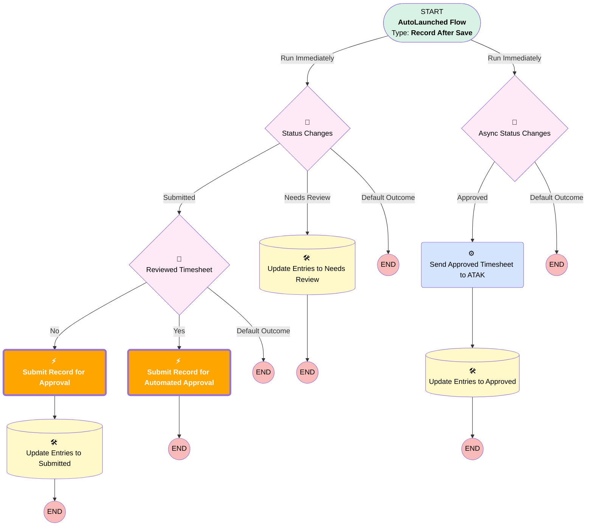

# [Time Sheet] - [After-Save] - [Record-Triggered] - Approval

## Flow Diagram

<!-- Flow description -->

## Flow Nodes Details

### Submit_Record_for_Approval

|<!-- -->|<!-- -->|
|:---|:---|
|Type|Action Call|
|Label|Submit Record for Approval|
|Action Type|Submit|
|Action Name|submit|
|Flow Transaction Model|CurrentTransaction|
|Name Segment|submit|
|Offset|0|
|Store Output Automatically|✅|
|Version Segment|1|
|Object Id (input)|$Record.Id|
|🟩<b>Submitter Id (input)</b>|<b>$Record.ServiceResource.RelatedRecordId</b>|
|🟩<b>Skip Entry Criteria (input)</b>|<b>✅</b>|
|Connector|[Update_Entries_to_Submitted](#update_entries_to_submitted)|

### Submit_Record_for_Automated_Approval

|<!-- -->|<!-- -->|
|:---|:---|
|Type|Action Call|
|Label|Submit Record for Automated Approval|
|Action Type|Submit|
|Action Name|submit|
|Flow Transaction Model|CurrentTransaction|
|Name Segment|submit|
|Offset|0|
|Store Output Automatically|✅|
|Version Segment|1|
|Object Id (input)|$Record.Id|
|🟩<b>Submitter Id (input)</b>|<b>$Record.ServiceResource.RelatedRecordId</b>|
|🟩<b>Skip Entry Criteria (input)</b>|<b>✅</b>|

___

_Documentation generated from branch monitoring_krinkelsgreencare__upeodev_sandbox by [sfdx-hardis](https://sfdx-hardis.cloudity.com), featuring [salesforce-flow-visualiser](https://github.com/toddhalfpenny/salesforce-flow-visualiser)_