# [Time Sheet] - [After-Save] - [Send to ATAK]

## Flow Diagram

```mermaid
%% If you read this, your Markdown visualizer does not handle MermaidJS syntax.
%% - If you are in VsCode, install extension `Markdown Preview Mermaid Support` at https://marketplace.visualstudio.com/items?itemName=bierner.markdown-mermaid
%% - If you are using sfdx-hardis, try to define env variable `MERMAID_MODES=cli,docker` ,then run again the command to regenerate markdown with SVG images.
%% - If you are within mkdocs-material, define mermaid plugin in `mkdocs.yml` as described in https://squidfunk.github.io/mkdocs-material/extensions/mermaid/
%% - At last resort, you can copy-paste this MermaidJS code in https://mermaid.live/ to see the Flow Diagram

flowchart TB
START(["START<br/><b>AutoLaunched Flow</b></br>Type: <b> Record After Save</b>"]):::startClass
click START "#general-information" "1436857281"

Process_Timesheet("⚙️ <em></em><br/>Process Timesheet"):::actionCalls
click Process_Timesheet "#process_timesheet" "349924332"

Reset_Flag[("🛠️ <em></em><br/>Reset Flag")]:::recordUpdates
click Reset_Flag "#reset_flag" "1676207890"

Process_Timesheet --> END_Process_Timesheet
Reset_Flag --> END_Reset_Flag
START --> |"Run Immediately"| Reset_Flag
START --> |"Run Immediately"| Process_Timesheet
END_Process_Timesheet(( END )):::endClass
END_Reset_Flag(( END )):::endClass


classDef actionCalls fill:#D4E4FC,color:black,max-height:100px
classDef assignments fill:#FBEED7,color:black,max-height:100px
classDef collectionProcessors fill:#F0E3FA,color:black,max-height:100px
classDef customErrors fill:#FFE9E9,color:black,max-height:100px
classDef decisions fill:#FDEAF6,color:black,max-height:100px
classDef loops fill:#FDEAF6,color:black,max-height:100px
classDef recordCreates fill:#FFF8C9,color:black,max-height:100px
classDef recordDeletes fill:#FFF8C9,color:black,max-height:100px
classDef recordLookups fill:#EDEAFF,color:black,max-height:100px
classDef recordUpdates fill:#FFF8C9,color:black,max-height:100px
classDef screens fill:#DFF6FF,color:black,max-height:100px
classDef subflows fill:#D4E4FC,color:black,max-height:100px
classDef startClass fill:#D9F2E6,color:black,max-height:100px
classDef endClass fill:#F9BABA,color:black,max-height:100px


```

## General Information

|<!-- -->|<!-- -->|
|:---|:---|
|Object|TimeSheet|
|Process Type| Auto Launched Flow|
|Trigger Type| Record After Save|
|Record Trigger Type| Update|
|Label|[Time Sheet] - [After-Save] - [Send to ATAK]|
|Status|Active|
|Does Require Record Changed To Meet Criteria|✅|
|Environments|Default|
|Interview Label|[Time Sheet] - [After-Save] - [Send to ATAK] {!$Flow.CurrentDateTime}|
| Builder Type (PM)|LightningFlowBuilder|
| Canvas Mode (PM)|AUTO_LAYOUT_CANVAS|
| Origin Builder Type (PM)|LightningFlowBuilder|
|Connector|[Reset_Flag](#reset_flag)|
|Next Node|[Reset_Flag](#reset_flag)|

#### Scheduled Paths

|Label|Name|Offset Number|Offset Unit|Record Field|Time Source|Connector|
|:-- |:-- |:-- |:-- |:-- |:-- |:--  |
|<!-- -->|<!-- -->|<!-- -->|<!-- -->|<!-- -->|<!-- -->|[Process_Timesheet](#process_timesheet)|

#### Filters (logic: **and**)

|Filter Id|Field|Operator|Value|
|:-- |:-- |:--:|:--: |
|1|Send_to_ATAK__c| Equal To|✅|

## Flow Nodes Details

### Process_Timesheet

|<!-- -->|<!-- -->|
|:---|:---|
|Type|Action Call|
|Label|Process Timesheet|
|Action Type|Apex|
|Action Name|ATAKPerformanceServiceInvocable|
|Flow Transaction Model|CurrentTransaction|
|Name Segment|ATAKPerformanceServiceInvocable|
|Offset|0|
|Version Segment|1|
|Timesheet Id (input)|$Record.Id|

### Reset_Flag

|<!-- -->|<!-- -->|
|:---|:---|
|Type|Record Update|
|Label|Reset Flag|
|Input Reference|$Record|

#### Input Assignments

|Field|Value|
|:-- |:--: |
|Send_to_ATAK__c|⬜|

___

_Documentation generated from branch monitoring_krinkelsgreencare__upeodev_sandbox by [sfdx-hardis](https://sfdx-hardis.cloudity.com), featuring [salesforce-flow-visualiser](https://github.com/toddhalfpenny/salesforce-flow-visualiser)_