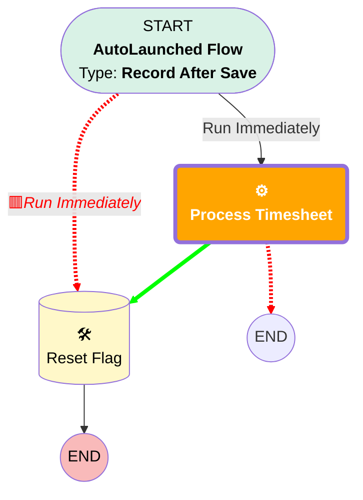

# [Time Sheet] - [After-Save] - [Send to ATAK]

## Flow Diagram

## General Information

|<!-- -->|<!-- -->|
|:---|:---|
|🟥<i>Connector</i>|<i>[Reset_Flag](#reset_flag)</i>|
|🟥<i>Next Node</i>|<i>[Reset_Flag](#reset_flag)</i>|

## Flow Nodes Details

### Process_Timesheet

|<!-- -->|<!-- -->|
|:---|:---|
|🟩<b>Connector</b>|<b>[Reset_Flag](#reset_flag)</b>|

___

_Documentation generated from branch monitoring_krinkelsgreencare__upeodev_sandbox by [sfdx-hardis](https://sfdx-hardis.cloudity.com), featuring [salesforce-flow-visualiser](https://github.com/toddhalfpenny/salesforce-flow-visualiser)_