# Time Sheet Entry - Before Save

## Flow Diagram

```mermaid
%% If you read this, your Markdown visualizer does not handle MermaidJS syntax.
%% - If you are in VsCode, install extension `Markdown Preview Mermaid Support` at https://marketplace.visualstudio.com/items?itemName=bierner.markdown-mermaid
%% - If you are using sfdx-hardis, try to define env variable `MERMAID_MODES=cli,docker` ,then run again the command to regenerate markdown with SVG images.
%% - If you are within mkdocs-material, define mermaid plugin in `mkdocs.yml` as described in https://squidfunk.github.io/mkdocs-material/extensions/mermaid/
%% - At last resort, you can copy-paste this MermaidJS code in https://mermaid.live/ to see the Flow Diagram

flowchart TB
START(["START<br/><b>AutoLaunched Flow</b></br>Type: <b> Record Before Save</b>"]):::startClass
click START "#general-information" "3957369726"

Code_ATAK{"🔀 <em></em><br/>Code ATAK"}:::decisions
click Code_ATAK "#code_atak" "26410005"

Update_ATAK_Code[("🛠️ <em></em><br/>Update ATAK Code")]:::recordUpdates
click Update_ATAK_Code "#update_atak_code" "696003204"

Code_ATAK --> |"Is Empty or Changed"| Update_ATAK_Code
Code_ATAK --> |"Default Outcome"| END_Code_ATAK
Update_ATAK_Code --> END_Update_ATAK_Code
START -->  Code_ATAK
END_Code_ATAK(( END )):::endClass
END_Update_ATAK_Code(( END )):::endClass


classDef actionCalls fill:#D4E4FC,color:black,text-decoration:none,max-height:100px
classDef assignments fill:#FBEED7,color:black,text-decoration:none,max-height:100px
classDef collectionProcessors fill:#F0E3FA,color:black,text-decoration:none,max-height:100px
classDef customErrors fill:#FFE9E9,color:black,text-decoration:none,max-height:100px
classDef decisions fill:#FDEAF6,color:black,text-decoration:none,max-height:100px
classDef loops fill:#FDEAF6,color:black,text-decoration:none,max-height:100px
classDef recordCreates fill:#FFF8C9,color:black,text-decoration:none,max-height:100px
classDef recordDeletes fill:#FFF8C9,color:black,text-decoration:none,max-height:100px
classDef recordLookups fill:#EDEAFF,color:black,text-decoration:none,max-height:100px
classDef recordUpdates fill:#FFF8C9,color:black,text-decoration:none,max-height:100px
classDef screens fill:#DFF6FF,color:black,text-decoration:none,max-height:100px
classDef subflows fill:#D4E4FC,color:black,text-decoration:none,max-height:100px
classDef startClass fill:#D9F2E6,color:black,text-decoration:none,max-height:100px
classDef endClass fill:#F9BABA,color:black,text-decoration:none,max-height:100px


```

## General Information

|<!-- -->|<!-- -->|
|:---|:---|
|Object|TimeSheetEntry|
|Process Type| Auto Launched Flow|
|Trigger Type| Record Before Save|
|Record Trigger Type| Create And Update|
|Label|Time Sheet Entry - Before Save|
|Status|⚠️ Draft|
|Description|This flow is configured to update and fill in some data automatically on Time Sheet Entries|
|Environments|Default|
|Interview Label|Time Sheet Entry - Before Save {!$Flow.CurrentDateTime}|
| Builder Type (PM)|LightningFlowBuilder|
| Canvas Mode (PM)|AUTO_LAYOUT_CANVAS|
| Origin Builder Type (PM)|LightningFlowBuilder|
|Connector|[Code_ATAK](#code_atak)|
|Next Node|[Code_ATAK](#code_atak)|

## Formulas

|Name|Data Type|Expression|Description|
|:-- |:--:|:-- |:--  |
|CalculateATAKCode|String|IF($Record.Urgent_Intervention__c, "URG",    CASE($Record.Type,      "Normal Hours", "HR",      "Travel Time", "HR",     "Night Work",        IF($Record.Starting_Allowance_Winter_Service__c, "P", "NW"),     "Machines", "MU",     ""   ) )|<!-- -->|
|CalculatedSoccode|String|IF($Record.Urgent_Intervention__c, "",    CASE($Record.Type,      "Normal Hours", "1010",      "Travel Time", "1010",     "Night Work",        IF($Record.Starting_Allowance_Winter_Service__c, "1710", "1706"),     "Machines", "",     ""   ) )|<!-- -->|

## Flow Nodes Details

### Code_ATAK

|<!-- -->|<!-- -->|
|:---|:---|
|Type|Decision|
|Label|Code ATAK|
|Default Connector Label|Default Outcome|

#### Rule Is_Empty_or_Changed (Is Empty or Changed)

|<!-- -->|<!-- -->|
|:---|:---|
|Connector|[Update_ATAK_Code](#update_atak_code)|
|Condition Logic|or|

|Condition Id|Left Value Reference|Operator|Right Value|
|:-- |:-- |:--:|:--: |
|1|$Record.Code_ATAK_Limbus__c| Is Null|✅|
|2|$Record.Type| Is Changed|✅|
|3|$Record.Starting_Allowance_Winter_Service__c| Equal To|✅|
|4|$Record.Urgent_Intervention__c| Equal To|✅|

### Update_ATAK_Code

|<!-- -->|<!-- -->|
|:---|:---|
|Type|Record Update|
|Label|Update ATAK Code|
|Input Reference|$Record|

#### Input Assignments

|Field|Value|
|:-- |:--: |
|Code_ATAK_Limbus__c|CalculateATAKCode|
|Soccode__c|CalculatedSoccode|

___

_Documentation generated from branch monitoring_krinkelsgreencare__upeodev_sandbox by [sfdx-hardis](https://sfdx-hardis.cloudity.com), featuring [salesforce-flow-visualiser](https://github.com/toddhalfpenny/salesforce-flow-visualiser)_