<i>🟥# Time Sheet Entry - Before Save</i>

<b>🟩# [Time Sheet Entry] - [Before-Save] - [Record-Triggered]</b>

## Flow Diagram

```mermaid
%% If you read this, your Markdown visualizer does not handle MermaidJS syntax.
%% - If you are in VsCode, install extension `Markdown Preview Mermaid Support` at https://marketplace.visualstudio.com/items?itemName=bierner.markdown-mermaid
%% - If you are using sfdx-hardis, try to define env variable `MERMAID_MODES=cli,docker` ,then run again the command to regenerate markdown with SVG images.
%% - If you are within mkdocs-material, define mermaid plugin in `mkdocs.yml` as described in https://squidfunk.github.io/mkdocs-material/extensions/mermaid/
%% - At last resort, you can copy-paste this MermaidJS code in https://mermaid.live/ to see the Flow Diagram

flowchart TB
START(["<b>START<br/><b>AutoLaunched Flow</b></br>Type: <b> Record Before Save</b></b>"]):::startClassChanged


click START "#general-information" "2143815732"


Code_ATAK{"🔀 <em></em><br/>Code ATAK"}:::decisions
click Code_ATAK "#code_atak" "26410005"

Update_ATAK_Code[("🛠️ <em></em><br/>Update ATAK Code")]:::recordUpdates
click Update_ATAK_Code "#update_atak_code" "696003204"

Code_ATAK --> |"Is Empty or Changed"| Update_ATAK_Code
Code_ATAK --> |"Default Outcome"| END_Code_ATAK
Update_ATAK_Code --> END_Update_ATAK_Code
START -->  Code_ATAK
END_Code_ATAK(( END )):::endClass
END_Update_ATAK_Code(( END )):::endClass


classDef actionCalls fill:#D4E4FC,color:black,text-decoration:none,max-height:100px
classDef assignments fill:#FBEED7,color:black,text-decoration:none,max-height:100px
classDef collectionProcessors fill:#F0E3FA,color:black,text-decoration:none,max-height:100px
classDef customErrors fill:#FFE9E9,color:black,text-decoration:none,max-height:100px
classDef decisions fill:#FDEAF6,color:black,text-decoration:none,max-height:100px
classDef loops fill:#FDEAF6,color:black,text-decoration:none,max-height:100px
classDef recordCreates fill:#FFF8C9,color:black,text-decoration:none,max-height:100px
classDef recordDeletes fill:#FFF8C9,color:black,text-decoration:none,max-height:100px
classDef recordLookups fill:#EDEAFF,color:black,text-decoration:none,max-height:100px
classDef recordUpdates fill:#FFF8C9,color:black,text-decoration:none,max-height:100px
classDef screens fill:#DFF6FF,color:black,text-decoration:none,max-height:100px
classDef subflows fill:#D4E4FC,color:black,text-decoration:none,max-height:100px
classDef startClass fill:#D9F2E6,color:black,text-decoration:none,max-height:100px
classDef endClass fill:#F9BABA,color:black,text-decoration:none,max-height:100px



classDef actionCallsAdded fill:green,color:white,stroke-width:4px,text-decoration:none,max-height:100px
classDef assignmentsAdded fill:green,color:white,stroke-width:4px,text-decoration:none,max-height:100px
classDef collectionProcessorsAdded fill:green,color:white,stroke-width:4px,text-decoration:none,max-height:100px
classDef customErrorsAdded fill:green,color:white,stroke-width:4px,text-decoration:none,max-height:100px
classDef decisionsAdded fill:green,color:white,stroke-width:4px,text-decoration:none,max-height:100px
classDef loopsAdded fill:green,color:white,stroke-width:4px,text-decoration:none,max-height:100px
classDef recordCreatesAdded fill:green,color:white,stroke-width:4px,text-decoration:none,max-height:100px
classDef recordDeletesAdded fill:green,color:white,stroke-width:4px,text-decoration:none,max-height:100px
classDef recordLookupsAdded fill:green,color:white,stroke-width:4px,text-decoration:none,max-height:100px
classDef recordUpdatesAdded fill:green,color:white,stroke-width:4px,text-decoration:none,max-height:100px
classDef screensAdded fill:green,color:white,stroke-width:4px,text-decoration:none,max-height:100px
classDef subflowsAdded fill:green,color:white,stroke-width:4px,text-decoration:none,max-height:100px
classDef startClassAdded fill:green,color:white,stroke-width:4px,text-decoration:none,max-height:100px

classDef actionCallsRemoved fill:red,color:white,stroke-width:4px,text-decoration:none,max-height:100px
classDef assignmentsRemoved fill:red,color:white,stroke-width:4px,text-decoration:none,max-height:100px
classDef collectionProcessorsRemoved fill:red,color:white,stroke-width:4px,text-decoration:none,max-height:100px
classDef customErrorsRemoved fill:red,color:white,stroke-width:4px,text-decoration:none,max-height:100px
classDef decisionsRemoved fill:red,color:white,stroke-width:4px,text-decoration:none,max-height:100px
classDef loopsRemoved fill:red,color:white,stroke-width:4px,text-decoration:none,max-height:100px
classDef recordCreatesRemoved fill:red,color:white,stroke-width:4px,text-decoration:none,max-height:100px
classDef recordDeletesRemoved fill:red,color:white,stroke-width:4px,text-decoration:none,max-height:100px
classDef recordLookupsRemoved fill:red,color:white,stroke-width:4px,text-decoration:none,max-height:100px
classDef recordUpdatesRemoved fill:red,color:white,stroke-width:4px,text-decoration:none,max-height:100px
classDef screensRemoved fill:red,color:white,stroke-width:4px,text-decoration:none,max-height:100px
classDef subflowsRemoved fill:red,color:white,stroke-width:4px,text-decoration:none,max-height:100px
classDef startClassRemoved fill:red,color:white,stroke-width:4px,text-decoration:none,max-height:100px

classDef actionCallsChanged fill:orange,color:white,stroke-width:4px,text-decoration:none,max-height:100px
classDef assignmentsChanged fill:orange,color:white,stroke-width:4px,text-decoration:none,max-height:100px
classDef collectionProcessorsChanged fill:orange,color:white,stroke-width:4px,text-decoration:none,max-height:100px
classDef customErrorsChanged fill:orange,color:white,stroke-width:4px,text-decoration:none,max-height:100px
classDef decisionsChanged fill:orange,color:white,stroke-width:4px,text-decoration:none,max-height:100px
classDef loopsChanged fill:orange,color:white,stroke-width:4px,text-decoration:none,max-height:100px
classDef recordCreatesChanged fill:orange,color:white,stroke-width:4px,text-decoration:none,max-height:100px
classDef recordDeletesChanged fill:orange,color:white,stroke-width:4px,text-decoration:none,max-height:100px
classDef recordLookupsChanged fill:orange,color:white,stroke-width:4px,text-decoration:none,max-height:100px
classDef recordUpdatesChanged fill:orange,color:white,stroke-width:4px,text-decoration:none,max-height:100px
classDef screensChanged fill:orange,color:white,stroke-width:4px,text-decoration:none,max-height:100px
classDef subflowsChanged fill:orange,color:white,stroke-width:4px,text-decoration:none,max-height:100px
classDef startClassChanged fill:orange,color:white,stroke-width:4px,text-decoration:none,max-height:100px
  
```

<!-- Flow description -->

## General Information

|<!-- -->|<!-- -->|
|:---|:---|
|🟥<i>Label</i>|<i>Time Sheet Entry - Before Save</i>|
|🟥<i>Status</i>|<i>⚠️ Draft</i>|
|🟩<b>Label</b>|<b>[Time Sheet Entry] - [Before-Save] - [Record-Triggered]</b>|
|🟩<b>Status</b>|<b>Active</b>|

## Formulas

|Name|Data Type|Expression|Description|
|:-- |:--:|:-- |:--  |
|🟥<i>CalculateATAKCode</i>|<i>String</i>|<i>IF($Record.Urgent_Intervention__c, "URG",    CASE($Record.Type,      "Normal Hours", "HR",      "Travel Time", "HR",     "Night Work",        IF($Record.Starting_Allowance_Winter_Service__c, "P", "NW"),     "Machines", "MU",     ""   ) )</i>|<i><!-- --></i>|
|🟥<i>CalculatedSoccode</i>|<i>String</i>|<i>IF($Record.Urgent_Intervention__c, "",    CASE($Record.Type,      "Normal Hours", "1010",      "Travel Time", "1010",     "Night Work",        IF($Record.Starting_Allowance_Winter_Service__c, "1710", "1706"),     "Machines", "",     ""   ) )</i>|<i><!-- --></i>|
|🟩<b>CalculateATAKCode</b>|<b>String</b>|<b>IF($Record.Urgent_Intervention__c, "URG",    CASE($Record.Type,      "Normal Hours", "HR",      "Travel Time", "HR",     "Night Work",        IF($Record.Starting_Allowance_Winter_Service__c, "P", "NW"),     "Machines", "MU",     "Frost Delay", "VV",      "Industrial Accident", "HR",     "Illness",  "HR",     "Recup Overtime", "SP",     "Absent Hours", "HR",     ""   ) )</b>|<b><!-- --></b>|
|🟩<b>CalculatedSoccode</b>|<b>String</b>|<b>IF($Record.Urgent_Intervention__c, "",    CASE($Record.Type,      "Normal Hours", "1010",      "Travel Time", "1010",     "Night Work",        IF($Record.Starting_Allowance_Winter_Service__c, "1710", "1706"),     "Machines", "",     "Frost Delay", "9720",      "Industrial Accident", "",     "Illness",  "",     "Recup Overtime", "4025",     "Absent Hours", "",     ""   ) )</b>|<b><!-- --></b>|

___

_Documentation generated from branch monitoring_krinkelsgreencare__upeodev_sandbox by [sfdx-hardis](https://sfdx-hardis.cloudity.com), featuring [salesforce-flow-visualiser](https://github.com/toddhalfpenny/salesforce-flow-visualiser)_