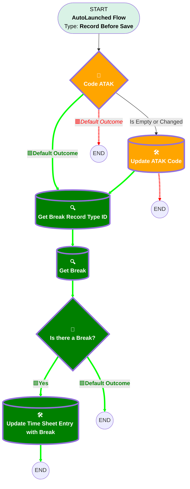

# [Time Sheet Entry] - [Before-Save] - [Record-Triggered]

## Flow Diagram

```mermaid
%% If you read this, your Markdown visualizer does not handle MermaidJS syntax.
%% - If you are in VsCode, install extension `Markdown Preview Mermaid Support` at https://marketplace.visualstudio.com/items?itemName=bierner.markdown-mermaid
%% - If you are using sfdx-hardis, try to define env variable `MERMAID_MODES=cli,docker` ,then run again the command to regenerate markdown with SVG images.
%% - If you are within mkdocs-material, define mermaid plugin in `mkdocs.yml` as described in https://squidfunk.github.io/mkdocs-material/extensions/mermaid/
%% - At last resort, you can copy-paste this MermaidJS code in https://mermaid.live/ to see the Flow Diagram

flowchart TB
START(["START<br/><b>AutoLaunched Flow</b></br>Type: <b> Record Before Save</b>"]):::startClass
click START "#general-information" "2143815732"

Code_ATAK{"<b>🔀 <em></em><br/>Code ATAK</b>"}:::decisionsChanged


click Code_ATAK "#code_atak" "4117200828"


Is_there_a_Break{"<b>🔀 <em></em><br/>Is there a Break?</b>"}:::decisionsAdded
click Is_there_a_Break "#is_there_a_break" "4186903804"

Get_Break[("<b>🔍 <em></em><br/>Get Break</b>")]:::recordLookupsAdded
click Get_Break "#get_break" "2682123174"

Get_Break_Record_Type_ID[("<b>🔍 <em></em><br/>Get Break Record Type ID</b>")]:::recordLookupsAdded
click Get_Break_Record_Type_ID "#get_break_record_type_id" "3724942779"


Update_ATAK_Code[("<b>🛠️ <em></em><br/>Update ATAK Code</b>")]:::recordUpdatesChanged


click Update_ATAK_Code "#update_atak_code" "1766681701"


Update_Time_Sheet_Entry_with_Break[("<b>🛠️ <em></em><br/>Update Time Sheet Entry with Break</b>")]:::recordUpdatesAdded
click Update_Time_Sheet_Entry_with_Break "#update_time_sheet_entry_with_break" "4265655950"


Code_ATAK --> |"Is Empty or Changed"| Update_ATAK_Code

Code_ATAK -.-> |"🟥<i>Default Outcome</i>"| END_Code_ATAK
Update_ATAK_Code -.-> END_Update_ATAK_Code

Code_ATAK ==> |"🟩<b>Default Outcome</b>"| Get_Break_Record_Type_ID
Is_there_a_Break ==> |"🟩<b>Yes</b>"| Update_Time_Sheet_Entry_with_Break
Is_there_a_Break ==> |"🟩<b>Default Outcome</b>"| END_Is_there_a_Break
Get_Break ==> Is_there_a_Break
Get_Break_Record_Type_ID ==> Get_Break
Update_ATAK_Code ==> Get_Break_Record_Type_ID
Update_Time_Sheet_Entry_with_Break ==> END_Update_Time_Sheet_Entry_with_Break

START -->  Code_ATAK

END_Code_ATAK(( END )):::endClassRemoved
END_Update_ATAK_Code(( END )):::endClassRemoved

END_Is_there_a_Break(( END )):::endClassAdded
END_Update_Time_Sheet_Entry_with_Break(( END )):::endClassAdded


classDef actionCalls fill:#D4E4FC,color:black,text-decoration:none,max-height:100px
classDef assignments fill:#FBEED7,color:black,text-decoration:none,max-height:100px
classDef collectionProcessors fill:#F0E3FA,color:black,text-decoration:none,max-height:100px
classDef customErrors fill:#FFE9E9,color:black,text-decoration:none,max-height:100px
classDef decisions fill:#FDEAF6,color:black,text-decoration:none,max-height:100px
classDef loops fill:#FDEAF6,color:black,text-decoration:none,max-height:100px
classDef recordCreates fill:#FFF8C9,color:black,text-decoration:none,max-height:100px
classDef recordDeletes fill:#FFF8C9,color:black,text-decoration:none,max-height:100px
classDef recordLookups fill:#EDEAFF,color:black,text-decoration:none,max-height:100px
classDef recordUpdates fill:#FFF8C9,color:black,text-decoration:none,max-height:100px
classDef screens fill:#DFF6FF,color:black,text-decoration:none,max-height:100px
classDef subflows fill:#D4E4FC,color:black,text-decoration:none,max-height:100px
classDef startClass fill:#D9F2E6,color:black,text-decoration:none,max-height:100px
classDef endClass fill:#F9BABA,color:black,text-decoration:none,max-height:100px


classDef actionCallsAdded fill:green,color:white,stroke-width:4px,text-decoration:none,max-height:100px
classDef assignmentsAdded fill:green,color:white,stroke-width:4px,text-decoration:none,max-height:100px
classDef collectionProcessorsAdded fill:green,color:white,stroke-width:4px,text-decoration:none,max-height:100px
classDef customErrorsAdded fill:green,color:white,stroke-width:4px,text-decoration:none,max-height:100px
classDef decisionsAdded fill:green,color:white,stroke-width:4px,text-decoration:none,max-height:100px
classDef loopsAdded fill:green,color:white,stroke-width:4px,text-decoration:none,max-height:100px
classDef recordCreatesAdded fill:green,color:white,stroke-width:4px,text-decoration:none,max-height:100px
classDef recordDeletesAdded fill:green,color:white,stroke-width:4px,text-decoration:none,max-height:100px
classDef recordLookupsAdded fill:green,color:white,stroke-width:4px,text-decoration:none,max-height:100px
classDef recordUpdatesAdded fill:green,color:white,stroke-width:4px,text-decoration:none,max-height:100px
classDef screensAdded fill:green,color:white,stroke-width:4px,text-decoration:none,max-height:100px
classDef subflowsAdded fill:green,color:white,stroke-width:4px,text-decoration:none,max-height:100px
classDef startClassAdded fill:green,color:white,stroke-width:4px,text-decoration:none,max-height:100px

classDef actionCallsRemoved fill:red,color:white,stroke-width:4px,text-decoration:none,max-height:100px
classDef assignmentsRemoved fill:red,color:white,stroke-width:4px,text-decoration:none,max-height:100px
classDef collectionProcessorsRemoved fill:red,color:white,stroke-width:4px,text-decoration:none,max-height:100px
classDef customErrorsRemoved fill:red,color:white,stroke-width:4px,text-decoration:none,max-height:100px
classDef decisionsRemoved fill:red,color:white,stroke-width:4px,text-decoration:none,max-height:100px
classDef loopsRemoved fill:red,color:white,stroke-width:4px,text-decoration:none,max-height:100px
classDef recordCreatesRemoved fill:red,color:white,stroke-width:4px,text-decoration:none,max-height:100px
classDef recordDeletesRemoved fill:red,color:white,stroke-width:4px,text-decoration:none,max-height:100px
classDef recordLookupsRemoved fill:red,color:white,stroke-width:4px,text-decoration:none,max-height:100px
classDef recordUpdatesRemoved fill:red,color:white,stroke-width:4px,text-decoration:none,max-height:100px
classDef screensRemoved fill:red,color:white,stroke-width:4px,text-decoration:none,max-height:100px
classDef subflowsRemoved fill:red,color:white,stroke-width:4px,text-decoration:none,max-height:100px
classDef startClassRemoved fill:red,color:white,stroke-width:4px,text-decoration:none,max-height:100px

classDef actionCallsChanged fill:orange,color:white,stroke-width:4px,text-decoration:none,max-height:100px
classDef assignmentsChanged fill:orange,color:white,stroke-width:4px,text-decoration:none,max-height:100px
classDef collectionProcessorsChanged fill:orange,color:white,stroke-width:4px,text-decoration:none,max-height:100px
classDef customErrorsChanged fill:orange,color:white,stroke-width:4px,text-decoration:none,max-height:100px
classDef decisionsChanged fill:orange,color:white,stroke-width:4px,text-decoration:none,max-height:100px
classDef loopsChanged fill:orange,color:white,stroke-width:4px,text-decoration:none,max-height:100px
classDef recordCreatesChanged fill:orange,color:white,stroke-width:4px,text-decoration:none,max-height:100px
classDef recordDeletesChanged fill:orange,color:white,stroke-width:4px,text-decoration:none,max-height:100px
classDef recordLookupsChanged fill:orange,color:white,stroke-width:4px,text-decoration:none,max-height:100px
classDef recordUpdatesChanged fill:orange,color:white,stroke-width:4px,text-decoration:none,max-height:100px
classDef screensChanged fill:orange,color:white,stroke-width:4px,text-decoration:none,max-height:100px
classDef subflowsChanged fill:orange,color:white,stroke-width:4px,text-decoration:none,max-height:100px
classDef startClassChanged fill:orange,color:white,stroke-width:4px,text-decoration:none,max-height:100px
  
linkStyle 3,4,5,6,7,8,9 stroke:#00ff00,stroke-width:4px,color:green;
linkStyle 1,2 stroke:#ff0000,stroke-width:4px,color:red;
```

<!-- Flow description -->

## Flow Nodes Details

### Code_ATAK

|<!-- -->|<!-- -->|
|:---|:---|
|🟩<b>Default Connector</b>|<b>[Get_Break_Record_Type_ID](#get_break_record_type_id)</b>|

### 🟩Is_there_a_Break

|<!-- -->|<!-- -->|
|:---|:---|
|🟩<b>Type</b>|<b>Decision</b>|
|🟩<b>Label</b>|<b>Is there a Break?</b>|
|🟩<b>Default Connector Label</b>|<b>Default Outcome</b>|

#### 🟩Rule Yes (Yes)

|<!-- -->|<!-- -->|
|:---|:---|
|🟩<b>Connector</b>|<b>[Update_Time_Sheet_Entry_with_Break](#update_time_sheet_entry_with_break)</b>|
|🟩<b>Condition Logic</b>|<b>and</b>|

|Condition Id|Left Value Reference|Operator|Right Value|
|:-- |:-- |:--:|:--: |
|🟩<b>1</b>|<b>Get_Break.Id</b>|<b> Is Null</b>|<b>⬜</b>|

### 🟩Get_Break

|<!-- -->|<!-- -->|
|:---|:---|
|🟩<b>Type</b>|<b>Record Lookup</b>|
|🟩<b>Object</b>|<b>ResourceAbsence</b>|
|🟩<b>Label</b>|<b>Get Break</b>|
|🟩<b>Assign Null Values If No Records Found</b>|<b>⬜</b>|
|🟩<b>Get First Record Only</b>|<b>✅</b>|
|🟩<b>Store Output Automatically</b>|<b>✅</b>|
|🟩<b>Connector</b>|<b>[Is_there_a_Break](#is_there_a_break)</b>|

#### 🟩Filters (logic: **and**)

|Filter Id|Field|Operator|Value|
|:-- |:-- |:--:|:--: |
|🟩<b>1</b>|<b>ResourceId</b>|<b> Equal To</b>|<b>$Record.TimeSheet.ServiceResourceId</b>|
|🟩<b>2</b>|<b>RecordTypeId</b>|<b> Equal To</b>|<b>Get_Break_Record_Type_ID.Id</b>|
|🟩<b>3</b>|<b>Start</b>|<b> Greater Than Or Equal To</b>|<b>$Record.StartTime</b>|
|🟩<b>4</b>|<b>End</b>|<b> Less Than Or Equal To</b>|<b>$Record.EndTime</b>|

### 🟩Get_Break_Record_Type_ID

|<!-- -->|<!-- -->|
|:---|:---|
|🟩<b>Type</b>|<b>Record Lookup</b>|
|🟩<b>Object</b>|<b>RecordType</b>|
|🟩<b>Label</b>|<b>Get Break Record Type ID</b>|
|🟩<b>Assign Null Values If No Records Found</b>|<b>⬜</b>|
|🟩<b>Get First Record Only</b>|<b>✅</b>|
|🟩<b>Store Output Automatically</b>|<b>✅</b>|
|🟩<b>Connector</b>|<b>[Get_Break](#get_break)</b>|

#### 🟩Filters (logic: **and**)

|Filter Id|Field|Operator|Value|
|:-- |:-- |:--:|:--: |
|🟩<b>1</b>|<b>DeveloperName</b>|<b> Equal To</b>|<b>Break</b>|

### Update_ATAK_Code

|<!-- -->|<!-- -->|
|:---|:---|
|🟩<b>Connector</b>|<b>[Get_Break_Record_Type_ID](#get_break_record_type_id)</b>|

### 🟩Update_Time_Sheet_Entry_with_Break

|<!-- -->|<!-- -->|
|:---|:---|
|🟩<b>Type</b>|<b>Record Update</b>|
|🟩<b>Label</b>|<b>Update Time Sheet Entry with Break</b>|
|🟩<b>Input Reference</b>|<b>$Record</b>|

#### 🟩Input Assignments

|Field|Value|
|:-- |:--: |
|🟩<b>Resource_Absence__c</b>|<b>Get_Break.Id</b>|

___

_Documentation generated from branch monitoring_krinkelsgreencare__upeodev_sandbox by [sfdx-hardis](https://sfdx-hardis.cloudity.com), featuring [salesforce-flow-visualiser](https://github.com/toddhalfpenny/salesforce-flow-visualiser)_