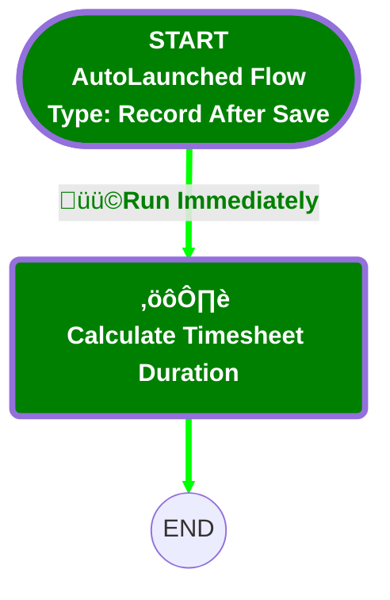

<b>üü©# [TimesheetEntry] - After Save - Break Time</b>

## üü©Flow Diagram

```mermaid
%% If you read this, your Markdown visualizer does not handle MermaidJS syntax.
%% - If you are in VsCode, install extension `Markdown Preview Mermaid Support` at https://marketplace.visualstudio.com/items?itemName=bierner.markdown-mermaid
%% - If you are using sfdx-hardis, try to define env variable `MERMAID_MODES=cli,docker` ,then run again the command to regenerate markdown with SVG images.
%% - If you are within mkdocs-material, define mermaid plugin in `mkdocs.yml` as described in https://squidfunk.github.io/mkdocs-material/extensions/mermaid/
%% - At last resort, you can copy-paste this MermaidJS code in https://mermaid.live/ to see the Flow Diagram

flowchart TB
START(["<b>START<br/><b>AutoLaunched Flow</b></br>Type: <b> Record After Save</b></b>"]):::startClassAdded
click START "#general-information" "1773013466"

Calculate_Timesheet_Duration("<b>⚙️ <em></em><br/>Calculate Timesheet Duration</b>"):::actionCallsAdded
click Calculate_Timesheet_Duration "#calculate_timesheet_duration" "1467692425"

Calculate_Timesheet_Duration ==> END_Calculate_Timesheet_Duration
START ==> |"üü©<b>Run Immediately</b>"| Calculate_Timesheet_Duration
END_Calculate_Timesheet_Duration(( END )):::endClassAdded


classDef actionCalls fill:#D4E4FC,color:black,text-decoration:none,max-height:100px
classDef assignments fill:#FBEED7,color:black,text-decoration:none,max-height:100px
classDef collectionProcessors fill:#F0E3FA,color:black,text-decoration:none,max-height:100px
classDef customErrors fill:#FFE9E9,color:black,text-decoration:none,max-height:100px
classDef decisions fill:#FDEAF6,color:black,text-decoration:none,max-height:100px
classDef loops fill:#FDEAF6,color:black,text-decoration:none,max-height:100px
classDef recordCreates fill:#FFF8C9,color:black,text-decoration:none,max-height:100px
classDef recordDeletes fill:#FFF8C9,color:black,text-decoration:none,max-height:100px
classDef recordLookups fill:#EDEAFF,color:black,text-decoration:none,max-height:100px
classDef recordUpdates fill:#FFF8C9,color:black,text-decoration:none,max-height:100px
classDef screens fill:#DFF6FF,color:black,text-decoration:none,max-height:100px
classDef subflows fill:#D4E4FC,color:black,text-decoration:none,max-height:100px
classDef startClass fill:#D9F2E6,color:black,text-decoration:none,max-height:100px
classDef endClass fill:#F9BABA,color:black,text-decoration:none,max-height:100px


classDef actionCallsAdded fill:green,color:white,stroke-width:4px,text-decoration:none,max-height:100px
classDef assignmentsAdded fill:green,color:white,stroke-width:4px,text-decoration:none,max-height:100px
classDef collectionProcessorsAdded fill:green,color:white,stroke-width:4px,text-decoration:none,max-height:100px
classDef customErrorsAdded fill:green,color:white,stroke-width:4px,text-decoration:none,max-height:100px
classDef decisionsAdded fill:green,color:white,stroke-width:4px,text-decoration:none,max-height:100px
classDef loopsAdded fill:green,color:white,stroke-width:4px,text-decoration:none,max-height:100px
classDef recordCreatesAdded fill:green,color:white,stroke-width:4px,text-decoration:none,max-height:100px
classDef recordDeletesAdded fill:green,color:white,stroke-width:4px,text-decoration:none,max-height:100px
classDef recordLookupsAdded fill:green,color:white,stroke-width:4px,text-decoration:none,max-height:100px
classDef recordUpdatesAdded fill:green,color:white,stroke-width:4px,text-decoration:none,max-height:100px
classDef screensAdded fill:green,color:white,stroke-width:4px,text-decoration:none,max-height:100px
classDef subflowsAdded fill:green,color:white,stroke-width:4px,text-decoration:none,max-height:100px
classDef startClassAdded fill:green,color:white,stroke-width:4px,text-decoration:none,max-height:100px

classDef actionCallsRemoved fill:red,color:white,stroke-width:4px,text-decoration:none,max-height:100px
classDef assignmentsRemoved fill:red,color:white,stroke-width:4px,text-decoration:none,max-height:100px
classDef collectionProcessorsRemoved fill:red,color:white,stroke-width:4px,text-decoration:none,max-height:100px
classDef customErrorsRemoved fill:red,color:white,stroke-width:4px,text-decoration:none,max-height:100px
classDef decisionsRemoved fill:red,color:white,stroke-width:4px,text-decoration:none,max-height:100px
classDef loopsRemoved fill:red,color:white,stroke-width:4px,text-decoration:none,max-height:100px
classDef recordCreatesRemoved fill:red,color:white,stroke-width:4px,text-decoration:none,max-height:100px
classDef recordDeletesRemoved fill:red,color:white,stroke-width:4px,text-decoration:none,max-height:100px
classDef recordLookupsRemoved fill:red,color:white,stroke-width:4px,text-decoration:none,max-height:100px
classDef recordUpdatesRemoved fill:red,color:white,stroke-width:4px,text-decoration:none,max-height:100px
classDef screensRemoved fill:red,color:white,stroke-width:4px,text-decoration:none,max-height:100px
classDef subflowsRemoved fill:red,color:white,stroke-width:4px,text-decoration:none,max-height:100px
classDef startClassRemoved fill:red,color:white,stroke-width:4px,text-decoration:none,max-height:100px

classDef actionCallsChanged fill:orange,color:white,stroke-width:4px,text-decoration:none,max-height:100px
classDef assignmentsChanged fill:orange,color:white,stroke-width:4px,text-decoration:none,max-height:100px
classDef collectionProcessorsChanged fill:orange,color:white,stroke-width:4px,text-decoration:none,max-height:100px
classDef customErrorsChanged fill:orange,color:white,stroke-width:4px,text-decoration:none,max-height:100px
classDef decisionsChanged fill:orange,color:white,stroke-width:4px,text-decoration:none,max-height:100px
classDef loopsChanged fill:orange,color:white,stroke-width:4px,text-decoration:none,max-height:100px
classDef recordCreatesChanged fill:orange,color:white,stroke-width:4px,text-decoration:none,max-height:100px
classDef recordDeletesChanged fill:orange,color:white,stroke-width:4px,text-decoration:none,max-height:100px
classDef recordLookupsChanged fill:orange,color:white,stroke-width:4px,text-decoration:none,max-height:100px
classDef recordUpdatesChanged fill:orange,color:white,stroke-width:4px,text-decoration:none,max-height:100px
classDef screensChanged fill:orange,color:white,stroke-width:4px,text-decoration:none,max-height:100px
classDef subflowsChanged fill:orange,color:white,stroke-width:4px,text-decoration:none,max-height:100px
classDef startClassChanged fill:orange,color:white,stroke-width:4px,text-decoration:none,max-height:100px
  
linkStyle 0,1 stroke:#00ff00,stroke-width:4px,color:green;
```

<b>üü©<!-- Flow description --></b>

## üü©General Information

|üü©<b><!-- --></b>|<b><!-- --></b>|
|:---|:---|
|üü©<b>Object</b>|<b>TimeSheetEntry</b>|
|üü©<b>Process Type</b>|<b> Auto Launched Flow</b>|
|üü©<b>Trigger Type</b>|<b> Record After Save</b>|
|üü©<b>Record Trigger Type</b>|<b> Create And Update</b>|
|üü©<b>Label</b>|<b>[TimesheetEntry] - After Save - Break Time</b>|
|üü©<b>Status</b>|<b>Active</b>|
|üü©<b>Does Require Record Changed To Meet Criteria</b>|<b>‚úÖ</b>|
|üü©<b>Filter Formula</b>|<b>ISCHANGED({!$Record.StartTime}) </b>|<b>  ISCHANGED({!$Record.EndTime})</b>|
|üü©<b>Environments</b>|<b>Default</b>|
|üü©<b>Interview Label</b>|<b>[TimesheetEntry] - After Save - Break Time {!$Flow.CurrentDateTime}</b>|
|üü©<b> Builder Type (PM)</b>|<b>LightningFlowBuilder</b>|
|üü©<b> Canvas Mode (PM)</b>|<b>AUTO_LAYOUT_CANVAS</b>|
|üü©<b> Origin Builder Type (PM)</b>|<b>LightningFlowBuilder</b>|

#### üü©Scheduled Paths

|üü©<b>Label</b>|<b>Name</b>|<b>Offset Number</b>|<b>Offset Unit</b>|<b>Record Field</b>|<b>Time Source</b>|<b>Connector</b>|
|:-- |:-- |:-- |:-- |:-- |:-- |:--  |
|üü©<b><!-- --></b>|<b><!-- --></b>|<b><!-- --></b>|<b><!-- --></b>|<b><!-- --></b>|<b><!-- --></b>|<b>[Calculate_Timesheet_Duration](#calculate_timesheet_duration)</b>|

## üü©Flow Nodes Details

### üü©Calculate_Timesheet_Duration

|üü©<b><!-- --></b>|<b><!-- --></b>|
|:---|:---|
|üü©<b>Type</b>|<b>Action Call</b>|
|üü©<b>Label</b>|<b>Calculate Timesheet Duration</b>|
|üü©<b>Action Type</b>|<b>Apex</b>|
|üü©<b>Action Name</b>|<b>TimeSheetCalculationInvocable</b>|
|üü©<b>Flow Transaction Model</b>|<b>CurrentTransaction</b>|
|üü©<b>Name Segment</b>|<b>TimeSheetCalculationInvocable</b>|
|üü©<b>Offset</b>|<b>0</b>|
|üü©<b>Version Segment</b>|<b>1</b>|
|üü©<b>Record Id (input)</b>|<b>$Record.Id</b>|
|üü©<b>Record Type (input)</b>|<b>TimeSheetEntry</b>|

___

<b>üü©_Documentation generated from branch monitoring_krinkelsgreencare__upeodev_sandbox by [sfdx-hardis](https://sfdx-hardis.cloudity.com), featuring [salesforce-flow-visualiser](https://github.com/toddhalfpenny/salesforce-flow-visualiser)_</b>