# [User] [After Create] [RecordTrigered] Create Service Resource

## Flow Diagram

```mermaid
%% If you read this, your Markdown visualizer does not handle MermaidJS syntax.
%% - If you are in VsCode, install extension `Markdown Preview Mermaid Support` at https://marketplace.visualstudio.com/items?itemName=bierner.markdown-mermaid
%% - If you are using sfdx-hardis, try to define env variable `MERMAID_MODES=cli,docker` ,then run again the command to regenerate markdown with SVG images.
%% - If you are within mkdocs-material, define mermaid plugin in `mkdocs.yml` as described in https://squidfunk.github.io/mkdocs-material/extensions/mermaid/
%% - At last resort, you can copy-paste this MermaidJS code in https://mermaid.live/ to see the Flow Diagram

flowchart TB
START(["<b>START<br/><b>AutoLaunched Flow</b></br>Type: <b> Record After Save</b></b>"]):::startClassChanged


click START "#general-information" "2647372585"


Add_to_Permission_Set_Assignment_Collection[\"🟰 <em></em><br/>Add to Permission Set Assignment Collection"/]:::assignments
click Add_to_Permission_Set_Assignment_Collection "#add_to_permission_set_assignment_collection" "1979944865"

Add_to_Permission_Set_License_Assignment_Collection[\"🟰 <em></em><br/>Add to Permission Set License Assignment Collection"/]:::assignments
click Add_to_Permission_Set_License_Assignment_Collection "#add_to_permission_set_license_assignment_collection" "30933696"

Create_Permission_Set_Assignment[\"🟰 <em></em><br/>Create Permission Set Assignment"/]:::assignments
click Create_Permission_Set_Assignment "#create_permission_set_assignment" "2837581743"

Create_Permission_Set_License[\"🟰 <em></em><br/>Create Permission Set License"/]:::assignments
click Create_Permission_Set_License "#create_permission_set_license" "1328069964"

Loop_Permission_Set_Licenses{{"🔁 <em></em><br/>Loop Permission Set Licenses"}}:::loops
click Loop_Permission_Set_Licenses "#loop_permission_set_licenses" "1035308025"

Loop_Permission_Sets{{"🔁 <em></em><br/>Loop Permission Sets"}}:::loops
click Loop_Permission_Sets "#loop_permission_sets" "491396196"

Create_Permission_Set_Assignments[("➕ <em></em><br/>Create Permission Set Assignments")]:::recordCreates
click Create_Permission_Set_Assignments "#create_permission_set_assignments" "3166075096"

Create_Platform_Event[("➕ <em></em><br/>Create Platform Event")]:::recordCreates
click Create_Platform_Event "#create_platform_event" "3679366570"

Get_Field_Service_Permission_Sets[("🔍 <em></em><br/>Get Field Service Permission Sets")]:::recordLookups
click Get_Field_Service_Permission_Sets "#get_field_service_permission_sets" "1578232173"

Get_Permission_Set_Licences[("🔍 <em></em><br/>Get Permission Set Licences")]:::recordLookups
click Get_Permission_Set_Licences "#get_permission_set_licences" "2893640959"

Add_to_Permission_Set_Assignment_Collection --> Loop_Permission_Sets
Add_to_Permission_Set_License_Assignment_Collection --> Loop_Permission_Set_Licenses
Create_Permission_Set_Assignment --> Add_to_Permission_Set_Assignment_Collection
Create_Permission_Set_License --> Add_to_Permission_Set_License_Assignment_Collection
Loop_Permission_Set_Licenses --> |"For Each"|Create_Permission_Set_License
Loop_Permission_Set_Licenses ---> |"After Last"|Create_Platform_Event
Loop_Permission_Sets --> |"For Each"|Create_Permission_Set_Assignment
Loop_Permission_Sets ---> |"After Last"|Create_Permission_Set_Assignments
Create_Permission_Set_Assignments --> Get_Permission_Set_Licences
Create_Platform_Event --> END_Create_Platform_Event
Get_Field_Service_Permission_Sets --> Loop_Permission_Sets
Get_Permission_Set_Licences --> Loop_Permission_Set_Licenses
START -->  Get_Field_Service_Permission_Sets
END_Create_Platform_Event(( END )):::endClass


classDef actionCalls fill:#D4E4FC,color:black,text-decoration:none,max-height:100px
classDef assignments fill:#FBEED7,color:black,text-decoration:none,max-height:100px
classDef collectionProcessors fill:#F0E3FA,color:black,text-decoration:none,max-height:100px
classDef customErrors fill:#FFE9E9,color:black,text-decoration:none,max-height:100px
classDef decisions fill:#FDEAF6,color:black,text-decoration:none,max-height:100px
classDef loops fill:#FDEAF6,color:black,text-decoration:none,max-height:100px
classDef recordCreates fill:#FFF8C9,color:black,text-decoration:none,max-height:100px
classDef recordDeletes fill:#FFF8C9,color:black,text-decoration:none,max-height:100px
classDef recordLookups fill:#EDEAFF,color:black,text-decoration:none,max-height:100px
classDef recordUpdates fill:#FFF8C9,color:black,text-decoration:none,max-height:100px
classDef screens fill:#DFF6FF,color:black,text-decoration:none,max-height:100px
classDef subflows fill:#D4E4FC,color:black,text-decoration:none,max-height:100px
classDef startClass fill:#D9F2E6,color:black,text-decoration:none,max-height:100px
classDef endClass fill:#F9BABA,color:black,text-decoration:none,max-height:100px



classDef actionCallsAdded fill:green,color:white,stroke-width:4px,text-decoration:none,max-height:100px
classDef assignmentsAdded fill:green,color:white,stroke-width:4px,text-decoration:none,max-height:100px
classDef collectionProcessorsAdded fill:green,color:white,stroke-width:4px,text-decoration:none,max-height:100px
classDef customErrorsAdded fill:green,color:white,stroke-width:4px,text-decoration:none,max-height:100px
classDef decisionsAdded fill:green,color:white,stroke-width:4px,text-decoration:none,max-height:100px
classDef loopsAdded fill:green,color:white,stroke-width:4px,text-decoration:none,max-height:100px
classDef recordCreatesAdded fill:green,color:white,stroke-width:4px,text-decoration:none,max-height:100px
classDef recordDeletesAdded fill:green,color:white,stroke-width:4px,text-decoration:none,max-height:100px
classDef recordLookupsAdded fill:green,color:white,stroke-width:4px,text-decoration:none,max-height:100px
classDef recordUpdatesAdded fill:green,color:white,stroke-width:4px,text-decoration:none,max-height:100px
classDef screensAdded fill:green,color:white,stroke-width:4px,text-decoration:none,max-height:100px
classDef subflowsAdded fill:green,color:white,stroke-width:4px,text-decoration:none,max-height:100px
classDef startClassAdded fill:green,color:white,stroke-width:4px,text-decoration:none,max-height:100px

classDef actionCallsRemoved fill:red,color:white,stroke-width:4px,text-decoration:none,max-height:100px
classDef assignmentsRemoved fill:red,color:white,stroke-width:4px,text-decoration:none,max-height:100px
classDef collectionProcessorsRemoved fill:red,color:white,stroke-width:4px,text-decoration:none,max-height:100px
classDef customErrorsRemoved fill:red,color:white,stroke-width:4px,text-decoration:none,max-height:100px
classDef decisionsRemoved fill:red,color:white,stroke-width:4px,text-decoration:none,max-height:100px
classDef loopsRemoved fill:red,color:white,stroke-width:4px,text-decoration:none,max-height:100px
classDef recordCreatesRemoved fill:red,color:white,stroke-width:4px,text-decoration:none,max-height:100px
classDef recordDeletesRemoved fill:red,color:white,stroke-width:4px,text-decoration:none,max-height:100px
classDef recordLookupsRemoved fill:red,color:white,stroke-width:4px,text-decoration:none,max-height:100px
classDef recordUpdatesRemoved fill:red,color:white,stroke-width:4px,text-decoration:none,max-height:100px
classDef screensRemoved fill:red,color:white,stroke-width:4px,text-decoration:none,max-height:100px
classDef subflowsRemoved fill:red,color:white,stroke-width:4px,text-decoration:none,max-height:100px
classDef startClassRemoved fill:red,color:white,stroke-width:4px,text-decoration:none,max-height:100px

classDef actionCallsChanged fill:orange,color:white,stroke-width:4px,text-decoration:none,max-height:100px
classDef assignmentsChanged fill:orange,color:white,stroke-width:4px,text-decoration:none,max-height:100px
classDef collectionProcessorsChanged fill:orange,color:white,stroke-width:4px,text-decoration:none,max-height:100px
classDef customErrorsChanged fill:orange,color:white,stroke-width:4px,text-decoration:none,max-height:100px
classDef decisionsChanged fill:orange,color:white,stroke-width:4px,text-decoration:none,max-height:100px
classDef loopsChanged fill:orange,color:white,stroke-width:4px,text-decoration:none,max-height:100px
classDef recordCreatesChanged fill:orange,color:white,stroke-width:4px,text-decoration:none,max-height:100px
classDef recordDeletesChanged fill:orange,color:white,stroke-width:4px,text-decoration:none,max-height:100px
classDef recordLookupsChanged fill:orange,color:white,stroke-width:4px,text-decoration:none,max-height:100px
classDef recordUpdatesChanged fill:orange,color:white,stroke-width:4px,text-decoration:none,max-height:100px
classDef screensChanged fill:orange,color:white,stroke-width:4px,text-decoration:none,max-height:100px
classDef subflowsChanged fill:orange,color:white,stroke-width:4px,text-decoration:none,max-height:100px
classDef startClassChanged fill:orange,color:white,stroke-width:4px,text-decoration:none,max-height:100px
  
```

## General Information

|<!-- -->|<!-- -->|
|:---|:---|
|🟥<i>Status</i>|<i>Active</i>|
|🟩<b>Status</b>|<b>Obsolete</b>|

___

_Documentation generated from branch monitoring_krinkelsgreencare__upeodev_sandbox by [sfdx-hardis](https://sfdx-hardis.cloudity.com), featuring [salesforce-flow-visualiser](https://github.com/toddhalfpenny/salesforce-flow-visualiser)_