# [Work Order][After-Save][Record-Triggered] Add WOL As Work Steps

## Flow Diagram

```mermaid
%% If you read this, your Markdown visualizer does not handle MermaidJS syntax.
%% - If you are in VsCode, install extension `Markdown Preview Mermaid Support` at https://marketplace.visualstudio.com/items?itemName=bierner.markdown-mermaid
%% - If you are using sfdx-hardis, try to define env variable `MERMAID_MODES=cli,docker` ,then run again the command to regenerate markdown with SVG images.
%% - If you are within mkdocs-material, define mermaid plugin in `mkdocs.yml` as described in https://squidfunk.github.io/mkdocs-material/extensions/mermaid/
%% - At last resort, you can copy-paste this MermaidJS code in https://mermaid.live/ to see the Flow Diagram

flowchart TB
START(["START<br/><b>AutoLaunched Flow</b></br>Type: <b> Record After Save</b>"]):::startClass
click START "#general-information" "4252839996"

Increment_Order[\"🟰 <em></em><br/>Increment Order"/]:::assignments
click Increment_Order "#increment_order" "2242132951"

Set_Values_for_Work_Steps[\"<b>🟰 <em></em><br/>Set Values for Work Steps</b>"/]:::assignmentsChanged


click Set_Values_for_Work_Steps "#set_values_for_work_steps" "4051926435"


WOL_presents{"🔀 <em></em><br/>WOL presents ?"}:::decisions
click WOL_presents "#wol_presents" "2033851454"

Work_Plan_Present{"🔀 <em></em><br/>Work Plan Present  ?"}:::decisions
click Work_Plan_Present "#work_plan_present" "1562172295"

Loop_Through_WOL{{"🔁 <em></em><br/>Loop Through WOL"}}:::loops
click Loop_Through_WOL "#loop_through_wol" "2757755997"

Create_New_Work_Steps[("➕ <em></em><br/>Create New Work Steps")]:::recordCreates
click Create_New_Work_Steps "#create_new_work_steps" "3617022635"

Create_Platform_Event_to_Reorder_Last_Steps[("➕ <em></em><br/>Create Platform Event to Reorder Last Steps")]:::recordCreates
click Create_Platform_Event_to_Reorder_Last_Steps "#create_platform_event_to_reorder_last_steps" "657826964"

Get_Before_Work_Photos_Step_Information[("🔍 <em></em><br/>Get Before Work Photos Step Information")]:::recordLookups
click Get_Before_Work_Photos_Step_Information "#get_before_work_photos_step_information" "1331861420"

Get_WOL[("🔍 <em></em><br/>Get WOL")]:::recordLookups
click Get_WOL "#get_wol" "3672556536"

Get_Work_Plan_Information[("🔍 <em></em><br/>Get Work Plan Information")]:::recordLookups
click Get_Work_Plan_Information "#get_work_plan_information" "824162745"

Increment_Order --> Loop_Through_WOL
Set_Values_for_Work_Steps --> Increment_Order
WOL_presents --> |"Yes"| Loop_Through_WOL
WOL_presents --> |"No"| END_WOL_presents
Work_Plan_Present --> |"Yes"| Get_Before_Work_Photos_Step_Information
Work_Plan_Present --> |"No"| END_Work_Plan_Present
Loop_Through_WOL --> |"For Each"|Set_Values_for_Work_Steps
Loop_Through_WOL ---> |"After Last"|Create_New_Work_Steps
Create_New_Work_Steps --> Create_Platform_Event_to_Reorder_Last_Steps
Create_Platform_Event_to_Reorder_Last_Steps --> END_Create_Platform_Event_to_Reorder_Last_Steps
Get_Before_Work_Photos_Step_Information --> Get_WOL
Get_WOL --> WOL_presents
Get_Work_Plan_Information --> Work_Plan_Present
START -->  Get_Work_Plan_Information
END_WOL_presents(( END )):::endClass
END_Work_Plan_Present(( END )):::endClass
END_Create_Platform_Event_to_Reorder_Last_Steps(( END )):::endClass


classDef actionCalls fill:#D4E4FC,color:black,text-decoration:none,max-height:100px
classDef assignments fill:#FBEED7,color:black,text-decoration:none,max-height:100px
classDef collectionProcessors fill:#F0E3FA,color:black,text-decoration:none,max-height:100px
classDef customErrors fill:#FFE9E9,color:black,text-decoration:none,max-height:100px
classDef decisions fill:#FDEAF6,color:black,text-decoration:none,max-height:100px
classDef loops fill:#FDEAF6,color:black,text-decoration:none,max-height:100px
classDef recordCreates fill:#FFF8C9,color:black,text-decoration:none,max-height:100px
classDef recordDeletes fill:#FFF8C9,color:black,text-decoration:none,max-height:100px
classDef recordLookups fill:#EDEAFF,color:black,text-decoration:none,max-height:100px
classDef recordUpdates fill:#FFF8C9,color:black,text-decoration:none,max-height:100px
classDef screens fill:#DFF6FF,color:black,text-decoration:none,max-height:100px
classDef subflows fill:#D4E4FC,color:black,text-decoration:none,max-height:100px
classDef startClass fill:#D9F2E6,color:black,text-decoration:none,max-height:100px
classDef endClass fill:#F9BABA,color:black,text-decoration:none,max-height:100px



classDef actionCallsAdded fill:green,color:white,stroke-width:4px,text-decoration:none,max-height:100px
classDef assignmentsAdded fill:green,color:white,stroke-width:4px,text-decoration:none,max-height:100px
classDef collectionProcessorsAdded fill:green,color:white,stroke-width:4px,text-decoration:none,max-height:100px
classDef customErrorsAdded fill:green,color:white,stroke-width:4px,text-decoration:none,max-height:100px
classDef decisionsAdded fill:green,color:white,stroke-width:4px,text-decoration:none,max-height:100px
classDef loopsAdded fill:green,color:white,stroke-width:4px,text-decoration:none,max-height:100px
classDef recordCreatesAdded fill:green,color:white,stroke-width:4px,text-decoration:none,max-height:100px
classDef recordDeletesAdded fill:green,color:white,stroke-width:4px,text-decoration:none,max-height:100px
classDef recordLookupsAdded fill:green,color:white,stroke-width:4px,text-decoration:none,max-height:100px
classDef recordUpdatesAdded fill:green,color:white,stroke-width:4px,text-decoration:none,max-height:100px
classDef screensAdded fill:green,color:white,stroke-width:4px,text-decoration:none,max-height:100px
classDef subflowsAdded fill:green,color:white,stroke-width:4px,text-decoration:none,max-height:100px
classDef startClassAdded fill:green,color:white,stroke-width:4px,text-decoration:none,max-height:100px

classDef actionCallsRemoved fill:red,color:white,stroke-width:4px,text-decoration:none,max-height:100px
classDef assignmentsRemoved fill:red,color:white,stroke-width:4px,text-decoration:none,max-height:100px
classDef collectionProcessorsRemoved fill:red,color:white,stroke-width:4px,text-decoration:none,max-height:100px
classDef customErrorsRemoved fill:red,color:white,stroke-width:4px,text-decoration:none,max-height:100px
classDef decisionsRemoved fill:red,color:white,stroke-width:4px,text-decoration:none,max-height:100px
classDef loopsRemoved fill:red,color:white,stroke-width:4px,text-decoration:none,max-height:100px
classDef recordCreatesRemoved fill:red,color:white,stroke-width:4px,text-decoration:none,max-height:100px
classDef recordDeletesRemoved fill:red,color:white,stroke-width:4px,text-decoration:none,max-height:100px
classDef recordLookupsRemoved fill:red,color:white,stroke-width:4px,text-decoration:none,max-height:100px
classDef recordUpdatesRemoved fill:red,color:white,stroke-width:4px,text-decoration:none,max-height:100px
classDef screensRemoved fill:red,color:white,stroke-width:4px,text-decoration:none,max-height:100px
classDef subflowsRemoved fill:red,color:white,stroke-width:4px,text-decoration:none,max-height:100px
classDef startClassRemoved fill:red,color:white,stroke-width:4px,text-decoration:none,max-height:100px

classDef actionCallsChanged fill:orange,color:white,stroke-width:4px,text-decoration:none,max-height:100px
classDef assignmentsChanged fill:orange,color:white,stroke-width:4px,text-decoration:none,max-height:100px
classDef collectionProcessorsChanged fill:orange,color:white,stroke-width:4px,text-decoration:none,max-height:100px
classDef customErrorsChanged fill:orange,color:white,stroke-width:4px,text-decoration:none,max-height:100px
classDef decisionsChanged fill:orange,color:white,stroke-width:4px,text-decoration:none,max-height:100px
classDef loopsChanged fill:orange,color:white,stroke-width:4px,text-decoration:none,max-height:100px
classDef recordCreatesChanged fill:orange,color:white,stroke-width:4px,text-decoration:none,max-height:100px
classDef recordDeletesChanged fill:orange,color:white,stroke-width:4px,text-decoration:none,max-height:100px
classDef recordLookupsChanged fill:orange,color:white,stroke-width:4px,text-decoration:none,max-height:100px
classDef recordUpdatesChanged fill:orange,color:white,stroke-width:4px,text-decoration:none,max-height:100px
classDef screensChanged fill:orange,color:white,stroke-width:4px,text-decoration:none,max-height:100px
classDef subflowsChanged fill:orange,color:white,stroke-width:4px,text-decoration:none,max-height:100px
classDef startClassChanged fill:orange,color:white,stroke-width:4px,text-decoration:none,max-height:100px
  
```

<!-- Flow description -->

## Flow Nodes Details

### Set_Values_for_Work_Steps

#### Assignments

|Assign To Reference|Operator|Value|
|:-- |:--:|:--: |
|🟩<b>WorkStepRecord.ActionDefinition</b>|<b> Assign</b>|<b>WorkStep.Set_Service_Status</b>|

___

_Documentation generated from branch monitoring_krinkelsgreencare__upeodev_sandbox by [sfdx-hardis](https://sfdx-hardis.cloudity.com), featuring [salesforce-flow-visualiser](https://github.com/toddhalfpenny/salesforce-flow-visualiser)_