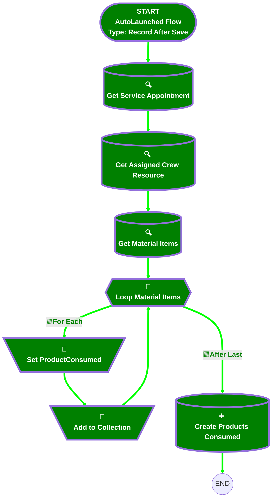

<b>🟩# [Work Order][After-Save][Record-Triggered] Assign Products Consumed</b>

## 🟩Flow Diagram

```mermaid
%% If you read this, your Markdown visualizer does not handle MermaidJS syntax.
%% - If you are in VsCode, install extension `Markdown Preview Mermaid Support` at https://marketplace.visualstudio.com/items?itemName=bierner.markdown-mermaid
%% - If you are using sfdx-hardis, try to define env variable `MERMAID_MODES=cli,docker` ,then run again the command to regenerate markdown with SVG images.
%% - If you are within mkdocs-material, define mermaid plugin in `mkdocs.yml` as described in https://squidfunk.github.io/mkdocs-material/extensions/mermaid/
%% - At last resort, you can copy-paste this MermaidJS code in https://mermaid.live/ to see the Flow Diagram

flowchart TB
START(["<b>START<br/><b>AutoLaunched Flow</b></br>Type: <b> Record After Save</b></b>"]):::startClassAdded
click START "#general-information" "1878252856"

Add_to_Collection[\"<b>🟰 <em></em><br/>Add to Collection</b>"/]:::assignmentsAdded
click Add_to_Collection "#add_to_collection" "349013536"

Set_ProductConsumed[\"<b>🟰 <em></em><br/>Set ProductConsumed</b>"/]:::assignmentsAdded
click Set_ProductConsumed "#set_productconsumed" "2512355329"

Loop_Material_Items{{"<b>🔁 <em></em><br/>Loop Material Items</b>"}}:::loopsAdded
click Loop_Material_Items "#loop_material_items" "2738472502"

Create_Products_Consumed[("<b>➕ <em></em><br/>Create Products Consumed</b>")]:::recordCreatesAdded
click Create_Products_Consumed "#create_products_consumed" "497010901"

Get_Assigned_Crew_Resource[("<b>🔍 <em></em><br/>Get Assigned Crew Resource</b>")]:::recordLookupsAdded
click Get_Assigned_Crew_Resource "#get_assigned_crew_resource" "3905967631"

Get_Material_Items[("<b>🔍 <em></em><br/>Get Material Items</b>")]:::recordLookupsAdded
click Get_Material_Items "#get_material_items" "4243110491"

Get_Service_Appointment[("<b>🔍 <em></em><br/>Get Service Appointment</b>")]:::recordLookupsAdded
click Get_Service_Appointment "#get_service_appointment" "892165293"

Add_to_Collection ==> Loop_Material_Items
Set_ProductConsumed ==> Add_to_Collection
Loop_Material_Items ==> |"🟩<b>For Each</b>"|Set_ProductConsumed
Loop_Material_Items ===> |"🟩<b>After Last</b>"|Create_Products_Consumed
Create_Products_Consumed ==> END_Create_Products_Consumed
Get_Assigned_Crew_Resource ==> Get_Material_Items
Get_Material_Items ==> Loop_Material_Items
Get_Service_Appointment ==> Get_Assigned_Crew_Resource
START ==>  Get_Service_Appointment
END_Create_Products_Consumed(( END )):::endClassAdded


classDef actionCalls fill:#D4E4FC,color:black,text-decoration:none,max-height:100px
classDef assignments fill:#FBEED7,color:black,text-decoration:none,max-height:100px
classDef collectionProcessors fill:#F0E3FA,color:black,text-decoration:none,max-height:100px
classDef customErrors fill:#FFE9E9,color:black,text-decoration:none,max-height:100px
classDef decisions fill:#FDEAF6,color:black,text-decoration:none,max-height:100px
classDef loops fill:#FDEAF6,color:black,text-decoration:none,max-height:100px
classDef recordCreates fill:#FFF8C9,color:black,text-decoration:none,max-height:100px
classDef recordDeletes fill:#FFF8C9,color:black,text-decoration:none,max-height:100px
classDef recordLookups fill:#EDEAFF,color:black,text-decoration:none,max-height:100px
classDef recordUpdates fill:#FFF8C9,color:black,text-decoration:none,max-height:100px
classDef screens fill:#DFF6FF,color:black,text-decoration:none,max-height:100px
classDef subflows fill:#D4E4FC,color:black,text-decoration:none,max-height:100px
classDef startClass fill:#D9F2E6,color:black,text-decoration:none,max-height:100px
classDef endClass fill:#F9BABA,color:black,text-decoration:none,max-height:100px


classDef actionCallsAdded fill:green,color:white,stroke-width:4px,text-decoration:none,max-height:100px
classDef assignmentsAdded fill:green,color:white,stroke-width:4px,text-decoration:none,max-height:100px
classDef collectionProcessorsAdded fill:green,color:white,stroke-width:4px,text-decoration:none,max-height:100px
classDef customErrorsAdded fill:green,color:white,stroke-width:4px,text-decoration:none,max-height:100px
classDef decisionsAdded fill:green,color:white,stroke-width:4px,text-decoration:none,max-height:100px
classDef loopsAdded fill:green,color:white,stroke-width:4px,text-decoration:none,max-height:100px
classDef recordCreatesAdded fill:green,color:white,stroke-width:4px,text-decoration:none,max-height:100px
classDef recordDeletesAdded fill:green,color:white,stroke-width:4px,text-decoration:none,max-height:100px
classDef recordLookupsAdded fill:green,color:white,stroke-width:4px,text-decoration:none,max-height:100px
classDef recordUpdatesAdded fill:green,color:white,stroke-width:4px,text-decoration:none,max-height:100px
classDef screensAdded fill:green,color:white,stroke-width:4px,text-decoration:none,max-height:100px
classDef subflowsAdded fill:green,color:white,stroke-width:4px,text-decoration:none,max-height:100px
classDef startClassAdded fill:green,color:white,stroke-width:4px,text-decoration:none,max-height:100px

classDef actionCallsRemoved fill:red,color:white,stroke-width:4px,text-decoration:none,max-height:100px
classDef assignmentsRemoved fill:red,color:white,stroke-width:4px,text-decoration:none,max-height:100px
classDef collectionProcessorsRemoved fill:red,color:white,stroke-width:4px,text-decoration:none,max-height:100px
classDef customErrorsRemoved fill:red,color:white,stroke-width:4px,text-decoration:none,max-height:100px
classDef decisionsRemoved fill:red,color:white,stroke-width:4px,text-decoration:none,max-height:100px
classDef loopsRemoved fill:red,color:white,stroke-width:4px,text-decoration:none,max-height:100px
classDef recordCreatesRemoved fill:red,color:white,stroke-width:4px,text-decoration:none,max-height:100px
classDef recordDeletesRemoved fill:red,color:white,stroke-width:4px,text-decoration:none,max-height:100px
classDef recordLookupsRemoved fill:red,color:white,stroke-width:4px,text-decoration:none,max-height:100px
classDef recordUpdatesRemoved fill:red,color:white,stroke-width:4px,text-decoration:none,max-height:100px
classDef screensRemoved fill:red,color:white,stroke-width:4px,text-decoration:none,max-height:100px
classDef subflowsRemoved fill:red,color:white,stroke-width:4px,text-decoration:none,max-height:100px
classDef startClassRemoved fill:red,color:white,stroke-width:4px,text-decoration:none,max-height:100px

classDef actionCallsChanged fill:orange,color:white,stroke-width:4px,text-decoration:none,max-height:100px
classDef assignmentsChanged fill:orange,color:white,stroke-width:4px,text-decoration:none,max-height:100px
classDef collectionProcessorsChanged fill:orange,color:white,stroke-width:4px,text-decoration:none,max-height:100px
classDef customErrorsChanged fill:orange,color:white,stroke-width:4px,text-decoration:none,max-height:100px
classDef decisionsChanged fill:orange,color:white,stroke-width:4px,text-decoration:none,max-height:100px
classDef loopsChanged fill:orange,color:white,stroke-width:4px,text-decoration:none,max-height:100px
classDef recordCreatesChanged fill:orange,color:white,stroke-width:4px,text-decoration:none,max-height:100px
classDef recordDeletesChanged fill:orange,color:white,stroke-width:4px,text-decoration:none,max-height:100px
classDef recordLookupsChanged fill:orange,color:white,stroke-width:4px,text-decoration:none,max-height:100px
classDef recordUpdatesChanged fill:orange,color:white,stroke-width:4px,text-decoration:none,max-height:100px
classDef screensChanged fill:orange,color:white,stroke-width:4px,text-decoration:none,max-height:100px
classDef subflowsChanged fill:orange,color:white,stroke-width:4px,text-decoration:none,max-height:100px
classDef startClassChanged fill:orange,color:white,stroke-width:4px,text-decoration:none,max-height:100px
  
linkStyle 0,1,2,3,4,5,6,7,8 stroke:#00ff00,stroke-width:4px,color:green;
```

<b>🟩<!-- Flow description --></b>

## 🟩General Information

|🟩<b><!-- --></b>|<b><!-- --></b>|
|:---|:---|
|🟩<b>Object</b>|<b>WorkOrder</b>|
|🟩<b>Process Type</b>|<b> Auto Launched Flow</b>|
|🟩<b>Trigger Type</b>|<b> Record After Save</b>|
|🟩<b>Record Trigger Type</b>|<b> Update</b>|
|🟩<b>Label</b>|<b>[Work Order][After-Save][Record-Triggered] Assign Products Consumed</b>|
|🟩<b>Status</b>|<b>Active</b>|
|🟩<b>Environments</b>|<b>Default</b>|
|🟩<b>Interview Label</b>|<b>[Work Order][After-Save][Record-Triggered] Assign Products Consumed {!$Flow.CurrentDateTime}</b>|
|🟩<b> Builder Type (PM)</b>|<b>LightningFlowBuilder</b>|
|🟩<b> Canvas Mode (PM)</b>|<b>AUTO_LAYOUT_CANVAS</b>|
|🟩<b> Origin Builder Type (PM)</b>|<b>LightningFlowBuilder</b>|
|🟩<b>Connector</b>|<b>[Get_Service_Appointment](#get_service_appointment)</b>|
|🟩<b>Next Node</b>|<b>[Get_Service_Appointment](#get_service_appointment)</b>|

#### 🟩Filters (logic: **and**)

|🟩<b>Filter Id</b>|<b>Field</b>|<b>Operator</b>|<b>Value</b>|
|:-- |:-- |:--:|:--: |
|🟩<b>1</b>|<b>Status</b>|<b> Is Changed</b>|<b>✅</b>|
|🟩<b>2</b>|<b>Status</b>|<b> Equal To</b>|<b>Scheduled</b>|
|🟩<b>3</b>|<b>Production_Work__c</b>|<b> Equal To</b>|<b>✅</b>|

## 🟩Variables

|🟩<b>Name</b>|<b>Data Type</b>|<b>Is Collection</b>|<b>Is Input</b>|<b>Is Output</b>|<b>Object Type</b>|<b>Description</b>|
|:-- |:--:|:--:|:--:|:--:|:--:|:--  |
|🟩<b>productConsumed</b>|<b>SObject</b>|<b>⬜</b>|<b>⬜</b>|<b>⬜</b>|<b>ProductConsumed</b>|<b><!-- --></b>|
|🟩<b>productConsumedCollection</b>|<b>SObject</b>|<b>✅</b>|<b>⬜</b>|<b>⬜</b>|<b>ProductConsumed</b>|<b><!-- --></b>|

## 🟩Flow Nodes Details

### 🟩Add_to_Collection

|🟩<b><!-- --></b>|<b><!-- --></b>|
|:---|:---|
|🟩<b>Type</b>|<b>Assignment</b>|
|🟩<b>Label</b>|<b>Add to Collection</b>|
|🟩<b>Connector</b>|<b>[Loop_Material_Items](#loop_material_items)</b>|

#### 🟩Assignments

|🟩<b>Assign To Reference</b>|<b>Operator</b>|<b>Value</b>|
|:-- |:--:|:--: |
|🟩<b>productConsumedCollection</b>|<b> Add</b>|<b>productConsumed</b>|

### 🟩Set_ProductConsumed

|🟩<b><!-- --></b>|<b><!-- --></b>|
|:---|:---|
|🟩<b>Type</b>|<b>Assignment</b>|
|🟩<b>Label</b>|<b>Set ProductConsumed</b>|
|🟩<b>Connector</b>|<b>[Add_to_Collection](#add_to_collection)</b>|

#### 🟩Assignments

|🟩<b>Assign To Reference</b>|<b>Operator</b>|<b>Value</b>|
|:-- |:--:|:--: |
|🟩<b>productConsumed.WorkOrderId</b>|<b> Assign</b>|<b>$Record.Id</b>|
|🟩<b>productConsumed.ProductItemId</b>|<b> Assign</b>|<b>Loop_Material_Items.Id</b>|
|🟩<b>productConsumed.QuantityConsumed</b>|<b> Assign</b>|<b>1</b>|

### 🟩Loop_Material_Items

|🟩<b><!-- --></b>|<b><!-- --></b>|
|:---|:---|
|🟩<b>Type</b>|<b>Loop</b>|
|🟩<b>Label</b>|<b>Loop Material Items</b>|
|🟩<b>Collection Reference</b>|<b>[Get_Material_Items](#get_material_items)</b>|
|🟩<b>Iteration Order</b>|<b>Asc</b>|
|🟩<b>Next Value Connector</b>|<b>[Set_ProductConsumed](#set_productconsumed)</b>|
|🟩<b>No More Values Connector</b>|<b>[Create_Products_Consumed](#create_products_consumed)</b>|

### 🟩Create_Products_Consumed

|🟩<b><!-- --></b>|<b><!-- --></b>|
|:---|:---|
|🟩<b>Type</b>|<b>Record Create</b>|
|🟩<b>Label</b>|<b>Create Products Consumed</b>|
|🟩<b>Input Reference</b>|<b>productConsumedCollection</b>|

### 🟩Get_Assigned_Crew_Resource

|🟩<b><!-- --></b>|<b><!-- --></b>|
|:---|:---|
|🟩<b>Type</b>|<b>Record Lookup</b>|
|🟩<b>Object</b>|<b>AssignedResource</b>|
|🟩<b>Label</b>|<b>Get Assigned Crew Resource</b>|
|🟩<b>Assign Null Values If No Records Found</b>|<b>⬜</b>|
|🟩<b>Get First Record Only</b>|<b>✅</b>|
|🟩<b>Store Output Automatically</b>|<b>✅</b>|
|🟩<b>Connector</b>|<b>[Get_Material_Items](#get_material_items)</b>|

#### 🟩Filters (logic: **and**)

|🟩<b>Filter Id</b>|<b>Field</b>|<b>Operator</b>|<b>Value</b>|
|:-- |:-- |:--:|:--: |
|🟩<b>1</b>|<b>ServiceAppointmentId</b>|<b> Equal To</b>|<b>Get_Service_Appointment.Id</b>|
|🟩<b>2</b>|<b>Resource_Is_A_Person__c</b>|<b> Equal To</b>|<b>⬜</b>|

### 🟩Get_Material_Items

|🟩<b><!-- --></b>|<b><!-- --></b>|
|:---|:---|
|🟩<b>Type</b>|<b>Record Lookup</b>|
|🟩<b>Object</b>|<b>ProductItem</b>|
|🟩<b>Label</b>|<b>Get Material Items</b>|
|🟩<b>Assign Null Values If No Records Found</b>|<b>⬜</b>|
|🟩<b>Get First Record Only</b>|<b>⬜</b>|
|🟩<b>Store Output Automatically</b>|<b>✅</b>|
|🟩<b>Connector</b>|<b>[Loop_Material_Items](#loop_material_items)</b>|

#### 🟩Filters (logic: **and**)

|🟩<b>Filter Id</b>|<b>Field</b>|<b>Operator</b>|<b>Value</b>|
|:-- |:-- |:--:|:--: |
|🟩<b>1</b>|<b>LocationId</b>|<b> Equal To</b>|<b>Get_Assigned_Crew_Resource.ServiceResource.LocationId</b>|
|🟩<b>2</b>|<b>Is_Temporary__c</b>|<b> Equal To</b>|<b>⬜</b>|

### 🟩Get_Service_Appointment

|🟩<b><!-- --></b>|<b><!-- --></b>|
|:---|:---|
|🟩<b>Type</b>|<b>Record Lookup</b>|
|🟩<b>Object</b>|<b>ServiceAppointment</b>|
|🟩<b>Label</b>|<b>Get Service Appointment</b>|
|🟩<b>Assign Null Values If No Records Found</b>|<b>⬜</b>|
|🟩<b>Get First Record Only</b>|<b>✅</b>|
|🟩<b>Store Output Automatically</b>|<b>✅</b>|
|🟩<b>Connector</b>|<b>[Get_Assigned_Crew_Resource](#get_assigned_crew_resource)</b>|

#### 🟩Filters (logic: **and**)

|🟩<b>Filter Id</b>|<b>Field</b>|<b>Operator</b>|<b>Value</b>|
|:-- |:-- |:--:|:--: |
|🟩<b>1</b>|<b>ParentRecordId</b>|<b> Equal To</b>|<b>$Record.Id</b>|

___

<b>🟩_Documentation generated from branch monitoring_krinkelsgreencare__upeodev_sandbox by [sfdx-hardis](https://sfdx-hardis.cloudity.com), featuring [salesforce-flow-visualiser](https://github.com/toddhalfpenny/salesforce-flow-visualiser)_</b>