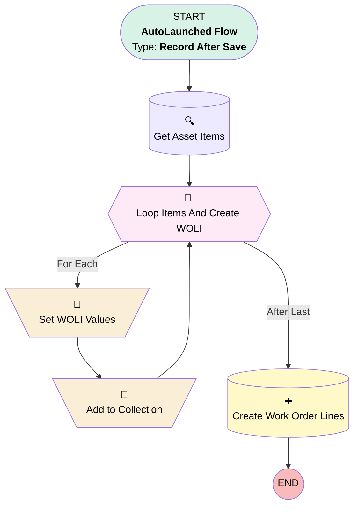

# [Work Order][After-Save][Record-Triggered] Assign Work Order Lines

## Flow Diagram

## General Information

|<!-- -->|<!-- -->|
|:---|:---|
|Object|WorkOrder|
|Process Type| Auto Launched Flow|
|Trigger Type| Record After Save|
|Record Trigger Type| Update|
|Label|[Work Order][After-Save][Record-Triggered] Assign Work Order Lines|
|Status|Active|
|Environments|Default|
|Interview Label|[Work Order][After-Save][Record-Triggered] Assign Work Order Lines {!$Flow.CurrentDateTime}|
| Builder Type (PM)|LightningFlowBuilder|
| Canvas Mode (PM)|AUTO_LAYOUT_CANVAS|
| Origin Builder Type (PM)|LightningFlowBuilder|
|Connector|[Get_Asset_Items](#get_asset_items)|
|Next Node|[Get_Asset_Items](#get_asset_items)|

#### Filters (logic: **and**)

|Filter Id|Field|Operator|Value|
|:-- |:-- |:--:|:--: |
|1|Status| Is Changed|✅|
|2|Status| Equal To|Scheduled|

## Variables

|Name|Data Type|Is Collection|Is Input|Is Output|Object Type|Description|
|:-- |:--:|:--:|:--:|:--:|:--:|:--  |
|WorkOrderLine|SObject|⬜|⬜|⬜|WorkOrderLineItem|<!-- -->|
|WorkOrderLineItems|SObject|✅|⬜|⬜|WorkOrderLineItem|<!-- -->|

## Flow Nodes Details

### Add_to_Collection

|<!-- -->|<!-- -->|
|:---|:---|
|Type|Assignment|
|Label|Add to Collection|
|Connector|[Loop_Items_And_Create_WOLI](#loop_items_and_create_woli)|

#### Assignments

|Assign To Reference|Operator|Value|
|:-- |:--:|:--: |
|WorkOrderLineItems| Add|WorkOrderLine|

### Set_WOLI_Values

|<!-- -->|<!-- -->|
|:---|:---|
|Type|Assignment|
|Label|Set WOLI Values|
|Connector|[Add_to_Collection](#add_to_collection)|

#### Assignments

|Assign To Reference|Operator|Value|
|:-- |:--:|:--: |
|WorkOrderLine.WorkOrderId| Assign|$Record.Id|
|WorkOrderLine.Description| Assign|Loop_Items_And_Create_WOLI.Name|
|WorkOrderLine.Status| Assign|New|

### Loop_Items_And_Create_WOLI

|<!-- -->|<!-- -->|
|:---|:---|
|Type|Loop|
|Label|Loop Items And Create WOLI|
|Collection Reference|[Get_Asset_Items](#get_asset_items)|
|Iteration Order|Asc|
|Next Value Connector|[Set_WOLI_Values](#set_woli_values)|
|No More Values Connector|[Create_Work_Order_Lines](#create_work_order_lines)|

### Create_Work_Order_Lines

|<!-- -->|<!-- -->|
|:---|:---|
|Type|Record Create|
|Label|Create Work Order Lines|
|Input Reference|WorkOrderLineItems|

### Get_Asset_Items

|<!-- -->|<!-- -->|
|:---|:---|
|Type|Record Lookup|
|Object|Service_Item__c|
|Label|Get Asset Items|
|Assign Null Values If No Records Found|⬜|
|Get First Record Only|⬜|
|Store Output Automatically|✅|
|Connector|[Loop_Items_And_Create_WOLI](#loop_items_and_create_woli)|

#### Filters (logic: **and**)

|Filter Id|Field|Operator|Value|
|:-- |:-- |:--:|:--: |
|1|Service__c| Equal To|$Record.AssetId|

___

_Documentation generated from branch monitoring_krinkelsgreencare__upeodev_sandbox by [sfdx-hardis](https://sfdx-hardis.cloudity.com), featuring [salesforce-flow-visualiser](https://github.com/toddhalfpenny/salesforce-flow-visualiser)_