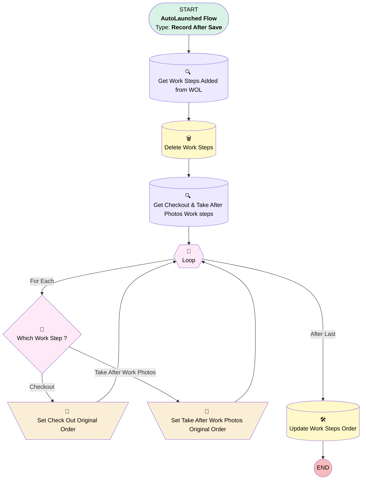

# [Work Order][After-Save][Record-Triggered] Delete Work Steps

## Flow Diagram

## General Information

|<!-- -->|<!-- -->|
|:---|:---|
|Object|WorkOrder|
|Process Type| Auto Launched Flow|
|Trigger Type| Record After Save|
|Record Trigger Type| Update|
|Label|[Work Order][After-Save][Record-Triggered] Delete Work Steps|
|Status|Active|
|Filter Formula|TEXT({!$Record__Prior.Status}) = "Dispatched" &&  (TEXT({!$Record.Status}) = "Unscheduled" || TEXT({!$Record.Status}) = "Scheduled")|
|Description|This flow deletes the work steps when the work order status changes from 'Dispatched' to either 'Unscheduled' or 'Scheduled'.|
|Environments|Default|
|Interview Label|[Work Order][After-Save][Record-Triggered] Delete Work Steps {!$Flow.CurrentDateTime}|
| Builder Type (PM)|LightningFlowBuilder|
| Canvas Mode (PM)|AUTO_LAYOUT_CANVAS|
| Origin Builder Type (PM)|LightningFlowBuilder|
|Connector|[Get_Work_Steps_Added_from_WOL](#get_work_steps_added_from_wol)|
|Next Node|[Get_Work_Steps_Added_from_WOL](#get_work_steps_added_from_wol)|

## Variables

|Name|Data Type|Is Collection|Is Input|Is Output|Object Type|Description|
|:-- |:--:|:--:|:--:|:--:|:--:|:--  |
|WorkStepCollection|SObject|✅|✅|⬜|WorkStep|<!-- -->|
|WorkStepRecord|SObject|⬜|✅|⬜|WorkStep|<!-- -->|

## Flow Nodes Details

### Set_Check_Out_Original_Order

|<!-- -->|<!-- -->|
|:---|:---|
|Type|Assignment|
|Label|Set Check Out Original Order|
|Connector|[Loop](#loop)|

#### Assignments

|Assign To Reference|Operator|Value|
|:-- |:--:|:--: |
|WorkStepRecord.Id| Assign|Loop.Id|
|WorkStepRecord.ExecutionOrder| Assign|21|
|WorkStepCollection| Add|WorkStepRecord|

### Set_Take_After_Work_Photos_Original_Order

|<!-- -->|<!-- -->|
|:---|:---|
|Type|Assignment|
|Label|Set Take After Work Photos Original Order|
|Connector|[Loop](#loop)|

#### Assignments

|Assign To Reference|Operator|Value|
|:-- |:--:|:--: |
|WorkStepRecord.Id| Assign|Loop.Id|
|WorkStepRecord.ExecutionOrder| Assign|20|
|WorkStepCollection| Add|WorkStepRecord|

### Which_Work_Step

|<!-- -->|<!-- -->|
|:---|:---|
|Type|Decision|
|Label|Which Work Step ?|
|Default Connector|[Set_Take_After_Work_Photos_Original_Order](#set_take_after_work_photos_original_order)|
|Default Connector Label|Take After Work Photos|

#### Rule Checkout (Checkout)

|<!-- -->|<!-- -->|
|:---|:---|
|Connector|[Set_Check_Out_Original_Order](#set_check_out_original_order)|
|Condition Logic|and|

|Condition Id|Left Value Reference|Operator|Right Value|
|:-- |:-- |:--:|:--: |
|1|Loop.Name| Equal To|Check Out|

### Loop

|<!-- -->|<!-- -->|
|:---|:---|
|Type|Loop|
|Label|[Loop](#loop)|
|Collection Reference|[Get_Checkout_Take_After_Photos_Work_steps](#get_checkout_take_after_photos_work_steps)|
|Iteration Order|Asc|
|Next Value Connector|[Which_Work_Step](#which_work_step)|
|No More Values Connector|[Update_Work_Steps_Order](#update_work_steps_order)|

### Delete_Work_Steps

|<!-- -->|<!-- -->|
|:---|:---|
|Type|Record Delete|
|Label|Delete Work Steps|
|Input Reference|[Get_Work_Steps_Added_from_WOL](#get_work_steps_added_from_wol)|
|Connector|[Get_Checkout_Take_After_Photos_Work_steps](#get_checkout_take_after_photos_work_steps)|

### Get_Checkout_Take_After_Photos_Work_steps

|<!-- -->|<!-- -->|
|:---|:---|
|Type|Record Lookup|
|Object|WorkStep|
|Label|Get Checkout & Take After Photos Work steps|
|Assign Null Values If No Records Found|⬜|
|Get First Record Only|⬜|
|Store Output Automatically|✅|
|Connector|[Loop](#loop)|

#### Filters (logic: **1 AND (2 OR 3)**)

|Filter Id|Field|Operator|Value|
|:-- |:-- |:--:|:--: |
|1|WorkOrderId| Equal To|$Record.Id|
|2|Name| Equal To|Take After Work Photos|
|3|Name| Equal To|Check Out|

### Get_Work_Steps_Added_from_WOL

|<!-- -->|<!-- -->|
|:---|:---|
|Type|Record Lookup|
|Object|WorkStep|
|Label|Get Work Steps Added from WOL|
|Assign Null Values If No Records Found|⬜|
|Get First Record Only|⬜|
|Store Output Automatically|✅|
|Connector|[Delete_Work_Steps](#delete_work_steps)|

#### Filters (logic: **and**)

|Filter Id|Field|Operator|Value|
|:-- |:-- |:--:|:--: |
|1|WorkOrderId| Equal To|$Record.Id|
|2|Added_from_WOL__c| Equal To|✅|

### Update_Work_Steps_Order

|<!-- -->|<!-- -->|
|:---|:---|
|Type|Record Update|
|Label|Update Work Steps Order|
|Input Reference|WorkStepCollection|

___

_Documentation generated from branch monitoring_krinkelsgreencare__upeodev_sandbox by [sfdx-hardis](https://sfdx-hardis.cloudity.com), featuring [salesforce-flow-visualiser](https://github.com/toddhalfpenny/salesforce-flow-visualiser)_