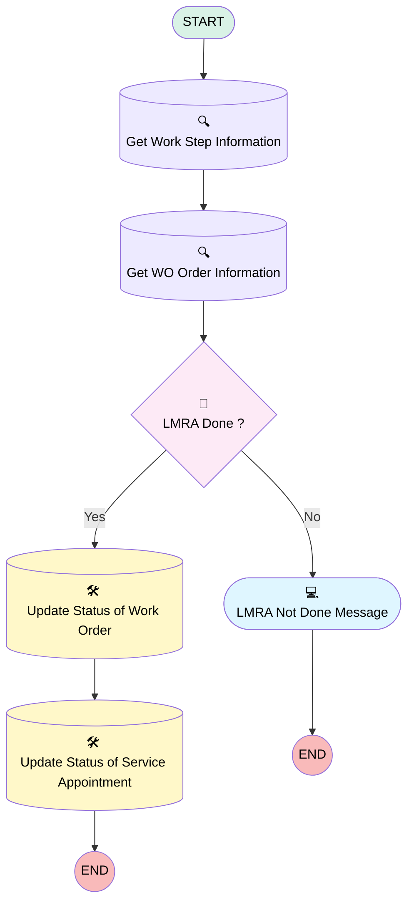

# [Work Order][Mobile Flow] Check Out

## Flow Diagram

## General Information

|<!-- -->|<!-- -->|
|:---|:---|
|Process Type| Field Service Mobile|
|Label|[Work Order][Mobile Flow] Check Out|
|Status|Active|
|Description|This flow updates the status of the work order and the related service appointment to ‘In Progress’.|
|Environments|Default|
|Interview Label|[Work Order][Mobile Flow] Check Out {!$Flow.CurrentDateTime}|
| Builder Type (PM)|LightningFlowBuilder|
| Canvas Mode (PM)|AUTO_LAYOUT_CANVAS|
| Origin Builder Type (PM)|LightningFlowBuilder|
|Connector|[Get_Work_Step_Information](#get_work_step_information)|
|Next Node|[Get_Work_Step_Information](#get_work_step_information)|

## Variables

|Name|Data Type|Is Collection|Is Input|Is Output|Object Type|
|:-- |:--:|:--:|:--:|:--:|:--: |
|Id|String|⬜|✅|✅|<!-- -->|
|WorkOrderRecord|SObject|⬜|✅|⬜|WorkOrder|
|WorkStepRecord|SObject|⬜|✅|⬜|WorkStep|

## Flow Nodes Details

### LMRA_Done

|<!-- -->|<!-- -->|
|:---|:---|
|Type|Decision|
|Label|LMRA Done ?|
|Default Connector|[LMRA_Not_Done_Message](#lmra_not_done_message)|
|Default Connector Label|No|

#### Rule Yes (Yes)

|<!-- -->|<!-- -->|
|:---|:---|
|Connector|[Update_Status_of_Work_Order](#update_status_of_work_order)|
|Condition Logic|and|

|Condition Id|Left Value Reference|Operator|Right Value|
|:-- |:-- |:--:|:--: |
|1|WorkOrderRecord.LMRA_Done__c| Equal To|✅|

### Get_WO_Order_Information

|<!-- -->|<!-- -->|
|:---|:---|
|Type|Record Lookup|
|Object|WorkOrder|
|Label|Get WO Order Information|
|Assign Null Values If No Records Found|⬜|
|Output Reference|WorkOrderRecord|
|Queried Fields|- Id - LMRA_Done__c |
|Connector|[LMRA_Done](#lmra_done)|

#### Filters (logic: **and**)

|Filter Id|Field|Operator|Value|
|:-- |:-- |:--:|:--: |
|1|Id| Equal To|WorkStepRecord.WorkOrderId|

### Get_Work_Step_Information

|<!-- -->|<!-- -->|
|:---|:---|
|Type|Record Lookup|
|Object|WorkStep|
|Label|Get Work Step Information|
|Assign Null Values If No Records Found|⬜|
|Output Reference|WorkStepRecord|
|Queried Fields|Id|
|Connector|[Get_WO_Order_Information](#get_wo_order_information)|

#### Filters (logic: **and**)

|Filter Id|Field|Operator|Value|
|:-- |:-- |:--:|:--: |
|1|Id| Equal To|Id|

### Update_Status_of_Service_Appointment

|<!-- -->|<!-- -->|
|:---|:---|
|Type|Record Update|
|Object|ServiceAppointment|
|Label|Update Status of Service Appointment|

#### Filters (logic: **and**)

|Filter Id|Field|Operator|Value|
|:-- |:-- |:--:|:--: |
|1|ParentRecordId| Equal To|Id|

#### Input Assignments

|Field|Value|
|:-- |:--: |
|Status|Completed|

### Update_Status_of_Work_Order

|<!-- -->|<!-- -->|
|:---|:---|
|Type|Record Update|
|Object|WorkOrder|
|Label|Update Status of Work Order|
|Connector|[Update_Status_of_Service_Appointment](#update_status_of_service_appointment)|

#### Filters (logic: **and**)

|Filter Id|Field|Operator|Value|
|:-- |:-- |:--:|:--: |
|1|Id| Equal To|Id|

#### Input Assignments

|Field|Value|
|:-- |:--: |
|Status|Completed|

### LMRA_Not_Done_Message

|<!-- -->|<!-- -->|
|:---|:---|
|Type|Screen|
|Label|LMRA Not Done Message|
|Allow Back|⬜|
|Allow Finish|✅|
|Allow Pause|⬜|
|Next Or Finish Button Label|Close|
|Show Footer|✅|
|Show Header|⬜|

#### LMRANotDoneMessage

|<!-- -->|<!-- -->|
|:---|:---|
|Field Text|
The LMRA has not been done. Please do this before closing this work order.
|
|Field Type| Display Text|

___

_Documentation generated from branch monitoring_krinkelsgreencare__upeodev_sandbox by [sfdx-hardis](https://sfdx-hardis.cloudity.com), featuring [salesforce-flow-visualiser](https://github.com/toddhalfpenny/salesforce-flow-visualiser)_