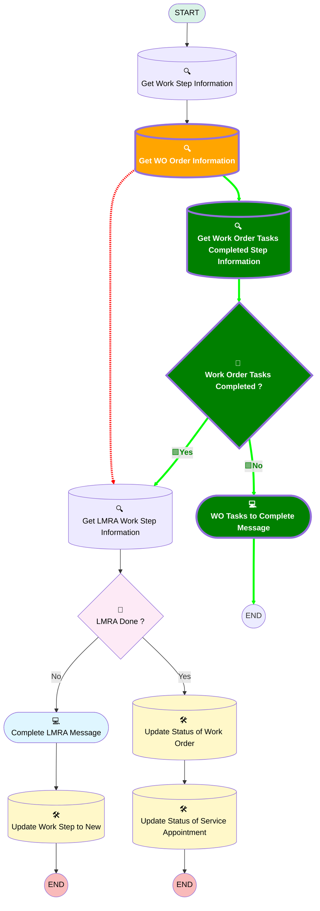

# [Work Order][Mobile Flow] Check Out

## Flow Diagram

```mermaid
%% If you read this, your Markdown visualizer does not handle MermaidJS syntax.
%% - If you are in VsCode, install extension `Markdown Preview Mermaid Support` at https://marketplace.visualstudio.com/items?itemName=bierner.markdown-mermaid
%% - If you are using sfdx-hardis, try to define env variable `MERMAID_MODES=cli,docker` ,then run again the command to regenerate markdown with SVG images.
%% - If you are within mkdocs-material, define mermaid plugin in `mkdocs.yml` as described in https://squidfunk.github.io/mkdocs-material/extensions/mermaid/
%% - At last resort, you can copy-paste this MermaidJS code in https://mermaid.live/ to see the Flow Diagram

flowchart TB
START(["START"]):::startClass
click START "#general-information" "422881515"

LMRA_Done{"🔀 <em></em><br/>LMRA Done ?"}:::decisions
click LMRA_Done "#lmra_done" "2020599569"


Work_Order_Tasks_Completed{"<b>🔀 <em></em><br/>Work Order Tasks Completed ?</b>"}:::decisionsAdded
click Work_Order_Tasks_Completed "#work_order_tasks_completed" "2166549268"


Get_LMRA_Work_Step_Information[("🔍 <em></em><br/>Get LMRA Work Step Information")]:::recordLookups
click Get_LMRA_Work_Step_Information "#get_lmra_work_step_information" "1781930665"

Get_WO_Order_Information[("<b>🔍 <em></em><br/>Get WO Order Information</b>")]:::recordLookupsChanged


click Get_WO_Order_Information "#get_wo_order_information" "3272715510"


Get_Work_Order_Tasks_Completed_Step_Information[("<b>🔍 <em></em><br/>Get Work Order Tasks Completed Step Information</b>")]:::recordLookupsAdded
click Get_Work_Order_Tasks_Completed_Step_Information "#get_work_order_tasks_completed_step_information" "3098385536"


Get_Work_Step_Information[("🔍 <em></em><br/>Get Work Step Information")]:::recordLookups
click Get_Work_Step_Information "#get_work_step_information" "3727188450"

Update_Status_of_Service_Appointment[("🛠️ <em></em><br/>Update Status of Service Appointment")]:::recordUpdates
click Update_Status_of_Service_Appointment "#update_status_of_service_appointment" "2008591544"

Update_Status_of_Work_Order[("🛠️ <em></em><br/>Update Status of Work Order")]:::recordUpdates
click Update_Status_of_Work_Order "#update_status_of_work_order" "3878701233"

Update_Work_Step_to_New[("🛠️ <em></em><br/>Update Work Step to New")]:::recordUpdates
click Update_Work_Step_to_New "#update_work_step_to_new" "2179782203"

Complete_LMRA_Message(["💻 <em></em><br/>Complete LMRA Message"]):::screens
click Complete_LMRA_Message "#complete_lmra_message" "3411231437"


WO_Tasks_to_Complete_Message(["<b>💻 <em></em><br/>WO Tasks to Complete Message</b>"]):::screensAdded
click WO_Tasks_to_Complete_Message "#wo_tasks_to_complete_message" "3310705615"


LMRA_Done --> |"No"| Complete_LMRA_Message
LMRA_Done --> |"Yes"| Update_Status_of_Work_Order

Work_Order_Tasks_Completed ==> |"🟩<b>No</b>"| WO_Tasks_to_Complete_Message
Work_Order_Tasks_Completed ==> |"🟩<b>Yes</b>"| Get_LMRA_Work_Step_Information

Get_LMRA_Work_Step_Information --> LMRA_Done

Get_WO_Order_Information -.-> Get_LMRA_Work_Step_Information

Get_WO_Order_Information ==> Get_Work_Order_Tasks_Completed_Step_Information
Get_Work_Order_Tasks_Completed_Step_Information ==> Work_Order_Tasks_Completed

Get_Work_Step_Information --> Get_WO_Order_Information
Update_Status_of_Service_Appointment --> END_Update_Status_of_Service_Appointment
Update_Status_of_Work_Order --> Update_Status_of_Service_Appointment
Update_Work_Step_to_New --> END_Update_Work_Step_to_New
Complete_LMRA_Message --> Update_Work_Step_to_New

WO_Tasks_to_Complete_Message ==> END_WO_Tasks_to_Complete_Message

START -->  Get_Work_Step_Information
END_Update_Status_of_Service_Appointment(( END )):::endClass
END_Update_Work_Step_to_New(( END )):::endClass

END_WO_Tasks_to_Complete_Message(( END )):::endClassAdded


classDef actionCalls fill:#D4E4FC,color:black,text-decoration:none,max-height:100px
classDef assignments fill:#FBEED7,color:black,text-decoration:none,max-height:100px
classDef collectionProcessors fill:#F0E3FA,color:black,text-decoration:none,max-height:100px
classDef customErrors fill:#FFE9E9,color:black,text-decoration:none,max-height:100px
classDef decisions fill:#FDEAF6,color:black,text-decoration:none,max-height:100px
classDef loops fill:#FDEAF6,color:black,text-decoration:none,max-height:100px
classDef recordCreates fill:#FFF8C9,color:black,text-decoration:none,max-height:100px
classDef recordDeletes fill:#FFF8C9,color:black,text-decoration:none,max-height:100px
classDef recordLookups fill:#EDEAFF,color:black,text-decoration:none,max-height:100px
classDef recordUpdates fill:#FFF8C9,color:black,text-decoration:none,max-height:100px
classDef screens fill:#DFF6FF,color:black,text-decoration:none,max-height:100px
classDef subflows fill:#D4E4FC,color:black,text-decoration:none,max-height:100px
classDef startClass fill:#D9F2E6,color:black,text-decoration:none,max-height:100px
classDef endClass fill:#F9BABA,color:black,text-decoration:none,max-height:100px


classDef actionCallsAdded fill:green,color:white,stroke-width:4px,text-decoration:none,max-height:100px
classDef assignmentsAdded fill:green,color:white,stroke-width:4px,text-decoration:none,max-height:100px
classDef collectionProcessorsAdded fill:green,color:white,stroke-width:4px,text-decoration:none,max-height:100px
classDef customErrorsAdded fill:green,color:white,stroke-width:4px,text-decoration:none,max-height:100px
classDef decisionsAdded fill:green,color:white,stroke-width:4px,text-decoration:none,max-height:100px
classDef loopsAdded fill:green,color:white,stroke-width:4px,text-decoration:none,max-height:100px
classDef recordCreatesAdded fill:green,color:white,stroke-width:4px,text-decoration:none,max-height:100px
classDef recordDeletesAdded fill:green,color:white,stroke-width:4px,text-decoration:none,max-height:100px
classDef recordLookupsAdded fill:green,color:white,stroke-width:4px,text-decoration:none,max-height:100px
classDef recordUpdatesAdded fill:green,color:white,stroke-width:4px,text-decoration:none,max-height:100px
classDef screensAdded fill:green,color:white,stroke-width:4px,text-decoration:none,max-height:100px
classDef subflowsAdded fill:green,color:white,stroke-width:4px,text-decoration:none,max-height:100px
classDef startClassAdded fill:green,color:white,stroke-width:4px,text-decoration:none,max-height:100px

classDef actionCallsRemoved fill:red,color:white,stroke-width:4px,text-decoration:none,max-height:100px
classDef assignmentsRemoved fill:red,color:white,stroke-width:4px,text-decoration:none,max-height:100px
classDef collectionProcessorsRemoved fill:red,color:white,stroke-width:4px,text-decoration:none,max-height:100px
classDef customErrorsRemoved fill:red,color:white,stroke-width:4px,text-decoration:none,max-height:100px
classDef decisionsRemoved fill:red,color:white,stroke-width:4px,text-decoration:none,max-height:100px
classDef loopsRemoved fill:red,color:white,stroke-width:4px,text-decoration:none,max-height:100px
classDef recordCreatesRemoved fill:red,color:white,stroke-width:4px,text-decoration:none,max-height:100px
classDef recordDeletesRemoved fill:red,color:white,stroke-width:4px,text-decoration:none,max-height:100px
classDef recordLookupsRemoved fill:red,color:white,stroke-width:4px,text-decoration:none,max-height:100px
classDef recordUpdatesRemoved fill:red,color:white,stroke-width:4px,text-decoration:none,max-height:100px
classDef screensRemoved fill:red,color:white,stroke-width:4px,text-decoration:none,max-height:100px
classDef subflowsRemoved fill:red,color:white,stroke-width:4px,text-decoration:none,max-height:100px
classDef startClassRemoved fill:red,color:white,stroke-width:4px,text-decoration:none,max-height:100px

classDef actionCallsChanged fill:orange,color:white,stroke-width:4px,text-decoration:none,max-height:100px
classDef assignmentsChanged fill:orange,color:white,stroke-width:4px,text-decoration:none,max-height:100px
classDef collectionProcessorsChanged fill:orange,color:white,stroke-width:4px,text-decoration:none,max-height:100px
classDef customErrorsChanged fill:orange,color:white,stroke-width:4px,text-decoration:none,max-height:100px
classDef decisionsChanged fill:orange,color:white,stroke-width:4px,text-decoration:none,max-height:100px
classDef loopsChanged fill:orange,color:white,stroke-width:4px,text-decoration:none,max-height:100px
classDef recordCreatesChanged fill:orange,color:white,stroke-width:4px,text-decoration:none,max-height:100px
classDef recordDeletesChanged fill:orange,color:white,stroke-width:4px,text-decoration:none,max-height:100px
classDef recordLookupsChanged fill:orange,color:white,stroke-width:4px,text-decoration:none,max-height:100px
classDef recordUpdatesChanged fill:orange,color:white,stroke-width:4px,text-decoration:none,max-height:100px
classDef screensChanged fill:orange,color:white,stroke-width:4px,text-decoration:none,max-height:100px
classDef subflowsChanged fill:orange,color:white,stroke-width:4px,text-decoration:none,max-height:100px
classDef startClassChanged fill:orange,color:white,stroke-width:4px,text-decoration:none,max-height:100px
  
linkStyle 2,3,6,7,13 stroke:#00ff00,stroke-width:4px,color:green;
linkStyle 5 stroke:#ff0000,stroke-width:4px,color:red;
```

## Variables

|Name|Data Type|Is Collection|Is Input|Is Output|Object Type|
|:-- |:--:|:--:|:--:|:--:|:--: |
|🟩<b>WOTaskStepRecord</b>|<b>SObject</b>|<b>⬜</b>|<b>✅</b>|<b>⬜</b>|<b>WorkStep</b>|

## Flow Nodes Details

### 🟩Work_Order_Tasks_Completed

|<!-- -->|<!-- -->|
|:---|:---|
|🟩<b>Type</b>|<b>Decision</b>|
|🟩<b>Label</b>|<b>Work Order Tasks Completed ?</b>|
|🟩<b>Default Connector</b>|<b>[Get_LMRA_Work_Step_Information](#get_lmra_work_step_information)</b>|
|🟩<b>Default Connector Label</b>|<b>Yes</b>|

#### 🟩Rule No_Work_Order_Tasks_Completed (No)

|<!-- -->|<!-- -->|
|:---|:---|
|🟩<b>Connector</b>|<b>[WO_Tasks_to_Complete_Message](#wo_tasks_to_complete_message)</b>|
|🟩<b>Condition Logic</b>|<b>and</b>|

|Condition Id|Left Value Reference|Operator|Right Value|
|:-- |:-- |:--:|:--: |
|🟩<b>1</b>|<b>WOTaskStepRecord.Status</b>|<b> Not Equal To</b>|<b>Completed</b>|
|🟩<b>2</b>|<b>WOTaskStepRecord.Status</b>|<b> Not Equal To</b>|<b>Not Applicable</b>|

### Get_WO_Order_Information

|<!-- -->|<!-- -->|
|:---|:---|
|🟥<i>Connector</i>|<i>[Get_LMRA_Work_Step_Information](#get_lmra_work_step_information)</i>|
|🟩<b>Connector</b>|<b>[Get_Work_Order_Tasks_Completed_Step_Information](#get_work_order_tasks_completed_step_information)</b>|

### 🟩Get_Work_Order_Tasks_Completed_Step_Information

|<!-- -->|<!-- -->|
|:---|:---|
|🟩<b>Type</b>|<b>Record Lookup</b>|
|🟩<b>Object</b>|<b>WorkStep</b>|
|🟩<b>Label</b>|<b>Get Work Order Tasks Completed Step Information</b>|
|🟩<b>Assign Null Values If No Records Found</b>|<b>⬜</b>|
|🟩<b>Output Reference</b>|<b>WOTaskStepRecord</b>|
|🟩<b>Queried Fields</b>|<b>Id</b>|
|🟩<b>Connector</b>|<b>[Work_Order_Tasks_Completed](#work_order_tasks_completed)</b>|

#### 🟩Filters (logic: **and**)

|Filter Id|Field|Operator|Value|
|:-- |:-- |:--:|:--: |
|🟩<b>1</b>|<b>Name</b>|<b> Equal To</b>|<b>Work Order Tasks Completed</b>|
|🟩<b>2</b>|<b>WorkOrderId</b>|<b> Equal To</b>|<b>WorkOrderRecord.Id</b>|

### 🟩WO_Tasks_to_Complete_Message

|<!-- -->|<!-- -->|
|:---|:---|
|🟩<b>Type</b>|<b>Screen</b>|
|🟩<b>Label</b>|<b>WO Tasks to Complete Message</b>|
|🟩<b>Allow Back</b>|<b>⬜</b>|
|🟩<b>Allow Finish</b>|<b>✅</b>|
|🟩<b>Allow Pause</b>|<b>⬜</b>|
|🟩<b>Show Footer</b>|<b>✅</b>|
|🟩<b>Show Header</b>|<b>⬜</b>|

#### 🟩TaskToCompleteMessage

|<!-- -->|<!-- -->|
|:---|:---|
|🟩<b>Field Text</b>|<b>
Make sure to complete all your tasks for this work order and tick the related work step.
</b>|
|🟩<b>Field Type</b>|<b> Display Text</b>|

___

_Documentation generated from branch monitoring_krinkelsgreencare__upeodev_sandbox by [sfdx-hardis](https://sfdx-hardis.cloudity.com), featuring [salesforce-flow-visualiser](https://github.com/toddhalfpenny/salesforce-flow-visualiser)_